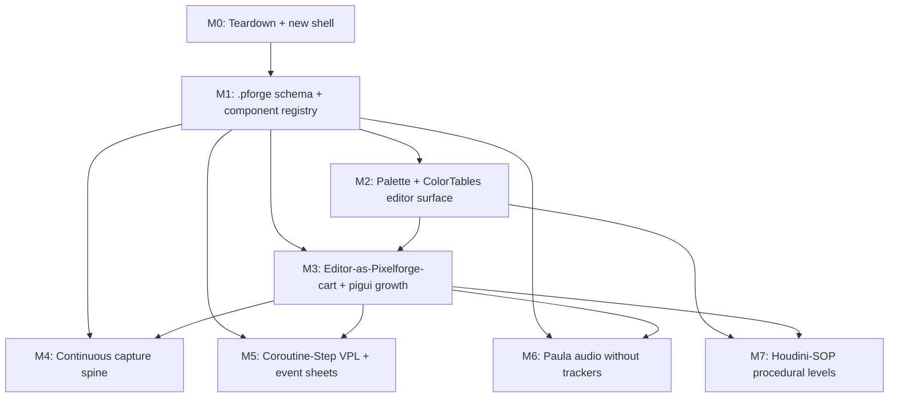

# feat: Pixelforge No-Code Visual Game Editor

## Summary

Replace the broken-and-stubbed `pixelforge_studio` package with a complete no-code visual game editor that lets a developer build, test, and ship a Pixelforge game without writing a line of Go. The editor is structured as an 8-milestone roadmap (M0 teardown → M7 procedural generation) covering all seven survivors from the upstream ideation: a `.pforge` declarative schema with reflection-driven component registry, a coroutine-Step visual scripting system + event sheets, a palette/ColorTable preset surface, a continuous capture spine for time-travel debugging and animation, a tracker-free Paula audio editor, a Houdini-SOP procedural level graph, and ultimately the editor itself authored as a Pixelforge cart (Picotron pattern).

This plan details **M0 (teardown + new shell) and M1 (`.pforge` schema + component registry)** as fully-scoped implementation units. **M2-M7 are milestone summaries** — each defines goals, scope, dependencies, key files, and verification criteria, but defers per-unit implementation breakdown to follow-up `ce-plan` invocations once the M0+M1 foundation has landed and shaped the unknowns.

---

## Problem Frame

The existing `pixelforge_studio` package is **broken and stubbed**:

- `pixelforge_studio/codegen/generator.go:24` hardcodes `replace github.com/ibilalkhan1/fyp_pixelforge => /home/tux/Pictures/basheer-go` — every exported game fails to build on every machine that isn't Tux's laptop.
- `pixelforge_studio/codegen/generator.go:79-83` stubs `getSprite()` to `return nil` — exported games cannot draw their sprites.
- `pixelforge_studio/editor/editor.go:51-52` stores game logic as `UpdateCode` / `DrawCode` `string` blobs — the supposed no-code editor punts to "write Go in a textbox."
- `pixelforge_studio/editor/assets.go:50-58` and `editor.go:254` hardcode `frameW, frameH := 8, 8`, silently corrupting any non-8×8 sprite import.
- `pixelforge_studio/editor/editor.go:295-432` renders the editor chrome as hand-rolled `screen.SubImage(...).Fill(color.RGBA{...})` rectangles — **no real text rendering**, no widgets, no scrollable lists, no focus management.
- No animation, no audio editor, no inspector, no preview, no undo, no asset hot-reload, no palette/ColorTable surfaces, no event-bus visibility, no real visual scripting — the engine's most distinctive capabilities (4 ColorTables, Paula 4-channel mixer, zero-alloc event bus, coroutine Steps, ring-buffer frame debugger, heatmap overlay, paletted snapshots) have **zero editor exposure**.

User's explicit feedback: *"current studio code has a lot of issues especially visual and it is highly incomplete."* This plan replaces the package wholesale.

The engine itself (`pixelforge` and its sibling `pixelforge_*` packages) is solid and out of scope for changes — the editor consumes its existing public APIs.

---

## Requirements

Each requirement maps to one of the seven survivors in the [origin ideation](../ideation/2026-05-15-pixelforge-editor-ideation.md). R-IDs are stable across plan edits.

- **R1.** Editor chrome (panels, inspectors, asset browser, menus) is itself authored as a Pixelforge program, dogfooding the engine's font, palette, ColorTables, sprite system, and event bus. There is no separate "play" mode — the game is always running underneath; tools fade in over it via the same overlay pattern `pimetr` and `piscope` use. *(Survivor #1 — Live edit/debug)*

- **R2.** A single declarative file format (`.pforge`) describes the entire game — `ScreenSize`, `TPS`, `Palette[64]`, `ColorTables[4]`, sprites, animations, scenes, entities, audio bindings, event subscriptions, routine graphs. The runtime loads it via a new `pixelforge_project` package; the editor mutates the same in-memory struct. Code-gen produces only a thin `main.go` shim. A reflection-driven `pfcomponent.Register[T]` API + struct tags auto-emit inspector widgets, serializers, undo entries, and visual-script nodes for every new component. *(Survivor #2 — Project/export, **keystone**)*

- **R3.** Visual scripting compiles directly to `pixelforge_routine.Step` coroutines (no bespoke VM). Two surfaces: a horizontal lane editor for sequences and a GDevelop-style event sheet (Conditions | Actions table) for reactive rules. A recorded-demo entry mode synthesizes routines from input/state traces. Visual-script wires are `pievent.Subscribe` calls; an event-bus topic catalog with a live publisher↔subscriber graph doubles as the script debugger. *(Survivor #3 — Behavior/logic)*

- **R4.** The 64-color palette and 4 ColorTables are a single live-bound first-class asset surface: animatable swatch timeline, Lightroom-style non-destructive ColorTable Presets, paint-to-place tile authoring with auto-tile-rule synthesis, and palette-aware drop-import (one PNG drop runs deterministic palette quantization, alpha-gutter slice, frame-strip detection, collision-mask derivation, `.png.meta` sidecar parsing — no import dialog). *(Survivor #4 — Asset authoring)*

- **R5.** A single always-on capture substrate fed by `pisnap`, the existing piscope ring buffer, and a `SubscribeAll` tap on every `pievent.Target` powers: time-travel scrub, animation cliplets ("save piscope selection as clip"), regression-test promotion (golden image + input log), GIF/MP4 capture, and shareable bug-repro zips. Scenes can also be recorded play sessions. *(Survivor #5 — Live edit/debug)*

- **R6.** Audio authoring without trackers. Three combinable input modes: a 4-row comic-strip (panels = sound moments per Paula channel), an Ableton Session-View grid (rows = channels, columns = scenes/states, mutually-exclusive cells), and an optional hum/tap-mode. Auto-allocate channels by inferred priority; live mixer lane visualization flashes red when `Play()` steals a still-active voice. *(Survivor #6 — Asset authoring)*

- **R7.** A node-graph procedural level designer (Houdini-SOP style) with operators (`Scatter`, `CellularAutomata`, `FloodFill`, `PaletteRemap`, `PlaceEntities`, `BSP`, `WaveCollapse`) feeding into a final `BakeTilemap` node. Bake step emits a static deterministic Pixelforge scene — procedural at design time, zero-cost at runtime. *(Survivor #7 — Scene/world)*

- **R8.** **Foundation — kills two known defects.** The new editor must (a) auto-detect the engine's module path (no hardcoded `replace` directive) and (b) generate working game binaries that include sprite assets and draw them at runtime. Any other gap left from the existing studio that blocks "export → fresh machine → it runs" is in scope of M0+M1.

---

## Scope Boundaries

**In scope.**
- Replacing `pixelforge_studio/` wholesale with a new editor package.
- Defining a new `pixelforge_project` package for the `.pforge` schema and runtime loader.
- Defining a new `pfcomponent` package for the reflection-driven component registry.
- Growing `pixelforge_gui` (currently minimal — Element with OnDraw/OnUpdate/OnPress hooks only) with the widgets the editor needs *when M3 (Editor-as-Cart) reaches it*. Until then, M0-M2 use Ebitengine native primitives (`ebitenutil.DebugPrintAt`, `vector.DrawFilledRect`) for editor chrome.
- One-click web export (WASM via `GOOS=js GOARCH=wasm`) and desktop export.

**Not in scope (engine-side).**
- Changes to the core `pixelforge` package, `pixelforge_audio` mixer internals, `pixelforge_event` bus internals, `pixelforge_routine` Step semantics, or any other engine subsystem behavior. The editor consumes existing public APIs.
- Adding new runtime features to the engine (e.g., new audio channels, additional ColorTables, ECS) — the editor surfaces what's there, not what could be there.

**Not in scope (editor-side, this iteration).**
- AI-assisted features (in-editor LLM scripting, AI sprite generation, prompt-driven level layouts) — interesting but premature.
- Multiplayer / collaborative editing — the editor is single-user.
- Mobile or iPad editor — desktop-only initially (web target is for the *exported game*, not the editor itself).
- Genre-locked editor variants (rejected during ideation as premature).
- Notion-style multi-view entity browser, Sourcegraph-style semantic search, Smalltalk-halo live-image editing — all rejected from ideation as v2 features.

### Deferred to Follow-Up Work
- **Per-unit implementation breakdown for M2-M7.** This plan defines milestone-level scope for those phases; once M0+M1 land and the foundation shapes the unknowns, each subsequent milestone gets its own dedicated `ce-plan` invocation that produces full per-unit detail. Don't over-commit to specifics 6+ months out.
- **Asset import for non-PNG formats** (Aseprite `.aseprite`, Tiled `.tmx`, GIMP `.xcf`). Plan for PNG-only import in M0-M2; add others later if demand surfaces.
- **CBOR project format** as a faster binary alternative to JSON. JSON is the v1 wire format (human-diffable, git-mergeable). CBOR can be added as an option in M5+ if profiling shows it matters.
- **Editor extension API.** The Picotron "tools-as-carts" pattern (M3) opens the door to user-written editor extensions; deferring the public API surface and stability story until after the editor itself stabilizes.
- **Multi-window / dockable panel system.** Default to fixed-pane layout in M0-M3; revisit only if user feedback demands it.

---

## Context & Research

### Relevant code and patterns

**Engine subsystems the editor surfaces (read-only consumers):**
- `pixelforge.go` — `SetDrawTarget`, `SetColor`, `SetPixel/Rect/RectFill/Line/Circ/CircFill`, `DrawSprite`, `RemapColor`, `SetTransparency`, `Frame`, `Time`, `TPS()`/`SetTPS`, `Camera`, `Palette`, `PaletteMapping`, `MaxColors=64`. Recently added: `PixelsWrittenThisFrame`, `ColorTableAccesses`, `HeatMapBuffer`, `FramePhaseDurations`, `SetFramePhaseDurations` (`engine_metrics.go`).
- `colortable.go` — `ColorTables[4]`, `RemapColor`, `SetTransparency`, `(source | target) >> 6` selection rule. **The signature Pixelforge feature R4 surfaces.**
- `pixelforge_audio/piaudio.go` + `pixelforge_audio/backend.go` — `Play(ch, sample, pitch, vol)`, `LoadSample`, `SetSample`/`SetLoop`/`SetPitch`/`SetVolume`, recently added `ChannelActive/Position/Pitch/Volume/Sample` query methods. **Surfaced by R6.**
- `pixelforge_event/pievent.go` — `NewTarget[T]`, `Publish`, `Subscribe`, `SubscribeAll`, recently added `SubscriberCount`, `PublishCount`. `TrackingTarget` for bulk unsubscribe. **Surfaced by R3 and R5.**
- `pixelforge_routine/piroutine.go` — `New(steps...)`, `Resume`, `Stop`, `Stopped`, recently added `CurrentStep`, `StepCount`, `Name`. **Surfaced by R3.**
- `pixelforge_loop/piloop.go` — `Target()`, `DebugTarget()`, `EventInit/FrameStart/Update/LateUpdate/Draw/LateDraw/WindowClose`. **Surfaced by R5.**
- `pixelforge_snap/pisnap.go` — `PalettedImage()`, `CaptureOrErr()`. **Surfaced by R5.**
- `pixelforge_metrics/pimetr.go` — `Start`, `Mode`, `ShowHeatMap`, `MetricsSnapshot`. Established the pattern of overlay-based debug UI; reuse for editor chrome.
- `pixelforge_ebiten/piebiten.go` — `Run`, `RunOrErr`, `CopyCanvasToEbitenImage`, recently added `SetNativeOverlay(func(*ebiten.Image))` hook. **The native overlay hook is how the editor draws window-resolution chrome.**
- `pixelforge_gui/pigui.go` — minimal `Element` with `OnDraw/OnUpdate/OnPress/OnRelease/OnTap` hooks and child propagation. **Needs to grow before M3 Editor-as-Cart can use it for chrome; deferred to M3 itself.**
- `pixelforge_scope/internal/internal.go` — toolbar-overlay pattern, ring-buffer recorder, frame stepping. Reference template for R5 capture spine.

**Existing studio (to be replaced):**
- `pixelforge_studio/main.go` — Ebiten game wrapper; will become the new editor's main entrypoint with the same `RunGame(editor)` shape.
- `pixelforge_studio/editor/editor.go` — single-file 1280×800 stub with hand-rolled rectangle chrome. Replaced.
- `pixelforge_studio/editor/assets.go` — basic PNG loader with hardcoded 8×8 frames. Replaced (palette-aware import lands in M2/R4).
- `pixelforge_studio/editor/project.go` — JSON project with string-blob `UpdateCode`/`DrawCode`. Replaced by `pixelforge_project` schema in M1/R2.
- `pixelforge_studio/codegen/generator.go` — string-concat code-gen with hardcoded module path and nil sprite stub. Replaced by `main.go` shim generator in M1/R2/R8.

### External patterns (from ideation)
- **PICO-8 / TIC-80 / Picotron** — tabbed all-in-one, editor==runtime, palette-as-constraint-and-tool, tools-as-carts. Drives R1.
- **LDtk** — single `.ldtk` JSON, typed entity fields, auto-layer rules, super-simple JSON+PNG export. Drives R2 + R4.
- **GDevelop / Construct 3** — event sheets (Conditions | Actions tables) beat node graphs for non-programmers; documented "Blueprint spaghetti at >30 nodes" anti-pattern. Drives R3.
- **Aseprite / Pro Motion NG** — live palette swap, dithering brushes, indexed-mode workflows. Drives R4.
- **FamiStudio / BeepBox** — piano roll + visual envelope curves, no hex notation. Drives R6.
- **Houdini SOPs / Substance Designer** — procedural node graph that bakes to deterministic output. Drives R7.

### Institutional learnings
None — `docs/solutions/` does not yet exist in this repo. After M0+M1 land, key decisions (schema design, component-registry reflection pattern, native-vs-canvas chrome split) should be captured via `/ce-compound` so the next contributor doesn't re-derive them.

---

## Key Technical Decisions

1. **Replace `pixelforge_studio/` in place; do not maintain a v1.** The current implementation is broken (cannot export a runnable game) and superficial (sprite-place tool only). There is no real user base to migrate. The new editor reuses the same package import path (`github.com/ibilalkhan1/fyp_pixelforge/pixelforge_studio`) so any external references stay valid; everything inside is new code.

2. **JSON as the v1 wire format for `.pforge`.** Human-diffable, git-mergeable, debuggable, well-supported by Go's `encoding/json`. Speed is not a v1 concern — Pixelforge games are tiny (the snake example's project would be a few KB). CBOR can be a v2 option behind a flag.

3. **Two-phase chrome rendering strategy.**
   - **M0-M2 (and beyond as fallback):** Editor chrome renders at native window resolution via `pixelforge_ebiten.SetNativeOverlay` — same hook the recently-rewritten metrics overlay uses. Text via `ebitenutil.DebugPrintAt`, bars via `vector.DrawFilledRect`, panels via direct `*ebiten.Image` draws. This is what works today and is what gives the user "normal terminal-style text" they asked for in the metrics overlay session.
   - **M3 (Editor-as-Cart):** Migrate chrome to `pixelforge_gui` (which grows in M3 to support text input, scrollables, focus, modals). The native-overlay path becomes the fallback for window-chrome-only elements that genuinely need native resolution (high-DPI tooltips, drag-resize gutters).
   - This is a deliberate sequencing: ship a **working** editor first using the easy native path, then migrate to the dogfooded canvas-resident path as `pixelforge_gui` matures.

4. **What stays as Go code vs. what becomes data in `.pforge`.**
   - **Becomes data:** all project metadata (screen size, TPS), asset registry (sprites with frame info, animations, audio samples), palette + ColorTable values + ColorTable presets + palette-slot animation curves, scenes (entities + positions + properties), entity component values (typed via `pf:` struct tags), event subscriptions (topic + handler reference), behavior graphs (Step sequences + event sheets — both materialized as data), audio graph (SFX → channel allocation hints, BGM grid).
   - **Stays as Go code:** custom rendering (anything that draws to the canvas via `SetPixel`/`RectFill`/`DrawSprite` from a custom function), exotic algorithms (procgen operators that don't fit Houdini-SOP shape), custom math, anything the user marks as a code-extension hook.
   - **Bridge:** the schema declares `extension_hooks` slots — named callable points where user-supplied Go functions can be registered. The generated `main.go` shim wires these. The editor surfaces them as "[code extension: X]" placeholders the user cannot edit visually but can see the wiring of.
   - **Discipline:** if a user can't accomplish their goal without code extensions, the editor should grow a feature, not encourage code blanks. Code extensions are an escape hatch, not a primary surface.

5. **Module-path detection.** Replace the hardcoded `replace github.com/ibilalkhan1/fyp_pixelforge => /home/tux/Pictures/basheer-go` with one of three strategies, picked at export time:
   - **Strategy A (default for v1):** Vendor a snapshot of the engine into the exported game (`exportPath/vendor/`). One-click export is fully self-contained; the user's `go build` works on any machine without internet. Cost: copies several MB per export.
   - **Strategy B (v1.1):** Detect a published module version (`go list -m github.com/ibilalkhan1/fyp_pixelforge` from the editor's own `go.mod`) and emit `require ... vX.Y.Z` with no `replace`. Requires the engine to be published as a module — currently isn't; deferred until that happens.
   - **Strategy C (developer mode):** When the editor itself is being run from a git checkout, emit a `replace` directive pointing at *that* checkout's path. Detected via `go env GOMOD` from the editor process. Useful for engine contributors testing changes; never the default.

6. **Project file extension and naming.** `.pforge` extension. Project layout on disk:
   ```
   my-game.pforge       # the project file (JSON)
   my-game.pforge-assets/
     sprites/*.png       # source PNGs preserved
     audio/*.wav         # source WAVs preserved
     palettes/*.gpl      # exported palette dumps (Aseprite-compatible)
   ```
   The schema references assets by relative paths under the `*-assets/` sibling directory.

7. **Test framework:** `github.com/stretchr/testify` (already used throughout the engine — `pixelforge_audio/decode_test.go`, `pixelforge_event/pievent_test.go`, `pixelforge_metrics/pimetr_test.go`, etc.). No new dependencies.

---

## Output Structure

This plan creates a new top-level package layout. The tree below shows the expected shape after **M0 + M1** complete; later milestones add files within these packages and a few small new packages (e.g., `pixelforge_studio/scripting/` in M5).

```
pixelforge_studio/                    # replaces existing — same import path
  main.go                              # Ebiten game wrapper, calls into editor.New()
  editor/
    editor.go                          # top-level Editor struct (Update/Draw/Layout)
    workspace.go                       # workspace tab system
    chrome.go                          # native-overlay chrome (text, bars, panels)
    asset_browser.go                   # sprite/audio asset list panel
    inspector.go                       # auto-generated inspector renderer
    canvas.go                          # game-canvas viewport + tools (Place/Select/Delete)
    project_panel.go                   # project tree (scenes, entities, behaviors)
    settings.go                        # editor preferences (window size, theme)
    keymap.go                          # keyboard shortcut registry
    editor_test.go
  codegen/
    generator.go                       # emits thin main.go shim that loads .pforge
    templates.go                       # Go source templates (no string concat)
    generator_test.go
  modulepath/
    detect.go                          # auto-detect engine module path
    detect_test.go

pixelforge_project/                   # NEW PACKAGE — .pforge schema + loader/saver
  project.go                           # top-level Project struct
  schema.go                            # schema version + migration helpers
  sprites.go                           # SpriteAsset, AnimationClip
  scenes.go                            # Scene, Entity, EntityComponent
  audio.go                             # AudioSample, AudioBinding
  palette.go                           # PaletteData, ColorTablePreset, PaletteAnimation
  behaviors.go                         # BehaviorGraph (Step sequence + event sheet)
  loader.go                            # JSON load + schema-version migration
  saver.go                             # JSON save (deterministic key order for git)
  project_test.go
  loader_test.go

pfcomponent/                          # NEW PACKAGE — reflection-driven component registry
  registry.go                          # Register[T], Get, lookup by name
  metadata.go                          # parsed pf:"..." struct tag metadata
  reflect.go                           # reflection helpers
  registry_test.go
  metadata_test.go

docs/
  studio.md                            # rewritten user guide (replaces stub)
  pforge-schema.md                     # NEW — schema reference
```

Implementer may adjust file boundaries within a package; per-unit `**Files:**` sections remain authoritative.

---

## Implementation Roadmap

**Eight milestones, dependency-ordered.** M0 + M1 are the foundation; everything else depends on them. M2 unlocks the most user-visible win quickly (palette/ColorTable surface). M3 is the architectural turning point (editor-as-cart). M4-M7 are independent and can land in any order once M3 stabilizes `pixelforge_gui`.



*This illustrates dependency relationships and is directional guidance for review, not implementation specification.*

Each milestone below is followed by either **detailed implementation units (M0, M1)** or a **milestone summary (M2-M7)** that defers per-unit detail to a follow-up `ce-plan` invocation when that milestone is reached.

---

## M0 — Teardown + New Editor Shell

**Goal.** Delete the broken `pixelforge_studio` implementation, stand up the new package skeleton, and ship a runnable Ebiten window with native-resolution chrome that loads, saves, and re-loads an empty `.pforge` project. No editor features yet — just the bones.

**Requirements addressed.** R8 (kill the two known defects), partial R1 (chrome renders properly via native overlay).

**Dependencies.** None — this is the start.

### U1. Delete legacy studio implementation; preserve package skeleton

**Goal.** Remove the existing `pixelforge_studio/` source files and replace with empty-but-compiling skeletons. Keep `pixelforge_studio/main.go` (rewritten) so `go run ./pixelforge_studio` still works.

**Requirements.** R8.

**Dependencies.** None.

**Files.**
- Delete: `pixelforge_studio/editor/editor.go`, `pixelforge_studio/editor/assets.go`, `pixelforge_studio/editor/project.go`, `pixelforge_studio/codegen/generator.go`, `pixelforge_studio/pixelforge_studio` (the orphan empty file).
- Create: `pixelforge_studio/main.go` (rewritten — minimal Ebiten host that calls `editor.New()` and `ebiten.RunGame(...)`).
- Create: `pixelforge_studio/editor/editor.go` (empty `Editor` struct with `Update`/`Draw`/`Layout` stubs that just clear a dark background).
- Create: `pixelforge_studio/codegen/generator.go` (empty package, no exports yet).

**Approach.**
- The new `Editor` struct exposes `New() *Editor`, `Update() error`, `Draw(*ebiten.Image)`, `Layout(int, int) (int, int)` — the four methods Ebitengine's `Game` interface needs.
- Window stays at 1280×800 default with `ebiten.WindowResizingModeEnabled` (matches the old shape so testers don't have to relearn).
- No project loaded yet — display "Pixelforge Studio" + version string only. `Layout` returns the outer dimensions (full window, no internal canvas scaling like the game runtime).

**Patterns to follow.**
- The recent `pixelforge_metrics` rewrite (`pixelforge_metrics/pimetr.go`) shows the native-overlay rendering pattern; M0 chrome reuses it.
- `pixelforge_ebiten/internal/ebitengame.go` is the reference for the `EbitenGame` Update/Draw/Layout structure.

**Test scenarios.**
- *Test expectation: none* — pure deletion + minimal scaffold; behavior is "window opens and shows the title". M2 adds the first real testable surface.

**Verification.**
- `go build ./...` passes with the new shell in place.
- `go run ./pixelforge_studio` opens a 1280×800 window showing only the title text and version. No crashes, no exported-game generation yet.

---

### U2. Editor harness — three-pane layout with native-resolution chrome

**Goal.** Build the persistent editor chrome layout: title bar, left panel (asset browser placeholder), center canvas viewport (game preview placeholder), right panel (inspector placeholder), bottom status bar. Render entirely via native overlay (no `pixelforge_studio`-side canvas drawing yet).

**Requirements.** R1 (partial — chrome renders correctly even though it's not yet on the cart).

**Dependencies.** U1.

**Files.**
- Modify: `pixelforge_studio/editor/editor.go` (lay out panels, wire `chrome.Draw`).
- Create: `pixelforge_studio/editor/chrome.go` (panel-render helpers: `drawTitleBar`, `drawLeftPanel`, `drawCenterCanvas`, `drawRightPanel`, `drawStatusBar`).
- Create: `pixelforge_studio/editor/editor_test.go` (layout dimension tests).

**Approach.**
- All chrome is drawn directly to the `*ebiten.Image` passed to `Draw` — no native overlay hook needed because there is no game canvas underneath yet (M3 changes that).
- Use `ebitenutil.DebugPrintAt` for all text (matches the metrics overlay decision).
- Use `vector.DrawFilledRect` for all backgrounds and dividers (anti-aliased, fast).
- Layout constants live in one struct `chromeLayout` so `editor_test.go` can assert pixel-perfect positions on resize.
- No grid, no game preview, no asset list yet — just panel backgrounds with "Asset Browser", "Canvas", "Inspector", "Status" placeholder labels.

**Patterns to follow.**
- `pixelforge_metrics/pimetr.go` `printAt` and `vector.DrawFilledRect` patterns.
- `pixelforge_studio/editor/editor.go:299-432` (legacy) for layout dimensions to start from — but rewrite, don't copy.

**Test scenarios.**
- **Happy path.** `chromeLayout(1280, 800)` returns the expected `titleBarH=40, leftPanelW=200, rightPanelW=200, statusBarH=24` (or whatever defaults the implementer chooses).
- **Edge case.** Layout at 800×600 (smaller than default) — panel widths scale down or clamp to a minimum that doesn't overlap the canvas; assert minimum canvas width >= 200.
- **Edge case.** Layout at 3840×2160 (4K) — panels stay at fixed pixel widths (no scaling); canvas takes the rest.
- **Integration.** `editor.Draw` produces an image where the canvas region's pixels are the background color (no chrome bleeding into it). Compare a sub-rect of the rendered image against the expected fill.

**Verification.**
- `go test ./pixelforge_studio/editor/` passes.
- `go run ./pixelforge_studio` shows the three-pane layout with placeholder labels and resizes cleanly.

---

### U3. Editor settings persistence + keyboard shortcut framework

**Goal.** Add a settings file (`~/.pixelforge-studio/settings.json`) for window size, theme, recent project paths, and a keyboard shortcut registry that other milestones can populate.

**Requirements.** R1 (foundation — keyboard shortcuts will be needed everywhere).

**Dependencies.** U1.

**Files.**
- Create: `pixelforge_studio/editor/settings.go`.
- Create: `pixelforge_studio/editor/keymap.go`.
- Create: `pixelforge_studio/editor/settings_test.go`.
- Create: `pixelforge_studio/editor/keymap_test.go`.

**Approach.**
- `Settings` struct with `WindowWidth`, `WindowHeight`, `Theme` (string, "dark" default), `RecentProjects` (`[]string`, capped at 10).
- Auto-save on change (debounced — 500ms idle); auto-load on `editor.New()`.
- Use `os.UserConfigDir()` for the path (cross-platform: `~/.config` on Linux, `%AppData%` on Windows, `~/Library/Application Support` on Mac).
- `KeyMap` is a `map[string]ebiten.Key` keyed by action name (`"file.new"`, `"file.save"`, `"tool.select"`). `Register(action, defaultKey)` lets later milestones add shortcuts; `IsPressed(action)` checks via `ebiten.IsKeyPressed`.
- Default shortcuts: `Ctrl+N` new project, `Ctrl+S` save, `Ctrl+O` open, `Ctrl+W` close project. Tool shortcuts come in M2.

**Patterns to follow.**
- `pixelforge_studio/editor/editor.go:228-241` (legacy) keyboard handling pattern — but route through `KeyMap` instead of inline switches.

**Test scenarios.**
- **Happy path.** `Settings.Save()` then `Load()` round-trips all fields.
- **Happy path.** `RecentProjects.Push("/path/a")` → length 1; pushing 11 different paths leaves length capped at 10 with most-recent-first order.
- **Edge case.** Settings file doesn't exist on first load → returns defaults, no error.
- **Edge case.** Settings file is malformed JSON → returns defaults, logs a warning, does not crash.
- **Happy path.** `KeyMap.Register("test.action", ebiten.KeyA)` then `IsPressed("test.action")` matches `ebiten.IsKeyPressed(ebiten.KeyA)`.
- **Edge case.** `IsPressed` for an unregistered action returns false (does not panic).

**Verification.**
- `go test ./pixelforge_studio/editor/` passes including new tests.
- Manual: open editor, resize window, close, reopen → window opens at the saved size.

---

## M1 — `.pforge` Schema + Component Registry (Keystone)

**Goal.** Define the declarative project format that everything else builds on. Stand up the `pixelforge_project` package (schema + loader/saver), the `pfcomponent` package (reflection-driven registry), and the new `codegen` (thin `main.go` shim that loads `.pforge`). Kill both known defects: hardcoded module path and nil sprite stub. By the end of M1, a user can create an empty project, add a sprite via the existing-stub asset-load (M2 makes this proper), place it in a scene, save, export, and have the resulting `go build ./generated-game/` produce a binary that runs and draws the sprite on a fresh machine.

**Requirements addressed.** R2 (schema + registry), R8 (defect kills), partial R4 (sprite asset model lands here even though the palette UI doesn't).

**Dependencies.** M0.

### U4. Define `pixelforge_project` package — types

**Goal.** Define every Go type the schema will serialize. Cover all engine subsystems even if their *editor surfaces* don't exist yet — getting the schema right early means later milestones don't have to migrate.

**Requirements.** R2.

**Dependencies.** U1.

**Files.**
- Create: `pixelforge_project/project.go` (top-level `Project` struct + frontmatter: `SchemaVersion`, `Name`, `ScreenWidth`, `ScreenHeight`, `TPS`, `CreatedAt`, `ModifiedAt`).
- Create: `pixelforge_project/schema.go` (`SchemaVersion` constant = `1`, migration helper stubs).
- Create: `pixelforge_project/sprites.go` (`SpriteAsset`, `AnimationClip`).
- Create: `pixelforge_project/scenes.go` (`Scene`, `Entity`, `EntityComponent`).
- Create: `pixelforge_project/audio.go` (`AudioSample`, `AudioBinding`).
- Create: `pixelforge_project/palette.go` (`PaletteData`, `ColorTablePreset`, `PaletteAnimation`).
- Create: `pixelforge_project/behaviors.go` (`BehaviorGraph` — empty `StepNode` slice + empty `EventSheetRule` slice for M5 to populate).
- Create: `pixelforge_project/project_test.go`.

**Approach.**
- All types are plain structs with `json:"..."` tags. Field order in source = key order in JSON output.
- `SchemaVersion` is the first field of `Project`; loaders dispatch on it.
- `Project` has `Sprites []SpriteAsset`, `Audio []AudioSample`, `Palette PaletteData`, `Scenes []Scene`, `Behaviors []BehaviorGraph`, `Bindings []AudioBinding`, `EventSubscriptions []EventSubscription`.
- `SpriteAsset` carries `Name`, `RelativePath` (under `*.pforge-assets/sprites/`), `Width`, `Height`, `FrameW`, `FrameH`, `OriginX`, `OriginY`, `CollisionMask` (`[]uint8`, optional), `Animations []AnimationRef`.
- `Entity` carries `ID` (stable string), `Name`, `Position`, `Components []EntityComponent`. `EntityComponent` is `Type string` + `Values map[string]any` — concrete typing happens at registry lookup.
- Schema fields the editor cannot author yet (e.g., `BehaviorGraph` for M5) still appear in the schema as empty slices. **Reserving the fields now prevents breaking-change migrations later.**

**Technical design (directional, not specification).**
```
Project (.pforge file as JSON):
  schema_version: 1
  name: "snake"
  screen: {w: 128, h: 128, tps: 30}
  palette:
    base: [64 RGB hex strings]
    color_tables: [4 × {64×64 grid of palette indices}]
    presets: [{name, color_tables_override}]
    animations: [{slot, keyframes, easing, trigger_event}]
  sprites:
    - {name: "fruit", relative_path: "sprites/sprites.png", width: 32, height: 8, frame_w: 8, frame_h: 8, ...}
  audio:
    - {name: "eat", relative_path: "audio/eat.wav", suggested_channel_priority: "sfx"}
  scenes:
    - id: "main", name: "Main", entities: [...]
  behaviors: [...]   # M5 will populate
  bindings: [...]    # M6 will populate
  event_subscriptions: [...]
```
*This illustrates the JSON shape; field names and nesting may shift slightly in implementation.*

**Patterns to follow.**
- Existing struct-tag style throughout the engine (e.g., `pixelforge_studio/editor/project.go:9-20` legacy — same idiom, more fields).
- `pixelforge_event/pievent.go` for stable `Handler`-style ID types.

**Test scenarios.**
- **Happy path.** `Project{}` zero value marshals to JSON without error and unmarshals back to an equal struct.
- **Happy path.** A populated `Project` (snake-game-shaped: 4 sprites, 1 scene with 5 entities, palette + 1 ColorTable preset) round-trips.
- **Edge case.** Marshalling a `Project` with no sprites produces `"sprites":[]` (not `null`) so loaders never hit nil-slice surprises.
- **Edge case.** Field order in the marshalled JSON is deterministic across runs (tested by marshalling twice and comparing byte-for-byte) — required for git-merge-friendly diffs.
- **Edge case.** Unmarshalling a `Project` with `schema_version: 99` (future) returns an explicit "unsupported schema version" error pointing at the version field.

**Verification.**
- `go test ./pixelforge_project/` passes.
- `go vet ./pixelforge_project/` clean.

---

### U5. Reflection-driven component registry — `pfcomponent`

**Goal.** Stand up the `pfcomponent` package: `Register[T](typeName string)` records component types and parses their `pf:"..."` struct tags into queryable `FieldMetadata`. The inspector renderer (U9) consumes this metadata to auto-generate UI without per-component editor code. Visual scripting (M5) consumes it to auto-generate Get/Set nodes.

**Requirements.** R2.

**Dependencies.** U1.

**Files.**
- Create: `pfcomponent/registry.go` (`Register[T]`, `Get`, `All`, registry singleton).
- Create: `pfcomponent/metadata.go` (`FieldMetadata` struct: `Name`, `Type`, `WidgetKind`, `Min`, `Max`, `Options`, `RequiredOnSave`).
- Create: `pfcomponent/reflect.go` (struct-tag parser).
- Create: `pfcomponent/registry_test.go`, `pfcomponent/metadata_test.go`.

**Approach.**
- `Register[T any](typeName string)` uses generics + `reflect.TypeOf((*T)(nil)).Elem()` to introspect the type once and cache the parsed metadata. Idempotent — re-registering the same type is a no-op.
- Tag grammar (initial):
  - `pf:"slider,0..100"` → `WidgetKind=Slider, Min=0, Max=100`
  - `pf:"color"` → `WidgetKind=PaletteColor`
  - `pf:"sprite"` → `WidgetKind=SpriteRef`
  - `pf:"audio"` → `WidgetKind=AudioRef`
  - `pf:"event"` → `WidgetKind=EventTopic`
  - `pf:"enum,Up|Down|Left|Right"` → `WidgetKind=Enum, Options=[...]`
  - `pf:"text,maxlen=64"` → `WidgetKind=Text, Max=64`
  - `pf:"vector2"` → `WidgetKind=Vector2`
  - No tag → `WidgetKind=Default` (fallback to type-based: `int`→`IntField`, `float64`→`FloatField`, `bool`→`Checkbox`, `string`→`Text`)
- `Get(typeName)` returns the cached metadata; `All()` returns the full registry for the inspector to iterate.
- Required for M9 and downstream: `Marshal(component any)` and `Unmarshal(typeName string, raw json.RawMessage)` use the metadata to round-trip without bespoke per-type code.

**Patterns to follow.**
- Go's stdlib `encoding/json` uses similar tag parsing (`json:"name,omitempty"`); mirror its tag-grammar conventions.

**Test scenarios.**
- **Happy path.** Register a struct with one of each tag kind; `Get(name).Fields` returns the expected `FieldMetadata` slice with correct kinds, min/max, and options parsed.
- **Happy path.** `Marshal` then `Unmarshal` round-trips a populated component instance via the registry's reflection path.
- **Edge case.** Untagged fields fall back to type-based widget (`int` → `IntField`).
- **Edge case.** Unknown tag kind (`pf:"future,..."`) is recorded with `WidgetKind=Unknown` and a warning, not a panic — forward-compat for newer-than-this-editor schemas.
- **Edge case.** `pf:"slider,0..100"` with a min > max in source code is detected and panics at registration time with a clear error message — fail-fast on developer mistakes.
- **Edge case.** Re-registering the same type with the same name is a no-op (no panic). Re-registering with a *different* name panics.
- **Edge case.** Anonymous (embedded) struct fields are inspected recursively.

**Verification.**
- `go test ./pfcomponent/` passes.
- `go vet ./pfcomponent/` clean.

---

### U6. Project loader and saver — JSON wire format with deterministic key order

**Goal.** Implement `pixelforge_project.Load(path)` and `(p *Project).Save(path)` with deterministic output (so git diffs are minimal), schema-version dispatch, and asset-path validation.

**Requirements.** R2.

**Dependencies.** U4.

**Files.**
- Create: `pixelforge_project/loader.go` (`Load`, `MustLoad`, schema-migration dispatch).
- Create: `pixelforge_project/saver.go` (`Save` with deterministic encoding).
- Create: `pixelforge_project/loader_test.go`, `pixelforge_project/saver_test.go`.

**Approach.**
- `Save` uses `json.Marshal` with `Indent("", "  ")`. To get deterministic output despite Go map iteration being random, custom-marshal any `map[string]any` fields by sorting keys alphabetically. (Apply to `EntityComponent.Values` specifically.)
- `Load` reads the file, peeks at `schema_version`, and routes:
  - v1 → unmarshal directly.
  - Future versions → unmarshal then run forward migrations (no migrations yet — placeholder hooks).
- `Save` updates `ModifiedAt` and bumps `SchemaVersion` to current.
- Both functions resolve the `*-assets/` sibling directory as `<projectPath without .pforge>` + `-assets`. Sprite/audio relative paths are validated against this directory; missing files produce loud errors with the resolved absolute path.

**Test scenarios.**
- **Happy path.** Save a snake-shaped Project to a temp dir; reload returns an equal struct. Re-save to a different temp file; the two files are byte-for-byte identical (deterministic).
- **Happy path.** Asset directory is auto-created on save if missing.
- **Edge case.** Loading a file where a referenced sprite path doesn't exist returns an error naming the missing file and the entity that referenced it.
- **Edge case.** Saving a Project whose `ModifiedAt` was set in the future does not panic; logs a warning.
- **Edge case.** `Load` returns a clear "not a Pixelforge project" error when given a JSON file that lacks `schema_version`.
- **Integration.** Modify a single entity position in an in-memory Project, save, reload, save again — git diff between the two saved files shows only the position change (no field reordering, no whitespace churn).

**Verification.**
- `go test ./pixelforge_project/` passes.
- Save → reload → save round-trip produces identical bytes for a representative project.

---

### U7. Code-gen v2 — thin `main.go` shim that loads `.pforge`

**Goal.** Replace the legacy string-concat code-gen with a template-driven generator that emits a minimal `main.go` (loads the embedded `.pforge` file, registers all components, calls `pixelforge_ebiten.Run()`). All actual game data lives in the `.pforge` file (embedded via `go:embed` in the exported binary).

**Requirements.** R2, R8.

**Dependencies.** U4, U5, U6, U8.

**Files.**
- Modify: `pixelforge_studio/codegen/generator.go` (the empty stub from U1 — populate it).
- Create: `pixelforge_studio/codegen/templates.go` (Go source templates as strings).
- Create: `pixelforge_studio/codegen/generator_test.go`.

**Approach.**
- Use `text/template` (stdlib). One template per output file: `main.go.tmpl`, `go.mod.tmpl`.
- `Generate(project *Project, outputPath string, opts Options)` writes:
  - `main.go` — loads embedded `.pforge`, registers all known components, sets up pixelforge state from the project, hands control to `pixelforge_ebiten.Run()`. **No** game logic — that lives entirely in the schema (interpreted at runtime by the `pixelforge_project.Runtime` type added in U10... ah, that's M3 — for now, the generated game just opens a window with the screen size and palette set; M3 onward drives behavior).
  - `go.mod` — auto-detected module path (see U8) for the engine require/replace.
  - `assets/` — all sprite PNGs and audio WAVs from the project, copied into the export.
  - `project.pforge` — the schema file itself, embedded into the binary via `//go:embed project.pforge`.
- `gofmt` the generated `main.go` after writing (use `go/format.Source` from stdlib — no shell-out).
- Any change requiring a new template variable bumps a `templateVersion` constant; the generator stamps it into the generated file as a header comment so debugging is unambiguous.

**Patterns to follow.**
- `text/template` stdlib idioms.
- Embed-via-go:embed pattern from `pixelforge_examples/snake/main.go:161-162`.

**Test scenarios.**
- **Happy path.** Generate from an empty project → resulting `main.go` parses with `go/parser` (so we know it's syntactically valid Go). `go.mod` has the engine require. `assets/` is empty.
- **Happy path.** Generate from a snake-shaped project → `main.go` parses, `assets/sprites/sprites.png` exists at the expected path, `project.pforge` is in the output.
- **Integration.** Generate to a temp dir, then run `go build .` in that dir using `os/exec` (this test is `_long` tagged so it's skippable in fast CI). Build succeeds. Resulting binary launches and draws the sprite. **This is the test that proves R8 is satisfied.**
- **Edge case.** Generating to a non-empty output directory does not silently overwrite — requires `opts.Force = true` or returns an error listing files that would be clobbered.
- **Edge case.** Generating from a project with a sprite path that doesn't exist on disk fails with a clear error before any output is written (atomic).
- **Edge case.** `gofmt` failure (someone broke the template) is reported with the offending source so the developer can debug.

**Verification.**
- `go test ./pixelforge_studio/codegen/` passes (fast tests).
- `go test -tags=long ./pixelforge_studio/codegen/` runs the build-and-launch integration test.

---

### U8. Auto-detect engine module path (kill hardcoded `replace`)

**Goal.** Implement the three module-path strategies from Key Technical Decision #5. Default to vendor-snapshot (Strategy A) for v1.

**Requirements.** R8.

**Dependencies.** U1.

**Files.**
- Create: `pixelforge_studio/modulepath/detect.go`.
- Create: `pixelforge_studio/modulepath/detect_test.go`.

**Approach.**
- `Strategy` is an enum: `StrategyVendor`, `StrategyPublishedVersion`, `StrategyDevReplace`.
- `Detect()` returns the recommended strategy:
  - If `runtime.GOOS != "js"` and `os.Stat(filepath.Join(<this-binary's go.mod dir>, ".git"))` succeeds AND a `go.mod` is found at the engine path → `StrategyDevReplace` (the user is running the editor from a checkout). Note: the editor binary's own location is found via `os.Executable()` + walking up to find `go.mod`.
  - Else → `StrategyVendor` (default for end users; works without internet).
- `StrategyPublishedVersion` is selectable but not the default until the engine is published as a Go module.
- `Apply(strategy, generatedDir)` actually does the work: for vendor it copies `pixelforge*/` directories; for dev-replace it writes the right `replace` directive; for published it writes the version pin.

**Patterns to follow.**
- `pixelforge_ebiten/internal/run.go` shows `os.Executable`-style path resolution.

**Test scenarios.**
- **Happy path.** Running `Detect()` from a temp dir with a fake `.git` returns `StrategyDevReplace`.
- **Happy path.** Running `Detect()` from a temp dir without `.git` returns `StrategyVendor`.
- **Happy path.** `Apply(StrategyVendor, tempDir)` populates `tempDir/vendor/github.com/ibilalkhan1/fyp_pixelforge/` with all `pixelforge*` packages from the engine source.
- **Edge case.** `Apply(StrategyDevReplace, tempDir)` writes a `go.mod` that points at the *current* engine checkout, not the legacy `/home/tux/Pictures/basheer-go` path. Resulting `go.mod` parses with `golang.org/x/mod/modfile`.
- **Edge case.** Engine source path can't be located → returns an explicit error, does not fall back to a hardcoded path.

**Verification.**
- `go test ./pixelforge_studio/modulepath/` passes.

---

### U9. Inspector renderer — auto-generated widgets from `pfcomponent` metadata

**Goal.** Implement the right-panel inspector that reads `pfcomponent.Get(typeName).Fields` and renders the appropriate widget (slider, color picker, sprite ref dropdown, etc.) for each field. Editing a widget mutates the active entity's component values; the change is reflected immediately in any preview surface.

**Requirements.** R2 (data binding side).

**Dependencies.** U2 (chrome layout), U5 (registry), U6 (project state).

**Files.**
- Create: `pixelforge_studio/editor/inspector.go`.
- Create: `pixelforge_studio/editor/widgets/` directory with one file per widget kind: `slider.go`, `color_picker.go`, `sprite_ref.go`, `audio_ref.go`, `event_topic.go`, `enum.go`, `text.go`, `vector2.go`, `default_field.go`.
- Create: `pixelforge_studio/editor/inspector_test.go`, `pixelforge_studio/editor/widgets/widgets_test.go`.

**Approach.**
- Inspector is a panel in the right pane; its content is determined by the editor's `selection` state (a single entity for now; multi-select is a v2 feature).
- For each `EntityComponent` on the selected entity, look up `pfcomponent.Get(component.Type)`. For each field in the metadata, instantiate the appropriate widget (a small struct with `Render(area, value)` and `OnEdit(newValue)` methods).
- Widgets render via native overlay (`vector.DrawFilledRect`, `ebitenutil.DebugPrintAt`); they handle their own input via `inpututil` mouse events. Each widget reports edits up via a callback.
- An edit fires `editor.Project.MarkDirty()` and updates the relevant component value in the in-memory project. M3+ will wire live re-render.
- Inspector uses an internal scrollbar (`pixelforge_studio/editor/widgets/scrollable.go`) when the entity has more fields than fit.

**Test scenarios.**
- **Happy path.** Register a `Player struct { Speed float64 \`pf:"slider,0..10"\` }`, create an entity with that component, open inspector → renders one slider widget; dragging the slider updates the component value to within 1% of the dragged position.
- **Happy path.** A component with `pf:"color"` renders a 64-swatch palette grid; clicking a swatch sets the field to the swatch's index.
- **Happy path.** A component with `pf:"sprite"` renders a dropdown listing all `Project.Sprites` by name; selection sets the field to the sprite name.
- **Edge case.** Component with zero fields renders an empty inspector (just the type name header).
- **Edge case.** Component whose registered type changed between save and load (field renamed) shows a warning row "(unknown field: X)" instead of dropping the value silently — preserves data for migration.
- **Integration.** Editing a slider on entity A while entity B is also selected does not affect entity B's values.

**Verification.**
- `go test ./pixelforge_studio/editor/...` passes.
- Manual: load a snake-shaped project, click an entity, see its component fields, drag a slider, watch the value update. Save, reload — the new value persists.

---

## M2 — Palette + ColorTables Editor Surface

**Status.** Milestone summary only. Per-unit detail deferred to a follow-up `ce-plan` invocation when M1 has landed and the schema's `palette.go` types are settled.

**Goal.** Make Pixelforge's signature feature (4 ColorTables over a 64-color palette) the most expressive surface in the editor. By the end of M2, a user can author a complete art pipeline without ever opening an external paint program.

**Requirements addressed.** R4 in full.

**Dependencies.** M0, M1.

**Scope.**
- 64-swatch palette grid with click-to-edit (RGB picker; supports paste-from-hex).
- 4 ColorTable matrix views (4 grids × 64×64 cells) showing the palette-index mappings; click-to-remap.
- Lightroom-style **non-destructive Preset stack**: named presets (`Dawn`, `Sickly Cave`, `Boss Red Shift`) shown as a vertical strip; click to toggle on top of base; A/B before-after wipe via space-bar hold.
- **Animatable palette slot timeline**: right-click any swatch → "Animate" → opens a timeline scrubber where keyframes drive the slot's color over time, with event-bus triggers (`OnLowHealth → palette[8] → red flash for 200ms`).
- **Paint-to-place tile authoring**: switch the canvas to "paint" mode; the user paints raw color indices onto the world; the editor synthesizes auto-tile transition rules from neighbor patterns it sees painted twice (LDtk-style).
- **Palette-aware drop-import**: drag a PNG onto the editor → automatic palette quantization (snap each pixel to the nearest of the 64 palette colors), alpha-gutter detection for sprite slicing, frame-strip detection (auto-detect the row/column division), per-frame collision-mask derivation from opaque pixels, `.png.meta` JSON sidecar parsing if present.

**Key files (to be created).**
- `pixelforge_studio/editor/palette/grid.go` — 64-swatch grid widget.
- `pixelforge_studio/editor/palette/colortables.go` — 4 ColorTable matrix view.
- `pixelforge_studio/editor/palette/presets.go` — preset stack panel.
- `pixelforge_studio/editor/palette/animator.go` — slot animation timeline.
- `pixelforge_studio/editor/painter.go` — paint-mode canvas tool + auto-tile rule synthesis.
- `pixelforge_studio/editor/import_pipeline.go` — palette-aware PNG import pipeline.

**Verification.**
- A user drops a PNG onto the editor; within 5 seconds without further input, sprites appear in the asset browser with correct frame sizes, palette quantization is verified against the project's 64 colors (no out-of-palette pixels), and animations are detected and playable in the inspector.
- Toggling a preset like "Dawn" in the running editor causes the entire scene canvas to repaint within 16ms.
- Painting two grass-then-sand tiles auto-generates 8+ transition tiles for the boundary; the rules are visible in the auto-tile inspector and editable.

**Open questions for the M2 detailed plan.**
- Auto-tile rule heuristic — start with LDtk's neighbor-pattern matching or implement Wave Function Collapse from the start?
- Palette quantization color-distance metric — RGB Euclidean (fast) or perceptual (Lab/CIEDE2000, slower but better)? Probably configurable.
- Collision-mask derivation — per-frame or per-sprite?

---

## M3 — Editor-as-Pixelforge-Cart + `pixelforge_gui` Growth

**Status.** Milestone summary only. Per-unit detail deferred.

**Goal.** Migrate editor chrome from native-overlay rendering (M0-M2) to authored-as-Pixelforge-cart rendering. The editor becomes itself a Pixelforge program: panels, inspectors, asset browser, and menus are Pixelforge entities running on a logical canvas (~1280×800), composed of sprites, fonts, ColorTables, and event-bus messages. The "running game" is one workspace; tools fade in over it via the same overlay pattern `pimetr` and `piscope` already use. There is no separate "play" mode — the game is always running underneath; tools toggle visibility on hotkey.

**Requirements addressed.** R1 in full.

**Dependencies.** M0, M1, M2 (palette UI is the proof-of-concept for canvas-resident chrome).

**Scope.**
- **Grow `pixelforge_gui`** with: text rendering (using `pixelforge_cofont` initially, with a path to TTF later), text-input field, scrollable list, modal dialog, focus management, keyboard navigation, drag-resize gutters, dropdown menu, tab strip, file picker dialog. Each new widget is added to `pixelforge_gui` (not to a one-off editor utility) so games can reuse them.
- **Editor canvas runtime.** The editor uses a logical canvas separate from the game's canvas (so a 320×180 game can run without forcing the editor down to that resolution). The logical canvas is sized to the window via `pixelforge_ebiten` integration.
- **Migrate panels.** Replace each native-overlay panel from M0-M2 with a Pixelforge-canvas equivalent. Native overlay path remains for tooltips, drag-resize indicators, and other window-chrome elements that genuinely benefit from native resolution.
- **Workspace tabs.** Top of the editor has tabs for Scene / Palette / Audio / Behavior / Capture / Procgen — each is a workspace. Workspaces compose over the running game canvas underneath.
- **Eliminate play mode.** The game is always running at TPS in the embedded canvas viewport; "Play" toggle just hides the editor chrome.
- **Tool overlay pattern.** Pressing Esc dims editor chrome; pressing it again brings it back. Pressing Ctrl+Tab cycles workspaces.

**Key files (to be created or expanded).**
- `pixelforge_gui/text.go` — text rendering with the engine's font.
- `pixelforge_gui/widgets/text_input.go`, `scrollable.go`, `modal.go`, `dropdown.go`, `tabs.go`, `file_picker.go`.
- `pixelforge_studio/editor/cart.go` — editor's Pixelforge program entrypoint.
- `pixelforge_studio/editor/workspaces/{scene,palette,audio,behavior,capture,procgen}.go`.

**Verification.**
- The editor opens `editor.pforge` (a project that describes the editor itself, dogfooding R2).
- All M2 palette features work identically when ported to canvas-resident chrome.
- The running game's canvas is visible underneath the editor at all times; toggling the "play" hotkey hides chrome and shows only the game.

**Open questions for the M3 detailed plan.**
- Should text rendering grow into `pixelforge_cofont` (the existing 4×8 pixel font) or a new `pixelforge_font/system_font` for higher-DPI editor text?
- Workspaces as separate `Pixelforge.Update`/`Draw` callbacks (composed via `pievent`) or as a single editor `Update`/`Draw` that switches on active workspace?
- Logical canvas resolution — fixed at 1280×800 or scales with window?

---

## M4 — Continuous Capture Spine

**Status.** Milestone summary only. Per-unit detail deferred.

**Goal.** Wire `pisnap`, the existing piscope ring buffer, and a `SubscribeAll` tap on every `pievent.Target` into a single capture substrate. From this stream, ship five user-facing tools: time-travel scrub, animation cliplets, regression-test promotion, GIF/MP4 export, and shareable bug-repro zips.

**Requirements addressed.** R5 in full.

**Dependencies.** M3 (capture surfaces live in the Capture workspace).

**Scope.**
- **Capture session.** When a project is open and the game is running, capture is on by default with a configurable budget (default 10 seconds × 30 FPS = 300 frames × ~50KB paletted PNG = ~15MB). Older frames are evicted ring-buffer style.
- **Time-travel scrub.** Capture workspace shows a horizontal timeline; drag the playhead backward to see the canvas state at any captured frame, with overlays for fired events and active routine Steps.
- **Animation cliplets.** Mark a range on the timeline → "Save selection as Animation" → produces an `AnimationClip` referenced from a sprite. No keyframe editor needed for v1; the captured frames *are* the animation.
- **Regression-test promotion.** Click any captured frame → "Promote to regression test" → writes a golden image + the input log + the project hash to `tests/regressions/`. A `pixelforge_studio test` command (CLI) replays them.
- **GIF/MP4 export.** Range select → "Export GIF" or "Export MP4" → uses `image/gif` (stdlib) or shells out to `ffmpeg` if present (graceful fallback if not).
- **Bug-repro zip.** "Share bug repro" packages: project file + asset directory + last-N-frames captured + input log + event log + system info → single zip with a generated `README.md`.

**Key files (to be created).**
- `pixelforge_studio/capture/recorder.go` — ring-buffer manager subscribing to `pievent` and `pisnap`.
- `pixelforge_studio/capture/timeline.go` — UI scrubber.
- `pixelforge_studio/capture/cliplet.go` — animation cliplet promoter.
- `pixelforge_studio/capture/regression.go` — golden-image regression runner.
- `pixelforge_studio/capture/export.go` — GIF/MP4 export.
- `pixelforge_studio/capture/bug_report.go` — repro-zip packager.

**Verification.**
- A user plays the snake game for 8 seconds, hits a glitch, scrubs back, marks a 1-second clip, and exports a GIF — all without leaving the editor.
- Promoting a frame to regression test and replaying it later either passes (deterministic) or surfaces a clear pixel-diff overlay on failure.

**Open questions for the M4 detailed plan.**
- Determinism guarantees — does the engine need a seeded RNG wrapper added (probably yes)?
- MP4 export — bundle ffmpeg or require it?
- Capture budget UX — soft cap with a warning, or hard cap?

---

## M5 — Coroutine-Step Visual Scripting + Event Sheets

**Status.** Milestone summary only. Per-unit detail deferred.

**Goal.** Two complementary behavior-authoring surfaces, both compiling directly to existing engine primitives (no bespoke VM). Sequences become `pixelforge_routine.Step` chains; reactive rules become `pievent.Subscribe` calls. Recorded-demo entry mode synthesizes routines from input/state traces.

**Requirements addressed.** R3 in full.

**Dependencies.** M3.

**Scope.**
- **Step lane editor.** Horizontal timeline of draggable Step cards (Wait, Tween, Move, Play, Publish, Branch, Custom-Go-extension). Each card edits its parameters in the inspector. Compiles to a `BehaviorGraph.StepNodes` slice in the schema.
- **Event sheet editor.** Two-column GDevelop-style table per behavior. Left column is Conditions (e.g., `When event PlayerHit fires`, `When key Esc held`, `When Health < 30`); right column is Actions (`Subtract 1 from Health`, `Publish event GameOver`, `Play SFX death`). Sub-events indent under parents. Compiles to a `BehaviorGraph.EventSheetRules` slice.
- **Recorded-demo entry mode.** The user binds an entity to "Record Behavior", plays the entity for a short time, and the editor synthesizes a Step sequence + event subscriptions from the input/state trace. The synthesized graph is editable afterward.
- **Event bus topic catalog.** A right-panel widget showing all `pievent.Target` instances in the running project, their subscriber counts, publish rates, and a directed graph of who publishes what to whom. Edges flash live when a message fires (consumes the M4 capture spine).
- **Visual script debugger.** Step in the lane editor; breakpoint on event predicates; step-execute one Step at a time. Backed by the M4 ring buffer for time-travel.
- **"View as Go" mode.** Any behavior renders to readable Go source on demand (for users who want to learn the API or escape to code).

**Key files (to be created).**
- `pixelforge_studio/scripting/lane_editor.go`, `event_sheet.go`, `recorder.go`, `topic_catalog.go`, `debugger.go`, `view_as_go.go`.
- `pixelforge_project/behaviors.go` (extended) — `StepNode`, `EventSheetRule`, `Condition`, `Action` schemas.
- `pixelforge_studio/scripting/runtime/runtime.go` — runtime interpreter that compiles `BehaviorGraph` into actual `pixelforge_routine.New(...)` calls and `pievent.Subscribe(...)` calls at game start.

**Verification.**
- A user authors "When player overlaps fruit, play eat sound and grow snake by 1" in the event sheet; the snake game runs and behaves correctly.
- The Step lane editor produces a smooth-tween animation that runs identically to a hand-written `pixelforge_routine.New(...)`.
- Recording a goblin chasing a player produces a usable first-draft behavior graph.

**Open questions for the M5 detailed plan.**
- Recorded-demo synthesis algorithm — heuristic state-diff or simple input log replay?
- Event sheet conditions — fixed grammar or extensible via component-registered predicates?
- How tight is the "View as Go" round-trip — can edits to the Go view be re-imported?

---

## M6 — Paula Audio Without Trackers

**Status.** Milestone summary only. Per-unit detail deferred.

**Goal.** Replace tracker UIs with three combinable input modes (4-row comic strip, Ableton Session-View grid, optional hum/tap mode), auto-allocate Paula's 4 channels, and visualize voice-stealing as a live red flash.

**Requirements addressed.** R6 in full.

**Dependencies.** M3.

**Scope.**
- **4-row comic strip.** 4 horizontal rows = 4 Paula channels; each row has cells representing discrete sound moments. Cells show the sample's waveform in palette colors. Drag-and-drop cells to reorder; each cell has duration and pitch.
- **Ableton Session-View grid.** Rows = 4 channels, columns = scenes/states. Cells in a row are mutually exclusive (visualizing channel-stealing). Trigger conditions drag from the event bus panel onto cells.
- **Hum/tap mode (optional).** Spacebar taps lay down a kick channel; humming into the mic captures pitch and assigns to a free channel. Pitch detection uses a simple autocorrelation algorithm on `oto`-captured PCM (or whatever Ebitengine exposes for mic input).
- **Channel auto-allocation.** Heuristic: BGM samples (long, looped) lock to channels 1-2; SFX (short, one-shot) round-robin on 3-4; voice (medium, ducked) gets priority on 3 if free.
- **Live mixer lane visualization.** During playback, a 4-channel lane view shows what's playing. When a `Play()` would steal a still-active voice, the new sample's lane flashes red for 200ms.
- **WAV import pipeline.** Drop a WAV → auto-downsample to Paula-compatible (8-bit mono ≤22kHz; reuses `pixelforge_audio.DecodeWavOrErr` validation).

**Key files (to be created).**
- `pixelforge_studio/audio/comic_strip.go`, `session_grid.go`, `hum_mode.go`, `allocator.go`, `mixer_view.go`, `import.go`.
- `pixelforge_project/audio.go` (extended) — `AudioBinding.SuggestedChannelPriority`, `AudioBinding.TriggerCondition`.

**Verification.**
- A user drops a WAV, drags it into the comic strip, plays the project — the sound plays on a Paula channel without any channel-picker UI ever appearing.
- Two SFX scheduled to start at the same time on overlapping channels — the mixer view flashes red for the second one.
- A non-musician hums a 4-second melody and ends up with a usable BGM loop in the session grid.

**Open questions for the M6 detailed plan.**
- Mic input — Ebitengine doesn't expose mic; do we shell out to `ffmpeg`, use `oto` directly, or defer hum-mode to v2?
- Pitch detection — accept any Go library (e.g., pitch-detection wrappers) or write a simple autocorrelation?
- Auto-allocator override — how does a user say "no, force this on channel 3"?

---

## M7 — Houdini-SOP Procedural Level Graph

**Status.** Milestone summary only. Per-unit detail deferred.

**Goal.** A node-graph procedural level designer with operators that bake to a static Pixelforge scene at design time. Procedural at design, deterministic at runtime, zero procgen cost shipped.

**Requirements addressed.** R7 in full.

**Dependencies.** M3 (graph editor uses canvas-resident chrome), M2 (operators output palette-aware tile data).

**Scope.**
- **Operator graph editor.** A workspace where nodes are operators connected by data-flow edges. Operators implemented for v1: `Scatter` (place sprites randomly), `CellularAutomata` (cave generation), `FloodFill` (region paint), `PaletteRemap` (apply a ColorTable preset to output), `PlaceEntities` (instantiate entities at procgen-determined positions), `BSP` (binary-space-partition rooms), `WaveCollapse` (constraint-based tile placement), `BakeTilemap` (terminal node — emits a `Scene` to the project).
- **Live preview.** Tweaking an upstream parameter or seed re-runs the graph and updates the canvas downstream within 200ms (debounced).
- **Bake to scene.** "Bake" button writes the result as a regular `Scene` in the schema. The graph is preserved as a sibling document so future re-bakes can use a different seed.
- **Scene variants.** A single graph can produce multiple scenes via different seeds; useful for procgen dungeon levels (e.g., bake 50 dungeon variants offline).

**Key files (to be created).**
- `pixelforge_studio/procgen/graph_editor.go`, `node.go`, `evaluator.go`, `bake.go`, `variants.go`.
- `pixelforge_studio/procgen/operators/{scatter,cellular,floodfill,palette_remap,place_entities,bsp,wavecollapse,bake_tilemap}.go`.
- `pixelforge_project/procgen.go` (new) — `ProcgenGraph` schema with `Nodes`, `Edges`, `Seed`, `OutputScene`.

**Verification.**
- A user assembles `Scatter → CellularAutomata → FloodFill → PaletteRemap → BakeTilemap`, tweaks a smoothing radius, watches the dungeon redraw within 200ms, and clicks Bake to produce a runnable scene.
- Re-baking with a different seed produces a different but coherent scene.

**Open questions for the M7 detailed plan.**
- Graph evaluation — pull-based (terminal node demands; nodes evaluate lazily) or push-based (parameters dirty downstream)?
- Cycle detection — strict (panic on cycle) or warn-and-pick?
- How many operators in v1 — minimal viable set (Scatter + CellularAutomata + BakeTilemap) or the full list above?

---

## System-Wide Impact

- **Replacing `pixelforge_studio` is contained.** No external code (outside this repo) imports `pixelforge_studio`; the package is end-user tooling, not engine API.
- **New packages introduced (M1):** `pixelforge_project`, `pfcomponent`, `pixelforge_studio/codegen`, `pixelforge_studio/modulepath`. All are new — no conflicts with existing engine subsystems.
- **`pixelforge_gui` grows in M3.** New widgets are additive (new files); existing `Element` API is preserved. Games that already use `pixelforge_gui` (none in `pixelforge_examples/` currently) continue working.
- **Engine subsystems are read-only consumers of the editor's perspective.** The editor calls into `pievent.SubscribeAll`, `pisnap.PalettedImage`, `pixelforge_audio.ChannelActive` etc. — no changes to engine code.
- **Generated games depend on the engine** via the strategy chosen by `pixelforge_studio/modulepath`. Most users get the vendor-snapshot strategy (no internet required after editor install).
- **Capture spine (M4) depends on `pievent.SubscribeAll` overhead.** That call is already used by `pixelforge_metrics`; doubling subscribers stays within the engine's zero-alloc envelope.

---

## Risks & Mitigations

| Risk | Mitigation |
|------|------------|
| Schema design lock-in: getting the v1 `.pforge` shape wrong forces breaking migrations. | Reserve fields for all engine subsystems in M1 even when their UI doesn't exist (palette animations, behavior graphs, audio bindings). Schema version bump + migration helpers in `pixelforge_project/schema.go`. Defer CBOR until after JSON ergonomics prove out. |
| `pixelforge_gui` is too minimal for editor needs. | M0-M2 deliberately use Ebitengine native primitives (the path the metrics overlay just adopted); `pixelforge_gui` only has to grow when M3 begins. M3 plan should detail the widget set needed. |
| Reflection-driven inspector adds startup latency. | Cache parsed `FieldMetadata` per-type at registration (not per-render). Profile in M9 verification; if startup > 500ms, generate metadata at compile time via `go generate`. |
| Vendor-snapshot strategy bloats every export. | ~5-15MB per export is acceptable for desktop indie projects. M1 verification measures exact size. If it becomes a problem, ship `Strategy B` (published version) once the engine is published. |
| Determinism required for capture replay (M4); engine has nondeterministic sources (`time.Now`, `math/rand`). | Add a seeded RNG wrapper to the engine in the M4 plan (small, additive, no breaking change). Document required user discipline (don't use `time.Now()` in update logic). |
| Recorded-demo synthesis (M5) produces incoherent behavior graphs for non-trivial inputs. | M5 plan should pilot with simple cases (chase, patrol, idle); ship "regenerate" + "edit synthesized graph" as first-class. The recorded-demo is a *first draft*, not the only authoring path. |
| 8 milestones is a lot of work; M3+ may shift in scope based on M0-M2 learnings. | Per-unit implementation detail deferred for M2-M7 to follow-up `ce-plan` invocations. After M0+M1 land, reconvene and re-plan M2 with concrete unknowns resolved. |
| Hardcoded module path detection (`StrategyDevReplace`) misidentifies user environments. | Default to `StrategyVendor` (always works); user can override via editor settings if they're an engine contributor. |

---

## Documentation / Operational Notes

- **Replace `docs/studio.md`** in M0 with a brief "Pixelforge Studio is being rebuilt; this document will return when M3 lands" placeholder. Rewrite at end of M3 with updated screenshots.
- **Create `docs/pforge-schema.md`** in M1 documenting the schema. Generate from the `pixelforge_project` Go types via a `go generate` command (`schema-doc-gen`) so it stays in sync.
- **Capture key decisions as `docs/solutions/` learnings** at the end of M0+M1: schema-design rationale, native-vs-canvas chrome split, reflection-pattern conventions. Use `/ce-compound`.
- **CHANGELOG entries** per milestone — the engine doesn't have a CHANGELOG yet; M0 adds `CHANGELOG.md` at the repo root.
- **`Makefile` updates.** `make studio` (run editor), `make studio-test` (test editor packages only).

---

## Sources & References

- **Origin document:** `docs/ideation/2026-05-15-pixelforge-editor-ideation.md` — 7 surviving ideas + rejection summary from the upstream `/ce-ideate` session.
- Existing studio (to be replaced): `pixelforge_studio/` (`main.go`, `editor/`, `codegen/`).
- Existing engine subsystems: see `## Context & Research` for the full list with file references.
- Recently-shipped engine instrumentation that the editor consumes: `engine_metrics.go`, `pixelforge_audio/backend.go` (channel queries), `pixelforge_event/pievent.go` (sub/pub counters), `pixelforge_routine/piroutine.go` (state accessors), `pixelforge_metrics/pimetr.go` (native-overlay rendering).
- External patterns: PICO-8/TIC-80/Picotron, LDtk, GDevelop/Construct 3, Aseprite/Pro Motion NG, FamiStudio/BeepBox, Houdini SOPs/Substance Designer (full citations in the origin ideation doc).
- Ebitengine API source available locally at `/home/red/Desktop/render/ebiten-main/` for reference when designing widget primitives in M3.
