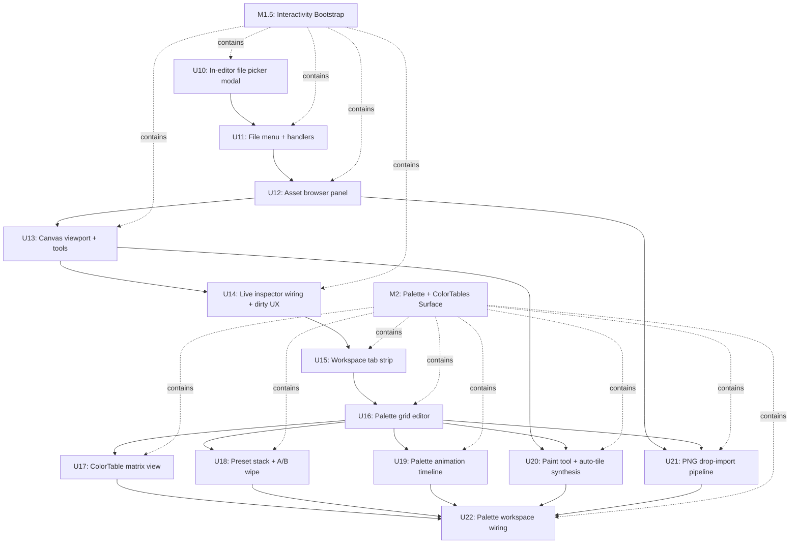

# feat: Pixelforge Editor Interactivity Bootstrap (M1.5) + Palette/ColorTables Surface (M2)

> **⚠ PARTIALLY SUPERSEDED — 2026-05-17.** The M1.5 / M2 feature
> targets — file menu, asset browser, click-to-place tools,
> palette grid, ColorTable matrices, palette presets, paint-to-place
> tiles — **remain authoritative**. Their pgui-based widget
> implementations described here are obsolete; build on Dear ImGui
> primitives (`imgui.MenuItem`, `imgui.Begin` panels, `imgui.Image`
> swatches, `imgui.BeginTable` matrices) instead. See
> **[`docs/plans/2026-05-17-001-refactor-pixelforge-studio-imgui-migration-plan.md`](2026-05-17-001-refactor-pixelforge-studio-imgui-migration-plan.md)**.

## Summary

The M0+M1 milestones of the master plan ([`docs/plans/2026-05-15-001-feat-pixelforge-no-code-editor-plan.md`](2026-05-15-001-feat-pixelforge-no-code-editor-plan.md)) shipped the editor's foundation — chrome layout, settings persistence, the `.pforge` schema, the reflection-driven component registry, the inspector renderer, and a working code-gen that emits buildable games. The studio launches and renders cleanly, but **none of its controls are wired to inputs** — there is no file menu, no asset list populated from the project, no click-to-place tool, and no live link between the inspector and the canvas. The original plan deferred per-unit detail for M2-M7 to follow-up `ce-plan` invocations.

This plan covers **two sequential milestones**:

- **M1.5 — Interactivity Bootstrap.** A small inserted milestone (not in the original roadmap) that makes the editor usable end-to-end before piling on palette tooling. Adds an in-editor file modal (New/Open/Save/Save As), an asset browser populated from the project's sprites, a click-to-place / select / delete tool set on the canvas, and the live wiring that ties inspector edits to the rendered canvas. After M1.5 lands, a user can open a `.pforge` file, see its sprites, place an entity on the canvas with the mouse, edit its component values via the inspector, save, and reload — without writing a line of code or touching the Go API.

- **M2 — Palette + ColorTables Editor Surface.** Promotes Pixelforge's signature feature (64-color palette × 4 ColorTables) into the editor's most expressive surface, per the original plan's M2 milestone summary. Adds the 64-swatch palette grid, the 4 ColorTable matrices, Lightroom-style non-destructive preset stacks, animatable palette slot timelines, paint-to-place tile authoring with LDtk-style auto-tile rule synthesis, and palette-aware PNG drop-import (quantization + frame-strip detection + collision mask derivation + `.png.meta` sidecar parsing).

Both milestones land on the M0+M1 foundation without changes to existing exported APIs — they extend the editor and grow `pixelforge_studio/editor/` and the new `pixelforge_studio/palette/` package.

---

## Problem Frame

Three concrete gaps surfaced after M1 shipped:

1. **The editor is a hollow shell at runtime.** The chrome renders correctly, the schema is sound, and the inspector logic is functional — but **a user looking at the running binary cannot do anything**. There is no path from "I launched the studio" to "I have a project open with my sprites visible" without opening a Go REPL. The original plan implicitly assumed M2 would land the first interactive surface (palette grid clicks), but palette tooling is a *deep* feature — landing it before file open/save means a user must first navigate complex palette UI on a project they cannot load.

2. **Palette tooling depends on a project context that doesn't yet have a UI.** Almost every M2 feature ("user drops a PNG", "user toggles preset Dawn", "user paints a tile") presupposes that the user can already open a project, see its assets, and select an entity. Building the palette surface in a vacuum — with no project open and no canvas to repaint — would force M2's units to fake their own project-loading paths or hardcode test fixtures, both anti-patterns.

3. **The original plan reserves but does not detail M2.** The master plan declares M2's *what* (six bullet points) and *verification criteria* but explicitly defers per-unit implementation breakdown. That deferral was intentional — the planners wanted M0+M1 to land first and shape the unknowns — and now that M0+M1 has shipped, M2 needs the same unit-level detail the foundation got.

The fix is to insert a focused **M1.5 (Interactivity Bootstrap)** that makes the editor usable end-to-end on its current feature set, then to plan M2 properly on top of that base.

---

## Requirements

Each requirement maps to the master plan's R-IDs ([`origin`](2026-05-15-001-feat-pixelforge-no-code-editor-plan.md#requirements)) plus a small number of new R-IDs scoped to the bootstrap milestone. R-IDs are stable across plan edits.

**Carried forward from origin (M2 fully addresses these):**

- **R4** — Palette + 4 ColorTables as the editor's first-class asset surface: animatable timeline, Lightroom-style presets, paint-to-place authoring with auto-tile rule synthesis, palette-aware drop-import. *(M2 covers R4 in full; the origin's milestone summary is the spec.)*
- **R1** (partial, continued from M0/U2) — Editor chrome panels (asset browser and inspector) gain real content rendering and live data binding. Full R1 (editor-as-Pixelforge-cart) still lands in M3.
- **R8** (continued from M1) — A user-friendly export path: M1.5 adds a File → Export menu entry that drives the existing `pixelforge_studio/codegen` pipeline so users do not need to call the Go API.

**New plan-local requirements (M1.5 scope):**

- **R9.** The user can create a new project, open an existing `.pforge` file from disk, save the in-memory project back to its source path, and save it to a different path (Save As), all via the editor's File menu and keyboard shortcuts. Project state survives roundtrip and the editor reflects the loaded project's contents (screen size, palette, sprites, scenes) immediately.

- **R10.** The asset browser panel lists the open project's sprites and audio samples with name, dimensions, and a small palette-rendered preview where applicable. Selecting an entry highlights it; double-clicking a sprite in placement mode locks the canvas tool to that sprite.

- **R11.** The canvas viewport renders the active scene's entities at their schema-declared positions, with three mouse tools: **Select** (click an entity to select it, drag to move), **Place** (click to add a new entity using the currently-selected sprite), **Delete** (click an entity to remove it). Selection drives the inspector. The active scene auto-fills the first scene in the project; M3 adds explicit scene switching.

- **R12.** Inspector edits mutate the in-memory project immediately and the canvas reflects the change on the next frame. The editor's dirty flag flips on every mutation that came from a UI control and clears when the project saves successfully.

---

## Scope Boundaries

**In scope (M1.5).**
- In-editor modal file picker (no native OS dialog dependency).
- File menu wiring: New / Open / Save / Save As / Export / Quit.
- Asset browser panel: sprite list + audio list + selection.
- Canvas tools: Select / Place / Delete with the existing keyboard shortcuts framework.
- Canvas entity rendering from the active scene.
- Inspector live-link: edits are visible within a frame.
- Dirty-state UX: trailing "* unsaved" marker, prompt on close with unsaved changes.

**In scope (M2).**
- 64-swatch palette grid with click-to-edit (RGB picker; supports paste-from-hex).
- 4 ColorTable matrix views (4 grids × 64×64 cells) with click-to-remap.
- Lightroom-style non-destructive Preset stack (named overlays, toggleable, A/B wipe).
- Animatable palette slot timeline with event-bus trigger references.
- Paint-to-place tile authoring with LDtk-style auto-tile rule synthesis.
- Palette-aware drop-import for PNG (quantization, alpha-gutter slice, frame-strip detection, collision-mask derivation, `.png.meta` sidecar parsing).

**Not in scope (M1.5).**
- Native OS file dialogs (deferred until `pixelforge_gui` grows a file-picker widget in M3 — see [`origin §M3`](2026-05-15-001-feat-pixelforge-no-code-editor-plan.md#m3--editor-as-pixelforge-cart--pixelforge_gui-growth)).
- Multi-scene management (Scene switching, Scene creation, Scene deletion). M1.5 assumes one scene and operates on the first one in the project.
- Undo/Redo. Deferred to M3 alongside the Pixelforge-cart rewrite that also adds the operation log.
- Drag-and-drop sprite import via OS drag (PNG drop). Deferred to M2 where it's a full feature; M1.5 supports import only via File → Import.

**Not in scope (M2).**
- WaveFunctionCollapse-based auto-tile synthesis. LDtk neighbor-pattern matching is the v1 algorithm (see Key Technical Decision #4).
- Aseprite/Tiled/GIMP project import. PNG is the v1 source format.
- Perceptual color-distance (Lab / CIEDE2000) for quantization. RGB Euclidean only at v1 (Key Technical Decision #5).
- Palette animation curves driven by `pixelforge_routine.Step` directly — M2 stores keyframes and easing; M5 visual scripting wires Steps in.

**Not in scope (either milestone).**
- Engine changes. The editor remains a read-only consumer of engine APIs.
- Audio editing UI. M6 owns that.
- Visual scripting. M5 owns that.

### Deferred to Follow-Up Work

- **Native OS file dialogs.** The in-editor picker is intentional for M1.5 — adds no new dependency, lets the editor stay self-contained. M3 may layer a native dialog (via `pixelforge_gui` widget growth) once the editor-as-cart migration lands and the picker can be authored as a Pixelforge program. Tracked as part of M3's `pixelforge_gui` widget catalog.
- **Multi-document interface.** M1.5 assumes a single open project at a time. Tabs / windows / dockable panels are deferred to post-M7.
- **Asset thumbnail generation for large sprite sheets.** M1.5 renders sprites at native size in the asset browser; sheets larger than the panel are truncated. M2's import pipeline can emit cached thumbnails but the asset browser UI work is deferred.
- **Color-distance metric pluggability beyond RGB Euclidean.** RGB Euclidean is the only v1 metric; pluggability stubs exist in the package shape so a Lab metric could land later without re-architecture.
- **Per-frame collision masks.** M2 derives one collision mask per sprite (not per frame); per-frame variants are deferred until a user surfaces an actual gameplay need.

---

## Context & Research

### Codebase patterns surfaced in this session

**M0+M1 foundation the new work builds on:**
- `pixelforge_studio/editor/editor.go` — top-level `Editor` struct with `Update`/`Draw`/`Layout` and accessors for `Project()`, `Settings()`, `KeyMap()`, `SelectedEntityID()`. M1.5 hangs new fields off this root.
- `pixelforge_studio/editor/chrome.go` — `chromeLayout` carving up the window into title bar / left panel / canvas / right panel / status bar. M1.5 fills the placeholder panels.
- `pixelforge_studio/editor/inspector.go` — auto-generated inspector reading `pfcomponent` metadata. Already wires `MarkDirty()` on edit; M1.5 needs the canvas to repaint in response.
- `pixelforge_studio/editor/widgets/` — slider, color picker, sprite ref, audio ref, event topic, enum, text, vector2, checkbox, numeric, default, unknown. Patterns to follow for new modal/list/canvas widgets.
- `pixelforge_studio/editor/keymap.go` — `Register(action, Binding)` + `IsPressed`/`JustPressed`. M1.5 registers new tool shortcuts (V/P/X for tools, Ctrl+S for save, etc.).
- `pixelforge_studio/editor/settings.go` — `RecentProjects` list maintained by `PushRecentProject`. M1.5 calls this on every successful Open/Save.
- `pixelforge_project/{project,loader,saver}.go` — `Load`, `Save`, `Encode`, `AssetsDir(path)`. M1.5 calls these from the File menu handlers.
- `pixelforge_studio/codegen/generator.go` — `Generate(project, outDir, opts)`. M1.5's Export menu drives it.

**Engine APIs the palette UI consumes (read-only):**
- `pixelforge.Palette` (the 64-entry `PaletteArray` mutated when slot colors change).
- `pixelforge.ColorTables[4]` (mutated when ColorTable cells are remapped).
- `pixelforge.RemapColor(from, to)` (the convenience API for ColorTable[0] slot edits).
- `pixelforge.DecodePalette(pngBytes)` and `pixelforge.DecodePaletteOrErr` — used by the M2 PNG import pipeline.
- `pixelforge.DecodeCanvas(pngBytes)` and `pixelforge.SpriteFrom(canvas, x, y, w, h)` — used to surface sprite previews in the asset browser and frame-strip detection.
- `pixelforge.ColorTableAccesses[4][64][64]` (the heat counters the metrics overlay already consumes) — surfaced in M2's ColorTable matrix view as activity dots so users see which mappings are actually exercised.

**Inspired patterns from elsewhere in the repo:**
- `pixelforge_metrics/pimetr.go` — the 4×64 ColorTable heat-map grid; M2's matrix view borrows the cell-rendering pattern (vector.DrawFilledRect per cell, scaled by access frequency).
- `pixelforge_studio/editor/chrome.go` — `clampMax(target, min, max)` helper; reuse for palette grid sizing.
- `pixelforge_studio/editor/widgets/color_picker.go` — already renders a 64-swatch grid as an inspector widget; the palette workspace borrows its layout but adds editing.

### External patterns (carried from origin)

- **LDtk** — auto-tile rules from neighbor patterns observed in user paint strokes. The reference algorithm for U18.
- **Aseprite** — non-destructive color overlay stack; M2 preset behavior modeled after this.
- **PICO-8 / TIC-80** — palette-as-constraint-and-tool. Drives the M2 paint-mode UX (the canvas IS the picker; no separate "color tab").

### Institutional learnings

- `docs/solutions/` still does not exist. Capture key decisions from this plan (file picker design, palette quantization metric, auto-tile heuristic, dirty-state UX) via `/ce-compound` when M1.5 lands so M2 contributors don't re-derive them.

---

## Key Technical Decisions

1. **In-editor file picker, not native OS dialogs.** M1.5 ships a modal file picker rendered via the editor's existing widget surface (native overlay over the chrome). Rationale:
   - **Zero new dependencies.** The conventional Go file-dialog libraries (`sqweek/dialog`, `ncruces/zenity`) shell out to `zenity`/`osascript`/`win32` and add platform-specific binary requirements. The engine has been disciplined about deps; adding CGo-flavored linux deps to the studio for a feature M3 will rewrite anyway is a poor trade.
   - **Editor-as-cart future.** M3 migrates chrome onto a Pixelforge canvas via `pixelforge_gui`. A native dialog would break the dogfooding goal at the worst possible moment (when the editor is its own demo). Building the picker as an in-editor widget from day one means M3 can repaint it without throwing the implementation away.
   - **Trade-off.** Users get a less-familiar picker (no system "favorites", no OS keyboard shortcuts like Cmd+Shift+G). Acceptable for v1; documented in `docs/studio.md`.

2. **Single open project.** M1.5 assumes one project at a time. The `Editor` already holds `*pixelforge_project.Project`; we don't introduce a project-list type. M3+ can add multi-document if user feedback demands it (deferred).

3. **Canvas tool model: explicit `Tool` enum on the editor.** A small `Tool` enum (`ToolSelect`, `ToolPlace`, `ToolDelete`) on `*Editor` plus a `SelectedSpriteName` field. Mouse handling in the canvas dispatches on the tool. Rationale:
   - Matches the legacy studio's mental model (V/P/X shortcuts) so muscle memory carries over.
   - Trivial to extend in M2 (the paint tool joins the enum as `ToolPaint`).
   - No need for a tool-strategy interface yet — the dispatch is one switch statement and stays readable below ~6 tools.

4. **Auto-tile rule synthesis: LDtk-style neighbor-pattern matching.** When the user paints a 3×3 neighborhood pattern twice in a tilemap, the editor synthesizes a transition rule that auto-applies on subsequent paint strokes. Rationale (origin Q from M2's open questions):
   - **Predictable.** The rule database is human-readable: "(north=grass, south=sand) → use tile 12". Users can inspect and edit it.
   - **Debuggable.** WaveFunctionCollapse can produce unexpected outputs that are hard to trace; LDtk-style rules misfire visibly (wrong tile in the user's paint stroke) and are fixed by re-painting the pattern.
   - **Simpler implementation.** Neighbor-pattern matching is a hash-table lookup; WFC requires constraint propagation and backtracking.
   - **The origin's reference application is LDtk.** The ideation doc cites LDtk as the model for tile authoring; WFC would re-invent the surface.

5. **Palette quantization metric: RGB Euclidean.** Each pixel snaps to the nearest of the 64 palette colors using `√((r1-r2)² + (g1-g2)² + (b1-b2)²)`. Rationale (origin Q):
   - **Deterministic.** Two imports of the same PNG produce identical output. Required for git-mergeable projects.
   - **Fast.** ~50 nanoseconds per pixel; a 256×256 sprite quantizes in ~3ms.
   - **Quality is "good enough" for indexed retro art.** Perceptual metrics (Lab/CIEDE2000) matter most for photo-realistic gradients; retro palettes have sparse, intentionally-chosen colors where Euclidean is rarely visibly worse than Lab.
   - **Pluggable shape.** The quantizer's color-distance function is an interface; M2.1 can add a Lab implementation behind a setting if users complain.

6. **Collision-mask derivation: per-sprite, not per-frame.** The mask is a 1-bit-per-pixel array sized for the sprite's `FrameW × FrameH` (the first frame's opacity, treated as canonical). Rationale (origin Q):
   - Per-frame masks bloat the schema and rarely buy gameplay value — most games treat all frames of a sprite as having the same collision shape.
   - When a user genuinely needs per-frame masks, M5 visual scripting can expose a "use frame N's alpha" predicate without re-architecting the schema.

7. **Palette animation: data-only at M2.** M2 stores keyframes + easing + trigger event in `pixelforge_project.PaletteAnimation`. The *runtime that drives the animation* lands with M5 visual scripting (Step coroutines). M2's "playback" in the editor is a preview that interpolates inline for the timeline scrubber — it does not register a real `pixelforge_routine.Step`.

8. **Preset stack composition order.** Active presets compose in the order the user toggled them on (LIFO display, FIFO composition). Rationale: gives users intuitive A/B comparison — turning a preset off "reveals" the layer below it. Implementation is straightforward: presets render in their `Project.Palette.Presets` order, each layer overwriting overlapping slots.

---

## Output Structure

The plan creates one new top-level package (`pixelforge_studio/palette`) and grows two existing packages (`pixelforge_studio/editor`, `pixelforge_studio/editor/widgets`). Expected shape after M1.5 + M2 complete:

```
pixelforge_studio/
  editor/
    canvas.go                        # NEW (M1.5) — scene viewport + tools (Select/Place/Delete/Paint)
    canvas_test.go                   # NEW
    asset_browser.go                 # NEW (M1.5) — sprite/audio list panel
    asset_browser_test.go            # NEW
    file_menu.go                     # NEW (M1.5) — File menu state + handlers
    file_menu_test.go                # NEW
    tools.go                         # NEW (M1.5) — Tool enum + mouse dispatch
    tools_test.go                    # NEW
    editor.go                        # MODIFY (M1.5) — wire tools, asset browser, canvas, file menu
    chrome.go                        # MODIFY (M1.5) — replace placeholder labels with live panels
    keymap.go                        # MODIFY (M1.5) — add tool shortcuts
    widgets/
      file_picker.go                 # NEW (M1.5) — modal in-editor file picker
      file_picker_test.go            # NEW
      modal.go                       # NEW (M1.5) — generic modal background + dismiss handling
      modal_test.go                  # NEW
      asset_row.go                   # NEW (M1.5) — single asset list row
      menu_bar.go                    # NEW (M1.5) — File / Edit / View / Help menu bar
      menu_bar_test.go               # NEW

  palette/                           # NEW PACKAGE (M2)
    workspace.go                     # palette workspace orchestrator (grid + matrices + presets + animator)
    grid.go                          # 64-swatch palette grid widget (click-to-edit)
    grid_test.go
    matrix.go                        # 4-ColorTable matrix view (4×64×64 cells, click-to-remap)
    matrix_test.go
    presets.go                       # preset stack panel + A/B wipe
    presets_test.go
    animator.go                      # palette slot animation timeline
    animator_test.go
    painter.go                       # paint-mode canvas tool + tilemap synthesis
    painter_test.go
    autotile.go                      # LDtk-style neighbor-pattern rule synthesizer
    autotile_test.go
    import_pipeline.go               # palette-aware PNG import pipeline
    import_pipeline_test.go
    quantize.go                      # color-distance + nearest-palette-color quantizer
    quantize_test.go
    frame_strip.go                   # frame-strip detection (alpha-gutter slice)
    frame_strip_test.go
    sidecar.go                       # .png.meta sidecar parser
    sidecar_test.go

  editor/
    workspaces.go                    # NEW (M2) — workspace tab strip + dispatch (Scene/Palette)
    workspaces_test.go               # NEW
```

The per-unit `**Files:**` sections remain authoritative; the implementer may adjust file boundaries within a package if implementation reveals a better layout.

---

## Implementation Roadmap

Two milestones, dependency-ordered. M1.5 lands first; M2 builds on M1.5's asset browser, canvas, file menu, and live-wiring patterns.



*This illustrates dependency relationships and is directional guidance for review, not implementation specification.*

---

## M1.5 — Interactivity Bootstrap

**Goal.** Make the editor usable end-to-end on the existing M0+M1 feature set. After M1.5, a non-programmer can open the studio, open a `.pforge` file, see its sprites in the asset browser, place an entity on the canvas with the mouse, edit its components in the inspector, watch the canvas update live, save, and reload — without writing Go.

**Requirements addressed.** R9, R10, R11, R12, partial R1, partial R8.

**Dependencies.** M0, M1 (from origin plan).

### U10. In-editor file picker modal

**Goal.** Build a generic modal file picker that renders inside the editor window (no native OS dialog). Used by File → Open, File → Save As, and M2's File → Import. Lists files and directories under a starting path; supports keyboard navigation (arrows + Enter) and mouse selection. Filters by extension when configured.

**Requirements.** R9.

**Dependencies.** None (foundation for U11).

**Files.**
- Create: `pixelforge_studio/editor/widgets/modal.go` (generic modal backdrop + dismiss on Esc / click-outside).
- Create: `pixelforge_studio/editor/widgets/modal_test.go`.
- Create: `pixelforge_studio/editor/widgets/file_picker.go` (`FilePicker` struct, `Open(opts)`, `Update`, `Draw`, callback on confirm).
- Create: `pixelforge_studio/editor/widgets/file_picker_test.go`.

**Approach.**
- `Modal` is a simple struct: `Visible bool`, `OnDismiss func()`, plus `Draw` that fills a semi-transparent backdrop over the full window before its child renders. A click outside the modal's body OR Esc dismisses. Multiple modals stack via a small `[]Modal` slice on the editor; only the topmost handles input.
- `FilePicker` options: `StartPath`, `Mode` (`PickOpen` / `PickSave`), `Extensions` (e.g., `[".pforge"]`), `OnConfirm func(path string)`. Renders a 600×400 centered panel: breadcrumb header, scrollable list, save-name input (only in `PickSave`), Cancel / Confirm buttons.
- Directory entries are sorted alphabetically with directories first. Hidden files (leading `.`) hidden by default; a checkbox toggles them.
- Keyboard: Up/Down navigate, Enter opens dir or confirms file, Backspace navigates up, Esc cancels.
- Path display uses `filepath.Clean`; we never expose backslash inconsistencies on Windows.

**Patterns to follow.**
- `pixelforge_studio/editor/widgets/widgets.go` `Rect`, `fillRect`, `strokeRect`, `printAt` helpers.
- `pixelforge_studio/editor/widgets/ref_widgets.go` `dropdown` for scroll-list rendering.

**Test scenarios.**
- **Happy path.** `FilePicker` opened at `t.TempDir()` lists files under it; selecting one fires `OnConfirm(absolutePath)`.
- **Happy path.** `PickSave` mode renders a filename input; entering "newgame" + Confirm fires `OnConfirm` with `<dir>/newgame.pforge` (extension appended if missing).
- **Edge case.** Backspace at the root path is a no-op (does not panic).
- **Edge case.** A path that is unreadable (permission denied) renders an error row instead of crashing; the user can still navigate elsewhere.
- **Edge case.** Extension filter `[".pforge"]` hides `.png` / `.go` files but shows directories.
- **Edge case.** Esc with the picker open fires `OnDismiss` and not `OnConfirm`.
- **Integration.** Stacked modals: the file picker over a confirmation modal — keyboard goes to the picker; pressing Esc dismisses only the topmost.

**Verification.**
- `go test ./pixelforge_studio/editor/widgets/...` passes.
- Manual: trigger the picker via Ctrl+O, navigate to `pixelforge_examples/snake/`, observe `.pforge` files filtered (when present) — no native dialog appears.

---

### U11. File menu + handlers (New / Open / Save / Save As / Export / Quit)

**Goal.** Add a top-of-window menu bar with File / Edit / View / Help. File menu drives the M0+M1 project APIs. Wire keyboard shortcuts via the existing `KeyMap`. On Quit (or window close) with unsaved changes, surface a confirmation modal.

**Requirements.** R9, R8 (Export menu).

**Dependencies.** U10.

**Files.**
- Create: `pixelforge_studio/editor/file_menu.go` (`FileMenu` state, `New`, `Open`, `Save`, `SaveAs`, `Export`, `Quit` action methods).
- Create: `pixelforge_studio/editor/file_menu_test.go`.
- Create: `pixelforge_studio/editor/widgets/menu_bar.go` (`MenuBar` widget with click-to-open dropdowns).
- Create: `pixelforge_studio/editor/widgets/menu_bar_test.go`.
- Modify: `pixelforge_studio/editor/editor.go` (host the menu bar; route menu actions).
- Modify: `pixelforge_studio/editor/keymap.go` (register Ctrl+N/O/S/Shift+S/E/Q shortcuts — most are already there from U3; just confirm and add Export).
- Modify: `pixelforge_studio/editor/chrome.go` (carve room for the menu bar at the top of the title region).

**Approach.**
- `MenuBar` renders a 24px horizontal strip at the very top of the window above the title bar. Top-level labels (File, Edit, View, Help); clicking opens a dropdown below.
- File menu items: New (Ctrl+N), Open... (Ctrl+O), Save (Ctrl+S), Save As... (Ctrl+Shift+S), Export... (Ctrl+E), Quit (Ctrl+Q).
- `New` confirms-if-dirty, then `editor.SetProject(pixelforge_project.NewProject("untitled"))`.
- `Open` opens the file picker filtered to `.pforge`; on confirm, calls `pixelforge_project.Load`, calls `editor.SetProject`, pushes to recent projects.
- `Save` writes to the current project's source path (tracked on the editor as `currentProjectPath`). If no path is set (untitled), routes to `Save As`.
- `Save As` opens the file picker in `PickSave` mode; on confirm, sets `currentProjectPath` and calls `p.Save(path)`.
- `Export` opens the file picker in directory mode (a new `PickDir` mode for the picker), then drives `codegen.Generate(p, outDir, codegen.Options{Force: true, RunGoModTidy: true, ProjectSourcePath: currentProjectPath})`.
- `Quit` confirms-if-dirty then signals `os.Exit(0)` via a small `Quit()` method on the editor — Ebitengine's `Update` returns `ebiten.Termination` for clean shutdown.
- Edit/View/Help dropdowns are stubs at M1.5 (each has one placeholder item that no-ops with a status-bar message). M2 populates View.

**Patterns to follow.**
- `pixelforge_studio/editor/widgets/ref_widgets.go` `dropdown` for menu rendering.
- `pixelforge_studio/editor/keymap.go` shortcut registration.

**Test scenarios.**
- **Happy path.** `FileMenu.Open` with a valid path replaces the editor's project, clears the selection, and pushes the path to `settings.RecentProjects`.
- **Happy path.** `FileMenu.Save` on a project with `currentProjectPath` set writes to that path and clears the dirty flag.
- **Happy path.** `FileMenu.SaveAs` opens the picker; on confirm with `/tmp/a.pforge`, the editor's `currentProjectPath` updates to `/tmp/a.pforge`.
- **Happy path.** `FileMenu.Export` writes a buildable export to the chosen directory. (Smoke; the full build proof is in the existing `-tags=long` codegen test.)
- **Happy path.** `FileMenu.New` on a dirty editor opens a confirm modal; choosing "Discard" replaces the project; choosing "Cancel" leaves the editor as-is.
- **Edge case.** `FileMenu.Save` on an untitled (no `currentProjectPath`) project routes to `Save As` automatically.
- **Edge case.** `FileMenu.Open` on a malformed `.pforge` surfaces the error in a modal and leaves the existing project loaded.
- **Edge case.** Ctrl+Q with dirty changes opens the confirm; closing the OS window with dirty changes does the same.
- **Integration.** Open → Save As → Open (the just-saved path) → assert the loaded project equals the in-memory project the editor had pre-Save.

**Verification.**
- `go test ./pixelforge_studio/editor/...` passes.
- Manual: open snake-shaped project (`docs/plans/.../snake.pforge` if present), save as a copy, reopen the copy — entities, components, palette persist.

---

### U12. Asset browser panel (sprite + audio lists)

**Goal.** Replace the left panel's "ASSET BROWSER" placeholder with a live list of the project's sprites and audio samples. Each entry shows name, dimensions / duration, and a small palette-rendered preview. Selecting an entry highlights it; the selected sprite is the one the Place tool will instantiate.

**Requirements.** R10.

**Dependencies.** U11 (so a project exists to browse).

**Files.**
- Create: `pixelforge_studio/editor/asset_browser.go` (`AssetBrowser` struct with `Draw(dst, panelRect, project)`, mouse handling, scroll state, selection state).
- Create: `pixelforge_studio/editor/asset_browser_test.go`.
- Create: `pixelforge_studio/editor/widgets/asset_row.go` (one row renderer: name + preview + dim/duration label).
- Modify: `pixelforge_studio/editor/editor.go` (instantiate `AssetBrowser`, expose `SelectedSpriteName()`).
- Modify: `pixelforge_studio/editor/chrome.go` (delegate left-panel content to `AssetBrowser` instead of the placeholder).

**Approach.**
- The panel renders two sections: "Sprites" header followed by sprite rows, then "Audio" header followed by audio rows. A small scroll offset (mouse wheel + Up/Down) handles overflow.
- Each sprite row: 48×48 preview thumbnail (palette-rendered via `pixelforge.DecodeCanvas` from the asset PNG, scaled to fit), name, "WxH FW×FH" dim label. A row is ~52px tall.
- Each audio row: a small waveform-style icon, name, sample-rate label.
- Selection: clicking a row highlights it; the editor tracks `selectedSpriteName` / `selectedAudioName` separately. Selected sprite drives the Place tool.
- Preview thumbnails cache by sprite path so repeated frames are cheap. Cache invalidates on Load.
- When no project is open or the project has no sprites, the panel shows a centered "No assets" hint with a "Import..." link that routes to the M2 import pipeline (placeholder string at M1.5; M2 wires it).

**Patterns to follow.**
- `pixelforge_studio/editor/widgets/ref_widgets.go` for scroll-list patterns.
- `pixelforge.DecodeCanvas` / `pixelforge.SpriteFrom` for thumbnail rendering.

**Test scenarios.**
- **Happy path.** Loading a snake-shaped project (1 sprite, 0 audio) renders one sprite row + a "No audio" placeholder.
- **Happy path.** Clicking a sprite row sets `editor.SelectedSpriteName()` to that sprite's name; clicking another row updates it.
- **Edge case.** A project with 50 sprites renders the first ~10 visible; scrolling reveals the rest.
- **Edge case.** A sprite whose `RelativePath` file is missing renders the row with a red ⚠ glyph and the name, no preview thumbnail. (Sanity — the loader's asset validation should catch this earlier; the browser must not panic.)
- **Edge case.** Empty project renders "No assets" + the Import placeholder.
- **Integration.** Load project → click sprite → switch to Place tool → first canvas click instantiates an entity with a component referencing the selected sprite.

**Verification.**
- `go test ./pixelforge_studio/editor/...` passes.
- Manual: open snake project, see the snake sprite preview rendered at 48×48 using the project palette.

---

### U13. Canvas viewport + tools (Select / Place / Delete)

**Goal.** Replace the center "CANVAS" placeholder with a real viewport that renders the active scene's entities at their schema-declared positions. Add three mouse tools driven by the keymap (V / P / X) and a tool indicator in the status bar.

**Requirements.** R11.

**Dependencies.** U12.

**Files.**
- Create: `pixelforge_studio/editor/canvas.go` (`Canvas` struct with `Draw(dst, rect, project, scene)`, mouse hit-testing, tool dispatch).
- Create: `pixelforge_studio/editor/canvas_test.go`.
- Create: `pixelforge_studio/editor/tools.go` (`Tool` enum: `ToolSelect`, `ToolPlace`, `ToolDelete`; `(e *Editor) Tool() Tool`, `SetTool(t Tool)`).
- Create: `pixelforge_studio/editor/tools_test.go`.
- Modify: `pixelforge_studio/editor/editor.go` (instantiate `Canvas`, dispatch in `Draw`).
- Modify: `pixelforge_studio/editor/chrome.go` (delegate center to `Canvas`).
- Modify: `pixelforge_studio/editor/keymap.go` (register V/P/X tool shortcuts).

**Approach.**
- The canvas viewport carves out the center chrome region. Within that region, a sub-rect (the "view box") is laid out by the project's `ScreenWidth × ScreenHeight` scaled to fit the available pixels — same letterboxing logic `pixelforge_ebiten` already uses.
- Each scene entity renders as: a small placeholder rectangle (12×12, palette color 7) when no sprite is bound, OR a thumbnail from the entity's sprite component (if a `pf:"sprite"` field is found) rendered at the entity's position.
- The selected entity gets a 1px white selection rectangle.
- **Select tool.** Click on an entity (hit-test against its bounding rect) → set `editor.selectedEntityID`. Click on empty space → clear selection. Drag a selected entity → update its `Position.X/Y` (snap to integer pixels). Releases mark the project dirty.
- **Place tool.** Click on empty space → append a new `Entity` to the active scene with a fresh stable ID (`uuid-like-short-id`), `Position` from the click, and one auto-generated component that references the asset browser's selected sprite. If no sprite is selected, the place tool silently no-ops and the status bar surfaces "Select a sprite first".
- **Delete tool.** Click on an entity → remove it from the scene; clear selection if the deleted entity was selected.
- The status bar shows the current tool name + selected sprite name + entity count.

**Patterns to follow.**
- The legacy `pixelforge_studio/editor/editor.go:228-241` keyboard dispatch (now deleted) — same shortcut idiom, routed through `KeyMap`.
- `pixelforge_ebiten/internal/ebitengame.go` LayoutF letterboxing.

**Test scenarios.**
- **Happy path.** With a snake-shaped scene loaded, `Canvas.Draw` renders 5 entity markers at their declared positions.
- **Happy path.** Select tool: clicking on entity "head-0" sets `editor.selectedEntityID = "head-0"`.
- **Happy path.** Select tool drag: clicking + dragging entity "head-0" by (10, 5) updates its `Position.X` by 10 and `Position.Y` by 5 (in scene-space pixels, not window pixels).
- **Happy path.** Place tool: with sprite "fruit" selected, clicking at scene-space (40, 40) appends a new entity at (40, 40) referencing the fruit sprite.
- **Happy path.** Delete tool: clicking on entity "fruit-0" removes it from the scene.
- **Edge case.** Place tool with no sprite selected does nothing; surfaces a status-bar message.
- **Edge case.** Click outside the view-box but inside the canvas panel does nothing (the tool dispatches only within the view-box).
- **Edge case.** Drag that crosses outside the view-box clamps the entity position to the scene bounds.
- **Edge case.** Multiple entities at the same position: Select picks the topmost (last in the array, painter's order). Delete deletes the topmost.
- **Integration.** Select tool → click entity → inspector renders that entity's components (proves the selection-to-inspector wire works end to end).

**Verification.**
- `go test ./pixelforge_studio/editor/...` passes.
- Manual: open snake project, press P, click on the canvas — fruit appears. Press V, click the new fruit — inspector shows its component.

---

### U14. Live inspector wiring + dirty UX

**Goal.** Confirm and tighten the existing inspector → project mutation path so edits reflect on the canvas within a frame; surface a clear dirty marker in the status bar; route Ctrl+S through the file menu; and prompt before destructive actions when dirty.

**Requirements.** R12.

**Dependencies.** U11, U12, U13.

**Files.**
- Modify: `pixelforge_studio/editor/inspector.go` (confirm `editor.MarkDirty()` is called for every widget edit — already wired through `EditEvent`; add visible diff to entity position when inspector edits the Vector2 widget).
- Modify: `pixelforge_studio/editor/editor.go` (status bar dirty marker, confirm-if-dirty hook used by `FileMenu`).
- Create: `pixelforge_studio/editor/widgets/confirm_modal.go` (small confirm dialog: title, message, Cancel / Confirm buttons; reuse `Modal`).
- Create: `pixelforge_studio/editor/widgets/confirm_modal_test.go`.

**Approach.**
- The dirty marker already exists (`* unsaved` text at bottom-right). M1.5 moves it into the status bar alongside the tool/sprite labels and styles it consistently.
- `Editor.PromptIfDirty(action func())` shows a confirm modal when the project is dirty, runs `action` on confirm; runs `action` immediately when clean. Used by File → New, File → Open, File → Quit, OS window-close.
- Inspector edits that change an entity's `Position` (the Vector2 widget when bound to an entity-position-typed component) must trigger a canvas repaint. Since the canvas reads `Project()` directly each frame, this is already true; we just verify the test coverage exists.

**Patterns to follow.**
- `pixelforge_studio/editor/widgets/ref_widgets.go` `dropdown` for confirm-modal structure.

**Test scenarios.**
- **Happy path.** Inspector edit (e.g., dragging a slider) sets `editor.IsDirty() = true`.
- **Happy path.** `editor.PromptIfDirty(action)` with a clean project runs `action` immediately (no modal).
- **Happy path.** `editor.PromptIfDirty(action)` with a dirty project shows a confirm modal; clicking Confirm runs `action`; clicking Cancel does not.
- **Happy path.** `FileMenu.Save` on a dirty project succeeds and clears the dirty flag.
- **Integration.** Inspector slider edit → entity component value updates → save → reload → assert the saved value persisted to disk and reloads with the edit. (Proves the "live mutation → save → reload" round-trip.)
- **Integration.** Inspector Vector2 edit on a position-typed component → canvas redraws with the entity at the new position on the next frame.

**Verification.**
- `go test ./pixelforge_studio/editor/...` passes including the integration tests.
- Manual: open snake, click head, drag the X slider in the inspector, watch the canvas head move; Ctrl+S; relaunch the studio; reopen the file; verify the head's new position persisted.

---

## M2 — Palette + ColorTables Editor Surface

**Goal.** Make Pixelforge's signature feature (64-color palette × 4 ColorTables) the editor's most expressive surface. By the end of M2, a user can author a complete art pipeline without leaving the editor: pick palette colors, design ColorTable mappings, stack Lightroom-style presets, animate palette slots over time, paint tiles with auto-tile rule synthesis, and import a raw PNG that the editor quantizes, slices, and registers automatically.

**Requirements addressed.** R4 in full.

**Dependencies.** M0, M1, M1.5.

### U15. Workspace tab strip

**Goal.** Add a tab strip immediately below the menu bar that selects between workspaces ("Scene" — the M1.5 canvas; "Palette" — the M2 palette workspace). Active tab determines what fills the center chrome region. The architectural foundation M3 will fully exploit.

**Requirements.** R4 (foundation), R1 (foundation — workspaces are how M3's editor-as-cart presents its tools).

**Dependencies.** M1.5 complete.

**Files.**
- Create: `pixelforge_studio/editor/workspaces.go` (`Workspace` interface: `Name()`, `Draw(dst, rect, editor)`, `Update(editor)`).
- Create: `pixelforge_studio/editor/workspaces_test.go`.
- Modify: `pixelforge_studio/editor/editor.go` (host the workspace registry + active workspace state).
- Modify: `pixelforge_studio/editor/chrome.go` (carve room for the tab strip; delegate center to the active workspace).
- Modify: `pixelforge_studio/editor/keymap.go` (register Ctrl+Tab to cycle workspaces, Ctrl+1/2 to jump to specific workspaces).

**Approach.**
- A `Workspace` is a thin interface (3 methods). M1.5's canvas becomes a `SceneWorkspace` implementing this interface; M2 adds `PaletteWorkspace`. M3-M7 add their own.
- Tab strip renders as a 22px horizontal bar between menu bar and chrome's main body. Each tab is a 100×22 button with the workspace name; active tab gets a 2px bottom accent stripe (same blue as the title bar's accent).
- Workspace switching does not unload state — each workspace keeps its scroll position, selection, etc., across switches.
- Asset browser (left) and inspector (right) panels remain visible across workspaces; they target the active workspace's selection where applicable.

**Patterns to follow.**
- `pixelforge_studio/editor/chrome.go` chrome carving — the tab strip is just another region.

**Test scenarios.**
- **Happy path.** `editor.SetActiveWorkspace("palette")` updates the active workspace; `Draw` routes to its handler.
- **Happy path.** Ctrl+Tab cycles workspaces in registration order.
- **Edge case.** `SetActiveWorkspace` with an unregistered name is a no-op + status-bar warning.
- **Integration.** Switch from Scene to Palette and back; assert the Scene canvas's selected-entity state is preserved.

**Verification.**
- `go test ./pixelforge_studio/editor/...` passes.
- Manual: launch, see two tabs (Scene / Palette); click Palette; chrome's center clears the canvas and renders the placeholder palette workspace.

---

### U16. Palette grid editor (click-to-edit, paste-from-hex)

**Goal.** The 64-swatch palette grid. Clicking a swatch opens an inline RGB picker; pasting `#RRGGBB` into the picker updates the slot. Live-bound: changing a slot reflects in the asset browser thumbnails, the canvas, and the metrics overlay if active.

**Requirements.** R4.

**Dependencies.** U15.

**Files.**
- Create: `pixelforge_studio/palette/workspace.go` (top-level palette workspace, registers grid + matrix + presets + animator as sub-panels).
- Create: `pixelforge_studio/palette/grid.go` (`Grid` widget — 8×8 swatch layout, click handling, RGB picker popover).
- Create: `pixelforge_studio/palette/grid_test.go`.

**Approach.**
- The grid is 8 rows × 8 columns (= 64) of 28×28 swatches separated by 2px gutters. Sized to fill the workspace's center horizontally; vertical centering.
- Clicking a swatch opens an inline RGB picker popover anchored below the swatch: three numeric inputs (R / G / B, 0..255), a hex input (`#RRGGBB`), a small preview chip, and Confirm / Cancel buttons.
- Hex input parsing is the same `parseHexColor` helper from `pixelforge_studio/editor/widgets/color_picker.go`. Bad input keeps the previous value + flashes the input field red.
- Confirm writes back to `project.Palette.Base[slot]` and pushes a status-bar message "Slot N = #...".
- Slot 0 is special — the engine treats it as transparent. The grid renders slot 0 with a checker pattern and the picker shows a "(transparent)" badge; editing slot 0's RGB is allowed but does not change transparency.

**Patterns to follow.**
- `pixelforge_studio/editor/widgets/color_picker.go` swatch layout + `parseHexColor`.

**Test scenarios.**
- **Happy path.** Click swatch 8 → picker opens → enter `#ff0000` → Confirm → `project.Palette.Base[8] == "#ff0000"` and `editor.IsDirty()` is true.
- **Happy path.** RGB numeric input (255, 0, 0) sets the same color as `#ff0000`.
- **Edge case.** Hex input `garbage` does not update the slot; field flashes red.
- **Edge case.** Hex input `#fff` (3-digit) expands to `#ffffff` (treat 3-digit as shorthand) OR rejects (pick rejection for v1 simplicity; document the policy in `pforge-schema.md`). *(Implementer decides; the test scenario should pin whichever path lands.)*
- **Edge case.** Editing slot 0 saves the RGB but does not flip a "transparent" flag — the engine's transparency rule is independent of slot 0's RGB.
- **Integration.** Edit slot 1 → switch to Scene workspace → an entity using palette index 1 in its sprite renders with the new color on the next frame.

**Verification.**
- `go test ./pixelforge_studio/palette/...` passes.
- Manual: edit a slot, watch the canvas repaint.

---

### U17. ColorTable matrix view (4 grids, click-to-remap, activity heat)

**Goal.** Render the four 64×64 ColorTable matrices as a vertical stack of grids. Each cell `(source, target)` shows the palette-index value the engine substitutes when drawing `source` over `target` in that table. Clicking a cell opens a slot picker that updates the cell. Cells overlay a heat tint pulled from `pixelforge.ColorTableAccesses` so users see which mappings are actually exercised.

**Requirements.** R4.

**Dependencies.** U16.

**Files.**
- Create: `pixelforge_studio/palette/matrix.go` (`Matrix` widget — 4 grids of 64×64 cells, scroll, click-to-remap).
- Create: `pixelforge_studio/palette/matrix_test.go`.
- Modify: `pixelforge_studio/palette/workspace.go` (register the matrix sub-panel).

**Approach.**
- Each table renders as a 64-col × 64-row grid of 4×4 cells (256×256 px total). Four tables stacked vertically with table-label headers; the workspace is scrollable to show all four.
- Cell value displayed as a small palette-color swatch (the value's color); on hover, a tooltip shows "Table T: (src=X) over (dst=Y) → palette[V]". Cell background tinted by access frequency from `pixelforge.ColorTableAccesses[T][src][dst]` (normalised by the max access count, same coloring scheme as `pixelforge_metrics.intensityRGBA`).
- Clicking a cell opens a 64-swatch picker (the same grid widget from U16, but in "select" mode). On confirmation, writes back to `project.Palette.ColorTables[T][src][dst]`.
- Bulk-edit shortcuts: dragging across cells with the picker target locked applies the same value to every dragged cell. Shift+click selects a range; right-click pastes the previous value. (Bulk-edit might land later; v1 supports single-cell only and the others are deferred to a Phase 2 of U17.)

**Patterns to follow.**
- `pixelforge_metrics/pimetr.go` `drawColorTableNative` cell rendering + access tint.

**Test scenarios.**
- **Happy path.** Matrix renders 4 × 64 × 64 cells. Initial state shows the identity table for ColorTables 1 / 2 (matching `pixelforge.ResetColorTables`).
- **Happy path.** Clicking cell (Table 0, src=7, dst=0) → picker → choose palette index 14 → `project.Palette.ColorTables[0][7][0] == 14`.
- **Edge case.** Scroll past Table 4 boundary clamps at the last table's bottom edge.
- **Edge case.** With `pixelforge.ColorTableAccesses` empty (no game running), heat tint is the dim baseline; cells remain readable.
- **Integration.** Edit ColorTable[0][7][0] → call `pixelforge.RemapColor(7, 14)` in a test that draws color 7 on color 0 → the rendered output is color 14. (Proves the editor's writes reach the engine semantics.)

**Verification.**
- `go test ./pixelforge_studio/palette/...` passes.
- Manual: switch to Palette workspace, scroll to Table 0, edit a cell, run a small in-editor test scene where that cell's source color renders on its target — observe the change.

---

### U18. Preset stack + A/B wipe

**Goal.** Lightroom-style non-destructive presets. A vertical panel lists the project's `Palette.Presets` with toggle checkboxes; toggling stacks the preset's overrides on top of the base palette + base ColorTables. Holding Spacebar performs an A/B wipe (shows the base for as long as held). Users can create / rename / delete presets via the panel.

**Requirements.** R4.

**Dependencies.** U16.

**Files.**
- Create: `pixelforge_studio/palette/presets.go` (`PresetStack` widget — list, toggle, add/remove/rename, A/B wipe state).
- Create: `pixelforge_studio/palette/presets_test.go`.
- Modify: `pixelforge_studio/palette/workspace.go` (register the preset stack sub-panel as a right-side strip in the palette workspace).

**Approach.**
- A preset list element is 32px tall: checkbox + name (editable on double-click) + "trash" icon + drag handle.
- Active preset composition: starting from the base palette/colortable, apply each active preset in `Project.Palette.Presets` order. Each preset's `PaletteOverrides` (map[slot]→color) overwrites those slots; each `ColorTableOverrides` entry overwrites those cells. M1's schema already supports this shape.
- "New Preset..." button at the bottom: prompts for a name, creates an empty preset, immediately active.
- A/B wipe: while Spacebar is held, the workspace renders as if no presets were active. Release returns to the composed view. Status bar shows "A/B WIPE" while held.
- Preset deletion shows a confirm modal if the preset has any overrides.

**Patterns to follow.**
- `pixelforge_studio/editor/widgets/checkbox.go` for the toggle.
- `pixelforge_studio/editor/widgets/confirm_modal.go` (from U14) for delete confirmation.

**Test scenarios.**
- **Happy path.** Create preset "Dawn" → toggle on → it adds an entry to `project.Palette.Presets` and the active-presets list.
- **Happy path.** Toggling a preset off restores the previously-composed palette state.
- **Happy path.** Adding override (slot 8 = #ff0000) to preset "Dawn" while active changes the displayed palette; toggling off reveals the base.
- **Happy path.** Two presets active in order [A, B] — B's overrides win on overlapping slots.
- **Happy path.** Hold Spacebar → grid shows base palette; release → grid shows composed.
- **Edge case.** Empty preset (no overrides) is a no-op when active; users can still rename/delete it.
- **Edge case.** Preset with a malformed override (slot index out of range, e.g. 99) is loaded but skipped during composition; surface a warning marker on the preset row.
- **Integration.** Toggling a preset re-renders the asset browser thumbnails on the next frame.

**Verification.**
- `go test ./pixelforge_studio/palette/...` passes.
- Manual: load a project, create a "Dawn" preset, edit slot 8 while active, toggle off → slot 8 reverts; toggle on → preset reappears.

---

### U19. Palette animation timeline

**Goal.** Right-click any palette grid swatch → "Animate" → opens a horizontal timeline scrubber for that slot. Users add keyframes by clicking the timeline; each keyframe stores a (time, color) pair. The timeline previews the animation by interpolating in editor playback; the runtime driver (Steps) lands with M5.

**Requirements.** R4.

**Dependencies.** U16.

**Files.**
- Create: `pixelforge_studio/palette/animator.go` (`Animator` widget — timeline scrubber, keyframe edit, easing selector, trigger event reference).
- Create: `pixelforge_studio/palette/animator_test.go`.
- Modify: `pixelforge_studio/palette/workspace.go` (register the animator as a popover triggered from the grid).
- Modify: `pixelforge_studio/palette/grid.go` (right-click → opens animator for that slot).

**Approach.**
- The timeline is a 300×60 horizontal bar showing 0..ClipLength seconds (default 2s, user-resizable). Tick marks every 0.5s.
- Keyframes are colored dots placed at their timestamp; clicking a dot opens the RGB picker for that frame.
- Easing dropdown: linear, ease_in, ease_out, ease_in_out, step.
- Trigger event dropdown: free-form text field or a project event-topic ref (M5 will register topics).
- A "▶" preview button plays the animation in the workspace — the grid's slot ramps through the keyframes while playback is active.
- Looping toggle.

**Patterns to follow.**
- `pixelforge_studio/editor/widgets/ref_widgets.go` `EventTopicWidget` for the trigger dropdown.
- `pixelforge_metrics/pimetr.go` budget-bar timeline rendering pattern.

**Test scenarios.**
- **Happy path.** Right-click slot 8 → animator opens for slot 8.
- **Happy path.** Add keyframes (0s, #ff0000), (1s, #00ff00) → preview button ramps slot 8 from red to green over 1 second.
- **Happy path.** Easing "step" produces a discrete jump at each keyframe (no interpolation).
- **Edge case.** Two keyframes at the same timestamp: the later (in source order) wins.
- **Edge case.** Empty animation (no keyframes) renders an empty timeline + a "Click to add keyframe" hint.
- **Edge case.** Removing the only keyframe leaves an empty animation (does not delete the animation entry — the user may add keyframes back).
- **Integration.** Animator playback uses the M4-style ring-buffer pattern as a future hook; for now, playback is inline interpolation. *(M4 may rebuild on top.)*

**Verification.**
- `go test ./pixelforge_studio/palette/...` passes.
- Manual: animate slot 8 from red to green over 1 second; press play; watch the grid swatch oscillate.

---

### U20. Paint tool + LDtk-style auto-tile rule synthesis

**Goal.** A new canvas tool: `ToolPaint`. The user picks a palette color from the asset browser's color section (or the palette workspace's grid) and paints raw pixel/tile data onto the active scene's tilemap. When the user paints a recognisable neighbor pattern twice, the editor synthesizes a transition tile rule from the pattern.

**Requirements.** R4.

**Dependencies.** U13 (canvas / tools), U16 (palette).

**Files.**
- Create: `pixelforge_studio/palette/painter.go` (`Painter` tool — paint-stroke recording, palette-color or tile selection).
- Create: `pixelforge_studio/palette/painter_test.go`.
- Create: `pixelforge_studio/palette/autotile.go` (`AutoTileRuleSynth` — neighbor-pattern matcher, rule database).
- Create: `pixelforge_studio/palette/autotile_test.go`.
- Modify: `pixelforge_studio/editor/tools.go` (add `ToolPaint`).
- Modify: `pixelforge_studio/editor/canvas.go` (dispatch the paint tool when active).
- Modify: `pixelforge_studio/editor/keymap.go` (register B for paint — "brush", since P is already Place).

**Approach.**
- Two paint modes: **pixel** (paint a single palette color into the scene's tilemap layer; smallest unit = 1 tile) and **tile** (paint an existing sprite/tile from the asset browser).
- A "tilemap layer" is a new concept in the active scene — at M2 we add it implicitly when the user first paints; the schema gains a `TilemapLayer` type on `Scene`. *(Deferred-to-implementation: exact schema shape; the implementer can place it on `Scene.Tilemaps []TilemapLayer` with `TileW`, `TileH`, `Grid [][]int`.)*
- Stroke recording: every paint click records (tile-x, tile-y, value) into a stroke buffer. On stroke end (mouse-up), the synth analyses the stroke for 3×3 neighbor patterns.
- Rule synth: for each painted tile, examine its 4-neighbor or 8-neighbor pattern. If the same pattern has been painted before with the same output, increment the rule's count. Once a pattern has count ≥ 2, it becomes an active rule and auto-applies on the next stroke that produces the same pattern. Rules display in an inspector-style panel for manual edit/delete.
- The implementation lives in a new package (`pixelforge_studio/palette/autotile.go`) so M7 procgen operators can reuse the same rule synth as the `WaveCollapse`/`TilePlace` operator.

**Patterns to follow.**
- `pixelforge_studio/editor/widgets/checkbox.go` minimalism for the mode toggle.
- LDtk's `rules.json` neighbor-pattern grammar (cited in ideation).

**Test scenarios.**
- **Happy path.** Paint mode "pixel", select palette color 8, click a tile → the tilemap cell becomes value 8.
- **Happy path.** Paint pattern (grass-grass-sand neighbor) twice → rule database now contains that pattern → painting the same neighborhood elsewhere auto-substitutes the synthesized transition tile.
- **Happy path.** Manual edit of a rule in the rule panel changes the synthesized tile.
- **Edge case.** Stroke with only one tile (single click) does not trigger rule synthesis (need a neighbor pattern, which requires at least one adjacent painted cell).
- **Edge case.** Painting outside the scene's pixel bounds clamps to scene bounds.
- **Edge case.** Two different patterns with the same output stay distinct rules.
- **Integration.** Paint a grass-sand transition on the scene → switch to Scene workspace → the rendered scene shows the painted tiles using the synthesized transition.

**Verification.**
- `go test ./pixelforge_studio/palette/...` passes.
- Manual: paint a 2-tile-deep grass border around a sand patch → watch the editor auto-fill the boundary with the appropriate transition tiles.

---

### U21. Palette-aware PNG drop-import pipeline

**Goal.** A drop target on the asset browser (and a File → Import menu item from U11) that takes a PNG file and produces a registered sprite asset in seconds, without dialogs. The pipeline: palette quantization → alpha-gutter slice / frame-strip detection → collision-mask derivation → `.png.meta` sidecar parsing → asset registration.

**Requirements.** R4.

**Dependencies.** U12 (asset browser), U16 (palette).

**Files.**
- Create: `pixelforge_studio/palette/import_pipeline.go` (`Import(pngPath, project) ImportResult` — orchestrator that calls the steps below).
- Create: `pixelforge_studio/palette/import_pipeline_test.go`.
- Create: `pixelforge_studio/palette/quantize.go` (`Quantize(rgb, palette) byte` + nearest-neighbor whole-image variant).
- Create: `pixelforge_studio/palette/quantize_test.go`.
- Create: `pixelforge_studio/palette/frame_strip.go` (`DetectFrames(canvas) (frameW, frameH int)` — alpha-gutter detection).
- Create: `pixelforge_studio/palette/frame_strip_test.go`.
- Create: `pixelforge_studio/palette/sidecar.go` (`LoadSidecar(pngPath) (Sidecar, error)` — parses `<pngPath>.meta` JSON).
- Create: `pixelforge_studio/palette/sidecar_test.go`.

**Approach.**
- `Import` is the orchestrator. Steps:
  1. **Load PNG** via `pixelforge.DecodeCanvas`.
  2. **Detect frame size** via `DetectFrames` (look for fully-transparent vertical/horizontal lines as gutters; failing that, default to image-wide single-frame).
  3. **Quantize** every pixel to the nearest palette color via `Quantize` (RGB Euclidean distance to each of `project.Palette.Base`).
  4. **Derive collision mask** from the first frame's opaque pixels (one bit per pixel, row-major).
  5. **Load sidecar** if `<pngPath>.meta` exists — overrides `FrameW`/`FrameH`/`OriginX`/`OriginY`/`AnimationClips` from the auto-detection.
  6. **Copy the asset file** into the project's `*-assets/sprites/` directory.
  7. **Register the sprite** by appending a `SpriteAsset` to `project.Sprites`.
- The quantize step is hot — operates on every pixel. Implement as a plain loop in `quantize.go` with a precomputed `paletteRGB [64][3]float64` table; profile in U21 verification and only optimise (SIMD, parallel) if it exceeds 100ms for a 256×256 sprite.
- The pipeline is deterministic: same PNG + same palette → same output. Tests rely on this.
- Errors at any step return without touching the project (atomic-on-failure).

**Patterns to follow.**
- `pixelforge.DecodePaletteOrErr` style: return-or-err idiom + a `MustImport` convenience.
- `pixelforge_studio/codegen/generator.go` atomic-on-failure pattern.

**Test scenarios.**
- **Happy path.** Drop a 32×8 PNG with 4 visible 8×8 frames separated by 1px transparent gutters → import produces a `SpriteAsset` with `FrameW=8, FrameH=8, Width=32, Height=8`.
- **Happy path.** Quantization snaps a (250, 5, 5) pixel to palette slot whose color is closest to red (e.g., #ff0000). Asserted by computing Euclidean distance manually.
- **Happy path.** Sidecar override: with `<png>.meta` containing `{"frame_w": 16, "frame_h": 16}`, import uses 16×16 regardless of auto-detection.
- **Happy path.** Collision mask: a 4×4 sprite with opaque pixels at (0,0), (1,1), (2,2), (3,3) produces a 16-bit mask with those bits set.
- **Edge case.** A PNG with no transparent gutters (e.g., a solid 32×16 image) imports as one frame at 32×16.
- **Edge case.** A PNG with one fully-transparent column on the left edge does not treat that column as a gutter — gutters must separate non-empty regions on both sides.
- **Edge case.** A PNG with colors outside the palette but within the same hue family snaps to the closest palette color; out-of-gamut pixels (a green pixel imported into a red-only palette) all snap to the nearest red.
- **Edge case.** Sidecar file present but malformed → import succeeds with auto-detection, surfaces a warning in the status bar.
- **Edge case.** Atomic: a malformed PNG aborts the entire import — `project.Sprites` is unchanged and no file lands in the assets directory.
- **Integration.** Import a PNG → switch to Scene workspace → asset browser shows the new sprite → Place tool can instantiate it → save → reload → the imported sprite + frames persist exactly.

**Verification.**
- `go test ./pixelforge_studio/palette/...` passes.
- Manual: drop `pixelforge_examples/snake/sprites.png` onto the asset browser; observe a new "sprites" entry; switch to Scene; place a frame on the canvas.
- Profile: a 256×256 sprite imports in <100ms on a modern laptop. (Captured during M2 wrap-up; if exceeded, profile + optimise.)

---

### U22. Palette workspace wiring + verification scenarios

**Goal.** Compose U15-U21 into a cohesive palette workspace. Final pass: keyboard shortcuts, status-bar surfaces, cross-workspace selection coherence, golden-image regression tests for the workspace at full feature set.

**Requirements.** R4.

**Dependencies.** U15, U16, U17, U18, U19, U20, U21.

**Files.**
- Modify: `pixelforge_studio/palette/workspace.go` (final composition + keyboard handling).
- Modify: `pixelforge_studio/editor/keymap.go` (palette workspace shortcuts: Ctrl+2 jumps to it, P opens preset stack popover when in workspace, A opens animator).
- Create: `pixelforge_studio/palette/workspace_test.go` (integration tests for the full palette workspace).

**Approach.**
- Final layout: grid on the left two-thirds, matrix stack on the right top, preset stack on the right middle, animator opens as a popover from grid right-click.
- Add a "Reset to defaults" button in the workspace's footer that re-runs `pixelforge_project.DefaultPalette()` after a confirm modal.
- The asset browser, when the Palette workspace is active, shows palette slots and preset names instead of sprites/audio. Selecting a slot in the browser focuses it in the grid.
- Mark dirty on every edit.

**Patterns to follow.**
- `pixelforge_studio/editor/inspector.go` cache pattern — keep widget instances per (workspace, panel, item) so transient state survives between frames.

**Test scenarios.**
- **Happy path.** Switch to Palette workspace → grid + matrix + preset stack all render.
- **Happy path.** Reset to defaults: with a customised palette, click Reset → confirm → palette reverts to `DefaultPalette`, ColorTables reset to identity. Dirty flag set.
- **Happy path.** Asset browser in Palette workspace lists "Slots", "Presets", "Animations" — switching to a list expands it.
- **Integration.** Drop a PNG → asset registered → switch to Palette → grid shows the project's now-derived palette (when M2 import auto-extracted it from the PNG, which is one of M2's open-questions to settle during U21).
- **Integration.** Two saves of the palette workspace's state via `Save()` produce byte-identical `.pforge` files (determinism — inherited from U6 but worth re-checking with palette presets active).
- **Integration.** Run the metrics overlay (`pixelforge_metrics.Start`) while the Palette workspace is open — ColorTable heat values match between the matrix-view tint and the overlay's grid.

**Verification.**
- `go test ./pixelforge_studio/palette/...` passes including the integration tests.
- Manual end-to-end: open a snake project, switch to Palette, edit a slot, toggle a preset, drop a PNG, switch back to Scene, place an entity using the imported sprite, save, reload — every change persists exactly.

---

## System-Wide Impact

- **New top-level package: `pixelforge_studio/palette`.** Contained — only the editor itself imports it. No engine code consumes it (the palette state lives on `pixelforge.Palette` / `pixelforge.ColorTables`, which already exist).
- **`pixelforge_studio/editor` grows.** New files (canvas, asset_browser, tools, file_menu, workspaces) plus modifications to chrome.go, editor.go, keymap.go, inspector.go. No exported-symbol removals; existing tests continue to pass.
- **Schema additions in M2.** `pixelforge_project.Scene` gains a `Tilemaps []TilemapLayer` field for paint-tool data. Existing scenes without tilemaps round-trip without changes (empty `tilemaps: []`). Schema version stays at 1; the addition is backward-compatible.
- **No engine-side changes.** Editor reads `pixelforge.Palette` / `pixelforge.ColorTables` / `pixelforge.ColorTableAccesses` / `pixelforge.DecodeCanvas` / `pixelforge.DecodePalette` directly. Edits to palette state mutate the engine state in-process so the canvas reflects changes immediately.
- **`pixelforge_studio/editor/widgets` grows.** New widgets: `modal`, `file_picker`, `menu_bar`, `confirm_modal`, `asset_row`. All additive.
- **Keymap surface grows.** New actions: tool.select (V), tool.place (P), tool.delete (X), tool.paint (B), file.export (Ctrl+E), file.quit (Ctrl+Q), workspace.cycle (Ctrl+Tab), workspace.scene (Ctrl+1), workspace.palette (Ctrl+2). All defaults; users can rebind via settings (M3 surface).

---

## Risks & Mitigations

| Risk | Mitigation |
|------|------------|
| In-editor file picker is harder to use than a native dialog, slowing user adoption. | Default `StartPath` to a sensible directory (`os.UserHomeDir()/Documents/pixelforge/` if it exists, else `os.UserHomeDir()`). Show recent projects from settings in a sidebar. Keyboard nav matches Finder/Explorer conventions. If user feedback says "still painful", M3 layers a native picker via `sqweek/dialog` behind a setting. |
| Palette quantization with RGB Euclidean is visually worse than Lab/CIEDE2000 for some inputs (skin tones, gradients). | The quantizer is pluggable (`type ColorDistance func(a, b RGB) float64`); we ship Euclidean only at v1 but the surface is ready for Lab in v2. If user feedback flags quality, ship Lab behind a setting in M2.1. |
| LDtk-style auto-tile rule synthesis produces unintuitive results when users paint similar-but-distinct patterns. | Surface the rule database in the inspector with the trigger pattern visualised; let users delete or edit a rule when it misfires. Document the "paint twice to teach" model in `docs/studio.md`. |
| Scene gains a `Tilemaps` field that older `.pforge` files don't have — risk of unmarshal drift. | `Tilemaps` defaults to `[]` via `normalizeSlices` (the same path that handles every other reserved field at M1). Loader is backward-compatible. Tested explicitly in the U22 integration. |
| Mouse-tool dispatch in `canvas.go` could grow to a 5+ tool switch that's hard to follow. | At 6 tools, refactor `tools.go` to a `Tool` interface (`Handle(mx, my, button)`) and dispatch via interface call. Document the refactor trigger in the file's top-of-file comment. |
| Asset browser thumbnails decode-from-PNG-on-every-frame is wasteful. | Cache thumbnails keyed by sprite path + project Save() generation counter. Invalidate on Load. Cache lives in `AssetBrowser.thumbnails map[string]*ebiten.Image`. |
| Drop-import on a project whose palette doesn't contain the PNG's colors produces visibly wrong sprites (everything snaps to a wrong color). | The import status modal previews the quantized first frame side-by-side with the source. User can cancel before commit. If they confirm, the modal also surfaces a "Match palette to PNG colors?" button that runs the palette extraction (re-derives the 64-color palette from the PNG) and re-quantizes. |
| The animation playback in U19 is inline interpolation, not the M5 Step runtime — risk of behavior drift when M5 lands. | The inline preview function is named `previewAt(t)` not `play()`; the M5 runtime will call the same `previewAt` for editor playback while emitting Step calls for runtime playback. Tests assert `previewAt`'s correctness; M5 inherits them. |

---

## Documentation Notes

- **Update `docs/studio.md`** as M1.5 lands: replace the "barebones M1 status" content with the M1.5 quickstart (open / place / edit / save / export). M2 lands a separate "Palette workspace" section.
- **Update `docs/pforge-schema.md`** when M2 lands the `Scene.Tilemaps` field. Document the auto-tile rule storage format.
- **Capture key decisions as `docs/solutions/` learnings** at the end of M1.5 and again at the end of M2: file-picker design, palette quantization metric choice, auto-tile heuristic, dirty-state UX, scheduler-vs-inline-playback split for animations. Use `/ce-compound`.
- **CHANGELOG entries.** M1.5 = "first usable editor: file menu, asset browser, canvas tools, live inspector". M2 = "palette + ColorTables workspace, paint tool, PNG drop-import".

---

## Sources & References

- **Origin master plan:** [`docs/plans/2026-05-15-001-feat-pixelforge-no-code-editor-plan.md`](2026-05-15-001-feat-pixelforge-no-code-editor-plan.md) — defines milestones, requirements R1-R8, scope boundaries; M2 milestone summary is the spec this plan details.
- **Upstream ideation:** [`docs/ideation/2026-05-15-pixelforge-editor-ideation.md`](../ideation/2026-05-15-pixelforge-editor-ideation.md) — seven surviving ideas + external pattern citations (PICO-8, LDtk, GDevelop, Aseprite, etc.).
- **Existing M0+M1 code:**
  - `pixelforge_studio/editor/{editor,chrome,inspector,settings,keymap}.go`
  - `pixelforge_studio/editor/widgets/` — slider, color_picker, ref_widgets, text, numeric, checkbox, vector2, default_field
  - `pixelforge_studio/codegen/{generator,templates}.go`
  - `pixelforge_studio/modulepath/detect.go`
  - `pixelforge_project/{project,schema,sprites,scenes,audio,palette,behaviors,loader,saver}.go`
  - `pfcomponent/{registry,metadata}.go`
- **Engine APIs the editor consumes (read-only):**
  - `palette.go` — `Palette`, `RGB`, `DecodePalette`, `DecodePaletteOrErr`
  - `colortable.go` — `ColorTables[4]`, `RemapColor`, `(source|target)>>6` selection rule
  - `pixelforge.go` — `ColorTableAccesses`, `HeatMapBuffer`, `MaxColors=64`
  - `sprite.go` — `SpriteFrom`, `DecodeCanvas`
- **Pattern references in the engine:**
  - `pixelforge_metrics/pimetr.go` — `drawColorTableNative` cell rendering, `intensityRGBA` heat coloring
  - `pixelforge_ebiten/internal/ebitengame.go` — letterboxing math the canvas viewport mirrors
- **Local ebitengine source:** `/home/red/Desktop/render/ebiten-main/` — reference for mouse / vector API.
- **External:** LDtk's neighbor-pattern auto-tile rule grammar (cited in origin ideation §1.4 — *Asset authoring*).
