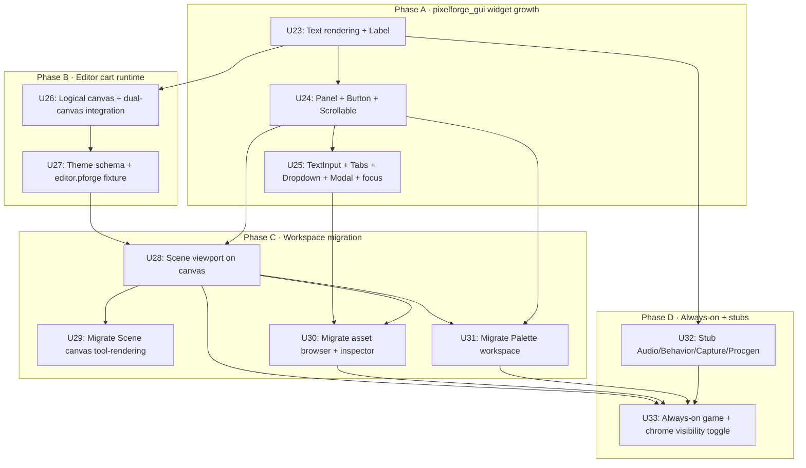

# feat: Editor-as-Pixelforge-Cart + pixelforge_gui Growth (M3, Hybrid)

## Summary

M0 through M2 shipped an editor that renders all chrome via native Ebitengine primitives (`ebitenutil.DebugPrintAt` + `vector.DrawFilledRect`). The engine is solid, the schema is sound, the inspector is reflection-driven, the palette workspace exists — but **the editor is not yet a Pixelforge program**. R1 in the master plan ([`docs/plans/2026-05-15-001-feat-pixelforge-no-code-editor-plan.md`](2026-05-15-001-feat-pixelforge-no-code-editor-plan.md#requirements)) calls for the editor to dogfood the engine: panels and inspectors composed of sprites, fonts, ColorTables, and event-bus messages, with the running game canvas visible underneath at all times.

This plan migrates the editor onto a Pixelforge logical canvas in a **hybrid** shape: the workspace area (Scene canvas, Palette workspace, asset browser, inspector) moves to canvas-resident rendering using a grown `pixelforge_gui` widget catalog; the surrounding chrome (menu bar, status bar, modals, file picker) stays on the native overlay path through M3. The hybrid trade — partial R1 dogfooding in exchange for shippable M3 scope — is deliberate: M3 proves the canvas path on the surfaces that benefit most (entity rendering, palette grid, asset thumbnails), and M4+ finishes the migration once the dogfooding has surfaced the real font/widget gaps.

Three concrete decisions anchor the plan:

- **Hybrid migration.** Panels first (Scene viewport, asset browser, inspector, palette workspace) onto the Pixelforge canvas. Menu bar, status bar, confirm modal, and file picker stay on the native overlay path. Canvas-native versions of those widgets are deferred to M3.1 / M4.
- **Pragmatic `editor.pforge`.** A go-embedded `editor.pforge` fixture defines the editor's theme (palette, font reference, workspace assets) and is loaded at startup. Chrome control flow stays in Go; the schema describes data, not behaviour. This proves R1 (canvas-resident chrome consuming the project schema) without the chicken-and-egg of authoring the editor in itself.
- **`pixelforge_cofont` only.** Text rendering uses the existing 4×8 PICO-8 font via `pixelforge_cofont.Sheet`. TTF / higher-DPI deferred. Matches the master plan's stated "cofont initially, TTF later" guidance.

Eleven implementation units (**U23-U33**) ship the milestone: three for `pixelforge_gui` widget growth, two for the editor cart runtime, three for workspace migration, two for always-on game + workspace stubs, one for verification and docs.

---

## Problem Frame

Four concrete gaps surfaced after M2 shipped:

1. **The chrome is not Pixelforge-authored.** Every panel draws via `vector.DrawFilledRect` and `ebitenutil.DebugPrintAt`. The engine's distinctive capabilities — palette + ColorTables, the font sheet, the sprite system, the event bus — are nowhere to be seen in the editor's own pixels. R1 calls for the editor to dogfood the engine; M0-M2 punted because the foundation needed to land first. M3 is when that debt gets paid.

2. **`pixelforge_gui` is too thin to migrate onto.** The package today is one file (`pigui.go`) plus an event/pool helper. It owns `Element` (a rectangle with `OnDraw`/`OnUpdate`/`OnPress`/`OnRelease`/`OnTap` callbacks and child propagation), nothing more. There is no text rendering, no scrollable container, no button, no text input, no tabs. Every editor surface that wants to move onto the canvas has to bring its own widget code with it — exactly the "one-off editor utility" anti-pattern R1 warns against.

3. **The game and the editor live in separate canvases.** Today, the editor renders into the screen image directly via Ebitengine primitives; the engine's `pixelforge.Canvas` is unused by the editor itself. R1 requires the running game to be visible underneath the editor at all times ("there is no separate play mode — tools fade in over the running game"). Until the editor renders into a Pixelforge canvas, the always-on game pattern is unimplementable.

4. **`editor.pforge` doesn't exist.** The master plan's verification for M3 is "the editor opens `editor.pforge` (a project that describes the editor itself, dogfooding R2)". No such file exists yet because there was no use for one; the editor was hand-rolled chrome. M3 introduces a small `editor.pforge` fixture that the editor loads at startup to derive its theme and workspace assets — enough to prove R2 dogfooding without forcing every panel to become a schema entity.

The fix is a focused hybrid migration: grow `pixelforge_gui` with the widgets the editor's workspace area needs, move the workspace area onto a Pixelforge canvas, keep the surrounding chrome native, embed the user's game canvas underneath the workspaces, and dogfood `editor.pforge` as a theme + asset descriptor.

---

## Requirements

Each requirement maps to the master plan's R-IDs ([`origin`](2026-05-15-001-feat-pixelforge-no-code-editor-plan.md#requirements)). R-IDs are stable across plan edits.

**Carried forward from origin (M3 addresses these):**

- **R1 (full).** Editor chrome is itself authored as a Pixelforge program — the workspace area renders via engine primitives (`pixelforge.RectFill`, `pixelforge.DrawSprite`, `pixelforge_cofont.Print`) reading from `pixelforge.Palette` and `pixelforge.ColorTables`. The hybrid scope means R1 is **partially** delivered: the workspace area is canvas-authored, the surrounding chrome (menu bar / status bar / modals / file picker) remains on the native overlay path for M3 and finishes migrating in a follow-up. The running game is visible underneath the Scene workspace at all times; tools fade in over it via the existing overlay pattern.
- **R2 (continued).** `editor.pforge` is a small fixture that describes the editor's theme (palette, font reference, workspace asset list). The editor loads it at startup like any other `.pforge` file, proving the schema's reflection path on the editor itself. Full R2 dogfooding (every panel as a schema entity) is deferred to M5+.

**New plan-local requirements (M3 scope):**

- **R13.** `pixelforge_gui` ships a reusable widget catalog usable by *both* the editor and user games: text label, button, panel, scrollable container, text input, tab strip, dropdown popover, modal backdrop. Widgets honour the engine's clip stack and palette; no widget reaches outside the canvas to call native Ebitengine primitives.
- **R14.** The editor renders into a logical 1280×800 Pixelforge canvas separate from the game's canvas. The game canvas (sized per project, e.g. 320×180) renders into the Scene workspace's viewport region; the editor's workspace area renders over it with the canvas-resident chrome. Native overlay (menu bar, status bar, modals, file picker) paints last via `pixelforge_ebiten.SetNativeOverlay`.
- **R15.** The user's game canvas updates at TPS regardless of editor activity. Pressing the chrome-visibility hotkey (Esc) toggles the workspace overlay on/off, leaving only the game canvas visible. There is no separate "play" mode — the game has been running the whole time.
- **R16.** The editor registers placeholder workspaces for the M4-M7 surfaces (Capture, Behavior, Audio, Procgen). Each placeholder renders a "coming in MX" message in the canvas-resident chrome and is keyboard-accessible via `Ctrl+1..6`. Their presence in the tab strip stabilises the M3 workspace ordering before M4-M7 fill them.

---

## Scope Boundaries

**In scope (M3 hybrid).**
- `pixelforge_gui` widget growth: Label, Button, Panel, Scrollable, TextInput, Tabs, Dropdown, Modal, plus a focus manager.
- Logical 1280×800 editor canvas via `pixelforge_ebiten` integration.
- `editor.pforge` fixture + go-embedded loader + Theme schema field.
- Migrate Scene workspace's viewport (entity markers, selection outline) to canvas primitives.
- Migrate the asset browser to canvas-resident widgets (Panel + Scrollable + Label + sprite thumbnails via `DrawSprite`).
- Migrate the inspector to canvas-resident widgets — pfcomponent dispatch to canvas widgets for Slider, Checkbox, Text, Vector2, Numeric. ColorPicker / SpriteRef / AudioRef / EventTopic / Enum keep their native-overlay implementation in M3 (deferred to M4).
- Migrate the palette workspace (Grid, Matrix, Presets, Animator) to canvas primitives.
- Embed the user's game canvas inside the Scene workspace viewport; game updates at TPS regardless of editor state.
- Chrome-visibility toggle (Esc hides workspace chrome; Esc again restores; status bar shows the toggle state).
- Stub workspaces for Capture / Behavior / Audio / Procgen with placeholder Pixelforge-canvas chrome.
- Golden-image regression coverage for the canvas-resident workspaces at 1280×800.

**Not in scope (M3 hybrid — explicitly deferred).**
- Canvas-native menu bar, status bar, confirm modal, file picker — these stay on the native overlay path through M3. The hybrid migration is the trade.
- ColorPicker / SpriteRef / AudioRef / EventTopic / Enum inspector widgets on the canvas — these dropdowns benefit most from native input handling at M3. Slated for the M3.1 follow-up that finishes the migration.
- TTF / higher-DPI font support. Editor text uses `pixelforge_cofont` (4×8). [Origin Q resolved by user.]
- Editor extension API (third-party tools-as-carts). The Picotron pattern is opened by M3 but the public API is deferred per master plan scope.
- Multi-window / dockable panels. Single-window single-document layout.
- Drag-resize gutters between panels. Fixed chrome widths from M0-M2 carry forward.

**Not in scope (engine-side).**
- Changes to engine internals (`pixelforge`, `pixelforge_audio`, `pixelforge_event`, `pixelforge_routine`, `pixelforge_loop`, `pixelforge_snap`, `pixelforge_metrics`). Editor consumes existing APIs read-only.
- New engine features (additional ColorTables, audio channels, ECS, etc.).
- Schema-version bump. The Theme field is additive and the schema stays at v1.

### Deferred to Follow-Up Work

- **M3.1: Canvas-native chrome completion.** Migrate menu bar, status bar, confirm modal, and file picker onto `pixelforge_gui` widgets so the native overlay path is no longer required for editor chrome. Unlocks the "editor as cart" identity fully (R1 in full at the chrome layer). Expected to land after M3 dogfooding surfaces font legibility and focus-handling gaps that inform the design.
- **M3.2: Inspector dropdown migration.** Port ColorPicker, SpriteRef, AudioRef, EventTopic, Enum widgets to canvas dropdowns. These hit the keyboard / focus story hardest; defer until the M3 focus manager has shipped and been exercised.
- **Drag-resize gutters between panels.** Useful UX, not load-bearing. Easy to add once `pixelforge_gui` has a generic drag interaction primitive.
- **Logical-canvas size customisation.** M3 ships at fixed 1280×800. A future iteration can let the editor's canvas scale with the window; weighed against the simpler fixed-size for v1.
- **TTF font path.** A `pixelforge_font/system_font.go` that wraps `golang.org/x/image/font` for higher-DPI editor text. Adds a transitive dep; defer until cofont's 4×8 reads poorly in practice.
- **Editor extension API.** Picotron-style user-written editor extensions. Whole separate plan once the editor itself stabilises.
- **`docs/solutions/` capture.** After M3 lands, run `/ce-compound` on: canvas-vs-native chrome split, editor.pforge schema shape, focus manager design, always-on game embedding. M0-M2 already accumulated learnings that should also be captured.

---

## Context & Research

### Codebase patterns surfaced in this session

**M0-M2 chrome the migration replaces:**
- `pixelforge_studio/editor/chrome.go` — `chromeLayout` carves the window into menu/title/tab-strip/left-panel/canvas/right-panel/status regions; draws each via `vector.DrawFilledRect` and `ebitenutil.DebugPrintAt`. Hybrid keeps the menu bar, title bar, and status bar regions native; the panels + tab strip + canvas + workspaces move to canvas.
- `pixelforge_studio/editor/editor.go` — `Editor` struct owns `chrome`, `inspector`, `assetBrowser`, `canvas`, `menuBar`, `filePicker`, `confirmDialog`, `workspaces`. M3 adds an `editorCanvas` field (logical Pixelforge canvas) and a Theme reference.
- `pixelforge_studio/editor/widgets/` — slider, color picker, sprite ref, audio ref, event topic, enum, text, vector2, checkbox, numeric, default, unknown, modal, file picker, menu bar, asset row. The inspector widgets stay where they are; canvas-resident equivalents land in `pixelforge_gui/widgets/`. The two paths coexist in M3 (inspector dispatches per widget kind).
- `pixelforge_studio/editor/asset_browser.go` — uses `vector.DrawFilledRect` + `ebitenutil.DebugPrintAt`. Migrated in U30.
- `pixelforge_studio/editor/canvas.go` — Scene viewport. `entityMarkerRect` is a fixed 12×12 white-bordered rect drawn via `vector.DrawFilledRect`. Migrates to engine sprite + RectFill in U29.
- `pixelforge_studio/palette/` — Grid, Matrix, Presets, Animator all use `vector.DrawFilledRect` + `ebitenutilPrint`. Migrates in U31.

**`pixelforge_gui` foundation (the canvas-resident chrome's home):**
- `pixelforge_gui/pigui.go` — `Element` with `Area[int]`, `OnDraw`/`OnUpdate`/`OnPress`/`OnRelease`/`OnTap` callbacks. Child propagation via `e.children`; `StopPropagation` available on events. `Update` and `Draw` recompute camera + clip per element so children render in element-local coordinates.
- `pixelforge_gui/event.go` — `Event`, `UpdateEvent`, `DrawEvent` types with `HasPointer` flag from mouse-hit tests.
- `pixelforge_gui/pool.go` — `propagateToChildren` pool (cheap reusable signal carrier).
- `pixelforge_examples/gui/main.go` — 94-line example exercising the existing surface: `New()` root, `Attach()` children, `OnDraw`/`OnTap` callbacks. Confirms the package design extends cleanly with new widget types.

**Engine APIs the canvas chrome consumes (read-only):**
- `pixelforge.RectFill`, `pixelforge.Rect`, `pixelforge.Line`, `pixelforge.Circ`, `pixelforge.SetColor`, `pixelforge.SetPixel`, `pixelforge.DrawSprite`, `pixelforge.SetClip` — the chrome's primitive surface.
- `pixelforge.SetDrawTarget(canvas)` — switch the rendering destination to the logical editor canvas.
- `pixelforge.Camera` — for nested layout (`pigui` already uses this for child positioning).
- `pixelforge.Screen()`, `pixelforge.NewCanvas(w, h)` — canvas creation.
- `pixelforge.Palette`, `pixelforge.ColorTables` — colours referenced by Theme indices.

**Font integration:**
- `pixelforge_cofont/picofont.go` — exposes `Sheet` (a `pifont.Sheet`) and `Print(text, x, y)`. First 128 glyphs are 4px wide, last 128 are 8px. The init function uses palette slots 0/1 for fg/bg before restoring, so font drawing is palette-context-aware.
- `pixelforge_font/pifont.go` — `Sheet.Print` mutates ColorTables to render in the current draw color, then restores. This is the canonical pattern the editor's labels will follow.

**Always-on game pattern:**
- `pixelforge_ebiten/piebiten.go` — `Run`, `SetNativeOverlay(fn func(*ebiten.Image))`, `CopyCanvasToEbitenImage`. The native overlay hook is how M0-M2 chrome was painted; M3 keeps it for the residual native chrome (menu/status/modals).
- `pixelforge_metrics/pimetr.go` and `pixelforge_scope/internal/internal.go` — overlay patterns that established the "tools fade in over the running game" precedent. The editor in M3 extends the same approach to *workspaces*.

### External patterns (carried from origin)

- **Picotron / PICO-8** — editor==runtime, tools-as-carts, palette-as-constraint-and-tool. Drives R1.
- **Aseprite / Pro Motion NG** — live palette swap, indexed-mode authoring. The M2 palette workspace already implements this; M3 makes the surface canvas-native.
- **GDevelop / Construct 3** — workspace tab strip pattern (Project / Scene / Events / etc.). M2 introduced the editor's tab strip; M3 fills out the placeholder tabs.

### Institutional learnings

- `docs/solutions/` does not yet exist. After M3 lands, capture: native-vs-canvas split rationale, focus manager design, editor.pforge schema shape, always-on game embedding choice, the migration sequencing (panels first, chrome later). M0-M2 also accumulated learnings (file picker design, palette quantization metric, auto-tile heuristic, dirty-state UX) that should be captured at the same time.

---

## Key Technical Decisions

1. **Hybrid migration: panels first, chrome later.** Workspace area moves to canvas; menu bar / status bar / modals / file picker stay native through M3. Rationale:
   - **Risk-tiered.** The workspace area is where R1 dogfooding pays off — it's where the engine's distinctive capabilities (palette, ColorTables, sprites, font) actually appear in the editor's pixels. The surrounding chrome is mostly text + rectangles; native rendering there delivers the same UX with far less migration risk.
   - **Reaches a shippable M3.** Full migration in one milestone risks dragging the chrome migration into the dogfood-discovery loop (you can't know what widgets `editor.pforge` needs until you've authored part of the editor in canvas-resident chrome). Hybrid splits the discovery from the polish: M3 ships the panels; M3.1 finishes the chrome with the lessons learned.
   - **Trade-off.** R1 is "partially" delivered at the chrome layer. The verification criteria reflect this: "all M2 palette features work identically on the canvas", "the running game is visible underneath", but **not** "every native overlay call is removed".
   - [User-confirmed during planning.]

2. **Pragmatic `editor.pforge`.** A small fixture describes the editor's theme + workspace asset list; chrome control flow stays in Go. Rationale:
   - **Avoids the bootstrap loop.** A strict "every panel is a schema entity" model requires a functioning editor to author the `.pforge` that defines the editor — a chicken-and-egg that would force M3 to ship before the schema can be authored from inside it.
   - **Still proves R2.** The editor loads its own `.pforge` at startup, exercising the same loader path as user projects. The pfcomponent registry, the palette serialization, the asset path resolution — all dogfooded.
   - **Extensible path.** M5+ can promote individual chrome elements (panels, inspector widgets) to schema entities once visual scripting has shaped what "editor as data" actually needs.
   - [User-confirmed during planning.]

3. **`pixelforge_cofont` only.** Editor text uses the 4×8 PICO-8 font; TTF deferred. Rationale:
   - **Smallest M3 surface.** The font path is established (`pifont.Sheet` exists; `pixelforge_cofont` is the canonical bootstrap consumer); reusing it adds zero new dependencies.
   - **Matches master plan posture.** Master plan explicitly calls for "cofont initially, TTF later". M3 follows that without re-litigating.
   - **Trade-off.** 4×8 glyphs read tightly on hi-DPI displays. Acceptable for v1; documented as the cause if user feedback flags legibility. TTF lands as a follow-up package (`pixelforge_font/ttf.go`) if and when demand surfaces.
   - [User-confirmed during planning.]

4. **Logical canvas size: fixed 1280×800.** The editor's Pixelforge canvas is sized to match the M0 default window. Rationale:
   - **Predictable layout math.** All chrome carving (panel widths, viewport regions, status bar height) is integer-pixel arithmetic; scaling logic adds complexity that pays off only on edge cases (ultra-wide monitors, hi-DPI scaling).
   - **The window can still resize.** `Ebitengine.SetWindowResizingMode` is enabled; the window's actual pixels scale via Ebitengine's internal blit. The logical chrome is always 1280×800. This matches Picotron's fixed virtual-resolution model.
   - **Trade-off.** Users on 4K displays see the chrome at 1/4 native resolution. Acceptable for v1; documented in `studio.md`. Window-relative scaling is a deferred follow-up.

5. **Workspace registration stays Go-side.** Workspaces register via `editor.RegisterWorkspace(w)` (from M2); no dynamic loading of `.pforge`-described workspace tools yet. Rationale:
   - **Compatibility.** M2's palette package already registers via `palette.RegisterWith(editor)`. Keeping the pattern means the M3 cart runtime is additive — existing call sites continue to work.
   - **Defers the API stability story.** The Picotron tools-as-carts pattern requires a stable extension API; that's a deferred follow-up. M3 doesn't have to make this commitment.
   - **Trade-off.** Workspace lists are not user-editable at runtime. Stub workspaces (Capture / Behavior / Audio / Procgen) are Go-side stubs that M4-M7 promote in place.

6. **Always-on game: render game canvas into Scene viewport region.** The user's game (defined by the active project) updates at TPS regardless of editor activity; its canvas blits into the Scene workspace's viewport rect each frame. Rationale:
   - **Matches R1's "no play mode" requirement.** Pressing Esc hides workspace chrome — the game keeps running underneath, fully visible.
   - **Decouples game canvas size from editor canvas size.** A 320×180 game renders into the viewport at integer-multiple scale (letterboxed). The editor's logical 1280×800 canvas is independent.
   - **Trade-off.** Headless mode (running editor with no project loaded) shows an empty viewport with a "(no project)" hint. Acceptable; the verification path covers it.

7. **Inspector hybrid dispatch.** The pfcomponent inspector renders each field using one of two widget banks: `pixelforge_studio/editor/widgets/` (native overlay) or `pixelforge_gui/widgets/` (canvas-resident), chosen per WidgetKind. M3 migrates Slider, Checkbox, Text, Vector2, Numeric; M3.2 migrates the remaining dropdown-style widgets. Rationale:
   - **Incremental.** Each widget migration is a small, testable change. The dispatch table is the integration seam.
   - **Both banks coexist.** Native-overlay widgets keep working while the canvas bank grows. No big-bang breakage of the inspector.
   - **Trade-off.** Two widget implementations to maintain through M3.2. Acceptable for ~5 weeks of partial coexistence; documented as a hybrid-period concession.

8. **Focus manager: per-canvas, not global.** Keyboard focus lives on the editor's logical canvas (where canvas-resident widgets live); native overlay chrome (menu bar, file picker) owns its own input via the existing keymap path. The two focus stacks don't communicate. Rationale:
   - **Matches the hybrid split.** Native chrome and canvas chrome are different runtimes; a global focus manager would have to mediate input across them.
   - **Predictable UX.** Native modals (file picker, confirm dialog) "swallow" all input while open (existing behaviour); workspace focus is irrelevant under a modal. Outside modals, canvas focus is the only focus the user can move with Tab.
   - **Trade-off.** When the M3.1 chrome migration lands, the focus manager gains the menu bar and modals. The interface is designed with that growth in mind.

---

## Output Structure

```
pixelforge_gui/
  pigui.go                          # MODIFY (M3) — small additions for focus integration
  event.go                          # (unchanged)
  pool.go                           # (unchanged)
  focus.go                          # NEW (U25) — focus manager (per-canvas keyboard focus stack)
  focus_test.go                     # NEW
  text.go                           # NEW (U23) — Label widget + font binding
  text_test.go                      # NEW
  widgets/
    panel.go                        # NEW (U24) — Panel (background + border + optional title)
    panel_test.go                   # NEW
    button.go                       # NEW (U24) — Button widget (label + click)
    button_test.go                  # NEW
    scrollable.go                   # NEW (U24) — Scrollable container (mouse wheel + scroll bar)
    scrollable_test.go              # NEW
    text_input.go                   # NEW (U25) — single-line text input
    text_input_test.go              # NEW
    tabs.go                         # NEW (U25) — tab strip
    tabs_test.go                    # NEW
    dropdown.go                     # NEW (U25) — dropdown popover (composable)
    dropdown_test.go                # NEW
    modal.go                        # NEW (U25) — modal backdrop + dismiss handling
    modal_test.go                   # NEW

pixelforge_project/
  theme.go                          # NEW (U27) — Theme schema (font ref, palette indices for chrome)
  theme_test.go                     # NEW
  project.go                        # MODIFY (U27) — add Theme field; backward-compatible loader

pixelforge_studio/
  editor/
    cart.go                         # NEW (U26) — logical Pixelforge canvas + dual-canvas integration
    cart_test.go                    # NEW
    cart_assets/                    # NEW (U27) — fixture directory
      editor.pforge                 # NEW (U27) — editor's own .pforge file (go:embed)
      editor.pforge-assets/         # NEW (U27) — sibling sprite assets
        ui/icon-place.png           # NEW
        ui/icon-select.png          # NEW
        ui/icon-delete.png          # NEW
        ui/icon-paint.png           # NEW
        ui/swatch-fallback.png      # NEW
    canvas.go                       # MODIFY (U29) — Scene viewport using engine primitives
    asset_browser.go                # MODIFY (U30) — uses pixelforge_gui widgets
    inspector.go                    # MODIFY (U30) — dispatch per-WidgetKind to native vs canvas bank
    inspector_canvas.go             # NEW (U30) — canvas-bank widget instantiation
    inspector_canvas_test.go        # NEW
    workspaces.go                   # MODIFY (U32) — register stub workspaces (Audio/Behavior/Capture/Procgen)
    workspaces_audio.go             # NEW (U32) — placeholder Audio workspace
    workspaces_behavior.go          # NEW (U32) — placeholder Behavior workspace
    workspaces_capture.go           # NEW (U32) — placeholder Capture workspace
    workspaces_procgen.go           # NEW (U32) — placeholder Procgen workspace
    workspaces_stub_test.go         # NEW
    chrome.go                       # MODIFY (U26, U33) — delegate workspace area to canvas, native overlay for chrome bar
    editor.go                       # MODIFY (U26, U33) — host editor canvas, Esc visibility toggle, game-canvas embedding
    chrome_visibility.go            # NEW (U33) — Esc-to-dim toggle + status-bar indicator
    chrome_visibility_test.go       # NEW
    keymap.go                       # MODIFY (U33) — register chrome.toggle (Esc)

  palette/
    workspace.go                    # MODIFY (U31) — canvas-resident render path
    grid.go                         # MODIFY (U31) — engine primitives + cofont labels
    matrix.go                       # MODIFY (U31) — engine primitives
    presets.go                      # MODIFY (U31) — engine primitives + pixelforge_gui list
    animator.go                     # MODIFY (U31) — engine primitives
```

The per-unit `**Files:**` sections remain authoritative; the implementer may adjust file boundaries within a package if implementation reveals a better layout.

---

## Implementation Roadmap

Eleven implementation units (U23-U33), grouped into five phases.



*This illustrates dependency relationships and is directional guidance for review, not implementation specification.*

---

## Phase A — `pixelforge_gui` Widget Growth

### U23. Text rendering on the canvas (Label widget + font binding)

**Goal.** Wrap `pixelforge_cofont.Sheet` as a `pixelforge_gui` widget surface so canvas-resident chrome can render text without reaching out to `ebitenutil.DebugPrintAt`. Establish a single chokepoint (`pixelforge_gui.Label`) that every other widget will compose with for text content.

**Requirements.** R13.

**Dependencies.** None (foundation).

**Files.**
- Create: `pixelforge_gui/text.go` — `Font` interface + `Label` element + default cofont-backed implementation.
- Create: `pixelforge_gui/text_test.go`.

**Approach.**
- `Font` interface: `Print(text string, x, y int) (endX, endY int)`, `Measure(text string) (w, h int)`, `LineHeight() int`. Single method set lets the editor swap to TTF later without touching call sites.
- `DefaultFont()` returns a `Font` backed by `pixelforge_cofont.Sheet`. The package's init has already populated `Sheet.Chars`; we just wrap it.
- `Label` is an `Element` subtype with `Text string`, `FgColor pixelforge.Color`, `Font Font`, `Align` (`Left`/`Center`/`Right`). `OnDraw` calls `Font.Print` after applying `pixelforge.SetColor(FgColor)`.
- `Measure` is needed for layout (button sizing, scrollable content extent); implementation reads `Sheet.Chars[r].W` for each rune.
- The label honours `Element`'s clip + camera context inherited from `pigui.Element.Draw` (already implemented).

**Patterns to follow.**
- `pixelforge_cofont/picofont.go` for the existing font init pattern.
- `pixelforge_font/pifont.go` `Sheet.Print` for the color-table-aware render path (the cofont sheet is a pifont.Sheet under the hood).
- `pixelforge_gui/pigui.go` `Element` for the element shape — Label extends, doesn't replace.

**Test scenarios.**
- **Happy path.** `Label{Text: "READY"}` drawn at (10, 10) in a Pixelforge canvas leaves "READY" rendered at the expected pixel positions; `Measure("READY")` returns 5×4-pixel-wide glyph metrics matching the cofont sheet.
- **Happy path.** Switching `FgColor` from 7 to 15 changes the rendered text colour on the next frame — the colour-table swap in `pifont.Sheet.Print` propagates.
- **Edge case.** Empty `Text` is a no-op; `Measure("")` returns `(0, lineHeight)`.
- **Edge case.** Multi-line text (string contains `\n`) advances Y between lines per `Font.LineHeight()`.
- **Edge case.** Out-of-sheet rune renders the sheet's "tofu" glyph (the cofont's `?` glyph) instead of panicking.
- **Integration.** A `Label` inside a `pixelforge_gui` parent inherits its parent's clip — text outside the parent's `Area` is not drawn (engine `SetClip` already handles this; the test just verifies it via `pisnap.PalettedImage`).

**Verification.**
- `go test ./pixelforge_gui/...` passes.
- Manual: launch the example program from `pixelforge_examples/gui/main.go` (modified to add a Label) and confirm text renders inside the panel.

---

### U24. Layout primitives (Panel, Button, Scrollable)

**Goal.** Ship the three layout primitives every other canvas-resident widget composes with: `Panel` (background + border + optional title), `Button` (label + click), `Scrollable` (clipped child container with mouse-wheel scroll).

**Requirements.** R13.

**Dependencies.** U23.

**Files.**
- Create: `pixelforge_gui/widgets/panel.go` + `panel_test.go`.
- Create: `pixelforge_gui/widgets/button.go` + `button_test.go`.
- Create: `pixelforge_gui/widgets/scrollable.go` + `scrollable_test.go`.

**Approach.**
- `Panel` composes a `pigui.Element` with `BgColor`, `BorderColor`, optional `TitleLabel`. `OnDraw` paints `pixelforge.RectFill` for the background, `pixelforge.Rect` for the border, then defers child rendering. Title bar is a 16-pixel-tall strip at the top with a Label inside.
- `Button` composes Label inside a Panel. `OnTap` runs the user's callback; `Pressed` state shifts the label by 1px down/right (classic press feedback). Disabled buttons render dim and don't fire `OnTap`.
- `Scrollable` is an `Element` with a content child whose `Area` is larger than the scrollable's `Area`. Mouse-wheel input adjusts an internal scroll offset; the offset translates the child's `Camera` before child `Draw`. A thin scroll bar on the right edge indicates scroll position. Vertical only at M3; horizontal scroll is a deferred follow-up.
- All three widgets are composable with `pigui.Attach`: `panel := widgets.NewPanel(...); widgets.Attach(panel.Element, child)`.

**Patterns to follow.**
- `pixelforge_gui/pigui.go` `Attach` for the element-tree composition idiom.
- `pixelforge_studio/editor/widgets/widgets.go` `fillRect` / `strokeRect` for the chrome rendering pattern (the canvas equivalent uses `pixelforge.RectFill` / `pixelforge.Rect`).
- `pixelforge_studio/editor/asset_browser.go` `scrollOffset` field for the scroll state pattern.

**Test scenarios.**
- **Happy path.** A `Panel{Title: "ASSETS"}` rendered at (0, 0, 220, 600) paints the background colour, the border, and the title at the top — verified by capturing the canvas via `pisnap.PalettedImage` and asserting the centre pixel of the title row is the title's fg colour.
- **Happy path.** A `Button{Label: "OK"}` fires its `OnTap` callback when the user clicks inside it; clicking outside does not fire.
- **Happy path.** A `Scrollable` with content height 1000 inside a 400-tall container starts at offset 0; scrolling the mouse wheel down 5 ticks moves the content up by `5 * scrollStep` (= 60 px) and the scroll bar position reflects the offset.
- **Edge case.** A `Button{Disabled: true}` does not fire `OnTap`; renders with dim colours.
- **Edge case.** A `Scrollable` with content shorter than its container does not show a scroll bar; mouse wheel is a no-op.
- **Edge case.** Scrolling past the top clamps to 0; scrolling past the bottom clamps to `content.H - container.H`.
- **Integration.** A `Panel` containing a `Scrollable` containing 50 `Label`s scrolls correctly — content beyond the panel's clip is not rendered (engine `SetClip` from the `pigui.Element.Draw` already enforces this; the test reads back pixels just outside the panel's bottom edge to confirm they are background colour).

**Verification.**
- `go test ./pixelforge_gui/widgets/...` passes.
- Manual: extend `pixelforge_examples/gui/main.go` with a Panel + Button + Scrollable list and verify scroll + click behaviour.

---

### U25. Interactive widgets + focus manager (TextInput, Tabs, Dropdown, Modal)

**Goal.** Ship the four interactive widgets the canvas-resident chrome needs for inspector inputs, workspace switching, and (forward-looking) M3.1 chrome migration. Add a per-canvas focus manager so keyboard input routes to exactly one widget at a time.

**Requirements.** R13.

**Dependencies.** U24.

**Files.**
- Create: `pixelforge_gui/focus.go` + `focus_test.go` — `FocusManager` with `Focus(elem)`, `Blur()`, `Focused() *Element`, `Tab(forward bool)`.
- Create: `pixelforge_gui/widgets/text_input.go` + `text_input_test.go`.
- Create: `pixelforge_gui/widgets/tabs.go` + `tabs_test.go`.
- Create: `pixelforge_gui/widgets/dropdown.go` + `dropdown_test.go`.
- Create: `pixelforge_gui/widgets/modal.go` + `modal_test.go`.

**Approach.**
- `FocusManager` lives on the editor's root `pigui.Element` (one per logical canvas). Widgets register themselves via `mgr.Register(elem)` to participate in Tab traversal. `Focused()` returns the currently-focused element pointer; widgets check identity to render their focused state.
- `TextInput` is a single-line input. Buffer is `[]rune`; cursor is an int position. `ebiten.AppendInputChars(nil)` captures typed input when focused. Backspace, Left/Right arrows, Home/End, Enter all wire to obvious behaviour. Selection is deferred; M3 supports cursor-only editing.
- `Tabs` is a horizontal strip of buttons; clicking one fires `OnSelect(idx int)`. Selected tab gets a 2-pixel accent stripe. Keyboard Left/Right navigates when focused.
- `Dropdown` is a Panel anchored below a "selector" element (button + label). Opens on click; lists option buttons; clicking an option fires `OnSelect(value string)` and closes. Esc / click-outside closes without selecting.
- `Modal` is a full-canvas backdrop (`pixelforge.RectFill` with a semi-transparent colortable mapping). A child body element renders centred. Esc and click-outside-body dismiss; both routes through an `OnDismiss` callback. Stacks: multiple modals can be active; only the topmost takes input.

**Patterns to follow.**
- `pixelforge_studio/editor/widgets/text.go` for the M0-M2 native text input behaviour — the canvas-resident TextInput mirrors it.
- `pixelforge_studio/editor/widgets/file_picker.go` for the modal stack pattern.
- `pixelforge_studio/editor/widgets/ref_widgets.go` `dropdown` for the popover shape — canvas version reuses the same UX.

**Test scenarios.**
- **Happy path (TextInput).** Focused TextInput receives typed characters; Backspace removes the rune at cursor-1; Left/Right arrow keys move the cursor; Enter fires `OnSubmit(string)`.
- **Happy path (Tabs).** Clicking tab 1 fires `OnSelect(1)`; rendering reflects the new selection.
- **Happy path (Dropdown).** Clicking the selector opens the option list; clicking an option fires `OnSelect("blue")` and closes the list.
- **Happy path (Modal).** Showing a modal renders the backdrop + body; clicking outside the body fires `OnDismiss`.
- **Happy path (Focus).** `mgr.Focus(input1)` followed by `mgr.Tab(true)` moves focus to the next registered element in registration order; wraps at the end.
- **Edge case (TextInput).** Pressing Backspace at cursor 0 is a no-op; Enter on empty buffer still fires `OnSubmit("")`.
- **Edge case (TextInput).** Max-length cap (`MaxRunes`) truncates input; further keystrokes are discarded.
- **Edge case (Tabs).** Tabs with zero entries renders nothing; doesn't panic.
- **Edge case (Dropdown).** Opening when the selector is near the canvas bottom flips the option list upward.
- **Edge case (Modal).** Stacked modals route Esc to the topmost only; the underlying modal stays open.
- **Edge case (Focus).** Tab past the last registered element wraps to the first; Shift+Tab goes backward.
- **Integration (Focus + TextInput).** Two TextInputs in a form; clicking input2 takes focus from input1; input1 stops receiving keystrokes; input2 receives them.
- **Integration (Dropdown + Modal).** Dropdown inside a modal: clicking the dropdown's option doesn't dismiss the modal (the click is inside the body).

**Verification.**
- `go test ./pixelforge_gui/widgets/...` passes including focus tests.
- Manual: extend the GUI example with a TextInput + Tabs + Dropdown and verify keyboard nav.

---

## Phase B — Editor Cart Runtime

### U26. Logical Pixelforge canvas + dual-canvas integration

**Goal.** Stand up the editor's logical 1280×800 Pixelforge canvas as a separate render target from the user's game canvas. The editor draws workspace chrome onto this canvas; `pixelforge_ebiten.SetNativeOverlay` continues to paint the residual native chrome (menu bar, status bar, modals, file picker) on top.

**Requirements.** R14.

**Dependencies.** U23 (for any text on the editor canvas), U25 (so widget event handling exists by the time the canvas is alive).

**Files.**
- Create: `pixelforge_studio/editor/cart.go` + `cart_test.go` — `editorCart` struct owning the logical canvas, the workspace root `pigui.Element`, and the focus manager.
- Modify: `pixelforge_studio/editor/editor.go` — instantiate `editorCart`; route `Draw` through it.
- Modify: `pixelforge_studio/editor/chrome.go` — the workspace area's `draw` step now blits the editor canvas into its rect instead of painting via `vector.DrawFilledRect`; menu bar / title bar / status bar / left + right panels (initially) keep their existing native path.

**Approach.**
- `editorCart` constructs a `pixelforge.Canvas` at 1280×800 once at New. The cart's `Render(e *Editor)` method:
  1. `pixelforge.SetDrawTarget(editorCanvas)`.
  2. Clear with theme background.
  3. Tell the active workspace to draw into the canvas.
  4. Restore prior draw target.
- `Editor.Draw(screen *ebiten.Image)` flow:
  1. Recompute chrome layout (unchanged).
  2. Call `editorCart.Render(e)` — paints the workspace region into the editor canvas.
  3. Call `pixelforge_ebiten.CopyCanvasToEbitenImage(editorCanvas, screen.SubImage(workspaceRect))` to blit the editor canvas to the workspace region.
  4. Paint the residual native chrome (title bar, menu bar, status bar, modals, file picker) via the existing native overlay code.
- Native chrome layout in `chrome.go` is unchanged; only the *workspace region* is replaced. Left panel / right panel / canvas viewport all sit inside that region.
- The focus manager lives on `editorCart.root` (a `pigui.Element` covering the whole logical canvas).
- Window-resize: when the actual window is bigger or smaller than 1280×800, the editor canvas blits with integer-pixel scaling into the workspace region — letterboxed when the window is taller, pillarboxed when wider. Mouse coordinates passed to the cart are translated from window space to canvas space.

**Patterns to follow.**
- `pixelforge_ebiten/piebiten.go` `SetNativeOverlay` for the native-overlay registration.
- `pixelforge_metrics/pimetr.go` for the "overlay over running game" composition order.
- `pixelforge_studio/editor/chrome.go` `recompute` for the layout math the workspace region inherits.

**Test scenarios.**
- **Happy path.** `editorCart.Render(e)` with a registered Scene workspace fills the editor canvas with the workspace's draw output; the canvas dimensions are 1280×800; the canvas content is non-empty after one frame.
- **Happy path.** `Editor.Draw(screen)` blits the editor canvas into the chrome's workspace rect at integer scale; the menu bar above it remains native-rendered (verified by reading a pixel inside the menu bar region — it matches the native title-bar colour, not the canvas background).
- **Edge case.** A 800×600 window letterboxes the editor canvas: the canvas blit is centred with vertical bars of the background colour above and below.
- **Edge case.** Mouse coordinates inside the workspace region are translated to canvas-local coordinates before being passed to `pigui` — clicking the centre of the workspace region produces (640, 400) on the canvas regardless of window size.
- **Edge case.** Running with no project loaded still paints a valid canvas (theme background only); does not panic.
- **Integration.** Native modals (confirm dialog, file picker) continue to render in front of the editor canvas — the `Draw` order in `Editor.Draw` paints modals last (already the case in M2; verified here for the new ordering).

**Verification.**
- `go test ./pixelforge_studio/editor/...` passes.
- Manual: launch the studio; window content visible; menu bar and status bar look unchanged; workspace area is now rendered via the editor canvas (verifiable by setting the editor canvas's background to a distinctive colour and observing it through the workspace area only).

---

### U27. Theme schema + `editor.pforge` fixture + go-embedded loader

**Goal.** Add a `Theme` field to the `pixelforge_project.Project` schema (additive, backwards-compatible) and ship a small `editor.pforge` fixture that the editor loads at startup to derive its chrome colours and font reference. Proves R2 dogfooding without forcing every panel to be a schema entity.

**Requirements.** R2 (continued), R14.

**Dependencies.** U26.

**Files.**
- Create: `pixelforge_project/theme.go` + `theme_test.go` — `Theme` struct with `BackgroundSlot`, `PanelSlot`, `PanelHeaderSlot`, `TextSlot`, `TextDimSlot`, `AccentSlot`, `WarningSlot`, `FontName` fields (palette-slot indices + font name reference).
- Modify: `pixelforge_project/project.go` — add `Theme Theme` field; `NewProject` initialises it; `normalizeSlices` honours it; loader is backwards-compatible (missing `theme` field → default values).
- Create: `pixelforge_studio/editor/cart_assets/editor.pforge` — go-embedded fixture.
- Create: `pixelforge_studio/editor/cart_assets/editor.pforge-assets/ui/*.png` — placeholder PNGs for chrome icons (Place, Select, Delete, Paint, fallback swatch).
- Modify: `pixelforge_studio/editor/cart.go` — `editorCart` loads `editor.pforge` at construction via `embed.FS` + `pixelforge_project.LoadReader`; chrome reads colours from `Theme`.

**Approach.**
- The `Theme` struct holds palette-slot indices, not raw RGB hex — this matches the engine's palette-as-constraint discipline. When the active project's palette changes, the chrome reads slot values from the *editor's* palette (the editor canvas has its own palette state derived from `editor.pforge.Palette`).
- `editor.pforge` is a normal `.pforge` file: schema version 1, a "main" scene, an empty entity list, a fixed 64-colour palette derived from a classic 16-colour set replicated × 4 (or a hand-tuned editor palette). Loaded once at startup; the editor's logical canvas runs with this palette set as `pixelforge.Palette` *while drawing the editor canvas*. Saving the editor canvas's drawn-target back to the game canvas's palette is a per-frame state restore.
- The asset directory holds the small icon set used by the workspace chrome (tool indicators, swatch fallback). These are referenced as sprites via the standard `pixelforge_project.SpriteAsset` loader path.
- `embed.FS` ships the fixture inside the studio binary; `LoadReader` parses the bytes; `AssetsDir` resolution falls back to the in-binary FS instead of disk for editor.pforge's assets.

**Patterns to follow.**
- `pixelforge_project/loader.go` `LoadReader` for the in-memory load path.
- `pixelforge_project/palette.go` `DefaultPalette()` for the palette-init pattern; editor.pforge's palette overrides per slot.
- `pixelforge_studio/editor/cart_assets/` as the asset directory convention; the loader resolves relative paths against the embedded FS.

**Test scenarios.**
- **Happy path.** `editor.pforge` loads successfully via `embed.FS` + `LoadReader`; the editor's Theme is populated with non-default values.
- **Happy path.** A project saved with `Theme{BackgroundSlot: 5}` round-trips through `Encode` → `Load` with the theme intact.
- **Happy path.** An older `.pforge` file (no `theme` field in JSON) loads cleanly; `Theme` falls back to its zero-value defaults (which match the M0-M2 chrome palette).
- **Edge case.** Theme with out-of-range slot indices (e.g., `BackgroundSlot: 99`) loads but is sanitised on use — chrome renders with slot 0 or a documented fallback.
- **Edge case.** Missing icon assets in editor.pforge-assets/ don't panic; the chrome falls back to coloured rectangles when an icon sprite is missing.
- **Integration (round-trip).** Save a user project that customised `Theme` from in-editor controls (a follow-up surface; the test inserts the value directly); load it; verify the Theme survived.
- **Integration (palette switch).** Drawing the editor canvas with `editor.pforge.Palette` and the game canvas with the user-project's palette produces correct colours for both — the palette swap is bracketed around the editor canvas render.

**Verification.**
- `go test ./pixelforge_project/...` passes (existing tests + new Theme tests).
- `go test ./pixelforge_studio/editor/...` passes including the embedded-load tests.
- Manual: launch the studio; the workspace area renders with the editor's theme palette (visibly distinct from the M0-M2 dark theme to confirm the theme is sourced from `editor.pforge`).

---

## Phase C — Workspace Migration

### U28. Scene viewport on the canvas

**Goal.** Replace the Scene workspace's chrome (background, viewport letterboxing, status overlays) with engine-primitive equivalents drawn into the editor canvas. The Scene workspace is the most visible verification target — once it renders via `pixelforge.RectFill` + `DrawSprite`, the canvas migration path is proven.

**Requirements.** R1 (partial).

**Dependencies.** U26, U24.

**Files.**
- Modify: `pixelforge_studio/editor/workspaces.go` `SceneWorkspace.Draw` — switch to the canvas render path (delegates to `Canvas.DrawCanvas(...)`).
- Modify: `pixelforge_studio/editor/canvas.go` — add a parallel `DrawCanvas(area widgets.Rect, e *Editor)` method that renders the viewport using engine primitives instead of `vector.DrawFilledRect`. Keep `Draw(...)` for backward compatibility (still used by tests that don't drive the cart).
- Modify: `pixelforge_studio/editor/cart.go` — the workspace dispatch chooses canvas-resident render path for canvas-aware workspaces.

**Approach.**
- The viewport's letterbox region (computed by the existing `viewBox(...)` math) is filled with `pixelforge.RectFill` instead of `vector.DrawFilledRect`. Colour comes from `Theme.PanelSlot`.
- Entity markers: instead of a 12×12 white rect, render a small palette-coloured sprite per entity (icons live in `editor.pforge-assets/ui/`). Selected entity gets a 1-pixel stroke around the marker using `pixelforge.Rect`.
- Coordinate translation: mouse-pick (`PickEntityAt`) already works in world coordinates; the only change is that the rect-fill calls use engine primitives.
- The existing Select/Place/Delete/Paint tool dispatch is untouched — only the *rendering* changes here.

**Patterns to follow.**
- `pixelforge_studio/palette/matrix.go` `Draw` for the engine-primitive rendering pattern (`vector.DrawFilledRect` → `pixelforge.RectFill`).
- `pixelforge_ebiten/internal/ebitengame.go` letterbox math is the source of truth the canvas already mirrors.

**Test scenarios.**
- **Happy path.** Rendering the Scene workspace into the editor canvas produces a viewport rect filled with the theme's panel colour at the letterboxed position computed by `viewBox`.
- **Happy path.** An entity at scene-space (40, 60) renders a marker at the corresponding canvas-pixel position; the marker sprite is the project's `Theme.AccentSlot` colour.
- **Happy path.** Selecting an entity adds a 1-pixel outline; deselecting removes it on the next frame.
- **Edge case.** Empty scene (no entities) renders the viewport background only — no markers.
- **Edge case.** A project with `ScreenWidth/Height = 0,0` is treated as 1×1 (no zero-divide); the viewport collapses to a 1-pixel rect.
- **Integration (with U33).** Game canvas embedded under the Scene workspace: the entity markers paint over the game canvas, not over the theme background; the viewport region is transparent.

**Verification.**
- `go test ./pixelforge_studio/editor/...` passes.
- Manual: snake project loaded; Scene workspace shows the snake's body entities at correct positions on the canvas-resident viewport.

---

### U29. Migrate Scene canvas tool rendering

**Goal.** Move the Scene workspace's tool-state surfaces (status overlay strings, drag-rectangle, placement preview) from `ebitenutil.DebugPrintAt` to `pixelforge_gui.Label`. The Scene workspace is fully canvas-resident after this unit.

**Requirements.** R1 (partial).

**Dependencies.** U28, U25 (for canvas-resident Label drawing).

**Files.**
- Modify: `pixelforge_studio/editor/canvas.go` — replace `printAt`/`debugPrint` calls with `pixelforge_cofont.Print` via `pixelforge_gui.Label`.

**Approach.**
- The current Scene workspace has no status-overlay text beyond the entity count, which lives in the native status bar. The migration is light: a tool-name indicator string (e.g., "PLACE — fruit") near the top-left of the viewport when a tool is active.
- The tool indicator is a `pigui.Label` placed inside the Scene workspace's root pigui element; updated each frame from `editor.Tool().String()` + `editor.SelectedSpriteName()`.

**Patterns to follow.**
- U23's Label widget.
- `pixelforge_metrics/pimetr.go` for a comparable "small text overlay over the running game" pattern.

**Test scenarios.**
- **Happy path.** Switching tool to `ToolPlace` with sprite "fruit" renders "PLACE — fruit" in the workspace; switching to `ToolSelect` updates the label.
- **Edge case.** No sprite selected: the label reads "PLACE — (no sprite)".
- **Edge case.** Empty workspace (no project) hides the indicator.

**Verification.**
- `go test ./pixelforge_studio/editor/...` passes.
- Manual: switch tools; observe the overlay label change without any `ebitenutil` call paths firing.

---

### U30. Migrate asset browser + inspector

**Goal.** Move the left-panel asset browser and the right-panel inspector onto the editor canvas using the U23-U25 widget catalog. Inspector widgets dispatch per-WidgetKind: Slider, Checkbox, Text, Vector2, Numeric → canvas-resident; ColorPicker / SpriteRef / AudioRef / EventTopic / Enum → still native-overlay (M3.2 finishes these).

**Requirements.** R1 (partial), R13.

**Dependencies.** U24, U25, U28.

**Files.**
- Modify: `pixelforge_studio/editor/asset_browser.go` — replace draw calls with a `pigui.Element` tree (Panel + Scrollable + per-row Buttons that hold sprite icon + Label).
- Modify: `pixelforge_studio/editor/inspector.go` — dispatch per `WidgetKind` to a canvas-bank (`inspector_canvas.go`) or the existing native-bank (`pixelforge_studio/editor/widgets/`).
- Create: `pixelforge_studio/editor/inspector_canvas.go` — canvas-bank widget instantiation for Slider, Checkbox, Text, Vector2, Numeric.
- Create: `pixelforge_studio/editor/inspector_canvas_test.go`.

**Approach.**
- Asset browser becomes a Panel hosting a Scrollable hosting per-row Buttons. Each Button's `OnTap` sets the editor's selected sprite. Thumbnails render via `pixelforge.DrawSprite` (the engine already decodes the project's sprite PNGs into canvases at load time; reuse those).
- The inspector's existing widget cache keyed by `(entityID, compIdx, fieldIdx)` (from M0-M2) carries over; the new dispatch wraps each cached widget with a wrapper that knows whether to call the canvas-bank or native-bank `Draw`/`Update`.
- Canvas-bank widgets: each is a small `pigui.Element` composing Label + Panel + (optional) TextInput + (optional) Button. Slider becomes a Panel with a drag-aware overlay (mouse-position → progress → value). Checkbox becomes a Button with a tick-mark Label. Vector2 becomes two TextInputs side-by-side.
- Native-bank widgets (the dropdown-style ones) keep drawing via `ebitenutil.DebugPrintAt` against `screen.SubImage(rightPanelRect)` in the native overlay path. They paint *after* the editor canvas blit, so they appear on top of the canvas-resident inspector frame.

**Patterns to follow.**
- `pixelforge_studio/editor/widgets/slider.go` for the M0-M2 slider's drag math — port the logic, swap render primitives.
- `pixelforge_studio/editor/widgets/vector2.go` for the dual-input Vector2 layout.
- `pixelforge_studio/editor/inspector.go` `widget(...)` for the cache idiom.

**Test scenarios.**
- **Happy path.** Asset browser renders all project sprites as scrollable rows; clicking a row updates `editor.SelectedSpriteName()`.
- **Happy path.** Inspector with a Slider field: dragging the canvas-bank slider mutates the entity's component value; the editor flips dirty.
- **Happy path.** Inspector with a Checkbox field: clicking toggles the value; the value persists to the entity component.
- **Happy path.** Inspector with a Vector2 field: typing into one of the two TextInputs and pressing Enter updates `Position.X` or `Y`.
- **Happy path.** Inspector with a ColorPicker field falls through to the native-overlay path — clicking the swatch grid still works (proves the hybrid dispatch).
- **Edge case.** Asset browser with 50 sprites scrolls; first 10 visible on entry; mouse wheel scrolls the list.
- **Edge case.** Inspector with no selection renders empty (no panic).
- **Edge case.** Slider clamps to min/max; below-min input clamps; above-max clamps.
- **Edge case.** Vector2 TextInput rejects non-numeric input (re-formats to last-valid on Enter); on Escape it reverts to the prior value.
- **Edge case.** Switching the selected entity invalidates the canvas widget cache for the old entity; the new entity's widgets get fresh state (e.g., Slider drag flag).
- **Integration.** Inspector edit → MarkDirty → entity component value updated → save → reload → assert the saved value persisted through the canvas-bank path.
- **Integration.** Inspector with one canvas-bank Slider and one native-bank ColorPicker: both work in the same inspector frame, neither blocks the other.

**Verification.**
- `go test ./pixelforge_studio/editor/...` passes.
- Manual: load snake project; asset browser shows the snake sprite preview rendered via `DrawSprite`; click into the body entity; inspector renders Slider for Speed via canvas-bank; drag → snake speeds up live.

---

### U31. Migrate Palette workspace

**Goal.** Move the Palette workspace (Grid, Matrix, Presets, Animator) from `vector.DrawFilledRect` + `ebitenutilPrint` to engine primitives. The Palette workspace is the master plan's proof-of-concept for canvas-resident chrome; this unit makes it true.

**Requirements.** R1 (partial), R4 (continued from M2).

**Dependencies.** U24, U28.

**Files.**
- Modify: `pixelforge_studio/palette/workspace.go` — swap draw primitives; integrate the palette workspace's sub-panels with the editor cart's pigui root.
- Modify: `pixelforge_studio/palette/grid.go` — `vector.DrawFilledRect` → `pixelforge.RectFill`; `ebitenutilPrint` → `pixelforge_cofont.Print` via Label.
- Modify: `pixelforge_studio/palette/matrix.go` — same swap; the access-heat overlay uses `pixelforge.RectFill` with a palette-derived tint colour.
- Modify: `pixelforge_studio/palette/presets.go` — preset list uses `pigui.Element` Panels + canvas-resident Button rows.
- Modify: `pixelforge_studio/palette/animator.go` — timeline scrubber uses `pixelforge.RectFill`; keyframe dots use `pixelforge.SetPixel` or 4×4 RectFills.

**Approach.**
- The palette workspace already has its own sub-panel layout (`workspaceRegions`); each region keeps the same rect, just renders with engine primitives instead of native ones.
- The 64-swatch grid renders 64 calls to `pixelforge.RectFill`. Selected slot stroke uses `pixelforge.Rect`.
- The ColorTable matrix renders 4 × 64 × 64 = 16384 small `RectFill` calls. This is the same volume as the M2 native path; benchmark before declaring done (verification step has a budget assertion).
- The preset panel becomes a `pigui` element tree: Panel → Scrollable → per-preset Row (Panel containing a checkbox-Button + Label + delete-Button).
- Animator's timeline scrubber: a Panel for the timeline strip + small per-keyframe RectFills + a playhead RectFill that moves left-to-right.
- The inline RGB picker popover (`rgbPicker`) becomes a small Modal hosted on the palette workspace's root pigui element.

**Patterns to follow.**
- `pixelforge_metrics/pimetr.go` `drawColorTableNative` for the matrix-cell rendering pattern.
- `pixelforge_cofont` `Print` for labels.
- U25 Modal for the picker popover.

**Test scenarios.**
- **Happy path.** Switching to the Palette workspace renders the 64-swatch grid using engine primitives — every swatch has the palette slot's RGB colour.
- **Happy path.** Clicking a swatch opens the RGB picker Modal; entering a hex value and confirming writes to `Project.Palette.Base[slot]`.
- **Happy path.** Switching to the matrix view renders 4 × 64 × 64 cells; mouse hover shows a tooltip Label with table/source/destination indices.
- **Happy path.** Adding a preset uses canvas-bank Button rows; toggling on/off updates `editor.IsDirty()`.
- **Edge case.** Slot 0 still renders the checkerboard (transparency marker) — engine primitives can produce this pattern.
- **Edge case.** Matrix scroll past the last table clamps to its bottom edge.
- **Edge case.** Picker Modal opens near the bottom of the workspace — body anchors above the swatch instead of clipping.
- **Performance.** 60 fps render budget: the matrix's 16,384 RectFill calls take under 4 ms on a modern laptop. Verified via a benchmark in `matrix_test.go` (`-bench=.`).
- **Integration.** Slot edit → palette write → next-frame Scene workspace render reflects the new colour for any entity using that palette index.

**Verification.**
- `go test ./pixelforge_studio/palette/...` passes including the integration test from M2 (palette edit → engine state observable).
- `go test -bench=BenchmarkMatrixRender -benchtime=2s ./pixelforge_studio/palette/...` reports below the 4 ms budget.
- Manual: switch to Palette workspace; full feature parity with M2 (edit swatch, toggle preset, scrub animator timeline) using canvas-resident chrome.

---

## Phase D — Always-On Game + Stub Workspaces

### U32. Stub Audio / Behavior / Capture / Procgen workspaces

**Goal.** Register placeholder workspaces for the four future surfaces (M4 Capture, M5 Behavior, M6 Audio, M7 Procgen). Each renders a centred "coming in MX" Label on the editor canvas. Their presence in the tab strip stabilises the workspace ordering and exercises the registration plumbing before the real implementations land.

**Requirements.** R16.

**Dependencies.** U23 (for Label).

**Files.**
- Create: `pixelforge_studio/editor/workspaces_audio.go` — `AudioWorkspace` implementing `Workspace`.
- Create: `pixelforge_studio/editor/workspaces_behavior.go` — `BehaviorWorkspace`.
- Create: `pixelforge_studio/editor/workspaces_capture.go` — `CaptureWorkspace`.
- Create: `pixelforge_studio/editor/workspaces_procgen.go` — `ProcgenWorkspace`.
- Create: `pixelforge_studio/editor/workspaces_stub_test.go`.
- Modify: `pixelforge_studio/editor/workspaces.go` `installDefaultWorkspaces` — register the four stubs.

**Approach.**
- Each stub workspace is a tiny `Workspace` impl: `Name()` returns its identifier (`audio`/`behavior`/`capture`/`procgen`), `DisplayName()` returns the tab label, `Draw` paints a centred Label on the editor canvas with the message ("Audio editing — coming in M6"), `Update` is a no-op.
- Workspaces register in this order: Scene, Palette, Behavior, Audio, Capture, Procgen. `Ctrl+1..6` jumps to each. `Ctrl+Tab` cycles in order.
- The stub workspaces share a small helper (`drawComingSoon(dst, area, "M4")`) that renders the centred Label.

**Patterns to follow.**
- `pixelforge_studio/editor/workspaces.go` `SceneWorkspace` for the workspace impl shape.

**Test scenarios.**
- **Happy path.** All six workspaces are registered after `New()`; `editor.Workspaces()` returns them in declaration order.
- **Happy path.** `editor.SetActiveWorkspaceByName("audio")` switches the active workspace; `Draw` calls the audio stub's `Draw`.
- **Happy path.** `Ctrl+5` jumps to the Capture workspace (per the order Scene/Palette/Behavior/Audio/Capture/Procgen).
- **Edge case.** Cycling past the last workspace wraps to the first.

**Verification.**
- `go test ./pixelforge_studio/editor/...` passes.
- Manual: launch studio; cycle through all six tabs; observe each placeholder.

---

### U33. Always-on game embedding + chrome visibility toggle

**Goal.** Embed the user's game canvas inside the Scene workspace's viewport so the game updates at TPS regardless of editor activity. Add the Esc-toggle that hides the workspace chrome to reveal the game canvas full-screen (within the workspace region). Verify R1's "no play mode" requirement end-to-end.

**Requirements.** R15.

**Dependencies.** U28 (canvas viewport), U30 (canvas inspector — interacts with selection state during play), U31 (palette workspace — survives toggle), U32 (stubs respect toggle).

**Files.**
- Create: `pixelforge_studio/editor/chrome_visibility.go` + `chrome_visibility_test.go`.
- Modify: `pixelforge_studio/editor/editor.go` — own a `gameCanvas` field (the active project's render target) + a `chromeHidden` toggle; `Update` advances the game-canvas TPS clock; `Draw` blits the game canvas into the Scene workspace viewport first, then the workspace chrome on top.
- Modify: `pixelforge_studio/editor/canvas.go` — the Scene workspace's viewport region is composed: layer 0 = game canvas, layer 1 = entity markers + selection outline. When chrome is hidden, layer 1 is skipped.
- Modify: `pixelforge_studio/editor/keymap.go` — register `chrome.toggle` bound to `KeyEscape` (with a guard: Esc still dismisses modals first if any modal is open).

**Approach.**
- The "game canvas" is a `pixelforge.Canvas` sized to `project.ScreenWidth × project.ScreenHeight`. The editor advances a logical TPS clock — even when the user is mid-edit, the game's `Update` callbacks fire. For M3, the user's game logic is the schema-described scene (entities draw; no behaviour execution yet, that's M5).
- For now, "running" means: the scene is rendered from data each frame, palette/colortable mutations are observable live, and (per future M5) routine steps would tick. M3's deliverable is the render path — the scene re-renders from the in-memory project every frame, which is enough to demonstrate "always running".
- Esc toggles `chromeHidden`. When hidden, the Scene workspace renders only the game canvas (no markers, no tool indicator). Esc again restores chrome.
- Esc precedence: if any modal is open, Esc closes the modal first; only when no modal is open does Esc toggle chrome.
- The status bar shows "chrome hidden — press Esc to restore" while hidden.

**Patterns to follow.**
- `pixelforge_metrics/pimetr.go` `Start` for the overlay-toggle pattern.
- `pixelforge_studio/editor/widgets/file_picker.go` `Update` for the Esc-precedence-with-modal pattern.

**Test scenarios.**
- **Happy path.** Game canvas renders into the Scene workspace viewport each frame; entities visible at their declared positions.
- **Happy path.** Pressing Esc with no modal open hides the chrome — the next render skips entity markers and the tool indicator; status bar shows the hint.
- **Happy path.** Pressing Esc again restores the chrome.
- **Happy path.** Animating a palette slot (M2 animator) ticks the slot colour every frame while chrome is hidden — proves the game is "still running".
- **Edge case.** Esc with a confirm modal open dismisses the modal; second Esc then toggles chrome (i.e., the toggle does not fire while a modal is being dismissed).
- **Edge case.** Esc with the file picker open dismisses the picker; chrome toggle remains as-is.
- **Edge case.** Switching workspaces while chrome is hidden: the new workspace also renders without its workspace-chrome layer; switching back to Scene preserves the hidden state.
- **Integration.** Edit an entity's position in the inspector; the entity's new position is visible in the always-on Scene viewport on the next frame (without needing a "play" button).
- **Integration.** Toggle chrome off → only the game canvas visible inside the Scene workspace's viewport region → toggle on → markers and selection outline return.

**Verification.**
- `go test ./pixelforge_studio/editor/...` passes including the chrome-visibility integration tests.
- Manual: launch studio with snake project; observe entities rendered in the Scene viewport; press Esc; only the rendered scene visible; press Esc; chrome returns.

---

## System-Wide Impact

- **New top-level package growth: `pixelforge_gui/widgets`.** A new sub-package with 6 widget files plus a focus manager at `pixelforge_gui/focus.go`. Contained to the GUI; the editor and any user game can consume.
- **`pixelforge_studio/editor` grows but compatibly.** New files (`cart.go`, `inspector_canvas.go`, `chrome_visibility.go`, `workspaces_{audio,behavior,capture,procgen}.go`, `cart_assets/`) plus modifications to `editor.go`, `chrome.go`, `canvas.go`, `asset_browser.go`, `inspector.go`, `workspaces.go`, `keymap.go`. No exported-symbol removals; M2 tests continue to pass.
- **`pixelforge_studio/palette` grows compatibly.** Same files; their render path swaps from `vector.DrawFilledRect` to `pixelforge.RectFill`; the public API (Grid, Matrix, Presets, Animator) is unchanged.
- **Schema gains a Theme field.** Backward-compatible; existing `.pforge` files load with default Theme values. Schema version stays at v1; the addition is additive.
- **No engine-side changes.** The editor consumes existing APIs (`pixelforge.SetDrawTarget`, `pixelforge.RectFill`, `pixelforge.DrawSprite`, `pixelforge_cofont.Print`, `pixelforge_ebiten.SetNativeOverlay`) read-only.
- **Keymap surface grows by one action.** `chrome.toggle` bound to `KeyEscape` with modal-precedence handling. All other M2 shortcuts continue to work.
- **Two widget banks coexist through M3.** `pixelforge_studio/editor/widgets/` (native-overlay) and `pixelforge_gui/widgets/` (canvas-resident). The hybrid dispatch is the integration seam; M3.1 / M3.2 finish the migration and retire the native bank.

---

## Risks & Mitigations

| Risk | Mitigation |
|------|------------|
| Two coexisting widget banks confuse contributors. | Document the hybrid clearly in `docs/studio.md` and in the inspector's dispatch table comment. Defer-to-M3.1 markers in code (`// M3-hybrid: canvas migration deferred to U…`) make the boundary explicit. Plan to retire the native bank in M3.1/M3.2 within ~6 weeks. |
| The 16,384-cell ColorTable matrix renders slowly with engine primitives. | U31 includes a benchmark with a 4 ms budget on a modern laptop. If exceeded, batch the RectFills into a precomputed `pixelforge.Canvas` that the matrix view blits as a single sprite — same approach `pixelforge_metrics/pimetr.go` uses for the heatmap. |
| Mouse coordinate translation between window-space and canvas-space introduces off-by-one bugs in mouse-pick widgets. | U26 owns a single coordinate-translation function; every widget uses it. Tests assert centre-pixel hits at 800×600, 1280×800, 1920×1080, 3840×2160 windows. |
| `editor.pforge`'s embedded palette overwrites the user-project's palette state when both are loaded. | The editor canvas's draw is bracketed: before render, save `pixelforge.Palette`; set editor palette; render; restore. The state restore is unit-tested. |
| Esc-toggle conflicts with file picker / confirm dialog Esc-dismiss. | Esc precedence is documented and tested: modals dismiss first; chrome toggle only fires when no modal is open. The test scenarios in U33 cover both paths. |
| 4×8 cofont glyphs read tightly at 4K resolutions. | Documented as a known trade-off; users on 4K can resize the window to 1280×800-ish to match the logical canvas. TTF support is the planned follow-up if user feedback flags this. |
| `embed.FS` for `editor.pforge` adds asset bundling complexity to the studio binary. | The pattern is well-established in Go 1.16+; the embed directive is one line. Existing studio assets are already small (4 placeholder PNGs at <1 KB each). |
| Existing M2 tests break when the palette workspace migrates to canvas primitives. | U31 keeps the public API stable. M2's integration test for palette edit → engine state observable still passes because the underlying schema mutations are unchanged. |
| The native-bank dropdown widgets render under modals incorrectly when the editor canvas blits over them. | The Z-order in `Editor.Draw` is fixed: editor canvas → native-bank widgets → native chrome → modals. Dropdown widgets render after the canvas blit so they appear on top. Verified in the U30 integration tests. |

---

## Documentation Notes

- **Update `docs/studio.md`** as M3 lands: document the hybrid native-vs-canvas split, the Esc-toggle UX, the workspace tab order, the editor.pforge fixture.
- **Update `docs/pforge-schema.md`** to document the new `Theme` field with sample JSON.
- **Capture decisions in `docs/solutions/`** at the end of M3 via `/ce-compound`: hybrid migration rationale, focus manager design, editor.pforge schema shape, always-on game embedding, the M0-M2 design decisions that were never captured (file picker design, palette quantization metric, auto-tile heuristic, dirty-state UX).
- **CHANGELOG.** M3 = "editor migrates onto Pixelforge canvas: workspaces, asset browser, inspector, palette surface — all canvas-resident; menu bar / status bar / modals / file picker remain native (deferred to M3.1)."
- **`pixelforge_gui/widgets/README.md`** (new) — short widget catalog: Label, Panel, Button, Scrollable, TextInput, Tabs, Dropdown, Modal. Each entry has a one-line use case and a link to the test file's first happy-path scenario for an example.

---

## Sources & References

- **Master plan:** [`docs/plans/2026-05-15-001-feat-pixelforge-no-code-editor-plan.md`](2026-05-15-001-feat-pixelforge-no-code-editor-plan.md) — M3 milestone summary at section "## M3 — Editor-as-Pixelforge-Cart + `pixelforge_gui` Growth" (line 668). Requirements R1, R2 (continued).
- **M1.5 + M2 plan:** [`docs/plans/2026-05-15-002-feat-pixelforge-editor-interactivity-and-palette-plan.md`](2026-05-15-002-feat-pixelforge-editor-interactivity-and-palette-plan.md) — the M0-M2 foundation this plan migrates.
- **Ideation:** [`docs/ideation/2026-05-15-pixelforge-editor-ideation.md`](../ideation/2026-05-15-pixelforge-editor-ideation.md) — survivor #1 (Live edit/debug) drives R1; Picotron tools-as-carts is the reference application.
- **Existing M0-M2 code:**
  - `pixelforge_studio/editor/{editor,chrome,canvas,asset_browser,inspector,workspaces,keymap,file_menu,confirm_modal,tools}.go`
  - `pixelforge_studio/editor/widgets/{slider,color_picker,vector2,text,numeric,checkbox,ref_widgets,modal,file_picker,menu_bar,asset_row}.go`
  - `pixelforge_studio/palette/{workspace,grid,matrix,presets,animator,painter,autotile,quantize,frame_strip,sidecar,import_pipeline}.go`
  - `pixelforge_project/{project,schema,sprites,scenes,audio,palette,loader,saver,behaviors}.go`
- **Engine APIs the editor canvas consumes (read-only):**
  - `pixelforge.go` — `RectFill`, `Rect`, `Line`, `SetColor`, `SetPixel`, `DrawSprite`, `SetDrawTarget`, `SetClip`, `Camera`, `Palette`, `ColorTables`, `NewCanvas`, `Screen`.
  - `pixelforge_cofont/picofont.go` — `Sheet.Print`, the M3 text-rendering foundation.
  - `pixelforge_font/pifont.go` — `Sheet.Print` (the colour-table-aware render path cofont composes).
  - `pixelforge_ebiten/piebiten.go` — `SetNativeOverlay`, `CopyCanvasToEbitenImage`, `Run`.
  - `pixelforge_gui/{pigui,event,pool}.go` — `Element`, `Attach`, `Detach`, `Update`, `Draw`, callbacks.
- **Reference patterns in the engine:**
  - `pixelforge_metrics/pimetr.go` — overlay-over-running-game composition; cell-rendering pattern; toggle UX.
  - `pixelforge_scope/internal/internal.go` — ring-buffer + native-overlay reference template.
  - `pixelforge_examples/gui/main.go` — `pixelforge_gui` consumption example.
- **Local ebitengine source:** `/home/red/Desktop/render/ebiten-main/` — reference for `inpututil` and `vector` APIs in case the canvas-bank widgets need to dip into native-overlay primitives for edge cases.
