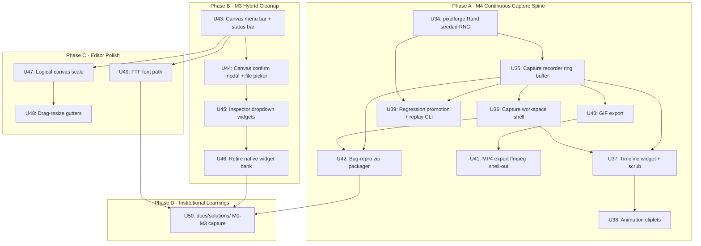

# feat: M4 Continuous Capture Spine + M3 Hybrid Cleanup + Editor Polish

## Summary

M3 (canvas-resident workspaces, GUI widget catalog, editor cart, `editor.pforge` fixture) shipped — workspaces draw onto a logical Pixelforge canvas, the asset browser and inspector have canvas-resident chrome paths, the Palette workspace renders its swatch grid via engine primitives, and four stub workspaces (Behavior, Audio, Capture, Procgen) are registered with `Ctrl+1..6` shortcuts. The chrome migration is **hybrid**: menu bar, status bar, confirm modal, and file picker still paint through the native overlay path.

This plan picks up where M3 left off and lands two complementary tracks in one pass:

- **M4 — Continuous Capture Spine.** Wire `pisnap` + `pievent.SubscribeAll` + a ring-buffer recorder into a single always-on capture substrate. From that stream, ship the five user-facing capture tools the master plan calls for: time-travel scrub, animation cliplets, regression-test promotion, GIF/MP4 export, and shareable bug-repro zips. Promote the M3 Capture workspace stub in place.
- **M3 hybrid cleanup + editor polish (queued from the M3 plan's "Deferred to Follow-Up Work").** Finish the chrome migration (M3.1 canvas-native menu bar / status bar / confirm modal / file picker; M3.2 inspector dropdown widgets), add drag-resize gutters, let the editor canvas scale with the window, ship the TTF font path, and capture M0-M3 institutional learnings into `docs/solutions/`.

Four decisions anchor this plan:

- **Phasing.** M4 first, then M3 cleanup. M4 is where new user-facing value lives (time-travel scrub, shareable bug-repros). M3 hybrid widgets work today; their migration is debt cleanup, not blocking. [User-confirmed during planning — M4 first.]
- **Seeded RNG for replay determinism.** Add a `pixelforge.Rand` wrapper to the engine: a global, seedable random source the regression replayer seeds before replay. Resolves the master plan's M4 open question on determinism guarantees. Small engine surface; cleaner UX than per-frame state snapshots. [User-confirmed during planning — seeded RNG.]
- **MP4 export via `ffmpeg` shell-out.** GIF export uses stdlib `image/gif` (zero extra deps). MP4 export attempts `exec.LookPath("ffmpeg")` and shells out when present; falls back to GIF with a clear status message when absent. No bundled binary. [Per master plan guidance — "shell out if present, graceful fallback if not".]
- **Editor extension API deferred to its own plan.** The Picotron-style user-written editor-tools API is the largest queued item; it warrants a dedicated `ce-brainstorm` / `ce-plan` round once M3.1/M3.2 stabilise the chrome surface. Explicitly excluded from this plan's scope. [User-confirmed during planning — defer.]

Seventeen implementation units (**U34-U50**) ship the milestone: nine for the capture spine, four for the M3 chrome migration, three for editor polish, one for `docs/solutions/` capture.

---

## Problem Frame

Three concrete gaps after M3:

1. **Capture surfaces are stubs.** M3 registered a `placeholderWorkspace{name: "capture"}` in `pixelforge_studio/editor/workspaces_stubs.go` that just paints "Capture - coming in M4". The recorder substrate, timeline UI, and the five user-facing tools the master plan calls for (R5) are unimplemented. Without M4, the editor can show you the running game but cannot rewind, clip, share, or regression-test it — the live-edit-debug pitch of R1 is half-built.

2. **The chrome migration is half-done.** M3's hybrid trade kept the menu bar, status bar, confirm modal, and file picker on the native overlay path while the workspace area moved onto the Pixelforge canvas. The remaining native chrome contradicts the "editor is itself a Pixelforge program" identity (R1) and forces every future widget contributor to think about *two* widget banks. M3.2 left the same split inside the inspector: five dropdown-style widgets (ColorPicker, SpriteRef, AudioRef, EventTopic, Enum) still paint via `ebitenutil.DebugPrintAt` while Slider / Checkbox / Text / Vector2 / Numeric route through the canvas.

3. **The editor is rough around the edges.** Fixed 1280×800 canvas means users on 4K displays see chrome at 1/4 native resolution. Panel widths are fixed — no drag-resize. Text reads tightly because cofont's 4×8 glyphs are pixel-perfect for 1×, not 2× or 4×. None of these are blockers, but they accumulate friction that erodes the polish R1 promises.

The fix is a single coordinated push: ship M4 to make the editor *useful* (rewind, clip, share, regression-test), then close out M3's hybrid debt (canvas-native chrome, canvas dropdowns) plus the three polish items (drag-resize, scalable canvas, TTF font), and finally capture the M0-M3 institutional learnings into `docs/solutions/` so the next milestone doesn't relearn them.

---

## Requirements

R-IDs are stable across plan edits. Carried forward from the master plan ([`docs/plans/2026-05-15-001-feat-pixelforge-no-code-editor-plan.md`](2026-05-15-001-feat-pixelforge-no-code-editor-plan.md#requirements)).

**Carried forward from origin:**

- **R5 (in full).** A single always-on capture substrate fed by `pisnap`, the `piscope` ring-buffer pattern, and `SubscribeAll` taps on `pievent.Target`s powers: time-travel scrub, animation cliplets, regression-test promotion (golden image + input log), GIF/MP4 capture, and shareable bug-repro zips. Scenes can also be recorded play sessions.
- **R1 (residual).** The editor's chrome — *including menu bar, status bar, confirm modal, and file picker* — renders via engine primitives only. M3 delivered R1 partially; M3.1 in this plan finishes the chrome side. R1 is closed at the end of Phase B.

**New plan-local requirements (this plan's scope):**

- **R17.** Deterministic regression replay. `pixelforge.Rand` wraps `math/rand/v2` with a seedable global source the regression replayer seeds before replay. The engine exposes `Seed(uint64)` and `Source()` for consumers; existing code that needs randomness migrates to the wrapper.
- **R18.** The Capture workspace replaces the M3 stub in-place: same name (`"capture"`), same `Ctrl+5` keybinding, same tab strip position. Re-registering by name (the existing `RegisterWorkspace` idempotency) is the seam.
- **R19.** Capture is on by default whenever a project is open and the game is rendering. Default ring buffer holds 10 seconds × 30 FPS = 300 frames. Older frames evict ring-buffer style. The user can resize the buffer via a Capture workspace control (resize allocates a fresh ring, dropping prior frames — soft warning before discarding).
- **R20.** Regression tests live under `tests/regressions/<project-hash>/<test-name>/` containing `golden.png`, `input.log`, `events.log`, and `project.pforge` snapshot. A `pf-studio test [--regressions=path]` CLI subcommand replays them; failures dump a pixel-diff PNG plus an event-diff text file alongside the golden.
- **R21.** Inspector dropdowns (ColorPicker, SpriteRef, AudioRef, EventTopic, Enum) render through `pixelforge_gui/widgets/Dropdown` shipped in M3 U25. The native widgets/ bank for those five widget kinds is retired once the canvas equivalents pass parity tests.
- **R22.** The editor's logical canvas size is a function of the actual window size — a "logical pixel scale" (default 1×, configurable to 2× / 3× / 4× via View menu and `settings.json`). The chrome layout recomputes from `(windowW/scale, windowH/scale)` so 4K displays no longer render the chrome at 1/4 resolution.
- **R23.** `pixelforge_font/system_font.go` wraps `golang.org/x/image/font/basicfont` to provide a higher-DPI editor text path. The font choice is theme-controlled — `editor.pforge` carries a `FontName` field already (added in M3 U27); when set to `"ttf"` or a TTF name, the cofont chokepoint dispatches to the system font implementation.

---

## Scope Boundaries

**In scope.**
- Engine: seedable `pixelforge.Rand` wrapper backed by `math/rand/v2`.
- `pixelforge_studio/capture/` package: recorder, timeline, cliplet promoter, regression runner, export, bug-repro packager.
- Promote Capture workspace stub to real implementation; canvas-resident chrome.
- `pf-studio test` CLI subcommand for regression replay.
- M3.1: canvas-native MenuBar / StatusBar / ConfirmModal / FilePicker via `pixelforge_gui/widgets/`.
- M3.2: canvas Dropdown for ColorPicker / SpriteRef / AudioRef / EventTopic / Enum widgets.
- Drag-resize gutters between left panel / canvas / right panel.
- Logical canvas scale (1×, 2×, 3×, 4×) configurable via View menu + settings.
- TTF font path: `pixelforge_font/system_font.go` + theme `FontName` dispatch.
- `docs/solutions/` capture of M0-M3 learnings (canvas-vs-native chrome split, focus manager design, editor.pforge schema shape, always-on game embedding, palette quantization metric, auto-tile heuristic, dirty-state UX, file picker design).

**Not in scope (explicitly deferred).**
- **Editor extension API (Picotron-style user-written editor tools).** Master plan called this out as needing its own plan; user confirmed deferral. Warrants a dedicated `ce-brainstorm` → `ce-plan` round once M3.1/M3.2 stabilise the chrome.
- **Behavior recording → routine synthesis.** Master plan ties this to M5 (recorded-demo entry mode). M4's capture stream is the *input* for that work but the synthesis logic itself ships in M5.
- **Scene recording as a play session (the "scenes can also be recorded play sessions" half of R5).** The recorder stream supports the data model; promoting a recorded session to a scene is M5 scripting territory.
- **MP4 bundling.** No bundled ffmpeg binary. Users on systems without ffmpeg get GIF and a status hint about installing ffmpeg for MP4.
- **Cross-process replay.** Regression replay runs in-process under `pf-studio test`. Bare runtime replay (a standalone `pixelforge_replay` binary) is a M6+ ask.
- **Headless-mode regression test runner.** `pf-studio test` boots a windowed Ebitengine instance for replay; a headless `pixelforge_test` flag (off-screen render) is a follow-up.
- **Engine internals**. No changes to `pixelforge_audio`, `pixelforge_event` API surface, `pixelforge_routine`, `pixelforge_loop` event constants, `pixelforge_snap` (we *consume* it). Adding `pixelforge_rand` is the only engine-side addition.

### Deferred to Follow-Up Work

- **Editor extension API.** Picotron-style user-written editor tools. Whole separate plan once M3.1/M3.2 stabilise the canvas chrome.
- **MP4 codec choice and quality knobs.** Current plan: pass-through to ffmpeg with sane defaults (`h264`, 30 fps). A quality / codec dropdown in the export modal is a follow-up.
- **Recorded scene → entity timeline.** Promoting a captured play session into an editable scene routine (master plan M5 recorded-demo entry mode).
- **Headless regression runner.** `pixelforge_test` binary that replays without opening a window. CI integration follows from there.
- **Hi-DPI palette workspace.** The palette workspace's swatch grid scales pixel-art; TTF font wouldn't fix the swatches themselves. A future iteration can integer-multiply the swatch size based on the canvas scale.
- **Multi-buffer capture per scene.** Single recording context for now; per-scene capture (so switching scenes mid-debug doesn't trash history) is a follow-up.

---

## Context & Research

### M3 surfaces this plan builds on

- `pixelforge_studio/editor/cart.go` — `editorCart` owns the logical Pixelforge canvas + pgui root + focus manager. Capture workspace will plug into the same root.
- `pixelforge_studio/editor/workspaces_stubs.go` — `placeholderWorkspace{name:"capture"}` is the slot M4 promotes in place. `RegisterWorkspace` is idempotent by name (existing M2 idiom).
- `pixelforge_studio/editor/widgets/` — slider, color_picker, ref_widgets, etc. The native bank Phase B retires for the five dropdown kinds (M3.2) and the four chrome surfaces (M3.1).
- `pixelforge_gui/widgets/` — `Panel`, `Button`, `Scrollable`, `TextInput`, `Tabs`, `Dropdown`, `Modal` + `FocusManager`. The catalog M3.1 / M3.2 migrate onto.
- `pixelforge_studio/editor/chrome.go` — `chromeLayout.recompute` is the function R22 (scale-aware canvas) modifies.
- `pixelforge_studio/editor/settings.go` — debounced settings persistence. Picks up `LogicalScale int` and `CaptureBudgetFrames int`.
- `pixelforge_studio/editor/keymap.go` — adds the `capture.*` actions (mark in/out, save clip, export gif, ...).
- `pixelforge_project/scenes.go` `SpriteAsset` — gains an `Animations []AnimationClip` field for cliplets (additive, schema v1 stays).

### Engine surfaces this plan consumes (read-only)

- **`pixelforge_snap/pisnap.go`** — `PalettedImage()` returns the current screen as `image.PalettedImage`. The recorder calls this once per game frame; the resulting paletted bitmap is what time-travel scrubs against.
- **`pixelforge_event/pievent.go`** — `Target[T].SubscribeAll(listener)` captures every event regardless of payload. The recorder taps every known `pievent.Target` (`piloop.Target`, `pimouse.target`, `pikey.target`, `pipad.target`, etc.) via `SubscribeAll` to build the event log.
- **`pixelforge_loop/piloop.go`** — `Target()` and `DebugTarget()` expose `EventUpdate`, `EventLateUpdate`, `EventDraw`, etc. The recorder hooks `EventLateDraw` for "capture this frame".
- **`pixelforge_mouse/pimouse.go`**, **`pixelforge_key/pikey.go`**, **`pixelforge_pad/pipad.go`** — input event targets. Replay rebroadcasts these.
- **`internal/pixelforge_ring/piring.go`** — `Buffer[E]` is the generic ring buffer `piscope` already uses (`pixelforge_scope/internal/recorder.go`). M4 uses it directly.
- **`pixelforge_scope/internal/recorder.go`** — the canonical "ring-buffer of canvas snapshots" reference pattern. M4 capture recorder mirrors this shape, extending with event log + input log.

### Existing patterns to mirror

- **Ring-buffer recorder pattern.** `pixelforge_scope/internal/recorder.go`'s `screenRecorder` stores `screenSnapshot{canvas, paletteMapping, palette}` and reuses canvases to avoid allocation. M4's capture frame extends that shape with `frameNumber`, `tickNumber`, `events []eventEntry`, `inputs []inputEntry`.
- **Subscribe-and-handle pattern.** `pixelforge_scope/internal/internal.go` `Start()` subscribes to `pixelforge_loop.DebugTarget().Subscribe(EventUpdate, ...)`. M4's recorder uses `SubscribeAll` because the master plan requires tapping every target.
- **Idempotent workspace registration.** `pixelforge_studio/editor/workspaces.go` `RegisterWorkspace` replaces by name — M4 calls `RegisterWorkspace(NewCaptureWorkspace())` and the M3 placeholder is replaced cleanly.
- **`go:embed` fixture loading.** `pixelforge_studio/editor/cart_loader.go` (shipped in M3 U27) is the template the bug-repro packager's README and the regression-test asset hashing use.
- **Test fixture conventions.** `pixelforge_project/loader_test.go` shows the schema-load round-trip pattern; M4 regression replay's golden files are read the same way.

### External references

- **stdlib `image/gif`.** `gif.EncodeAll(w, &gif.GIF{Image: []*image.Paletted, Delay: []int})`. Zero dependencies; ~50ms encode for 300 frames at 320×180.
- **stdlib `os/exec`.** `exec.LookPath("ffmpeg")` to detect MP4 capability; `exec.Command("ffmpeg", "-i", "frames/%04d.png", ...)` for the encode.
- **`golang.org/x/image/font/basicfont`.** Bundled TTF-like font surface for the higher-DPI editor text path (R23). Single transitive dep; the same dep the Ebitengine `ebitenutil.DebugPrintAt` already pulls in.
- **stdlib `math/rand/v2`.** Go 1.22+ random package with a cleaner `Source` interface than v1; `rand.New(rand.NewPCG(seed1, seed2))` builds a deterministic source. Go 1.24 already runs in this repo (`go.mod`), so v2 is available.
- **stdlib `archive/zip`.** Used by the bug-repro packager.

### Institutional learnings

`docs/solutions/` does not yet exist. Phase D in this plan creates it with M0-M3 captures: canvas-vs-native chrome split rationale, focus manager design, `editor.pforge` schema shape, always-on game embedding choice, palette quantization metric, auto-tile heuristic, dirty-state UX, file picker design, ring-buffer-as-snapshot-store pattern (from M4's own work). See [origin master plan](2026-05-15-001-feat-pixelforge-no-code-editor-plan.md) and [M3 plan deferred work](2026-05-15-003-feat-pixelforge-editor-as-cart-and-gui-growth-plan.md#deferred-to-follow-up-work) for the running list.

---

## Key Technical Decisions

1. **Seeded `pixelforge.Rand` package, not snapshot-RNG-state-per-frame.** Add `pixelforge_rand/pirand.go` with `Seed(uint64)`, `Float64()`, `IntN(int)`, etc., backed by `math/rand/v2`'s `*rand.Rand` over a `*rand.PCG` source. Replayer calls `pirand.Seed(replay.seed)` before driving frames. Rationale:
   - **Cleaner contract.** "Same project + same seed + same inputs = same frames" is easy to state and verify. Snapshotting RNG state per frame works but bloats the input log and forces every event consumer to know about RNG state.
   - **Migration is small.** Existing engine + studio code uses `math/rand` in a few spots (one `surface_test.go` reference per grep); the rest is in user game code. Migration is a search-and-replace `rand.X` → `pirand.X` for code paths that need determinism.
   - **Backwards-compatible.** Games that don't seed get the default-seed behaviour (today's behaviour); only games run under regression replay see a seeded source. [User-confirmed during planning.]

2. **Capture frames stored as `pixelforge.Canvas` clones, not encoded PNGs.** The ring buffer holds `screenSnapshot{canvas pixelforge.Canvas, paletteMapping, palette, frameNumber, tickNumber, events, inputs}`. PNG encoding happens lazily — only when exporting GIF/MP4 or promoting to regression. Rationale:
   - **Matches the existing `piscope` recorder.** Same shape, same memory model, same reuse-canvas-to-avoid-alloc trick.
   - **Memory cost is bounded.** Default 300 frames × 320×180 × 1 byte/pixel = ~17 MB. Configurable via `CaptureBudgetFrames` setting.
   - **Scrub stays fast.** `Canvas.SetData` + `Palette = snapshot.palette` is the cheapest possible "show frame N" path; we already use it for piscope rewind.

3. **MP4 export shells out to `ffmpeg`; never bundled.** `exec.LookPath("ffmpeg")` gates the MP4 button in the export modal. When missing, the modal shows "MP4 needs ffmpeg — install from ffmpeg.org" with a button to copy the URL. GIF export is always available (stdlib). Rationale:
   - **No vendored binary.** Bundling ffmpeg would add tens of megabytes to a binary that's currently ~30 MB. Most game-dev users already have it; for the ones who don't, the message is explicit.
   - **Matches master plan posture.** Master plan explicitly says "shell out if present, graceful fallback if not".
   - **Future-proof.** If a pure-Go MP4 encoder lands (Ebitengine community has discussed one), swap the implementation without changing the user-facing modal.

4. **Capture timeline is a `pixelforge_gui` widget, not a Scene-workspace overlay.** Build a new `pixelforge_gui/widgets/timeline.go` with `Timeline.SetFrames(n)`, `Timeline.Playhead()`, `Timeline.OnScrub(fn)`, `Timeline.OnMarkRange(fn)`. Capture workspace owns one. Rationale:
   - **Reusable.** Animator (in palette workspace) and Behavior recorder (M5) both want a scrubbable timeline; building the abstraction once means M5 doesn't reinvent.
   - **Canvas-resident.** Matches R1 — timeline is just `RectFill` + cofont labels + a draggable playhead bar.
   - **Trade-off.** One more widget to test and document. Acceptable given the two known downstream consumers.

5. **Regression replay runs in-process under `pf-studio test`, not as a separate binary.** `cmd: pf-studio test ./tests/regressions/` boots the same `Editor.Run` path but with a `replayMode` flag that disables UI and drives the recorded input log. Rationale:
   - **Single binary.** The studio is already an executable; adding a subcommand is cheaper than maintaining two binaries that both link the engine.
   - **Headless follow-up known.** A true headless `pixelforge_test` is documented as a deferred follow-up. M4 ships the windowed variant; CI integration is M6+ work.
   - **Trade-off.** Replay requires a display. CI scenarios with no display can use Xvfb (well-trodden Ebitengine pattern); the deferred headless follow-up makes this cleaner.

6. **Logical canvas scale is an integer (1, 2, 3, 4), not arbitrary float.** Editor canvas remains at fixed `EditorCanvasW × EditorCanvasH` (M3's 1280×800); the *display* scale is applied at blit time. Rationale:
   - **Pixel-perfect chrome.** Cofont 4×8 glyphs upscale cleanly at integer multiples; arbitrary fractional scaling blurs them.
   - **Cheap change.** The blit in `editorCart.blitToScreen` already does scale math. Add a `LogicalScale` setting field, divide the window dimensions by it, recompute chrome with the smaller "logical window" dimensions, blit the canvas at `scale ×`.
   - **Trade-off.** At scale 4×, the chrome only uses 320×200 logical pixels — tight but matches the M0 default. A future "fluid scale" can revisit.

7. **TTF font dispatches at `pixelforge_cofont.Print` level, not per-widget.** Add a `pixelforge_cofont.SetActiveSheet(sheet pifont.Sheet)` setter that the editor calls during startup based on `editor.pforge`'s `FontName`. Rationale:
   - **One swap site.** Every existing call site (`pixelforge_cofont.Print(...)` from a dozen files) automatically picks up the active sheet — no per-widget plumbing.
   - **Trade-off.** Active sheet is process-global; a future per-canvas font story would need a different abstraction. Acceptable since editor and game share the runtime today.

8. **Drag-resize gutters are a new `pixelforge_gui` capability, not editor-specific code.** Add a `Draggable` mixin pattern (an element with `OnDragStart` / `OnDrag(dx, dy)` / `OnDragEnd` callbacks) shipped in `pixelforge_gui`. Editor chrome adds two 4px-wide drag handles between left panel / canvas / right panel. Rationale:
   - **Reusable.** Future workspaces (Behavior graph zoom, Audio waveform pan) want drag interactions too.
   - **Pattern parity.** Mirrors the `Element.OnTap` shape already in `pixelforge_gui/pigui.go`.

---

## Output Structure

```
pixelforge_rand/                                # NEW (U34)
  pirand.go                                     # NEW — seedable wrapper around math/rand/v2
  pirand_test.go                                # NEW

pixelforge_studio/
  capture/                                      # NEW (U35-U42)
    recorder.go                                 # NEW (U35) — ring-buffer recorder + pievent SubscribeAll tap
    recorder_test.go                            # NEW
    frame.go                                    # NEW (U35) — captured-frame data shape
    workspace.go                                # NEW (U36) — promote M3 stub; canvas-resident chrome
    workspace_test.go                           # NEW
    timeline.go                                 # NEW (U37) — Capture workspace timeline state + handlers
    timeline_test.go                            # NEW
    cliplet.go                                  # NEW (U38) — animation cliplet promoter (writes AnimationClip into SpriteAsset)
    cliplet_test.go                             # NEW
    regression.go                               # NEW (U39) — golden-image regression runner
    regression_test.go                          # NEW
    export.go                                   # NEW (U40, U41) — GIF + MP4 export
    export_test.go                              # NEW
    bug_report.go                               # NEW (U42) — repro-zip packager
    bug_report_test.go                          # NEW

  cmd/pf-studio-test/                           # NEW (U39)
    main.go                                     # NEW — `pf-studio test ./tests/regressions/` entry point

  editor/
    keymap.go                                   # MODIFY (U36, U38) — capture.* actions
    settings.go                                 # MODIFY (U35, U47) — CaptureBudgetFrames + LogicalScale fields
    workspaces.go                               # MODIFY (U36) — drop the Capture stub at startup; capture pkg re-registers
    chrome.go                                   # MODIFY (U47) — scale-aware recompute
    cart.go                                     # MODIFY (U47) — blit math handles scale
    chrome_visibility.go                        # MODIFY (U35) — game canvas hooks into recorder

pixelforge_gui/
  widgets/
    timeline.go                                 # NEW (U37) — reusable scrub timeline
    timeline_test.go                            # NEW
    menu_bar.go                                 # NEW (U43) — canvas-native menu bar (M3.1)
    menu_bar_test.go                            # NEW
    status_bar.go                               # NEW (U43) — canvas-native status bar (M3.1)
    status_bar_test.go                          # NEW
    confirm_modal.go                            # NEW (U44) — canvas-native confirm dialog (M3.1)
    confirm_modal_test.go                       # NEW
    file_picker.go                              # NEW (U44) — canvas-native file picker (M3.1)
    file_picker_test.go                         # NEW
    draggable.go                                # NEW (U48) — Draggable mixin (drag-resize primitive)
    draggable_test.go                           # NEW

pixelforge_studio/editor/
  inspector_canvas.go                           # MODIFY (U45) — dispatch ColorPicker/SpriteRef/AudioRef/EventTopic/Enum to canvas Dropdown
  widgets/                                      # RETIRE (U45) — five files removed once parity tests pass:
    color_picker.go                             # DELETE
    ref_widgets.go                              # DELETE
    # Slider/Checkbox/Text/Vector2/Numeric/Default/Asset row stay (still used until full canvas-bank parity in a later milestone)

pixelforge_font/
  system_font.go                                # NEW (U49) — TTF wrapper around golang.org/x/image/font/basicfont
  system_font_test.go                           # NEW

pixelforge_cofont/
  picofont.go                                   # MODIFY (U49) — SetActiveSheet() + dispatch to system_font when configured

pixelforge_project/
  scenes.go                                     # MODIFY (U38) — SpriteAsset.Animations field

docs/solutions/                                 # NEW (U50)
  canvas-vs-native-chrome-split.md              # NEW
  focus-manager-design.md                       # NEW
  editor-pforge-schema-shape.md                 # NEW
  always-on-game-embedding.md                   # NEW
  palette-quantization-metric.md                # NEW
  auto-tile-heuristic.md                        # NEW
  dirty-state-ux.md                             # NEW
  file-picker-design.md                         # NEW
  ring-buffer-snapshot-store.md                 # NEW
  README.md                                     # NEW — index
```

The per-unit `**Files:**` sections remain authoritative; implementers may adjust file boundaries within a package if implementation reveals a better layout.

---

## Implementation Roadmap

Seventeen implementation units (U34-U50), grouped into four phases.



*This illustrates dependency relationships and is directional guidance for review, not implementation specification.*

---

## Phase A — M4 Continuous Capture Spine

### U34. Seedable `pixelforge.Rand` wrapper

**Goal.** Add `pixelforge_rand/pirand.go` providing a seedable, deterministic random source. Existing engine + studio code that uses `math/rand` migrates onto this wrapper so regression replay (U39) can guarantee determinism.

**Requirements.** R17.

**Dependencies.** None (foundation).

**Files.**
- Create: `pixelforge_rand/pirand.go` — exposes `Seed(uint64)`, `Float64()`, `IntN(int)`, `Shuffle`, `Source()` with `math/rand/v2` + `*rand.PCG` under the hood.
- Create: `pixelforge_rand/pirand_test.go`.
- Modify (search-and-replace `math/rand` callers inside the engine/studio repos): grep surfaces are sparse — `surface_test.go` is the only hit in the engine; any user-facing example code that exists.

**Approach.**
- `Seed(seed uint64)` calls `rand.New(rand.NewPCG(seed, seed^0x9E3779B97F4A7C15))` and stores in a package-private `current *rand.Rand`. Default `init()` seeds with `uint64(time.Now().UnixNano())` so games that never call `Seed` keep today's behaviour.
- `Float64()`, `IntN(n int)`, `Shuffle` and friends delegate to `current`. Variadic-free API to keep allocations zero.
- `Source()` returns the active `*rand.Rand` for callers that need to interop with stdlib functions accepting `rand.Source`.
- The default `Seed` value (`time.Now().UnixNano()`) is recorded into the capture log on `EventInit` so a captured session naturally carries its seed; regression replay calls `Seed(loggedSeed)` before driving frames.

**Patterns to follow.**
- `math/rand/v2` package layout. Wrap, do not re-implement.
- The single-global-package-state pattern that `pixelforge.Camera`, `pixelforge.Palette` already use; not goroutine-safe by design (matches engine conventions).

**Test scenarios.**
- **Happy path.** `pirand.Seed(42)` then 10 `Float64()` calls produces the exact same sequence on a second `Seed(42)` invocation.
- **Happy path.** `pirand.IntN(100)` returns a value in `[0, 100)`.
- **Edge case.** `pirand.IntN(0)` panics with a clear message (matches stdlib `math/rand/v2` panic shape).
- **Edge case.** Calling `Seed` mid-sequence resets the sequence — next call produces the same value as the first call after a fresh Seed.
- **Edge case.** No `Seed` call → distinct sequences across two process runs (initialized from time).
- **Integration.** A function that shuffles a slice using `pirand.Shuffle` produces the same permutation given the same seed across runs.

**Verification.**
- `go test ./pixelforge_rand/...` passes.
- Manual: `grep -r "math/rand" pixelforge_studio pixelforge_event pixelforge_routine pixelforge_loop` returns no production hits (test files are fine; user-game code is out of scope).

---

### U35. Capture recorder ring buffer + pievent SubscribeAll tap

**Goal.** Stand up `pixelforge_studio/capture/recorder.go`: a ring buffer of captured frames where each frame holds the screen canvas, palette state, frame/tick numbers, fired events, and input events for that tick. Subscribe to `piloop.EventLateDraw` to drive captures; subscribe to every input + event target via `SubscribeAll`.

**Requirements.** R5 (substrate), R19.

**Dependencies.** U34 (recorder logs initial RNG seed on EventInit).

**Files.**
- Create: `pixelforge_studio/capture/recorder.go` — `Recorder`, `Frame`, `New(budget int)`, `Start()`, `Stop()`, `Reset()`, `Frames() []*Frame`, `MostRecent() *Frame`.
- Create: `pixelforge_studio/capture/frame.go` — `Frame{Canvas pixelforge.Canvas, Palette, PaletteMapping, FrameNumber, TickNumber, Events []EventEntry, Inputs []InputEntry}`.
- Create: `pixelforge_studio/capture/recorder_test.go`.
- Modify: `pixelforge_studio/editor/settings.go` — add `CaptureBudgetFrames int` (default 300).
- Modify: `pixelforge_studio/editor/chrome_visibility.go` — pipe the game canvas's frame events to the recorder.

**Approach.**
- `Recorder` wraps `pixelforge_ring.Buffer[Frame]` (same primitive `pixelforge_scope` uses). `NextWritePointer` returns a reusable `*Frame`; the recorder copies the current screen into `Frame.Canvas` via `SetData` to avoid allocation.
- On `Start()`: subscribe to `piloop.Target().Subscribe(EventLateDraw, captureFrame)` for frame capture. Subscribe to every known target via `SubscribeAll` for event log: `pimouse.ButtonTarget`, `pimouse.MoveTarget`, `pikey.Target`, `pipad.Target`, etc. (use exported `*Target()` accessors where they exist; add minimal getters on `pimouse` etc. only if absolutely needed — prefer documenting and using existing surfaces).
- Event handlers append `EventEntry{TargetName, EventValue}` to the recorder's "current frame" event buffer; `EventLateDraw` rolls that buffer into the captured `Frame` and resets it for the next tick.
- Budget configuration: `Recorder.SetBudget(n int)` rebuilds the ring (drops history with a status hint). Default 300 frames.
- Memory: 300 × (320×180 byte canvas + ~50 byte event slice) ≈ 17 MB worst case.

**Patterns to follow.**
- `pixelforge_scope/internal/recorder.go` `screenRecorder` — the canonical capture loop shape (use it).
- `pixelforge_scope/internal/internal.go` `Start()` for the `pixelforge_loop.DebugTarget().Subscribe` idiom.
- `pixelforge_event/pievent.go` `SubscribeAll` for the "tap every event" pattern.

**Test scenarios.**
- **Happy path.** A fresh `Recorder` with budget 5 receives 3 `captureFrame` triggers — `Frames()` returns 3 frames; `MostRecent().FrameNumber == 2`.
- **Happy path.** Receiving 8 frames with budget 5 keeps the most recent 5; the oldest 3 evicted; `Frames()[0].FrameNumber == 3`.
- **Happy path.** An event published on a subscribed target between two `EventLateDraw` ticks is recorded in the *first* frame's `Events` and not the next.
- **Edge case.** `New(0)` panics with a clear message (zero-size ring isn't useful).
- **Edge case.** `Stop()` after `Start()` unsubscribes cleanly; subsequent frame events do not append.
- **Edge case.** `Reset()` empties the ring but keeps subscriptions live.
- **Edge case.** Resizing the budget mid-capture (`SetBudget(10)` from `SetBudget(5)`) drops the existing ring and starts fresh (rolling forward inflight history is a deferred follow-up).
- **Integration.** With the recorder running for 100 simulated ticks against a fake event target publishing 3 events per tick, the captured event log has 300 entries spread across the 100 frames.

**Verification.**
- `go test ./pixelforge_studio/capture/...` passes.
- Manual: launch the studio with a project loaded → background recorder accumulates frames; observe via a debug flag exposing `len(recorder.Frames())`.

---

### U36. Capture workspace shell (promote M3 stub in place)

**Goal.** Replace `pixelforge_studio/editor/workspaces_stubs.go`'s `placeholderWorkspace{name:"capture"}` with a real `CaptureWorkspace` implementing `editor.CanvasWorkspace`. The workspace owns a `*capture.Recorder` instance and renders the workspace chrome (panel headers, status text, frame-count indicator). Timeline + per-tool surfaces ship in U37+.

**Requirements.** R18, R19.

**Dependencies.** U35 (uses the recorder).

**Files.**
- Create: `pixelforge_studio/capture/workspace.go` — `CaptureWorkspace`, `RegisterWith(e *editor.Editor)`, `New()`. Mirrors the `palette.Workspace` registration pattern.
- Create: `pixelforge_studio/capture/workspace_test.go`.
- Modify: `pixelforge_studio/editor/workspaces.go` `installDefaultWorkspaces` — drop the capture stub; the `capture` package's `RegisterWith` re-registers by name (idempotent).
- Modify: `pixelforge_studio/main.go` — call `capture.RegisterWith(e)` alongside `palette.RegisterWith(e)`.
- Modify: `pixelforge_studio/editor/keymap.go` — add the `capture.*` action namespace (registered no-op for now; later units bind specific shortcuts).

**Approach.**
- `CaptureWorkspace` implements `Name()` → `"capture"`, `DisplayName()` → `"Capture"`, `Draw` (native overlay no-op for hybrid path), `DrawCanvas(rel, e)` (canvas-resident workspace chrome), `Update(e)`.
- `Update` keeps the recorder running whenever a project is loaded (via `e.Project()`); if no project, the workspace renders a "(no project)" placeholder.
- `DrawCanvas` paints: panel header strip ("CAPTURE"), the recorder's frame count + budget in the corner ("142 / 300"), the timeline region (filled in U37), and a tool palette region (filled in U38-U42 with mark-in/out, save clip, export, etc. buttons).
- `RegisterWith` constructs the workspace, allocates `capture.New(e.Settings().CaptureBudgetFrames)`, calls `recorder.Start()`, and `e.RegisterWorkspace(w)`. The M3 stub is replaced by `Name()` collision (existing M2 idiom).

**Patterns to follow.**
- `pixelforge_studio/palette/workspace.go` for the `Workspace` impl shape.
- `pixelforge_studio/palette/canvas_render.go` for the `DrawCanvas` engine-primitives style.
- `pixelforge_studio/editor/workspaces_stubs.go` for the placeholder being replaced.

**Test scenarios.**
- **Happy path.** Registering `capture.NewWorkspace()` via `RegisterWith` after `editor.New()` replaces the M3 stub — `e.Workspaces()` still has 5 entries with the Capture slot now holding the real implementation.
- **Happy path.** `Ctrl+5` switches to the workspace; `ActiveWorkspaceName() == "capture"`.
- **Edge case.** Workspace renders without a project loaded — no panic, placeholder text visible.
- **Edge case.** Recorder remains running across workspace switches (Scene → Capture → Scene) — frame count keeps incrementing.
- **Integration.** Loading a project, switching to Capture workspace, observing the frame counter advances each tick.

**Verification.**
- `go test ./pixelforge_studio/capture/...` passes.
- Manual: launch studio, press Ctrl+5; "CAPTURE" header visible, frame count climbs.

---

### U37. Timeline widget + scrub

**Goal.** Build a reusable `pixelforge_gui/widgets/Timeline` widget (canvas-resident, scrubbable) and host one inside the Capture workspace. Dragging the playhead backward reapplies the captured frame at that index to the game canvas — the "rewind" UX from R5.

**Requirements.** R5.

**Dependencies.** U35, U36.

**Files.**
- Create: `pixelforge_gui/widgets/timeline.go` — `Timeline{Frames int, Position int, OnScrub func(idx int), OnMarkRange func(start, end int)}` + Draw/Update.
- Create: `pixelforge_gui/widgets/timeline_test.go`.
- Modify: `pixelforge_studio/capture/workspace.go` — owns a `*widgets.Timeline` in `CaptureWorkspace`.
- Create: `pixelforge_studio/capture/timeline.go` — the workspace-side handlers wiring the widget to the recorder (`OnScrub` reapplies captured frame; `OnMarkRange` records the user-marked range for clip/export tools).
- Create: `pixelforge_studio/capture/timeline_test.go`.

**Approach.**
- `Timeline` renders a horizontal strip: filled background bar (frames range), a playhead vertical line, an optional mark-range region (between in-point and out-point), tick marks every 30 frames (= 1 second @ 30 TPS).
- Drag handling: pointer down inside the strip + drag horizontally → `OnScrub(idx)`. Shift+drag → set/extend mark range. Click on a tick → snap-to-frame.
- `Timeline.SetFrames(n)` resets count and clamps position. `Timeline.SetPosition(idx)` is what scroll-to-most-recent uses.
- Workspace-side `timeline.go`: `OnScrub(idx)` calls `recorder.Frames()[idx]`, then `pixelforge.Screen().SetData(frame.Canvas.Data())` + restore palette/mapping. Live game continues to advance separately; scrubbing past the most-recent frame "catches up" to live.
- The reusable widget is what M5 Behavior recorder and the palette Animator will also consume — keep its API minimal and avoid `editor.Editor` coupling.

**Patterns to follow.**
- `pixelforge_gui/widgets/scrollable.go` for the drag-state-via-pointer pattern.
- `pixelforge_scope/internal/recorder.go` `showCurrent()` for the "reapply a snapshot to the screen" pattern.

**Test scenarios.**
- **Happy path.** `Timeline.SetFrames(300)` + `OnScrub` callback fires when the user drags the playhead; idx is correctly proportional (drag to 50% → idx ≈ 150).
- **Happy path.** Workspace `OnScrub(100)` reapplies `recorder.Frames()[100]`'s canvas to the screen; the screen pixels match the recorded frame.
- **Happy path.** Shift+drag sets a mark range; `OnMarkRange(start, end)` fires with the swept indices.
- **Edge case.** Drag past the right edge clamps to the last frame; past the left clamps to 0.
- **Edge case.** A `Timeline` with `Frames=0` renders an empty strip; pointer events are no-ops.
- **Edge case.** Mark range with `start > end` swaps internally so `OnMarkRange` always reports `start ≤ end`.
- **Integration.** With recorder running and Capture workspace active, scrubbing back to frame 50 shows the game state at frame 50 — the live game canvas is restored to "current" on workspace switch back to Scene.

**Verification.**
- `go test ./pixelforge_gui/widgets/...` passes including timeline tests.
- `go test ./pixelforge_studio/capture/...` passes.
- Manual: load snake project, play 5 seconds, switch to Capture, drag playhead — snake rewinds visibly.

---

### U38. Animation cliplets

**Goal.** Promote a marked timeline range to an `AnimationClip` referenced from a `SpriteAsset`. The captured frames *are* the animation — no keyframe editor needed for v1.

**Requirements.** R5.

**Dependencies.** U37.

**Files.**
- Create: `pixelforge_studio/capture/cliplet.go` — `PromoteRangeToClip(rec *Recorder, start, end int, spriteName, clipName string, project *pixelforge_project.Project) error`.
- Create: `pixelforge_studio/capture/cliplet_test.go`.
- Modify: `pixelforge_project/scenes.go` — add `SpriteAsset.Animations []AnimationClip` and `AnimationClip{Name, Frames []ClipFrame, FPS int}`. Additive; schema stays at v1.
- Modify: `pixelforge_studio/editor/keymap.go` — register `capture.save_clip` (Ctrl+Shift+C).

**Approach.**
- A marked range and a "Save as Animation" action opens a small modal: sprite name (dropdown of existing project sprites), clip name (text input). Confirming calls `PromoteRangeToClip`.
- `PromoteRangeToClip` clones the canvases in the range, encodes them as paletted PNG into the sprite's *-assets directory under `<sprite>/<clip>.png` (frame strip), and appends an `AnimationClip{Name, FPS, Frames: [{Path, Duration}...]}` to the sprite's `Animations`.
- The sprite's existing FrameW/FrameH metadata is reused as the clip's frame dimensions (so cliplets are constrained to the sprite's existing strip layout).
- Per-frame Duration default = 1 tick; future inspector can override.

**Patterns to follow.**
- `pixelforge_project/sprites.go` SpriteAsset structure for the `Animations` field addition.
- `pixelforge_studio/palette/sidecar.go` for the "write asset bytes to *-assets/" pattern.
- `pixelforge_studio/editor/widgets/modal.go` for the prompt dialog shape (this is the native bank — Phase B retires it, but until then it's the canonical modal).

**Test scenarios.**
- **Happy path.** Marking range [50, 80] and promoting to clip "walk" on sprite "hero" writes 31 frames into `<project-assets>/hero/walk.png` and appends an `AnimationClip` to `SpriteAsset.Animations`.
- **Happy path.** Re-saving over an existing clip name overwrites the PNG and replaces the `AnimationClip` entry (idempotent).
- **Edge case.** Marking a range with `end < start` swaps them and ships frames in chronological order.
- **Edge case.** A sprite without `FrameW/H` set rejects the promote with an error message instructing the user to set frame dimensions first.
- **Edge case.** Empty range (`start == end`) returns an error.
- **Edge case.** Sprite name not found in project returns an error referencing the missing name.
- **Integration.** Round-trip: promote a clip → save the project → reload → the `AnimationClip` survives load.

**Verification.**
- `go test ./pixelforge_studio/capture/...` and `go test ./pixelforge_project/...` pass.
- Manual: capture snake gameplay → mark a 30-frame range → save as "wiggle" on the snake sprite → reload project → clip visible in the inspector's sprite section.

---

### U39. Regression-test promotion + `pf-studio test` CLI

**Goal.** "Promote to regression test" on a captured frame writes `tests/regressions/<project-hash>/<test-name>/{golden.png, input.log, events.log, project.pforge, seed.txt}`. A new `pf-studio test [dir]` CLI subcommand replays them in-process and reports pass/fail (with pixel-diff and event-diff on failure).

**Requirements.** R5, R17, R20.

**Dependencies.** U34 (seed log), U35 (captured frame + input/event logs).

**Files.**
- Create: `pixelforge_studio/capture/regression.go` — `PromoteFrameToRegression(rec *Recorder, frameIdx int, project *pixelforge_project.Project, testName string) error`, `ReplayRegression(testDir string) (Result, error)`.
- Create: `pixelforge_studio/capture/regression_test.go`.
- Create: `pixelforge_studio/cmd/pf-studio-test/main.go` — the CLI binary. Routes `pf-studio test ./tests/regressions/` to `ReplayRegression`.
- Modify: `pixelforge_studio/main.go` — recognise an optional `test` subcommand and dispatch to the same `cmd/pf-studio-test` logic.
- Modify: `pixelforge_studio/editor/keymap.go` — register `capture.promote_regression` (Ctrl+Shift+R).

**Approach.**
- Promotion: take the frame's canvas → encode as PNG → write `golden.png`. Take the input + event logs from the recorder for [0..frameIdx] → write `input.log` + `events.log` as JSON lines. Snapshot `project.pforge` via the existing saver. Write the seed as `seed.txt` (the one `pirand.Seed` logged on `EventInit`). Compute a project hash (SHA-256 of `project.pforge`) to namespace the directory.
- Replay: `ReplayRegression(dir)` loads `project.pforge`, seeds via `pirand.Seed(loggedSeed)`, opens a headed Ebitengine window (master plan trade-off documented), drives the input log through `pimouse/pikey/pipad`'s targets, runs to the last frame in the log, captures the screen via `pisnap`, and compares against `golden.png`. Result: `{Passed bool, PixelDiff *image.Image, EventDiff string}`.
- CLI: `pf-studio test` walks the regression directory, runs each test, reports `OK`/`FAIL <name>` to stdout, exits non-zero on any failure. `--regressions=path` overrides the default `tests/regressions/`.
- The replay window can be hidden (`ebiten.SetWindowSize(1,1)` + off-screen) — the deferred follow-up is a true headless renderer.

**Patterns to follow.**
- `pixelforge_project/saver.go` `Encode` for the deterministic project snapshot.
- `pixelforge_snap/pisnap.go` `PalettedImage` for the screen-capture-at-frame-N path.
- `pixelforge_studio/codegen/generator.go` for the build-a-runnable-Go-thing layout pattern.

**Test scenarios.**
- **Happy path.** Promoting frame 100 from a clean snake recording writes the four files + `seed.txt`; the directory layout matches `tests/regressions/<hash>/<name>/{golden.png, input.log, events.log, project.pforge, seed.txt}`.
- **Happy path.** Replaying a freshly-promoted regression on the same machine passes (golden matches actual; events match).
- **Happy path.** Promoting twice with the same `testName` updates the existing directory in place.
- **Edge case.** Replaying a regression after the project file changed (different hash) fails with `mismatched project hash`.
- **Edge case.** Replaying a regression whose recorded inputs reference a missing sprite asset returns a clear `ErrMissingAsset` (existing project loader error).
- **Edge case.** Pixel-diff PNG is written to `<test-dir>/diff.png` on failure; event-diff to `<test-dir>/diff.txt`.
- **Edge case.** Non-deterministic game (uses `pirand` without explicit seeding) still replays deterministically because the recorder logs the auto-generated seed.
- **Integration.** Run two consecutive replays of the same regression test — both pass (proves the replay leaves no residual state).

**Verification.**
- `go test ./pixelforge_studio/capture/...` passes.
- `go build ./pixelforge_studio/cmd/pf-studio-test/...` succeeds.
- Manual: capture 5 seconds of snake, promote frame 60 to "snake-baseline", run `./pf-studio test`, observe `OK snake-baseline`.

---

### U40. GIF export

**Goal.** Export a marked timeline range as an animated GIF via stdlib `image/gif`. Zero external dependencies; always available.

**Requirements.** R5.

**Dependencies.** U35.

**Files.**
- Create: `pixelforge_studio/capture/export.go` — `ExportGIF(rec *Recorder, start, end int, out io.Writer, opts GIFOptions) error`. GIFOptions: `LoopCount int`, `Delay int` (ms per frame).
- Create: `pixelforge_studio/capture/export_test.go`.
- Modify: `pixelforge_studio/editor/keymap.go` — register `capture.export_gif` (Ctrl+Shift+G).

**Approach.**
- Walk `recorder.Frames()[start..end]`, build `[]*image.Paletted` from each `Frame.Canvas` (the canvas is already paletted indices; just wrap with `image.NewPaletted` using the frame's palette).
- Build `*gif.GIF{Image: pals, Delay: [...]int}`. Delay default = `100 / TPS` (10 cs for 30 TPS → 10 frames/s).
- `gif.EncodeAll(out, g)` writes the bytes.
- Export modal asks for filename → confirm → write to disk via `os.Create`.

**Patterns to follow.**
- stdlib `image/gif` docs — `EncodeAll` is the canonical path.
- `pixelforge_snap/pisnap.go` `PalettedImage` for the canvas-to-Paletted conversion idiom.

**Test scenarios.**
- **Happy path.** Exporting 30 frames produces a valid GIF parsable by `gif.DecodeAll`; frame count matches.
- **Happy path.** Loop count 0 = forever; loop count > 0 = N loops + stop.
- **Edge case.** `start == end` exports a 1-frame GIF.
- **Edge case.** `end > len(frames)` clamps to the last available frame.
- **Edge case.** Writer that fails mid-write returns the error (no partial file on disk if the caller checks).
- **Edge case.** Per-frame palette changes (palette animator running during capture) produce a GIF with the global palette of the first frame and per-frame local palettes for the rest.

**Verification.**
- `go test ./pixelforge_studio/capture/...` passes; GIF round-trip test passes.
- Manual: capture 1 second of snake, export GIF, open it in an image viewer — animation plays correctly.

---

### U41. MP4 export via ffmpeg shell-out

**Goal.** Detect `ffmpeg` in PATH; when present, pipe a frame range through `ffmpeg -i frames/%04d.png` to produce an MP4. When absent, the export modal shows a clear message and offers GIF instead.

**Requirements.** R5.

**Dependencies.** U40.

**Files.**
- Modify: `pixelforge_studio/capture/export.go` — add `ExportMP4(rec *Recorder, start, end int, outPath string, opts MP4Options) error`, `FFmpegAvailable() bool`.
- Modify: `pixelforge_studio/capture/export_test.go`.
- Modify: `pixelforge_studio/editor/keymap.go` — register `capture.export_mp4`.

**Approach.**
- `FFmpegAvailable()` does `exec.LookPath("ffmpeg")`; result cached at package init.
- `ExportMP4` writes the frame range to a temp dir as numbered PNGs (`0000.png`, `0001.png`, ...), then shells out: `ffmpeg -framerate 30 -i frames/%04d.png -c:v libx264 -pix_fmt yuv420p -y out.mp4`. Captures stderr for error diagnostics; deletes the temp dir on success.
- Export modal shows "MP4 (requires ffmpeg)" with an enabled/disabled state depending on `FFmpegAvailable()`. When disabled, hovering the button shows a tooltip with the install hint.

**Patterns to follow.**
- stdlib `os/exec` — `exec.LookPath`, `exec.Command(...).Run()`, capturing stderr via `cmd.Stderr = &buf`.

**Test scenarios.**
- **Happy path.** With ffmpeg available, exporting 30 frames produces an MP4 whose duration matches `30 / 30 = 1s` (parsed via `ffprobe` in the test, or just `os.Stat` non-zero size as a coarse check).
- **Happy path.** `FFmpegAvailable()` returns false on a PATH that doesn't contain ffmpeg; true when it does.
- **Edge case.** `ExportMP4` when ffmpeg missing returns `ErrFFmpegMissing` immediately without touching the filesystem.
- **Edge case.** ffmpeg exits non-zero (e.g. invalid codec) returns the wrapped error including stderr tail.
- **Edge case.** The temp PNG dir is cleaned up even on ffmpeg failure (deferred cleanup).

**Verification.**
- `go test ./pixelforge_studio/capture/...` passes (ffmpeg test gated behind a build tag or `t.Skip("ffmpeg not available")` when missing).
- Manual: capture 2 seconds, export MP4, play in mpv.

---

### U42. Bug-repro zip packager

**Goal.** "Share bug repro" packages: `project.pforge` + `*-assets/` directory + last N captured frames + input log + event log + system info → single ZIP with an auto-generated `README.md`.

**Requirements.** R5.

**Dependencies.** U35, U36.

**Files.**
- Create: `pixelforge_studio/capture/bug_report.go` — `PackageReproZip(rec *Recorder, project *pixelforge_project.Project, projectPath string, framesBack int, out io.Writer) error`.
- Create: `pixelforge_studio/capture/bug_report_test.go`.
- Modify: `pixelforge_studio/editor/keymap.go` — register `capture.bug_report` (Ctrl+Shift+B).

**Approach.**
- Use stdlib `archive/zip`. Layout:
  ```
  bug-repro-<timestamp>.zip
    README.md                       # generated: project name, frame count, ffmpeg available?, system info, last error
    project.pforge
    project.pforge-assets/...       # full recursive copy
    capture/
      frames/0000.png ... NNNN.png  # last N frames (default 60)
      input.log
      events.log
      seed.txt
    system.txt                       # runtime.GOOS/GOARCH, go version, ebiten version (via runtime/debug.BuildInfo)
  ```
- The generated README has a "What to provide" section reminding the bug filer to describe steps + expected vs actual.
- Default `framesBack = 60` (= 2 seconds @ 30 TPS).
- The system info uses `runtime/debug.ReadBuildInfo()` for dep versions.

**Patterns to follow.**
- stdlib `archive/zip` — `zip.NewWriter`, `Writer.Create`.
- `pixelforge_studio/codegen/generator.go` for the "copy a directory tree" idiom.

**Test scenarios.**
- **Happy path.** Packaging a recorder with 100 frames and `framesBack=30` produces a ZIP containing 30 frame PNGs, the project file, the README, and system.txt.
- **Happy path.** ZIP is decompressible via stdlib `archive/zip` reader and the README contains the project name.
- **Edge case.** `framesBack > len(recorder.Frames())` clamps to all available frames.
- **Edge case.** Project with no assets directory writes the ZIP without the `project.pforge-assets/` prefix; README notes the absence.
- **Edge case.** Writer that fails mid-zip propagates the error without producing a half-written file (caller-managed disk semantics).
- **Edge case.** Large assets directory (10 MB+) doesn't OOM — files are streamed.

**Verification.**
- `go test ./pixelforge_studio/capture/...` passes.
- Manual: trigger Ctrl+Shift+B during a snake session → ZIP appears in the working dir → unzip → README + frames + project intact.

---

## Phase B — M3 Hybrid Cleanup

### U43. Canvas-native menu bar + status bar

**Goal.** Migrate `pixelforge_studio/editor/widgets/menu_bar.go` (`MenuBar` native widget) and the status bar rendering inside `chrome.go` (`drawStatusBar`) onto canvas-resident `pixelforge_gui/widgets/MenuBar` and `StatusBar`. The native overlay path stops painting menu/status chrome after this lands.

**Requirements.** R1 (residual chrome closure).

**Dependencies.** None within this plan (the canvas widget catalog from M3 U23-U25 already shipped).

**Files.**
- Create: `pixelforge_gui/widgets/menu_bar.go` — canvas-resident `MenuBar` mirroring the native one's API (`NewMenuBar(defs []MenuDef)`, click + hover + dropdown).
- Create: `pixelforge_gui/widgets/menu_bar_test.go`.
- Create: `pixelforge_gui/widgets/status_bar.go` — `StatusBar{Left, Right, Hint string, FgColor, BgColor pixelforge.Color}` with a `Draw()` that paints via `RectFill` + `cofont.Print`.
- Create: `pixelforge_gui/widgets/status_bar_test.go`.
- Modify: `pixelforge_studio/editor/editor.go` — switch `e.menuBar` to a `*pixelforge_gui/widgets.MenuBar`; instantiate a `*StatusBar`.
- Modify: `pixelforge_studio/editor/chrome.go` — replace `drawStatusBar` / `drawTitleBar` / `drawTabStrip` with canvas-resident equivalents that paint into the editor canvas.
- Modify: `pixelforge_studio/editor/cart.go` — `renderInto` paints the menu bar + status bar at the top/bottom of the canvas; native overlay no longer responsible for them.
- Delete: `pixelforge_studio/editor/widgets/menu_bar.go` (after parity verified).

**Approach.**
- The canvas `MenuBar` reuses the existing `MenuDef` struct (which lives in the native bank for now — port it to `pixelforge_gui/widgets/menu_def.go` alongside the widget).
- Menu dropdowns reuse the M3 U25 `Dropdown` widget.
- Status bar is simple: three regions (left/right text, optional centre hint), text via cofont, background via `RectFill` from the theme.
- The migration order is: (1) build the canvas widgets; (2) duplicate the menu/status in canvas mode while keeping the native ones to verify parity; (3) flip a `useCanvasChrome` editor flag to on; (4) remove the native files.

**Patterns to follow.**
- `pixelforge_studio/editor/widgets/menu_bar.go` for the native menu's exact behaviour (port it).
- `pixelforge_gui/widgets/tabs.go` (M3 U25) for the click-to-select widget shape.

**Test scenarios.**
- **Happy path.** Clicking a top-level menu item opens its Dropdown; clicking a dropdown entry fires the registered `OnSelect`.
- **Happy path.** Status bar's Left/Right text both render at the right positions; the chrome-hidden hint appears in the centre region when set.
- **Happy path.** Keyboard shortcut (Alt+F for File menu) opens the menu when a future accelerator binding lands; M3 didn't have this but the canvas widget supports it.
- **Edge case.** Menu with zero items renders nothing.
- **Edge case.** A long status message wider than the available status-bar width is truncated with an ellipsis.
- **Integration.** Open File → Save Project menu path: native menu bar replaced; canvas-resident menu produces the same Save action.

**Verification.**
- `go test ./pixelforge_gui/widgets/...` passes including menu_bar + status_bar tests.
- `go test ./pixelforge_studio/editor/...` passes.
- Manual: visible menu bar + status bar look identical to M3 (same fonts/colours) but render via cofont, not `ebitenutil.DebugPrintAt`.

---

### U44. Canvas-native confirm modal + file picker

**Goal.** Migrate `pixelforge_studio/editor/widgets/file_picker.go` and `pixelforge_studio/editor/confirm_modal.go` onto canvas-resident equivalents using the M3 `pixelforge_gui/widgets/Modal` and `TextInput`.

**Requirements.** R1 (residual chrome closure).

**Dependencies.** U43 (so the menu bar that opens the file picker is already canvas-resident).

**Files.**
- Create: `pixelforge_gui/widgets/confirm_modal.go` — `NewConfirmModal(title, msg, onOK, onCancel)`.
- Create: `pixelforge_gui/widgets/confirm_modal_test.go`.
- Create: `pixelforge_gui/widgets/file_picker.go` — canvas-resident file picker using `Modal` + `Scrollable` + `TextInput`.
- Create: `pixelforge_gui/widgets/file_picker_test.go`.
- Modify: `pixelforge_studio/editor/editor.go` — swap `e.filePicker` and `e.confirmDialog` to the canvas types.
- Delete: `pixelforge_studio/editor/widgets/file_picker.go`, `pixelforge_studio/editor/widgets/modal.go`, `pixelforge_studio/editor/confirm_modal.go` after parity.

**Approach.**
- Confirm modal: `Modal` body with a Label (title), a Label (message), and two Buttons (OK / Cancel) wired to callbacks.
- File picker: `Modal` body containing a path TextInput (current directory), a Scrollable list of entries (directory rows + file rows rendered as Buttons), and a footer with name TextInput (for save) + OK/Cancel.
- Use the M3 `FocusManager` so Tab/Shift+Tab navigates between input fields; Enter on the path TextInput descends into the directory.
- Stack handling: both modals route through `ModalStack` (M3 U25) so the Esc precedence stays correct.

**Patterns to follow.**
- `pixelforge_studio/editor/widgets/file_picker.go` for the native file picker's behaviour (port it).
- `pixelforge_gui/widgets/modal.go` for the modal body shape.

**Test scenarios.**
- **Happy path.** Confirm modal: clicking OK fires `onOK`; clicking Cancel fires `onCancel`; both dismiss.
- **Happy path.** File picker: navigating into a subdir updates the list; selecting a file + clicking OK fires `OnSelect(absPath)`.
- **Happy path.** Esc dismisses the topmost modal first; second Esc dismisses the next; chrome toggle only fires when stack is empty.
- **Edge case.** Picker rooted at a non-existent path falls back to home dir (existing native behaviour).
- **Edge case.** Save-mode picker with empty name TextInput disables OK button.
- **Edge case.** Long directory list scrolls via mouse wheel (Scrollable widget already supports this).
- **Integration.** File → Save Project opens the canvas file picker; navigating + selecting writes a `.pforge` to the chosen path.

**Verification.**
- `go test ./pixelforge_gui/widgets/...` passes.
- `go test ./pixelforge_studio/editor/...` passes.
- Manual: File → Save / Open both work end-to-end; visible file picker renders via cofont not ebitenutil.

---

### U45. Inspector dropdown widgets on canvas

**Goal.** Port `ColorPicker`, `SpriteRef`, `AudioRef`, `EventTopic`, `Enum` widgets from `pixelforge_studio/editor/widgets/` to canvas-resident equivalents using `pixelforge_gui/widgets/Dropdown` (M3 U25). The hybrid dispatch in `inspector.go` switches the five widget kinds from the native bank to the canvas bank.

**Requirements.** R21.

**Dependencies.** U44 (full canvas-resident modal stack so dropdown popovers integrate cleanly).

**Files.**
- Modify: `pixelforge_studio/editor/inspector.go` — the `widget()` dispatch returns canvas-bank instances for these five `WidgetKind`s.
- Modify: `pixelforge_studio/editor/inspector_canvas.go` — `drawInspectorFieldCanvas` calls canvas widget Draw paths for the dropdown kinds.
- Create: `pixelforge_studio/editor/inspector_canvas_dropdowns.go` — canvas-bank widgets (ColorPickerCanvas, SpriteRefCanvas, AudioRefCanvas, EventTopicCanvas, EnumCanvas) wrapping `pixelforge_gui/widgets.Dropdown`.
- Create: `pixelforge_studio/editor/inspector_canvas_dropdowns_test.go`.

**Approach.**
- Each canvas dropdown widget is a small struct wrapping a `*widgets.Dropdown`, owning the bind-context plumbing (sprite list / audio list / event topics / palette colours / enum values) and the OnSelect → entity component value mutation.
- ColorPickerCanvas additionally renders a swatch preview in its selector area (palette colour from the project's palette).
- The existing inspector widget cache (`(entityID, compIdx, fieldIdx)`) keeps working — instances are constructed once and reused.

**Patterns to follow.**
- `pixelforge_studio/editor/widgets/ref_widgets.go` for the existing dropdown logic to port.
- `pixelforge_gui/widgets/dropdown.go` for the canvas dropdown API.

**Test scenarios.**
- **Happy path.** Editing a SpriteRef field: opening the dropdown lists project sprites; clicking one updates the component value; closes the dropdown.
- **Happy path.** ColorPicker dropdown shows the 64-slot palette grid in a scrollable popover; selecting a slot updates the value.
- **Happy path.** Enum widget for a Tool field shows `select` / `place` / `delete` / `paint`; selection updates the entity.
- **Edge case.** AudioRef with zero audio samples shows "no audio loaded" placeholder; dropdown is disabled.
- **Edge case.** EventTopic widget with no subscribed topics shows the same placeholder.
- **Edge case.** Switching the selected entity invalidates the inspector cache — fresh dropdown instances for the new entity.
- **Integration.** Inspector edit through a canvas dropdown → MarkDirty → save → reload → value persists.
- **Integration.** Two dropdowns open at once: clicking the second closes the first (single-popover policy).

**Verification.**
- `go test ./pixelforge_studio/editor/...` passes.
- Manual: load snake, select an entity, change its sprite via the dropdown — sprite swap visible immediately.

---

### U46. Retire native widget bank for migrated widgets

**Goal.** Remove the dropdown-style native widget files now that U45 has shipped canvas equivalents. The native bank still hosts Slider / Checkbox / Numeric / Text / Vector2 (carried forward to a future M3.3); the dropdown files retire here.

**Requirements.** R21.

**Dependencies.** U45.

**Files.**
- Delete: `pixelforge_studio/editor/widgets/color_picker.go`, `pixelforge_studio/editor/widgets/ref_widgets.go` (after confirming nothing else imports them).
- Modify: `pixelforge_studio/editor/inspector.go` — drop the `bindContext` switch arms for the retired widget types.

**Approach.**
- Grep for imports of the retired files; remove them.
- Compile-time fail safety net: tests rerun, build passes.

**Patterns to follow.**
- Standard Go deletion: ensure no test file or production file references the removed symbols.

**Test scenarios.**
- **Test expectation: none -- pure deletion of unused code.**

**Verification.**
- `go build ./...` (or the same package subset M3 used) succeeds.
- `go test ./pixelforge_studio/...` passes.
- Grep returns zero hits for the deleted symbol names.

---

## Phase C — Editor Polish

### U47. Logical canvas scale (1×, 2×, 3×, 4×)

**Goal.** Make the editor's chrome scale based on a configurable `LogicalScale` integer setting. The editor canvas stays at fixed `EditorCanvasW × EditorCanvasH` but the *display* divides the window dimensions by the scale, recomputes chrome from the smaller logical window, and blits at `scale ×`.

**Requirements.** R22.

**Dependencies.** U43 (so menu bar items "View → Scale 1× / 2× / 3× / 4×" land on canvas-native chrome).

**Files.**
- Modify: `pixelforge_studio/editor/settings.go` — add `LogicalScale int` (default 1; valid: 1, 2, 3, 4).
- Modify: `pixelforge_studio/editor/chrome.go` — `recompute(w, h)` divides by `LogicalScale` before laying out regions.
- Modify: `pixelforge_studio/editor/cart.go` — `blitToScreen` multiplies by `LogicalScale`.
- Modify: `pixelforge_studio/editor/editor.go` — `Layout(outW, outH)` reports `outW/LogicalScale, outH/LogicalScale` for input coordinate transformation.
- Modify: `pixelforge_studio/editor/file_menu.go` — "View → Scale ..." submenu wiring.

**Approach.**
- Single `LogicalScale` field; chrome layout treats `effectiveW = windowW / LogicalScale`, `effectiveH = windowH / LogicalScale`. Cofont 4×8 glyphs upscale to 8×16 at 2×, 16×32 at 4× via Ebitengine's nearest-neighbour blit (`op.GeoM.Scale(scale, scale)`).
- Mouse coordinates need to divide by scale at the chrome boundary (existing `ebiten.CursorPosition()` reports window-pixel coords; chrome math compares against logical coords).
- Persistence: scale change saves to `settings.json` via the debounced settings writer.

**Patterns to follow.**
- `pixelforge_studio/editor/settings.go` settings field pattern.
- `pixelforge_studio/editor/cart.go` blit math (already does aspect-preserving scale).
- Ebitengine `op.GeoM.Scale` for the nearest-neighbour upscale.

**Test scenarios.**
- **Happy path.** Setting `LogicalScale = 2` on a 1920×1200 window produces a 960×600 chrome layout that blits at 2× → visually identical proportions, just higher DPI text.
- **Happy path.** Switching scale at runtime via the View menu re-lays out chrome on the next frame without a restart.
- **Happy path.** Persisting `LogicalScale = 3` to settings, reopening the studio loads at scale 3.
- **Edge case.** Invalid scale value (0 or 5) clamps to nearest valid integer.
- **Edge case.** Mouse click at window pixel (1500, 800) at scale 2 maps to logical (750, 400) for chrome hit-testing.
- **Edge case.** Window smaller than `LogicalScale × minCanvas` (e.g. scale 4 on a 600×400 window) clamps scale to fit.
- **Integration.** Drag-resize a window at scale 2 → chrome remains crisp; canvas region stays usable.

**Verification.**
- `go test ./pixelforge_studio/editor/...` passes.
- Manual: launch studio on a 4K display → switch View → Scale 2× → menu bar text is twice as tall and readable.

---

### U48. Drag-resize gutters between panels

**Goal.** Add a `Draggable` mixin pattern to `pixelforge_gui` and use it to ship two drag handles — one between the left panel and the canvas, one between the canvas and the right panel. Resizes are persisted to settings.

**Requirements.** —

**Dependencies.** U47 (so the chrome layout the gutters mutate is already scale-aware).

**Files.**
- Create: `pixelforge_gui/widgets/draggable.go` — `Draggable{OnDragStart, OnDrag(dx, dy), OnDragEnd}` mixin attached to an `Element`.
- Create: `pixelforge_gui/widgets/draggable_test.go`.
- Modify: `pixelforge_studio/editor/chrome.go` — add the two gutter regions to `chromeLayout`; their drag handlers mutate `LeftPanelW` / `RightPanelW`.
- Modify: `pixelforge_studio/editor/settings.go` — persist resized panel widths.

**Approach.**
- `Draggable` watches mouse-down → mouse-move → mouse-up. Tracks `(startX, startY)` and emits `OnDrag(currentX - startX, currentY - startY)` while pressed. Hit-test region is a 4-pixel-wide vertical strip.
- The gutter elements set their cursor (when Ebitengine cursor API permits) to the resize indicator; for now, just respond to drag.
- Min/max bounds: enforce the M3 `minLeftPanelW` / `minRightPanelW` / `minCanvasW` constants.

**Patterns to follow.**
- `pixelforge_gui/widgets/scrollable.go` for the drag-state tracking pattern.
- `pixelforge_studio/editor/chrome.go` `recompute` for the panel-width math being mutated.

**Test scenarios.**
- **Happy path.** Dragging the left gutter right by 30 px increases `LeftPanelW` by 30; the canvas region shrinks correspondingly.
- **Happy path.** Drag end persists the new width to settings.
- **Happy path.** Dragging beyond `minLeftPanelW` clamps; the gutter stops moving.
- **Edge case.** Mouse-up outside the window still ends the drag (no stuck-in-drag state).
- **Edge case.** Settings load: previously-saved panel widths apply on next launch.
- **Edge case.** Resizing the right gutter at scale 2 still feels natural (drag in window pixels, applied to logical layout).

**Verification.**
- `go test ./pixelforge_gui/widgets/...` and `go test ./pixelforge_studio/editor/...` pass.
- Manual: drag the left gutter → asset browser widens visibly; reopen studio → width persists.

---

### U49. TTF font path

**Goal.** Add `pixelforge_font/system_font.go` wrapping `golang.org/x/image/font/basicfont` for a higher-DPI editor text path. `pixelforge_cofont` gains a `SetActiveSheet` so callers swap fonts at startup based on the `editor.pforge` `FontName` field.

**Requirements.** R23.

**Dependencies.** None (orthogonal to U47/U48).

**Files.**
- Create: `pixelforge_font/system_font.go` — `NewSystemSheet() pifont.Sheet` and helper builders.
- Create: `pixelforge_font/system_font_test.go`.
- Modify: `pixelforge_cofont/picofont.go` — `SetActiveSheet(sheet *pifont.Sheet)` + `activeSheet *pifont.Sheet`; `Print` dispatches to active sheet.
- Modify: `pixelforge_studio/editor/cart_loader.go` — when `Theme.FontName == "system"` (or a TTF face name), call `pixelforge_cofont.SetActiveSheet(...)`.

**Approach.**
- `basicfont.Face7x13` is the built-in fallback. The system sheet rasterises each ASCII glyph into a `pixelforge.Canvas` and packs into a `pifont.Sheet.Chars` map keyed by rune. Width: 7px, height: 13px → bigger than cofont's 4×8 so even at scale 1× it reads more comfortably.
- `pixelforge_cofont.Print` calls `activeSheet.Print` if non-nil, else the existing `Sheet.Print` (cofont default).
- Editor's startup reads `Theme.FontName`; `"cofont"` keeps current behaviour, `"system"` swaps in the system sheet.

**Patterns to follow.**
- `pixelforge_cofont/picofont.go` `init()` for the rune-to-sprite extraction pattern.
- `pixelforge_font/pifont.go` `Sheet.Print` (the canonical text render path).
- `golang.org/x/image/font/basicfont` `Face7x13` for the bundled font.

**Test scenarios.**
- **Happy path.** `NewSystemSheet()` returns a `pifont.Sheet` whose `Chars` map contains all ASCII printables (32..126) at 7px width and 13px height.
- **Happy path.** `pixelforge_cofont.SetActiveSheet(sys)` followed by `Print("HELLO", 0, 0)` writes a 35×13-pixel block (5 chars × 7px); cofont's 5×8 baseline is replaced.
- **Happy path.** `editor.pforge` with `FontName: "system"` loads → the editor renders text via system_font; visual difference verified by snapshot.
- **Edge case.** `SetActiveSheet(nil)` reverts to the cofont default.
- **Edge case.** Non-ASCII rune (≥128) renders the system sheet's tofu fallback; no panic.
- **Edge case.** Theme.FontName = "unknown" logs a warning and falls back to cofont default.

**Verification.**
- `go test ./pixelforge_font/...` passes.
- Manual: launch studio with the editor.pforge fixture's `FontName` flipped to `"system"`; text is taller and more readable.

---

## Phase D — Institutional Learnings

### U50. `docs/solutions/` capture of M0-M3 learnings

**Goal.** Run `/ce-compound` on each major decision M0-M4 surfaced, producing curated docs under `docs/solutions/`. This is documentation work — no production code touched. Captures keep institutional knowledge accessible to future milestones.

**Requirements.** —

**Dependencies.** All prior units (the learnings include M4's own).

**Files.**
- Create: `docs/solutions/canvas-vs-native-chrome-split.md` — M3 hybrid migration rationale, lessons from the M3 wrap-up in M3.1.
- Create: `docs/solutions/focus-manager-design.md` — `pixelforge_gui.FocusManager` shape; Tab traversal; modal precedence.
- Create: `docs/solutions/editor-pforge-schema-shape.md` — Theme additive field, embedded fixture pattern, additive-schema rule for v1.
- Create: `docs/solutions/always-on-game-embedding.md` — Esc toggle, modal precedence, game canvas allocation.
- Create: `docs/solutions/palette-quantization-metric.md` — M2 quantization metric design + heuristic numbers.
- Create: `docs/solutions/auto-tile-heuristic.md` — M2 tile-rule auto-derivation.
- Create: `docs/solutions/dirty-state-ux.md` — IsDirty / PromptIfDirty pattern, save handlers.
- Create: `docs/solutions/file-picker-design.md` — modal stack + Esc precedence.
- Create: `docs/solutions/ring-buffer-snapshot-store.md` — M4's recorder pattern + its reuse of piscope's primitive.
- Create: `docs/solutions/README.md` — short index linking to each entry with a one-line hook.

**Approach.**
- Each entry follows a `/ce-compound`-style template: Context, What we did, Why it works, Alternatives considered, When to apply this pattern, References.
- The README orders entries by topic clusters (chrome / schema / capture / palette / interaction).
- Cross-link each entry to the plan that introduced it.

**Patterns to follow.**
- The `/ce-compound` skill output format (TODO: confirm template on first run; minimal example: header + four sections).
- The deferred-work guidance at the end of `docs/plans/2026-05-15-003-...` already enumerated this list.

**Test scenarios.**
- **Test expectation: none -- documentation only.**

**Verification.**
- Each markdown file renders cleanly in GitHub's preview.
- Cross-links to the relevant plan sections all resolve.
- README links to every solution file in the directory.

---

## System-Wide Impact

- **New top-level package: `pixelforge_rand`.** A small wrapper around `math/rand/v2` with global seeding. Engine-side addition; non-breaking for games that never call `Seed`.
- **New package: `pixelforge_studio/capture`.** Recorder, workspace promotion, timeline, cliplet, regression, export, bug-report — ten files. Self-contained; the only outward edges are `pixelforge_project.Project` schema (additive `AnimationClip`), `pixelforge_studio/editor.Editor` (workspace registration + keymap), and the engine read-only consumers.
- **New CLI subcommand: `pf-studio test`.** Same binary, new dispatch path. CI integration story is straightforward but deferred (no test runner changes here).
- **`pixelforge_gui/widgets` grows.** Five new widgets: `Timeline`, `MenuBar`, `StatusBar`, `ConfirmModal`, `FilePicker` (the canvas-resident equivalents) + a `Draggable` mixin. All composable with existing M3 widgets.
- **`pixelforge_studio/editor/widgets` shrinks.** Five dropdown widgets retired (color_picker, ref_widgets). The native bank still hosts Slider / Checkbox / Numeric / Text / Vector2 — those migrate in a future M3.3.
- **Schema gains `SpriteAsset.Animations []AnimationClip`.** Additive; old projects load without it; new projects (or any sprite that gets a cliplet) populate it.
- **Settings file gains two fields:** `CaptureBudgetFrames int` (default 300) and `LogicalScale int` (default 1). Backwards-compatible.
- **`pixelforge_cofont.Print` gains active-sheet dispatch.** Existing call sites unchanged; opt-in TTF swap via theme.
- **New `docs/solutions/` directory.** Markdown docs only. No build impact.

---

## Risks & Mitigations

| Risk | Mitigation |
|------|------------|
| Capture ring buffer's 17 MB working set surprises users on memory-tight systems. | Budget is configurable. Default sized for 30 TPS / 320×180; the workspace shows current memory cost in the status corner. Document the trade-off in `docs/studio.md`. |
| `pievent.SubscribeAll` taps on every target need targets to expose accessors that may not be exported today (e.g., `pimouse.ButtonTarget()`). | U35's first task is grepping for the available accessor surface and either using them or adding a single read-only `Target()` getter where missing. No new event types; just exporting existing internal state. |
| Regression replay's "open a window" requirement breaks CI. | Acceptable trade-off for M4; the master plan tracks the headless follow-up. Document the Xvfb workaround for local CI. |
| ffmpeg shell-out has a long error tail; debugging cross-platform invocation is a tar pit. | Wrap stderr capture into a clean `ErrFFmpeg{Stderr string}` and surface the last 10 lines of stderr in the UI. Document the install command per OS in the export modal's "ffmpeg missing" hint. |
| `pixelforge.Rand` accidentally breaks existing user games. | The wrapper's default `init` matches today's `math/rand` behaviour (auto-seed from time). Only games run under regression replay (which explicitly calls `Seed`) see a different sequence. Document the migration as opt-in. |
| Logical canvas scale at 4× makes chrome regions too small. | Hard floor: scale × min-canvas-area > window-area triggers a clamp + status warning. Document the recommended scale per common monitor size. |
| Drag-resize causes layout thrash on each frame the user is dragging. | `chromeLayout.recompute` is already called per frame; the gutter just sets new widths between frames. Settings save is debounced (existing infrastructure). |
| TTF font path adds a transitive dependency (`golang.org/x/image`). | Already pulled in by Ebitengine (`ebitenutil.DebugPrintAt` uses `basicfont`). Net new vendored bytes = 0. |
| Inspector dropdown migration breaks copy-paste / undo. | M3 didn't ship undo. The migration preserves the current behaviour (mutate-on-select + MarkDirty); no regression introduced. |
| The five existing native bank widgets keep working through M3.3 — confusion about which bank to extend. | Document the M3.1 / M3.2 / M3.3 milestone scope in `docs/studio.md`. Mark surviving native files with a `// retire in M3.3` header comment. |
| Bug-repro zip can balloon if the assets directory is large. | Compress with `zip.Deflate` (default for `archive/zip`); document a "Include assets?" toggle as a future follow-up. |
| `docs/solutions/` becomes stale faster than it's updated. | Add a footer to each entry: "Last verified against: <plan-doc-link>". Future `/ce-compound-refresh` runs can detect drift. |

---

## Documentation Notes

- **Update `docs/studio.md`** during U36, U43, U44, U45, U47, U48, U49 — each visible UX change gets a section.
- **Update `docs/pforge-schema.md`** during U38 — the new `SpriteAsset.Animations` field with a sample JSON.
- **CHANGELOG.** M4 entry: "Continuous capture spine: time-travel scrub, animation cliplets, regression-test promotion, GIF/MP4 export, bug-repro zip. Editor chrome migration complete: menu bar, status bar, confirm modal, file picker all canvas-native. Inspector dropdowns canvas-resident. Logical canvas scaling, drag-resize gutters, optional TTF font. M0-M3 learnings captured to docs/solutions/."
- **`pixelforge_studio/capture/README.md`** (new) — short module overview: recorder shape, the six tools, integration seams (event taps, workspace promotion). One paragraph per topic.
- **`pixelforge_rand/README.md`** (new) — when to seed, how it interacts with regression replay, the v1 vs v2 stdlib trade-off.

---

## Sources & References

- **Master plan:** [`docs/plans/2026-05-15-001-feat-pixelforge-no-code-editor-plan.md`](2026-05-15-001-feat-pixelforge-no-code-editor-plan.md) — M4 milestone summary at section `## M4 — Continuous Capture Spine` (line 704). Requirements R5; carried-forward R1 partial closure.
- **M2 plan:** [`docs/plans/2026-05-15-002-feat-pixelforge-editor-interactivity-and-palette-plan.md`](2026-05-15-002-feat-pixelforge-editor-interactivity-and-palette-plan.md) — palette workspace + inspector M0-M2 foundation that M3.2 hybrid-cleans up.
- **M3 plan:** [`docs/plans/2026-05-15-003-feat-pixelforge-editor-as-cart-and-gui-growth-plan.md`](2026-05-15-003-feat-pixelforge-editor-as-cart-and-gui-growth-plan.md) — the just-shipped foundation. `Deferred to Follow-Up Work` section enumerates the queued items folded into this plan's Phase B / C / D.
- **Existing engine surfaces (read-only):**
  - `pixelforge_snap/pisnap.go` — `PalettedImage()` for per-frame snapshots.
  - `pixelforge_event/pievent.go` — `SubscribeAll`, `Target[T]` for the event tap.
  - `pixelforge_loop/piloop.go` — `Target()` / `DebugTarget()` and the `EventLateDraw` driver tick.
  - `pixelforge_mouse/pimouse.go`, `pixelforge_key/pikey.go`, `pixelforge_pad/pipad.go` — input event targets.
  - `pixelforge_scope/internal/recorder.go` — canonical "ring-buffer of canvas snapshots" reference pattern M4's recorder mirrors.
  - `internal/pixelforge_ring/piring.go` — the generic ring buffer.
- **External:**
  - stdlib `image/gif` — GIF encoding.
  - stdlib `os/exec` — ffmpeg detection + shell-out.
  - stdlib `math/rand/v2` — seeded RNG source.
  - stdlib `archive/zip` — bug-repro zip writer.
  - `golang.org/x/image/font/basicfont` — TTF fallback face.
- **Local Ebitengine source:** `/home/red/Desktop/render/ebiten-main/` — reference for `ebitenutil.DebugPrintAt` and Ebitengine `op.GeoM` scale math.
