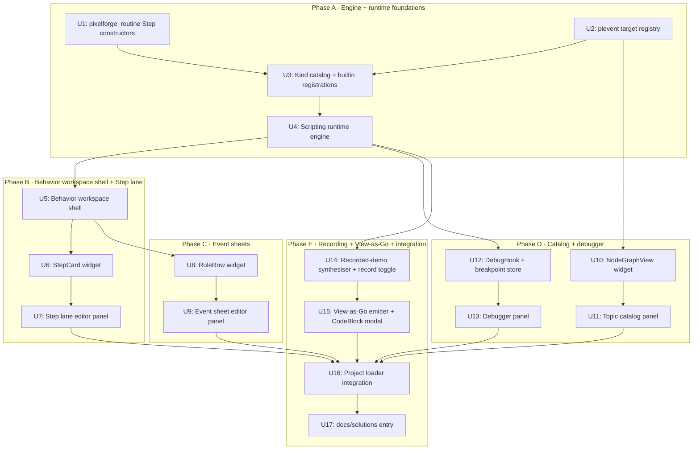

# feat: M5 Coroutine-Step Visual Scripting + Event Sheets

> **⚠ PARTIALLY SUPERSEDED — 2026-05-17.** The visual scripting
> **UX** described here — horizontal step lanes (not node graphs),
> two-column event sheets with indent-based grouping, recorded-demo
> capture, debugger overlay, View-as-Go panel — **remains
> authoritative**. The specific widget implementations
> (`StepCard`, `RuleRow`, `NodeGraphView` as `pixelforge_gui`
> widgets) are obsolete; rebuild on Dear ImGui primitives
> (`imgui.BeginChild` per lane, `imgui.BeginDragDropSource` for
> reorder, `imgui.BeginTable` for event sheets,
> `ImGuiColorTextEdit` for the View-as-Go pane). See
> **[`docs/plans/2026-05-17-001-refactor-pixelforge-studio-imgui-migration-plan.md`](2026-05-17-001-refactor-pixelforge-studio-imgui-migration-plan.md)**.

## Summary

M5 turns Pixelforge from "the project loads but does nothing" into "the project loads and runs the behaviour the user authored". The master plan reserved the schema (`BehaviorGraph`, `StepNode`, `EventSheetRule`, `Condition`, `Action`) at M1 and stopped — six milestones later, every field is still empty in every saved project. M5 fills them.

Six surfaces ship in one plan, in dependency order:

- **Step lane editor.** Horizontal timeline of draggable `Wait` / `Tween` / `Move` / `Play` / `Publish` / `Branch` / `Custom` cards. Compiles to `BehaviorGraph.Steps`; runtime evaluates as a `pixelforge_routine.Routine`.
- **Event sheet editor.** GDevelop-style two-column Conditions/Actions table with indented sub-events. Compiles to `BehaviorGraph.EventSheet`; runtime evaluates as a tree of `pievent.Subscribe` handlers, one per row.
- **Recorded-demo entry mode.** Toggle "record", drive the game, stop — the editor synthesises a Step sequence from M4's recorded input log (input-log replay v1, per the planning decision).
- **Event bus topic catalog.** Right-panel widget enumerating every `pievent.Target` instance in the running project, subscriber counts, publish rates, and a directed pub/sub graph that flashes when a target publishes.
- **Visual debugger.** Step the lane editor one card at a time, break on event predicates, scrub history via the M4 ring buffer.
- **View-as-Go.** On-demand read-only Go source emitter for any behaviour (no round-trip — copy to escape to code).

Four decisions anchor this plan:

- **All six surfaces in one plan.** Mirrors the M4/M3.1 plan shape. User-confirmed during planning.
- **Recorded-demo synthesis = input-log replay.** Captured `Frame.Inputs` → a `Wait(n)` + `Publish(target, value)` Step sequence. Smarter state-diff heuristics are deferred to a follow-up. User-confirmed.
- **View-as-Go is read-only emit only.** No constrained-Go parser; the generated source is for users escaping to code, not for round-trip authoring. User-confirmed.
- **`pievent` target registry is a non-generic `TargetInfo` sidecar.** Go generics block uniform iteration over `Target[T]` (each instance has a different `T`), but `SubscriberCount()` and `PublishCount()` are non-generic accessors. A small `pievent.RegisterTarget(name, target)` API at package init lets the topic catalog enumerate without leaking generics.

Seventeen implementation units (**U1-U17**) across five phases ship the milestone.

---

## Problem Frame

Three concrete gaps after M4:

1. **Authored projects don't run.** A `.pforge` file with sprites, scenes, and entities loads cleanly, but `Project.Behaviors` is empty in every existing project and the engine has no runtime that would execute the contents even if it weren't. The "no-code editor" pitch is half-built: users can author *content* but not *behaviour*.

2. **The capture spine has no consumer yet.** M4 ships a recorder, a timeline scrub, regression replay, GIF/MP4 export, and bug-repro zip — but the recorder's input + event logs were also designed to feed into M5's recorded-demo entry mode, and that consumer doesn't exist yet. The capture spine is one milestone of dormant infrastructure waiting for M5 to land.

3. **The behaviour workspace is still a placeholder.** M3 registered `placeholderWorkspace{name:"behavior"}` at `Ctrl+3` that just paints "Behavior — coming in M5". The slot is reserved but empty; promoting it is the same in-place `RegisterWorkspace` swap M4's capture workspace used.

The fix is a single coordinated push: build the runtime that *executes* behaviour graphs, then ship the five user-facing surfaces that *author* them, plus the visualisation/recording/code-emission surfaces that round out R3.

---

## Requirements

R-IDs are stable across plan edits. Carried forward from the master plan ([`docs/plans/2026-05-15-001-feat-pixelforge-no-code-editor-plan.md`](2026-05-15-001-feat-pixelforge-no-code-editor-plan.md#requirements)).

**Carried forward from origin:**

- **R3 (in full).** Behaviour authored through two complementary surfaces — Step lane editor (sequential) and Event sheet editor (reactive) — both compiling directly to existing engine primitives (`pixelforge_routine.Step` and `pievent.Subscribe`). No bespoke VM. Recorded-demo entry mode synthesises routines from input traces.

**New plan-local requirements (this plan's scope):**

- **R24.** A behaviour-runtime package walks a loaded `*pixelforge_project.Project`, instantiates one `pixelforge_routine.Routine` per non-empty `Steps` graph, and subscribes one handler tree per `EventSheet` graph. On scene change or project unload, every routine stops and every subscription unsubscribes cleanly.
- **R25.** The Step kind catalog ships with `Wait`, `Tween`, `Move`, `Play`, `Publish`, `Branch`, `Custom`. Each Kind has a registered builder that turns a `StepNode.Args` map into a runtime `pixelforge_routine.Step`. Unknown Kinds load without panic and surface as an error in the editor's status bar.
- **R26.** Event sheet Conditions ship with `event_fired`, `key_held`, `value_lt`, `value_gt`, `value_eq`. Actions ship with `play_sample`, `set_value`, `publish_event`, `move_entity`, `branch`. Unknown Kinds load without panic and surface in the status bar.
- **R27.** `pievent` exposes a non-generic `RegisterTarget(name string, target Inspectable)` and `EnumerateTargets() []TargetInfo` so the topic catalog can iterate over targets without generic-type knowledge. `Inspectable` is the subset `Target[T]` already satisfies: `SubscriberCount() int`, `PublishCount() uint64`. Existing engine targets (`pixelforge_loop`, `pixelforge_mouse`, `pixelforge_key`, `pixelforge_pad`, `pixelforge_debug`) register themselves during their package `init`.
- **R28.** Recorded-demo entry mode promotes the marked range of the M4 capture recorder into a `BehaviorGraph` whose `Steps` are a deterministic translation of the recorder's `Frame.Inputs` slice — one `Wait(ticks)` between distinct input ticks, one `Publish(target, value)` per logged input.
- **R29.** The visual debugger consumes M4's recorder ring buffer for time-travel: scrubbing the timeline rewinds both the screen AND the runtime's "next step to run" pointer for the active behaviour. Breakpoints are set per condition Kind+Args via a `Pause` predicate evaluated at event publish time.
- **R30.** A `BehaviorGraph.Emit()` helper renders the graph to a readable Go source string referencing `pixelforge_routine.New(...)` + `pievent.Subscribe(...)`. The emitter is one-way (no parser). The studio's View-as-Go modal copies the output to the clipboard.
- **R31.** The Behaviour workspace replaces the M3 stub in-place: same name (`"behavior"`), same `Ctrl+3` keybinding, same tab strip position. Inside the workspace, a Tabs widget switches between the four sub-views (Lane / Sheet / Catalog / Debug).

---

## Scope Boundaries

**In scope.**
- Engine: extend `pixelforge_routine` with `Tween`, `Move`, `Play`, `Publish`, `Branch` step constructors; add a non-generic `pievent` target registry (R27).
- New `pixelforge_studio/scripting/` package: runtime (compiler + lifecycle), Step / Condition / Action Kind catalogs, recorded-demo synthesiser, Go emitter, debugger control plane.
- New `pixelforge_studio/scripting/workspace.go` promoting the M3 behaviour stub.
- New `pixelforge_gui/widgets/` additions: `StepCard` (Draggable composite), `RuleRow` (two-column nested rule view), `NodeGraphView` (basic graph render for the topic catalog), `CodeBlock` (read-only syntax-coloured text inside a Modal).
- Project loader integration: instantiate the scripting runtime when the studio loads a project.
- `docs/solutions/` entry for the scripting runtime design.

**Not in scope (explicitly deferred).**
- **Bidirectional View-as-Go.** A constrained-Go parser that round-trips edits back into `BehaviorGraph` is the largest item we're cutting. The read-only emitter ships; round-trip becomes its own plan once users hand-author enough graphs to inform the parser's grammar.
- **State-diff recorded-demo synthesis.** Smart heuristics that compare entity state across frames and propose declarative rules are deferred. Input-log replay v1 ships; state-diff is M6+ territory.
- **Editor extension API (Picotron-style user-written editor tools).** Still pending its own plan post-M3.1/3.2 chrome stabilisation. Unchanged from the M4 plan's deferral.
- **Step grammar extensions** beyond the seven Kinds in R25. Custom user-written Kinds plug in via the existing `ExtensionHook` mechanism; new built-in Kinds (e.g., `Animate`, `Spawn`, `Destroy`) land in follow-up work.
- **Per-entity event handler isolation.** Today every behavior subscribes to a global target; the runtime does not enforce that "behaviour bound to entity X only sees events about entity X". Adding that is a behaviour-correctness improvement deferred to M5.1.
- **Persistent breakpoints.** Breakpoints live in-memory for the editor session; they don't survive across studio restarts. Persisting them to `editor.pforge` is a polish follow-up.
- **Engine internals.** No changes to `pixelforge_audio` (consumed read-only by `Play` step + `play_sample` action), `pixelforge_snap`, `pixelforge_rand`, `pixelforge_loop` event constants, `pixelforge_event` API surface beyond the new `RegisterTarget` / `EnumerateTargets` pair.

### Deferred to Follow-Up Work

- **Bidirectional View-as-Go parser.** Whole separate plan; requires a grammar definition and a constrained Go subset.
- **State-diff recorded-demo synthesis.** Captures `Frame` entity-state snapshots (which don't exist today), runs a diff heuristic, proposes rules.
- **Persistent breakpoints in `editor.pforge`.** Schema add + serialisation.
- **Per-entity event scoping.** Behaviour binds to entity → runtime auto-filters published events to only those matching the binding.
- **Custom Step / Condition / Action Kinds in projects.** A `Project.Extensions` registration mechanism so users can author their own Kinds in user-supplied Go and have the editor surface them.
- **Hot reload of `BehaviorGraph`.** The runtime currently tears down + rebuilds on project reload; editing a behaviour mid-game restart is a polish item.
- **Scene-runtime isolation.** Today the runtime treats the project's first scene as "the live one". Multi-scene runtime switching is deferred.

---

## Context & Research

### M4 surfaces this plan builds on

- `pixelforge_studio/capture/recorder.go` — `Recorder` with `Frame.Inputs []InputEntry`. Recorded-demo entry mode reads this directly.
- `pixelforge_studio/capture/workspace.go` — the in-place `RegisterWorkspace` swap pattern M5's behaviour workspace mirrors.
- `pixelforge_studio/capture/timeline.go` — `widgets.Timeline` already supports `SetFrames` / `OnScrub`. The debugger reuses it for time-travel.

### M3 surfaces this plan builds on

- `pixelforge_studio/editor/cart.go` — `editorCart`'s `DrawCanvas` dispatch picks up the new behaviour workspace via the same `CanvasWorkspace` interface.
- `pixelforge_gui/widgets/` — `Tabs`, `Dropdown`, `Modal`, `ModalStack`, `Scrollable`, `TextInput`, `Draggable`, `MenuBar`, `StatusBar`, `Panel`, `Button`. M5 composes these.
- `pixelforge_studio/editor/widgets/` — inspector field widgets (Slider, Checkbox, Numeric, Text, Vector2, Default) for editing `StepNode.Args` and `Condition.Args` values.

### M1 surfaces this plan builds on

- `pixelforge_project/behaviors.go` — `BehaviorGraph`, `StepNode`, `EventSheetRule`, `Condition`, `Action`. Already complete; no schema extension needed.
- `pixelforge_project/project.go` — `Project.Behaviors`, `Project.EventSubscriptions`, `Project.ExtensionHooks`. Already complete; runtime walks these.
- `pfcomponent/metadata.go` — `WidgetEventTopic` is already a reserved widget kind; M5 wires it through to event sheet condition inputs.

### Engine surfaces this plan consumes (read-only)

- `pixelforge_routine/piroutine.go` — `Step = func() bool`, `New(steps ...Step) *Routine`, `Wait`, `Call`, `Printf`, `SlowDown`, `Resume`, `ScheduleOn`. M5 adds `Tween`, `Move`, `Play`, `Publish`, `Branch` constructors.
- `pixelforge_event/pievent.go` — `Target[T]`, `Subscribe`, `SubscribeAll`, `SubscriberCount`, `PublishCount`, `TrackingTarget[T].UnsubscribeAll`. M5 adds `RegisterTarget` / `EnumerateTargets` / `Inspectable` (non-generic sidecar).
- `pixelforge_loop`, `pixelforge_mouse`, `pixelforge_key`, `pixelforge_pad`, `pixelforge_debug` — call `pievent.RegisterTarget` at package init.
- `pixelforge_audio.Play` — invoked by the `Play` step constructor and the `play_sample` action.

### Existing patterns to mirror

- **Workspace registration.** `pixelforge_studio/palette/workspace.go` and `pixelforge_studio/capture/workspace.go` both demonstrate the `RegisterWith(e *editor.Editor) *Workspace` shape with idempotent name-based replacement.
- **Kind catalog + registry.** `pfcomponent/registry.go` is the canonical "registered names with reflection-driven metadata" pattern. The new Step / Condition / Action catalogs mirror it.
- **Subscribe-and-track pattern.** `pixelforge_event/pievent.go` `TrackingTarget[T]` is exactly the lifecycle wrapper the runtime needs — one TrackingTarget per `BehaviorGraph`, `UnsubscribeAll` on teardown.
- **`go:embed` fixture loading.** `pixelforge_studio/editor/cart_loader.go` — the Behaviour workspace's example fixtures use the same template.
- **Modal stack precedence.** `pixelforge_gui/widgets/modal.go` `ModalStack` — the View-as-Go and breakpoint-config modals plug in here.

### Institutional learnings

- `docs/solutions/ring-buffer-snapshot-store.md` — the M4 recorder pattern; the debugger reuses it for time-travel.
- `docs/solutions/focus-manager-design.md` — Tab traversal + modal precedence for the workspace's nested input fields.
- `docs/solutions/editor-pforge-schema-shape.md` — additive evolution + `sanitize()` on load. Step/Condition/Action catalogs adopt the same "unknown Kinds load and surface a warning" rule.

### External references

- **GDevelop event sheet UX** — the conditions/actions two-column model with nested sub-events. Treat as a UX inspiration; we are not cloning the data model.
- **Construct 3 timeline-of-Steps UX** — the Step lane visual idiom. Same UX inspiration scope.

---

## Key Technical Decisions

1. **Runtime is a single `Engine` struct in `pixelforge_studio/scripting/runtime/`, started by the studio on `Project.Load` and stopped on project unload.** The engine owns one `*pixelforge_routine.Routine` per non-empty `BehaviorGraph.Steps` and one `pievent.TrackingTarget` per behaviour for all `EventSheet`-derived subscriptions. Rationale:
   - **One owner.** The runtime is the only thing that calls `pievent.Subscribe` and `Routine.ScheduleOn` on behalf of a project. Teardown is deterministic — kill the engine, every routine stops and every subscription unsubscribes.
   - **Project-level granularity.** The engine matches project lifecycle. Scene-level granularity is deferred (see Scope Boundaries).
   - **Trade-off.** A "hot-reload behaviour graph X" path requires re-instantiating its routine and re-subscribing its sheet; the engine exposes `Reload(graphName string)` for the editor to call after an edit.

2. **Step / Condition / Action Kinds are registered via package-level `Register(kind string, builder BuilderFunc)` calls.** Each builder takes `Args map[string]any` plus a runtime `Context` and returns a `Step` (for steps) or a `func(payload) bool` predicate (for conditions) or a `func(payload)` effect (for actions). Rationale:
   - **Mirrors `pfcomponent.Register`.** Same shape, same testability, same "discover-by-name" semantics.
   - **Extensibility hook.** Project-defined Kinds via `ExtensionHook` are a deferred follow-up but the registry shape already accommodates them — `Register(name, builder)` is the seam.
   - **Trade-off.** `Args map[string]any` JSON-loads numbers as `float64`. Builders convert with helpers (`argInt`, `argString`, `argFloat`) — explicit and a small extra surface.

3. **`pievent` gains a non-generic `Inspectable` interface and a `targetRegistry` sidecar.** Each engine package's `init()` calls `pievent.RegisterTarget("loop.main", piloop.Target())`. Targets implement `Inspectable` (which `Target[T]` already does via `SubscriberCount` and `PublishCount`). The topic catalog reads `pievent.EnumerateTargets()`. Rationale:
   - **Generics blocker.** Iterating `Target[T]` uniformly requires either type erasure or a non-generic interface. `Inspectable` is the smallest non-generic intersection.
   - **Zero impact on existing call sites.** `Target[T]` keeps its full generic API; `RegisterTarget` is purely additive.
   - **Trade-off.** Each engine package gets a 2-line `init()` addition. Acceptable; this is exactly the shape `pfcomponent` uses for component-type registration.

4. **Recorded-demo synthesis is a stateless function from `[]InputEntry` to `[]StepNode`.** Walks the recorder's input log, emits one `Wait(n)` whenever the `TickNumber` advances, and one `Publish(target, value)` per entry. No state diff, no entity-position inference, no heuristics. Rationale:
   - **Deterministic.** Same input log → same `[]StepNode` every time. Trivially testable.
   - **Builds on M4.** Consumes `Frame.Inputs` as-is; no extension to `Frame` needed.
   - **Trade-off.** Synthesised graphs are literal playback, not abstract intent. Documented as "input-log replay v1"; users iterate the synthesised graph manually if they want abstraction.

5. **The visual debugger uses a `DebugHook` callback the runtime fires before every `Step.Resume` and every `EventSheetRule` evaluation.** The editor sets a hook that consults a breakpoints map; when a breakpoint matches, the hook blocks the runtime and surfaces the paused state in the debugger panel. Step-execute resumes one tick then re-blocks. Rationale:
   - **Single seam.** One callback covers both step-by-step lane execution and event-predicate breakpoints.
   - **Composable with M4 time-travel.** Breakpoint-induced pause is independent of the recorder's scrub state; both can fire on the same frame.
   - **Trade-off.** The hook adds one function-pointer indirection per Step / per rule evaluation. Negligible compared to the work the step itself does.

6. **View-as-Go is a `text/template`-driven emitter, not a custom code generator.** The template renders a Go function per `BehaviorGraph`, with one `pixelforge_routine.X` constructor per Step and one `pievent.X.Subscribe(...)` block per `EventSheetRule`. Rationale:
   - **Templates handle 90% of the syntax surface.** Indentation, comma placement, and import lists are easy template lookups; what we lose in flexibility we gain in 100 lines of code instead of 1000.
   - **Read-only is explicit.** No round-trip means we never have to parse the output back; the template can take any liberties for clarity.
   - **Trade-off.** Generated code isn't always idiomatic Go (template emitters rarely are). The "escape to code" UX is "copy this, then edit it in your IDE" — not "this is what a senior Go engineer would have written".

7. **The topic catalog's "who publishes to whom" graph is a static + live layer composition.** Static edges come from grep at editor startup (scanning for `Target.Publish` calls in user-supplied Go is deferred; v1 ships static edges from a hand-authored map of engine-known publishers). Live edges flash when `Inspectable.PublishCount()` increments — a once-per-second poll suffices for visual feedback. Rationale:
   - **No code-scanning in v1.** Static edge map is small and accurate for engine-known publishers (`piloop` publishes `EventUpdate`, `pimouse` publishes `EventButton`, etc.).
   - **Polling, not subscribing.** Subscribing the catalog to every target would multiply event volume by N; a 1-Hz `PublishCount` delta is cheaper and sufficient for visualisation.

8. **The Step lane editor renders Steps left-to-right inside a `Scrollable`; the event sheet renders rules top-to-bottom inside a `Scrollable`.** Rationale:
   - **Mirror established editor idioms.** The capture timeline already proves horizontal-strip scrolling on canvas; the inspector already proves vertical scrollable rule lists.
   - **Reuse `Scrollable`.** No new scrollable container needed; the M3 widget does the job.

---

## Output Structure

```
pixelforge_routine/
  steps_tween.go                                # NEW (U1) — Tween constructor
  steps_move.go                                 # NEW (U1) — Move constructor
  steps_play.go                                 # NEW (U1) — Play constructor
  steps_publish.go                              # NEW (U1) — Publish constructor
  steps_branch.go                               # NEW (U1) — Branch constructor
  steps_test.go                                 # MODIFY (U1) — extend coverage

pixelforge_event/
  registry.go                                   # NEW (U2) — Inspectable + RegisterTarget + EnumerateTargets
  registry_test.go                              # NEW

pixelforge_loop/
  piloop.go                                     # MODIFY (U2) — init() calls RegisterTarget

pixelforge_mouse/
  pimouse.go                                    # MODIFY (U2) — init() calls RegisterTarget

pixelforge_key/
  pikey.go                                      # MODIFY (U2) — init() calls RegisterTarget

pixelforge_pad/
  event.go                                      # MODIFY (U2) — init() calls RegisterTarget

pixelforge_debug/
  event.go                                      # MODIFY (U2) — init() calls RegisterTarget

pixelforge_studio/scripting/                    # NEW PACKAGE (U3-U17)
  catalog/
    catalog.go                                  # NEW (U3) — Register / Lookup / All for Step, Condition, Action Kinds
    catalog_test.go                             # NEW
    builtin_steps.go                            # NEW (U3) — register Wait/Tween/Move/Play/Publish/Branch/Custom
    builtin_conditions.go                       # NEW (U3) — register event_fired/key_held/value_lt/_gt/_eq
    builtin_actions.go                          # NEW (U3) — register play_sample/set_value/publish_event/move_entity/branch
  runtime/
    engine.go                                   # NEW (U4) — Engine struct, Start/Stop/Reload
    engine_test.go                              # NEW
    compile.go                                  # NEW (U4) — BehaviorGraph → Routine + handler tree
    context.go                                  # NEW (U4) — runtime Context passed to builders
    debug_hook.go                               # NEW (U12) — DebugHook callback shape + breakpoint store
    debug_hook_test.go                          # NEW
  workspace.go                                  # NEW (U5) — BehaviourWorkspace; replaces M3 stub
  workspace_test.go                             # NEW
  lane_editor.go                                # NEW (U6, U7) — Step lane panel state + drag/drop
  lane_editor_test.go                           # NEW
  event_sheet.go                                # NEW (U8, U9) — rule list + nested rule rows
  event_sheet_test.go                           # NEW
  topic_catalog.go                              # NEW (U10, U11) — target enumeration + graph render + publish-rate poll
  topic_catalog_test.go                         # NEW
  debugger.go                                   # NEW (U12, U13) — breakpoint UI + step-execute + time-travel
  debugger_test.go                              # NEW
  recorded_demo.go                              # NEW (U14) — InputLog → BehaviorGraph synthesiser + record toggle
  recorded_demo_test.go                         # NEW
  view_as_go.go                                 # NEW (U15) — BehaviorGraph → Go source emitter + ViewAsGo modal
  view_as_go_test.go                            # NEW
  view_as_go.tmpl                               # NEW (U15) — embedded text/template

pixelforge_gui/widgets/
  step_card.go                                  # NEW (U6) — Draggable composite for one StepNode
  step_card_test.go                             # NEW
  rule_row.go                                   # NEW (U8) — two-column condition/action row with indent
  rule_row_test.go                              # NEW
  node_graph.go                                 # NEW (U10) — minimal pub/sub graph view
  node_graph_test.go                            # NEW
  code_block.go                                 # NEW (U15) — read-only syntax-coloured text inside Modal
  code_block_test.go                            # NEW

pixelforge_studio/
  main.go                                       # MODIFY (U16) — scripting.RegisterWith(e); engine.Start on project load
  editor/
    keymap.go                                   # MODIFY (U5) — behavior.* actions
    file_menu.go                                # MODIFY (U5) — "View → Behavior" submenu wiring

docs/solutions/
  scripting-runtime-design.md                   # NEW (U17) — the runtime lifecycle + Kind registry pattern
  README.md                                     # MODIFY (U17) — add the new entry to the index
```

The per-unit `**Files:**` sections remain authoritative; implementers may adjust file boundaries within a package if implementation reveals a better layout.

---

## Implementation Roadmap

Seventeen implementation units (U1-U17), grouped into five phases.



*This illustrates dependency relationships and is directional guidance for review, not implementation specification.*

---

## Phase A — Engine + Runtime Foundations

### U1. Extend `pixelforge_routine` with M5 Step constructors

**Goal.** Ship the five new Step constructors the lane editor's built-in Kinds need: `Tween`, `Move`, `Play`, `Publish`, `Branch`. The existing `Wait`, `Call`, `Printf`, `SlowDown` cover the rest.

**Requirements.** R3 (substrate), R25.

**Dependencies.** None (foundation).

**Files.**
- Create: `pixelforge_routine/steps_tween.go` — `Tween(target *float64, from, to float64, ticks int, ease string) Step`.
- Create: `pixelforge_routine/steps_move.go` — `Move(pos *pixelforge.Position, dx, dy int, ticks int) Step`.
- Create: `pixelforge_routine/steps_play.go` — `Play(sample *pixelforge_audio.Sample, volume float32, pan float32) Step`.
- Create: `pixelforge_routine/steps_publish.go` — `Publish(target pievent.Target[string], event string) Step` (generic Publish ships as the string-target variant; typed publish via the Custom step).
- Create: `pixelforge_routine/steps_branch.go` — `Branch(predicate func() bool, ifTrue, ifFalse []Step) Step` (compiles into a small embedded routine that dispatches once).
- Modify: `pixelforge_routine/steps_test.go` (or new `*_test.go` per step).

**Approach.**
- Each constructor returns a `Step = func() bool` closure. `false` means "consume one tick, call me again"; `true` means "I'm done".
- `Tween` interpolates over `ticks` frames using the named easing (linear / ease-in / ease-out / ease-in-out — small table in the file).
- `Move` is a sugar layer on top of `Tween` operating on a `pixelforge.Position`'s `X` and `Y` together.
- `Play` calls `pixelforge_audio.Play` once and returns `true` on the next tick (samples are fire-and-forget — duration tracking is out of scope).
- `Publish` calls `target.Publish(event)` once and returns `true` immediately.
- `Branch` evaluates the predicate once on first call, then delegates its remaining lifetime to a freshly-constructed internal routine built from the chosen `[]Step`. Returns `true` when the internal routine completes.

**Patterns to follow.**
- `pixelforge_routine/piroutine.go:55` (`Wait`) for the canonical "tick counter inside a closure" shape.
- `pixelforge_routine/piroutine.go:64` (`SlowDown`) for the wrap-an-inner-step pattern Branch reuses.

**Test scenarios.**
- **Happy path.** `Tween` over 30 ticks moves the target from `from` to `to` with the value matching `from + (to-from) * progress` at every queried tick.
- **Happy path.** `Move` advances a `Position`'s `X` and `Y` by the requested delta over `ticks` ticks; final value matches `start + delta`.
- **Happy path.** `Publish` fires the named event exactly once on its first tick.
- **Happy path.** `Branch` with a true predicate runs only the `ifTrue` substeps; with a false predicate runs only `ifFalse`.
- **Edge case.** `Tween` with `ticks == 0` jumps to `to` immediately and returns `true`.
- **Edge case.** `Tween` with `from == to` is a no-op that returns `true` on the first tick.
- **Edge case.** `Move` with `dx == dy == 0` returns `true` on the first tick without mutating the position.
- **Edge case.** `Branch` with both empty substep slices returns `true` on the first tick.
- **Edge case.** Unknown easing name in `Tween` falls back to linear with a one-time `log.Printf` warning.
- **Integration.** A 5-step routine — `Wait(10)`, `Tween(...)`, `Publish(loopTarget, "checkpoint")`, `Move(...)`, `Branch(predicateTrue, [Wait(5)], nil)` — resumed every tick completes in the expected number of ticks.

**Verification.**
- `go test ./pixelforge_routine/...` passes.

---

### U2. `pievent` target registry

**Goal.** Add a non-generic `Inspectable` interface and a `targetRegistry` sidecar to `pixelforge_event` so the topic catalog can enumerate every known `pievent.Target` without leaking generics. Existing engine packages register their targets at `init()`.

**Requirements.** R3 (substrate), R27.

**Dependencies.** None (foundation).

**Files.**
- Create: `pixelforge_event/registry.go` — `Inspectable` interface (subset `Target[T]` already satisfies); `TargetInfo{Name string, Subscribers int, Publishes uint64}`; `RegisterTarget(name string, t Inspectable)`; `EnumerateTargets() []TargetInfo`; `LookupTarget(name string) Inspectable`.
- Create: `pixelforge_event/registry_test.go`.
- Modify: `pixelforge_loop/piloop.go` — `init()` adds `pixelforge_event.RegisterTarget("loop.main", target); RegisterTarget("loop.debug", debugTarget)`.
- Modify: `pixelforge_mouse/pimouse.go` — `init()` registers `mouse.button`, `mouse.move`, `mouse.button.debug`, `mouse.move.debug`.
- Modify: `pixelforge_key/pikey.go` — `init()` registers `key.main`, `key.debug`.
- Modify: `pixelforge_pad/event.go` — `init()` registers `pad.button`, `pad.connection`.
- Modify: `pixelforge_debug/event.go` — `init()` registers `debug.main`.

**Approach.**
- `Inspectable` is the smallest non-generic intersection of `Target[T]` capabilities — `SubscriberCount() int` and `PublishCount() uint64`. `Target[T]` already implements both, so registration is just a type assertion.
- `targetRegistry` is a `map[string]Inspectable` under a `sync.RWMutex`. Read-heavy at runtime; writes happen once per engine package at `init()`.
- `EnumerateTargets()` returns names in alphabetical order so the topic catalog displays a stable list.
- Duplicate registration with the same name logs a `log.Printf` warning but is not fatal — engines under test sometimes import packages twice.

**Patterns to follow.**
- `pfcomponent/registry.go:30` (`Register`) — same shape: package init calls one function per registered name.
- `pixelforge_event/pievent.go:46` (`NewTarget`) — the existing API surface registry sits next to without modifying.

**Test scenarios.**
- **Happy path.** After registering three targets via `RegisterTarget`, `EnumerateTargets` returns all three in alphabetical order.
- **Happy path.** `LookupTarget("known.name")` returns the registered `Inspectable`; subscriber and publish counts match the underlying target.
- **Edge case.** Registering the same name twice logs a warning but does not panic; the second registration overwrites the first.
- **Edge case.** `LookupTarget("missing")` returns `nil`.
- **Edge case.** `EnumerateTargets()` on an empty registry returns an empty slice (not nil).
- **Integration.** With the studio's engine packages imported, `EnumerateTargets()` returns at least the nine engine targets the M5 plan enumerates in Context & Research.

**Verification.**
- `go test ./pixelforge_event/... ./pixelforge_loop/... ./pixelforge_mouse/... ./pixelforge_key/... ./pixelforge_pad/... ./pixelforge_debug/...` passes.

---

### U3. Step / Condition / Action Kind catalog + builtin registrations

**Goal.** Stand up `pixelforge_studio/scripting/catalog/`: a registry of Kind builders for Steps, Conditions, and Actions, with the seven builtin Step Kinds (R25), five builtin Condition Kinds, and five builtin Action Kinds (R26) registered at package init.

**Requirements.** R25, R26.

**Dependencies.** U1 (Step constructors), U2 (target registry — needed by `publish_event` action).

**Files.**
- Create: `pixelforge_studio/scripting/catalog/catalog.go` — `RegisterStep(name string, builder StepBuilder)`, `RegisterCondition`, `RegisterAction`, `LookupStep`, `LookupCondition`, `LookupAction`, `AllSteps()`, `AllConditions()`, `AllActions()`.
- Create: `pixelforge_studio/scripting/catalog/catalog_test.go`.
- Create: `pixelforge_studio/scripting/catalog/builtin_steps.go` — register Wait/Tween/Move/Play/Publish/Branch/Custom builders.
- Create: `pixelforge_studio/scripting/catalog/builtin_conditions.go` — register event_fired/key_held/value_lt/value_gt/value_eq.
- Create: `pixelforge_studio/scripting/catalog/builtin_actions.go` — register play_sample/set_value/publish_event/move_entity/branch.

**Approach.**
- `StepBuilder = func(args map[string]any, ctx *Context) (pixelforge_routine.Step, error)`. Errors at build time surface as a runtime warning + a no-op step.
- `ConditionBuilder = func(args map[string]any, ctx *Context) (Predicate, error)` where `Predicate = func(payload any) bool`.
- `ActionBuilder = func(args map[string]any, ctx *Context) (Effect, error)` where `Effect = func(payload any)`.
- Args helpers (`argInt`, `argString`, `argFloat`, `argBool`) live in `catalog.go` and convert `map[string]any` values (which JSON-unmarshal to `float64` / `string` / `bool`) with a clear error message on type mismatch.
- Builtins for Steps map 1:1 onto U1's constructors (Wait → `pixelforge_routine.Wait`, etc.). `Custom` resolves an `ExtensionHook` by name and calls it.
- Builtins for Conditions: `event_fired` matches when the published event name equals `args["event"]`; `key_held` returns true while `pixelforge_key.Duration(args["key"])` > 0; `value_lt`/`gt`/`eq` compare two arg values.
- Builtins for Actions: `play_sample` resolves the sample by name in `ctx.Project()` and calls `pixelforge_audio.Play`; `set_value` writes to a component field via `pfcomponent.Unmarshal` round-trip; `publish_event` looks up the target via `pievent.LookupTarget`; `move_entity` finds the entity in the active scene and shifts its `Position`; `branch` recurses into a sub-rule tree.

**Patterns to follow.**
- `pfcomponent/registry.go:30` (`Register`) for the package-init registration shape.
- `pfcomponent/registry.go:106` (`Marshal`) for the args-encoding round-trip.

**Test scenarios.**
- **Happy path.** `RegisterStep("custom_kind", builder)` then `LookupStep("custom_kind")` returns the builder.
- **Happy path.** Builtin `Wait` builder with `args = {"ticks": 30}` returns a working Step.
- **Happy path.** `event_fired` predicate with `args = {"event": "PlayerHit"}` returns true only when the published event matches.
- **Happy path.** `play_sample` action with `args = {"name": "eat"}` calls `pixelforge_audio.Play` with the resolved sample.
- **Edge case.** `LookupStep("missing")` returns nil; the runtime substitutes a no-op step that logs once.
- **Edge case.** Builder with malformed `args` (string where int expected) returns a descriptive error; the runtime substitutes a no-op step.
- **Edge case.** Duplicate `RegisterStep` with the same name logs a warning; second registration overwrites.
- **Edge case.** `argInt` accepts `float64(30)` (JSON-unmarshalled int) and `int(30)`; rejects strings.
- **Integration.** A `BehaviorGraph` with one `Wait(30)` Step compiles to a routine that completes in exactly 30 ticks.

**Verification.**
- `go test ./pixelforge_studio/scripting/catalog/...` passes.

---

### U4. Scripting runtime `Engine`

**Goal.** Build `pixelforge_studio/scripting/runtime/`: the `Engine` struct that walks a loaded `*pixelforge_project.Project`, compiles every non-empty `BehaviorGraph` into routines + handler trees, schedules routines on `piloop.EventUpdate`, and tears everything down on `Engine.Stop()` or `Reload(graphName)`.

**Requirements.** R3, R24.

**Dependencies.** U1, U2, U3.

**Files.**
- Create: `pixelforge_studio/scripting/runtime/engine.go` — `Engine{project *Project, instances []*instance, ...}`, `New(p *Project) *Engine`, `Start()`, `Stop()`, `Reload(graphName string)`, `Project() *Project`.
- Create: `pixelforge_studio/scripting/runtime/engine_test.go`.
- Create: `pixelforge_studio/scripting/runtime/compile.go` — `compileGraph(graph BehaviorGraph, ctx *Context) (*instance, error)`.
- Create: `pixelforge_studio/scripting/runtime/context.go` — `Context{project *Project, scene *Scene, entityByID func(id string) *Entity, ...}` — the shared runtime context passed to every builder.

**Approach.**
- `Engine.Start()` walks `project.Behaviors`; for each graph, calls `compileGraph` which:
  - Iterates `graph.Steps`, looks up each `StepNode.Kind` in the catalog, calls the builder, collects `[]pixelforge_routine.Step`, calls `pixelforge_routine.New(steps...)`, and `ScheduleOn(piloop.EventUpdate)`.
  - Iterates `graph.EventSheet`, recursively walks each `EventSheetRule.Children`, looks up each condition and action Kind, composes the resulting predicates/effects into one subscribed handler: when all conditions in a row pass, every action fires in order.
- `Engine.Stop()` walks every recorded `*instance`: calls `Routine.Stop()`, `TrackingTarget.UnsubscribeAll()`. Idempotent.
- `Engine.Reload(graphName)` stops and re-instantiates a single graph — used by the editor when a behaviour is edited mid-run.
- `Context` exposes `Project()`, `Scene()`, `EntityByID(id)` — enough for builders to resolve named assets and entities without taking a hard dependency on `*Project` directly.
- Errors during compile (unknown Kind, malformed args) are logged with `log.Printf` and the offending node is replaced with a no-op. The runtime never panics on bad data.

**Patterns to follow.**
- `pixelforge_routine/piroutine.go:187` (`ScheduleOn`) — the engine reuses this for routine scheduling.
- `pixelforge_event/pievent.go:53,196` (`Track`, `TrackingTarget`) — one per behaviour, so `UnsubscribeAll` cleanly tears down on `Stop`.
- `pixelforge_studio/capture/recorder.go:95` (`Start`) — same lifecycle shape: subscribe in `Start`, unsubscribe in `Stop`.

**Test scenarios.**
- **Happy path.** A project with one `BehaviorGraph{Steps: [Wait(30), Publish(loopTarget, "tick")]}` compiles, `Engine.Start()` schedules the routine, after 30 simulated ticks the loop target receives one "tick" event.
- **Happy path.** A project with one `EventSheetRule{Conditions: [event_fired(loop.main, "EventUpdate")], Actions: [publish_event(loop.main, "echoed")]}` subscribes a handler; publishing EventUpdate produces an "echoed" publish.
- **Happy path.** Nested `EventSheetRule.Children` fire only when their parent's conditions pass.
- **Happy path.** `Engine.Stop()` then re-publishing the source event produces no handler invocation.
- **Happy path.** `Engine.Reload("graphA")` rebuilds only the named graph; other behaviours stay running.
- **Edge case.** A graph with an empty `Steps` slice produces no routine.
- **Edge case.** A graph with an unknown Step Kind logs a warning, compiles a no-op step in its place, and continues; the rest of the routine runs.
- **Edge case.** A graph with a malformed `EventSheetRule.Conditions[].Args` logs a warning and skips just that rule.
- **Edge case.** `Engine.Stop` called twice is a no-op the second time.
- **Edge case.** Subscribing to a target that doesn't exist (`LookupTarget` returns nil) logs a warning and skips the rule.
- **Integration.** Running the engine on a project with three behaviours, then `Stop()`, leaves every registered target with the same `SubscriberCount()` as before `Start()`.
- **Integration.** A behaviour's `Steps` modify a component value via `set_value` action; after one tick, the project entity's serialised JSON reflects the change.

**Verification.**
- `go test ./pixelforge_studio/scripting/runtime/...` passes.
- Manual: load a project with a hand-edited `BehaviorGraph` containing one `Publish(loop.debug, "tick")` step that fires every tick. The debug target's `PublishCount()` increases on each frame.

---

## Phase B — Behavior Workspace Shell + Step Lane Editor

### U5. Behaviour workspace shell (promote M3 stub in place)

**Goal.** Replace `pixelforge_studio/editor/workspaces_stubs.go`'s `placeholderWorkspace{name:"behavior"}` with a real `BehaviourWorkspace` implementing `editor.CanvasWorkspace`. The workspace owns a `widgets.Tabs` switching between four sub-panes (Lane / Sheet / Catalog / Debug); concrete pane content ships in subsequent units.

**Requirements.** R31, R24 (workspace boots the engine for the loaded project).

**Dependencies.** U4 (engine is what the workspace's "Run" / "Stop" buttons drive).

**Files.**
- Create: `pixelforge_studio/scripting/workspace.go` — `BehaviourWorkspace`, `RegisterWith(e *editor.Editor)`, `New() *BehaviourWorkspace`.
- Create: `pixelforge_studio/scripting/workspace_test.go`.
- Modify: `pixelforge_studio/editor/workspaces.go` — `installDefaultWorkspaces` drops the behaviour stub; the scripting package's `RegisterWith` replaces by name.
- Modify: `pixelforge_studio/main.go` — call `scripting.RegisterWith(e)` alongside `palette.RegisterWith`, `capture.RegisterWith`.
- Modify: `pixelforge_studio/editor/keymap.go` — register the `behavior.*` action namespace.

**Approach.**
- `BehaviourWorkspace` implements `Name()` → `"behavior"`, `DisplayName()` → `"Behavior"`, `Draw` (native overlay placeholder text), `DrawCanvas(rel, e)` (canvas-resident chrome), `Update(e)`.
- `DrawCanvas` paints: panel header strip ("BEHAVIOR"), the active graph name + entity binding indicator, a `Tabs` widget (4 tabs: "Lane" / "Sheet" / "Catalog" / "Debug"), a footer with engine-status indicator (running / stopped / error) and "Run" / "Stop" buttons.
- `Update` dispatches input first to the active sub-pane, then to the Tabs widget for tab clicks.
- The workspace holds a pointer to the runtime `*Engine` — `RegisterWith` constructs one via `runtime.New(e.Project())` and starts it.
- Keymap registrations: `behavior.tab_lane` (Alt+1 within behaviour), `behavior.tab_sheet` (Alt+2), `behavior.tab_catalog` (Alt+3), `behavior.tab_debug` (Alt+4), `behavior.run` (F5), `behavior.stop` (F6), `behavior.view_as_go` (Ctrl+Shift+V).

**Patterns to follow.**
- `pixelforge_studio/capture/workspace.go` for the in-place stub promotion + RegisterWith shape.
- `pixelforge_studio/palette/workspace.go` for the workspace-with-multiple-sub-panes layout.

**Test scenarios.**
- **Happy path.** Registering the workspace replaces the M3 stub at slot "behavior"; `e.Workspaces()` length unchanged.
- **Happy path.** `Ctrl+3` switches to the workspace; `ActiveWorkspaceName() == "behavior"`.
- **Happy path.** The Tabs widget renders 4 tabs and switching via `Alt+1..4` updates the active sub-pane.
- **Edge case.** Workspace renders without a project loaded — "(no project)" placeholder visible; engine is not started.
- **Edge case.** Switching tabs preserves per-pane state (e.g., scroll position in Lane editor).
- **Integration.** Loading a project then switching to the behaviour workspace boots the runtime engine; `engine.Running()` returns true.

**Verification.**
- `go test ./pixelforge_studio/scripting/...` passes (workspace tests).
- Manual: launch studio, press `Ctrl+3`, see the four tabs.

---

### U6. `StepCard` widget

**Goal.** Build a reusable `pixelforge_gui/widgets/StepCard`: a draggable rectangular tile that visually represents one `StepNode`. The lane editor renders an ordered list of StepCards inside a horizontal `Scrollable`.

**Requirements.** R3.

**Dependencies.** U5 (workspace shell). The widget itself depends only on `pgui` primitives.

**Files.**
- Create: `pixelforge_gui/widgets/step_card.go` — `StepCard{Kind, Label, IsActive, Selected, OnSelect, OnDragMove}` + Draw/Update.
- Create: `pixelforge_gui/widgets/step_card_test.go`.

**Approach.**
- Each card is ~64 px wide × 56 px tall. Header row shows the Kind label in cofont; body shows an abbreviated args summary ("Tween x: 0→100"); footer thin line is the "active step" indicator drawn when `IsActive` is true (used by the debugger).
- The card composes a `Draggable` (M4 U48) — `OnDragMove(dx, dy)` exposes the cumulative drag offset so the host (the Lane editor) can implement reorder logic without the card knowing about its peers.
- Click without drag (`Draggable.CumulativeDX() == 0` at release) fires `OnSelect`.
- Active vs inactive vs selected each get a distinct background colour from the theme (Accent / Background / Panel).

**Patterns to follow.**
- `pixelforge_gui/widgets/draggable.go` (U48) for the mixin.
- `pixelforge_gui/widgets/button.go` for the simple click-handler pattern.

**Test scenarios.**
- **Happy path.** Drawing a StepCard with Kind="Wait", Label="30 ticks" produces a 64×56 card with both strings visible.
- **Happy path.** Pressing inside the card, then dragging, calls `OnDragMove(dx, dy)` with deltas matching the pointer movement.
- **Happy path.** Pressing and releasing without movement fires `OnSelect`.
- **Edge case.** A card with `IsActive=true` and `Selected=true` renders the selected highlight on top of the active stripe.
- **Edge case.** Drag release with zero cumulative movement does not fire `OnSelect` if movement happened mid-drag and was then reversed (treat as a drag, not a click).
- **Edge case.** Press outside the card is ignored.
- **Integration.** Two StepCards laid horizontally — dragging one over the other reports the correct drag deltas to the host.

**Verification.**
- `go test ./pixelforge_gui/widgets/...` passes.

---

### U7. Step lane editor panel

**Goal.** Build the Step lane editor pane inside the behaviour workspace: a horizontally-scrolling `Scrollable` containing one `StepCard` per `BehaviorGraph.Steps` element. Dragging a card reorders the list; clicking a card opens its args in the inspector strip below. A "+" button at the right opens a `Dropdown` of registered Step Kinds.

**Requirements.** R3, R25.

**Dependencies.** U3 (catalog), U4 (engine — for Reload after edits), U5 (workspace shell), U6 (StepCard).

**Files.**
- Create: `pixelforge_studio/scripting/lane_editor.go` — `LaneEditor` state (active graph name, selected step index, scroll offset, kind picker dropdown state).
- Create: `pixelforge_studio/scripting/lane_editor_test.go`.

**Approach.**
- The lane editor holds `*BehaviorGraph` (a pointer into the project) plus widget state. Its `DrawCanvas(rel, e)` paints the scrollable strip of StepCards followed by a "+" tile.
- Reorder logic on drag: track the dragged card's index; when its centre crosses another card's centre, swap them in `graph.Steps`.
- Args editor: when a card is selected, the area below the strip renders one inspector field per arg in the StepNode's `Args` map. Field type comes from a per-Kind args schema registered alongside the builder (Wait has `{ticks: int}`; Tween has `{target: ref, from: float, to: float, ticks: int, ease: enum}`).
- "+" button opens a `Dropdown` populated by `catalog.AllSteps()`; clicking a name appends a new StepNode with default args.
- After any edit, the workspace calls `engine.Reload(graphName)`.

**Patterns to follow.**
- `pixelforge_gui/widgets/scrollable.go` for horizontal scrolling.
- `pixelforge_gui/widgets/dropdown.go` for the kind picker.
- `pixelforge_studio/editor/inspector.go` for the args editor's field-dispatch pattern (reuse existing inspector field widgets).

**Test scenarios.**
- **Happy path.** Drawing a lane with three Steps produces three StepCards in left-to-right order.
- **Happy path.** Dragging card 0 over card 1 swaps them in `graph.Steps`; `engine.Reload(graphName)` is called once.
- **Happy path.** Clicking a card sets `lane.selectedStep` to its index; the inspector strip renders the card's args.
- **Happy path.** Clicking "+" opens a dropdown of every registered Step Kind; selecting one appends a default-args node.
- **Edge case.** Dragging a card off the rightmost edge clamps the swap target to the last card.
- **Edge case.** An empty `Steps` slice shows only the "+" tile; clicking it works.
- **Edge case.** Editing an arg via the inspector marks the project dirty; `engine.Reload` is called.
- **Edge case.** Selecting a Step then deleting it via the keyboard (Delete key) removes it and clears selection.
- **Integration.** Add a `Wait(30)` then a `Publish(loop.main, "tick")` via the UI, save the project, reload — both steps survive round-trip.

**Verification.**
- `go test ./pixelforge_studio/scripting/...` passes (lane_editor tests).
- Manual: open the behaviour workspace, add a `Wait` step, run the engine, observe the routine waiting for 30 ticks before completing.

---

## Phase C — Event Sheets

### U8. `RuleRow` widget

**Goal.** Build a reusable `pixelforge_gui/widgets/RuleRow`: a two-column row showing a list of Conditions on the left and a list of Actions on the right, with an indent level for nested rules (`Children`). Used by the event sheet editor to render one `EventSheetRule`.

**Requirements.** R3.

**Dependencies.** U5 (workspace shell).

**Files.**
- Create: `pixelforge_gui/widgets/rule_row.go` — `RuleRow{Indent int, Conditions []string, Actions []string, OnSelect func(col int, idx int)}` + Draw/Update.
- Create: `pixelforge_gui/widgets/rule_row_test.go`.

**Approach.**
- Each row is full-width; indent adds 16 px of left padding per level.
- The left column (Conditions) and right column (Actions) split the remaining width 50/50.
- Each condition / action renders as a small line of text via cofont, with a hover highlight.
- `OnSelect(col, idx)` fires when the user clicks a condition (`col=0`) or action (`col=1`).
- A small "+" affordance at the end of each column opens a Kind dropdown for adding conditions / actions.

**Patterns to follow.**
- `pixelforge_gui/widgets/button.go` for the click-to-select shape.
- `pixelforge_gui/widgets/dropdown.go` for the add-Kind dropdown.

**Test scenarios.**
- **Happy path.** A row with 2 Conditions and 1 Action renders 2 left-column lines + 1 right-column line.
- **Happy path.** Indent of 2 shifts the row 32 px to the right.
- **Happy path.** Clicking a condition fires `OnSelect(0, idx)` with the right index.
- **Edge case.** A row with zero conditions and zero actions still renders (showing only the "+" tiles).
- **Edge case.** Long condition labels truncate with an ellipsis to fit the column width.
- **Edge case.** Click outside both columns is a no-op.

**Verification.**
- `go test ./pixelforge_gui/widgets/...` passes.

---

### U9. Event sheet editor panel

**Goal.** Build the event sheet editor pane: a vertically-scrolling `Scrollable` containing one `RuleRow` per top-level `EventSheetRule`, recursively rendering `Children` with increasing indent. The inspector strip below an actively-selected condition or action edits its `Args`.

**Requirements.** R3, R26.

**Dependencies.** U3 (catalog), U4 (engine — for Reload), U5 (workspace shell), U8 (RuleRow).

**Files.**
- Create: `pixelforge_studio/scripting/event_sheet.go` — `EventSheetEditor` state (active graph, selected rule path, selected col/idx, scroll offset, kind picker dropdown).
- Create: `pixelforge_studio/scripting/event_sheet_test.go`.

**Approach.**
- The editor holds `*BehaviorGraph`. Its `DrawCanvas` paints rows depth-first: for each top-level rule, render a `RuleRow` then recurse with indent+1 for each child.
- A "+" tile at the bottom adds a new top-level rule.
- A right-click on a rule offers "Add child rule" (creates a nested empty rule).
- Selecting a condition or action exposes its `Args` in the inspector strip; the strip uses the same per-Kind schema as the Step lane editor (U7).
- After any edit, the workspace calls `engine.Reload(graphName)`.

**Patterns to follow.**
- `pixelforge_gui/widgets/scrollable.go` for vertical scrolling.
- `pixelforge_studio/editor/inspector.go` for the args editor.

**Test scenarios.**
- **Happy path.** A sheet with one rule containing one condition and one action renders one `RuleRow` with one item in each column.
- **Happy path.** A rule with one nested child renders the child indented by one level on the next row.
- **Happy path.** Clicking a condition selects it; the inspector strip shows its args.
- **Happy path.** Adding a top-level rule via "+" appends to `graph.EventSheet`.
- **Edge case.** Two-level-deep child nesting renders at indent 2.
- **Edge case.** Removing a rule's last child does not also remove the parent.
- **Edge case.** Editing an arg marks the project dirty and triggers `engine.Reload`.
- **Edge case.** A rule with zero conditions but non-zero actions evaluates as "always fire" — documented as expected behaviour in the rule editor's status text.
- **Integration.** Author a rule "When key Space held, Publish event Jump"; save; reload; rule survives round-trip.

**Verification.**
- `go test ./pixelforge_studio/scripting/...` passes (event_sheet tests).
- Manual: author a rule, run the engine, observe the action firing when conditions match.

---

## Phase D — Topic Catalog + Visual Debugger

### U10. `NodeGraphView` widget

**Goal.** Build a minimal `pixelforge_gui/widgets/NodeGraphView`: rectangular nodes with text labels, straight edges between them, click-to-select. Used by the topic catalog to visualise the pub/sub graph.

**Requirements.** R3.

**Dependencies.** U5 (workspace shell — host).

**Files.**
- Create: `pixelforge_gui/widgets/node_graph.go` — `NodeGraphView{Nodes []GraphNode, Edges []GraphEdge, OnSelectNode func(name string)}` + Draw/Update.
- Create: `pixelforge_gui/widgets/node_graph_test.go`.

**Approach.**
- `GraphNode{Name string, X, Y int}` — caller positions nodes; v1 has no auto-layout.
- `GraphEdge{From, To string, Flash float32}` — Flash is a 0..1 highlight that the host decrements over time for the "edge flashes on publish" effect.
- Drawing: each node is a 96×24 px rectangle with cofont label. Edges are simple lines from one node's right side to the next node's left side. Active flash > 0 renders the edge in the theme's Accent colour; otherwise TextDim.
- Click on a node fires `OnSelectNode(name)`.

**Patterns to follow.**
- `pixelforge_gui/widgets/button.go` for the click-to-select hit-testing pattern.
- `pixelforge_studio/capture/workspace.go` `drawTimelineWidget` for the camera-shift-then-call-OnDraw pattern (the host can dispatch the widget Draw directly).

**Test scenarios.**
- **Happy path.** A graph with 2 nodes and 1 edge renders both nodes and the edge.
- **Happy path.** Clicking a node fires `OnSelectNode` with the correct name.
- **Happy path.** An edge with `Flash > 0` renders in the Accent colour.
- **Edge case.** A node positioned offscreen is clipped to the widget bounds (no crash).
- **Edge case.** An edge referencing a missing node name is silently skipped (logged once).
- **Edge case.** Empty graph (no nodes) draws cleanly.

**Verification.**
- `go test ./pixelforge_gui/widgets/...` passes.

---

### U11. Topic catalog panel

**Goal.** Build the topic catalog pane: lists every `pievent.Target` (via `pievent.EnumerateTargets()`), shows live `SubscriberCount` and `PublishCount` deltas, and renders a `NodeGraphView` with edges flashing when publish counts increment.

**Requirements.** R3, R27.

**Dependencies.** U2 (target registry), U10 (NodeGraphView), U5 (workspace shell).

**Files.**
- Create: `pixelforge_studio/scripting/topic_catalog.go` — `TopicCatalog` state (last polled counts per target, edge flash decay timers, static publisher→target map).
- Create: `pixelforge_studio/scripting/topic_catalog_test.go`.

**Approach.**
- The pane's left half is a `Scrollable` list of `TargetInfo` rows: `name | subscribers | publishes-since-last-second`.
- The right half is a `NodeGraphView` showing publishers (left column) and targets (right column) with edges from a static `publishers.go` map (e.g., "loop" publishes to "loop.main", "loop.debug").
- A 1 Hz polling loop (via `time.Tick` started in the workspace's Update) re-reads `EnumerateTargets()`; for each target whose `PublishCount` increased, sets the incoming edges' Flash to 1.0. Flash decays by 0.1 per Update tick.
- Clicking a target name in the list focuses the corresponding node in the graph.

**Patterns to follow.**
- `pixelforge_gui/widgets/scrollable.go` for the target list.
- `pixelforge_studio/capture/recorder.go` for the "poll counters once per second" idiom.

**Test scenarios.**
- **Happy path.** The pane lists every target returned by `EnumerateTargets`.
- **Happy path.** Publishing on a target sets the corresponding edges' Flash to 1.0 on the next poll.
- **Happy path.** Flash decays to 0 over 10 Update ticks.
- **Happy path.** Clicking a target name focuses the matching node in the graph.
- **Edge case.** A target with zero publishers in the static map renders as an unconnected node (still listed).
- **Edge case.** An empty target registry shows "(no targets)" placeholder.
- **Edge case.** Polling at a different frequency than the publish frequency still produces visible flashes (no missed deltas because we compare cumulative counts).
- **Integration.** With the engine running and one behaviour publishing on `loop.main` every tick, the catalog's loop.main edge stays continuously flashed.

**Verification.**
- `go test ./pixelforge_studio/scripting/...` passes (topic_catalog tests).
- Manual: open the topic catalog tab; observe the engine's intrinsic publish activity (loop ticks, mouse moves) showing live counts.

---

### U12. DebugHook + breakpoint store

**Goal.** Add a debug-hook seam to the runtime: a `DebugHook` callback fired before every `Step.Resume` and every `EventSheetRule` predicate evaluation. The editor sets a hook that consults an in-memory breakpoint store; when a breakpoint matches, the hook blocks until the user clicks "Step" or "Continue".

**Requirements.** R3, R29.

**Dependencies.** U4 (runtime engine).

**Files.**
- Create: `pixelforge_studio/scripting/runtime/debug_hook.go` — `DebugHook = func(event DebugEvent) DebugAction`, `DebugEvent{Kind, GraphName, StepIdx, RuleIdx, Payload}`, `DebugAction{Type: Continue / Step / Pause}`, `Engine.SetDebugHook(hook)`, `Engine.Continue()`, `Engine.Step()`.
- Create: `pixelforge_studio/scripting/runtime/debug_hook_test.go`.

**Approach.**
- `Engine.SetDebugHook(hook)` records a hook; the engine's internal Step-evaluation and predicate-evaluation paths consult it before proceeding.
- When the hook returns `Pause`, the engine writes the pending event to an internal channel and blocks. The editor's debugger panel sees the paused state via `Engine.Paused() (true, lastEvent)`.
- `Engine.Continue()` unblocks; `Engine.Step()` unblocks for exactly one step then re-pauses.
- The breakpoint store is a `map[string]bool` keyed by `"steps/<graphName>/<index>"` or `"rules/<graphName>/<path>"`. The editor's UI toggles entries; the hook consults the map.

**Patterns to follow.**
- `pixelforge_event/pievent.go:99` (`target[T]`) — the runtime's debug-hook field sits next to the loop scheduler as a process-global indirection.
- `pixelforge_studio/capture/recorder.go:43` (`Recorder` struct holding handler IDs) for the "engine owns state but exposes Continue/Step setters" pattern.

**Test scenarios.**
- **Happy path.** Setting a breakpoint at `steps/g1/2`, calling `engine.Start()`, the engine pauses at step 2 of graph g1.
- **Happy path.** Calling `engine.Continue()` from paused state resumes execution.
- **Happy path.** Calling `engine.Step()` advances exactly one step then re-pauses.
- **Happy path.** Removing the breakpoint while paused, then calling `Continue`, resumes normally and doesn't pause again at that step.
- **Edge case.** Setting a breakpoint on a missing graph name is silently accepted (it just never fires).
- **Edge case.** `Engine.Paused()` on a non-paused engine returns false + zero event.
- **Edge case.** `Engine.Continue()` on a non-paused engine is a no-op.
- **Edge case.** A breakpoint on a rule predicate fires before the predicate evaluates; resuming evaluates normally.
- **Integration.** With a debugger panel attached, setting a breakpoint and running causes the panel's "Paused at: steps/g1/2" indicator to surface.

**Verification.**
- `go test ./pixelforge_studio/scripting/runtime/...` passes.

---

### U13. Debugger panel

**Goal.** Build the debugger pane: a list of registered behaviours, a "set breakpoint" toggle per Step / per Rule, a "Step" / "Continue" / "Stop" button trio, and a M4-recorder-backed time-travel slider that rewinds both screen state and the "next-step-to-run" pointer.

**Requirements.** R3, R29.

**Dependencies.** U4 (engine), U12 (DebugHook), U5 (workspace shell), M4 (capture recorder — already shipped).

**Files.**
- Create: `pixelforge_studio/scripting/debugger.go` — `Debugger` panel state (selected behaviour, breakpoint map, scrub position).
- Create: `pixelforge_studio/scripting/debugger_test.go`.

**Approach.**
- Left half: list of `BehaviorGraph` names. Selecting one expands a tree of its Steps + Rules.
- Each Step / Rule row has a clickable "●" badge that toggles the matching breakpoint in `Engine`'s store.
- Right half: a `widgets.Timeline` (M4 U37) showing the capture recorder's frame buffer. Scrubbing left rewinds the screen via `capture.ApplyFrameToScreen` (M4 U37) AND tells the runtime to rewind its "next step index" to the matching tick (engine records a tick→step-index mapping on every Step execution).
- Footer: "Step" (Alt+S), "Continue" (Alt+R), "Stop" (Alt+Esc) buttons.

**Patterns to follow.**
- `pixelforge_studio/capture/timeline.go` (M4 U37) — the workspace-side handlers for OnScrub.
- `pixelforge_studio/capture/workspace.go` `drawTimelineWidget` for the camera-shift Draw dispatch.

**Test scenarios.**
- **Happy path.** Selecting a behaviour expands its Steps + Rules in the tree.
- **Happy path.** Clicking a Step's breakpoint badge toggles the engine's breakpoint map entry.
- **Happy path.** With the engine paused, clicking "Step" calls `engine.Step()`.
- **Happy path.** Scrubbing the timeline to frame 50 reapplies frame 50 to the screen and reverts the engine's step pointer for the active behaviour to the recorded value.
- **Edge case.** Scrubbing while the engine isn't running just rewinds the screen.
- **Edge case.** Clicking "Stop" while not paused calls `engine.Stop()`.
- **Edge case.** Selecting a behaviour with empty Steps and empty EventSheet shows "(empty graph)" in the tree.
- **Integration.** Set a breakpoint, run the engine, watch it pause; click Step three times; see the step pointer advance by three.

**Verification.**
- `go test ./pixelforge_studio/scripting/...` passes (debugger tests).
- Manual: set a breakpoint on a Step, run, see the pause indicator; click Step to advance one tick.

---

## Phase E — Recording + View-as-Go + Integration

### U14. Recorded-demo synthesiser + record toggle

**Goal.** Add a "Record Behaviour" toggle on the behaviour workspace. While active, the workspace ensures the M4 capture recorder is running; on stop, it synthesises a `BehaviorGraph` from the recorder's marked range using input-log replay v1.

**Requirements.** R3, R28.

**Dependencies.** U4 (engine), U5 (workspace shell), M4 capture recorder.

**Files.**
- Create: `pixelforge_studio/scripting/recorded_demo.go` — `SynthesiseFromInputLog(inputs []capture.InputEntry, ticks []int) BehaviorGraph` plus the workspace-side toggle handler.
- Create: `pixelforge_studio/scripting/recorded_demo_test.go`.

**Approach.**
- `SynthesiseFromInputLog(frames []*capture.Frame, startIdx, endIdx int) BehaviorGraph`:
  - Walks `frames[startIdx..endIdx]` in order.
  - Maintains a `lastTick` cursor. For every frame whose `TickNumber > lastTick`, emits a `StepNode{Kind: "Wait", Args: {ticks: tick-lastTick}}` and advances `lastTick`.
  - For each `Frame.Inputs` entry, emits `StepNode{Kind: "Publish", Args: {target: entry.Target, event: entry.Value}}`.
- Workspace-side: a "Record" toggle button on the Lane / Sheet panes. Pressed → ensure capture recorder is running, remember start frame index. Pressed again → take end frame index from `recorder.FrameCount()-1`, call `SynthesiseFromInputLog`, prompt the user for a graph name + entity binding, append the new graph to `project.Behaviors`, call `engine.Reload(name)`.

**Patterns to follow.**
- `pixelforge_studio/capture/cliplet.go` (M4 U38) `PromoteRangeToClip` — same shape: range of frames in, project-side artifact out.
- `pixelforge_studio/capture/regression.go` (M4 U39) — for the "save snapshot of project" idiom around the graph promotion.

**Test scenarios.**
- **Happy path.** Synthesising from a 3-frame input log with one Publish per frame produces a graph with 5 Steps: Wait(0), Publish, Wait(1), Publish, Wait(1), Publish.
- **Happy path.** An input log with no inputs produces a graph with only Wait steps (or empty if all on the same tick).
- **Happy path.** Two inputs on the same tick produce two adjacent Publish steps with no intervening Wait.
- **Edge case.** An empty range produces an empty `Steps` slice.
- **Edge case.** Start index > end index swaps them.
- **Edge case.** End index beyond the recorder's frame count clamps to the last frame.
- **Edge case.** `lastTick = 0` and first frame's `TickNumber = 5` emits one `Wait(5)` before the first Publish.
- **Integration.** Record 60 ticks of snake gameplay, promote, the synthesised graph round-trips through save/load.
- **Integration.** Replay the synthesised graph through `engine.Start()`; the recorded inputs publish in the same order they were captured.

**Verification.**
- `go test ./pixelforge_studio/scripting/...` passes (recorded_demo tests).
- Manual: click Record, drive the snake left and right for a few seconds, click Stop, see the synthesised graph appear in the Lane editor.

---

### U15. View-as-Go emitter + CodeBlock modal

**Goal.** Ship a one-way Go source emitter that renders any `BehaviorGraph` to readable Go code referencing `pixelforge_routine.New(...)` + `pievent.Subscribe(...)`. The behaviour workspace exposes this via Ctrl+Shift+V; the output renders in a `Modal` containing a new `CodeBlock` widget with a Copy button.

**Requirements.** R3, R30.

**Dependencies.** U4 (runtime — emitter mirrors compile.go's shape).

**Files.**
- Create: `pixelforge_studio/scripting/view_as_go.go` — `Emit(graph BehaviorGraph) string` plus the ViewAsGo modal handler.
- Create: `pixelforge_studio/scripting/view_as_go.tmpl` — the `text/template` template (embedded via `//go:embed`).
- Create: `pixelforge_studio/scripting/view_as_go_test.go`.
- Create: `pixelforge_gui/widgets/code_block.go` — `CodeBlock{Text string, FgColor, BgColor pixelforge.Color}` — read-only multi-line text inside a `Modal` body.
- Create: `pixelforge_gui/widgets/code_block_test.go`.

**Approach.**
- The template renders one Go function per graph: `func Build_<GraphName>() {...}`. Inside, `pixelforge_routine.New(...)` chains map 1:1 from `StepNodes`; `pievent.Subscribe(...)` blocks one per top-level `EventSheetRule`.
- Args are rendered as Go literals (`int` numerics, `"strings"`, etc.). Unknown Kinds render as a `// TODO: unknown kind "X"` comment.
- `CodeBlock` widget wraps a `Modal` body with cofont-rendered text and a "Copy to clipboard" Button. Clipboard write uses `os/exec` to invoke `xclip` / `pbcopy` / `clip.exe` (best-effort; missing tool surfaces a status warning).
- The workspace's Ctrl+Shift+V handler builds the modal lazily and pushes it onto the `ModalStack`.

**Patterns to follow.**
- `text/template` — keep the template human-readable; do not pre-emptively optimise.
- `pixelforge_gui/widgets/modal.go` for the modal body pattern.
- `pixelforge_gui/widgets/button.go` for the Copy button.
- `pixelforge_studio/capture/export.go` `FFmpegAvailable` cache pattern, for the clipboard-tool detection cache.

**Test scenarios.**
- **Happy path.** A graph with `Steps: [Wait(30)]` emits a Go function calling `pixelforge_routine.Wait(30)`.
- **Happy path.** A graph with one `EventSheetRule` emits one `target.Subscribe(...)` block.
- **Happy path.** The emitted source includes a leading `package` and import block.
- **Happy path.** Clicking "Copy" writes the source to the system clipboard (when a clipboard tool is available).
- **Edge case.** An empty `BehaviorGraph` emits a function body with `// empty graph` and no routine.
- **Edge case.** Unknown Step Kinds render as a TODO comment without breaking surrounding code.
- **Edge case.** A graph with a Branch step containing nested Steps emits a nested `pixelforge_routine.New(...)` call.
- **Edge case.** Clipboard tool missing surfaces "clipboard unavailable; copy manually" status instead of failing.
- **Integration.** Round-trip: emit a graph → paste into a `_test.go` file under `pixelforge_routine/` → the generated code compiles (manual verification, not automated).

**Verification.**
- `go test ./pixelforge_studio/scripting/... ./pixelforge_gui/widgets/...` passes (view_as_go, code_block tests).
- Manual: Ctrl+Shift+V on a non-empty graph shows readable Go.

---

### U16. Project loader integration

**Goal.** Wire the runtime engine into the studio's project lifecycle. On `Editor.SetProject(p)`, instantiate `runtime.New(p)` and call `engine.Start()`. On project unload / new / open, call the previous engine's `Stop()`.

**Requirements.** R24.

**Dependencies.** U4 (engine), U5 (workspace).

**Files.**
- Modify: `pixelforge_studio/main.go` — call `scripting.RegisterWith(e)` (which itself owns the engine lifecycle wiring).
- Modify: `pixelforge_studio/editor/editor.go` — the `SetProject` setter notifies any registered `ProjectListener`s; the scripting workspace registers as one.
- Create: `pixelforge_studio/scripting/lifecycle_test.go` — verify Start/Stop fire on project changes.

**Approach.**
- Add a minimal `ProjectListener interface { OnProjectChanged(*pixelforge_project.Project) }` on the Editor + a `RegisterProjectListener(l ProjectListener)` method.
- The scripting workspace registers itself; on `OnProjectChanged`, it stops the prior engine (if any) and constructs a fresh one rooted at the new project.
- Edge: first project load on a freshly-launched studio fires `OnProjectChanged` exactly once.

**Patterns to follow.**
- `pixelforge_studio/editor/editor.go` `SetProject` — the existing project-replacement seam.
- `pixelforge_studio/palette/workspace.go` `RegisterWith` — for the registration pattern.

**Test scenarios.**
- **Happy path.** Opening a project starts a runtime engine.
- **Happy path.** Switching to a new project stops the old engine and starts a new one.
- **Happy path.** Closing the project (project = nil) stops the engine cleanly.
- **Edge case.** `OnProjectChanged` called with the same pointer twice is a no-op (don't restart the engine unnecessarily).
- **Edge case.** A project with no behaviours starts an engine that's immediately idle but still tracked.
- **Integration.** Open project A (1 behaviour), switch to project B (2 behaviours), close: A's 1 routine stops then B's 2 routines start then both stop. Total `EnumerateTargets` subscriber-count delta returns to zero.

**Verification.**
- `go test ./pixelforge_studio/scripting/...` passes (lifecycle tests).
- Manual: open one project, see the engine boot via status indicator; open another, see the prior one stop.

---

### U17. `docs/solutions/` entry for the scripting runtime design

**Goal.** Capture the M5 institutional learnings: the runtime lifecycle pattern (one engine per project, `TrackingTarget` for deterministic teardown), the Kind catalog pattern (mirrors pfcomponent), the non-generic `Inspectable` sidecar for generic-target enumeration, and the input-log replay synthesis approach.

**Requirements.** —

**Dependencies.** All prior units (the doc captures their decisions).

**Files.**
- Create: `docs/solutions/scripting-runtime-design.md` — Context / What we did / Why it works / Alternatives considered / When to apply / References.
- Modify: `docs/solutions/README.md` — add the new entry under a "Scripting" cluster.

**Approach.**
- Sections:
  - **Context.** Project schema reserved at M1; nothing executed user-authored behaviour until M5.
  - **What we did.** One `Engine` per project, `TrackingTarget` per behaviour for clean unsubscribe, Kind catalogs mirroring pfcomponent, non-generic `Inspectable` for target enumeration, input-log replay for recorded-demo synthesis, read-only Go emitter.
  - **Why it works.** Lifecycle pinned to project; clean teardown is deterministic; catalogs are testable and extensible; emitter has zero parser surface.
  - **Alternatives considered.** Per-scene engine (deferred — see Scope Boundaries); bidirectional Go round-trip (deferred); state-diff synthesis (deferred); registry-via-codegen (rejected — Go generics can't iterate `Target[T]` uniformly).
  - **When to apply this pattern.** Any subsystem that needs to compile declarative graph data into running engine objects with deterministic lifecycle.
  - **References.** Plan, runtime/engine.go, pievent/registry.go.

**Patterns to follow.**
- The other `docs/solutions/` entries (e.g., `ring-buffer-snapshot-store.md` from the M4 plan).

**Test scenarios.**
- **Test expectation: none -- documentation only.**

**Verification.**
- Each cross-link resolves; the README index links to the new file.

---

## System-Wide Impact

- **New top-level package: `pixelforge_studio/scripting`.** Runtime, catalog, workspace, lane editor, event sheet, topic catalog, debugger, recorded-demo, view-as-go, lifecycle. ~15 files; self-contained except for outward edges to `pixelforge_project`, `pixelforge_routine`, `pixelforge_event`, `pixelforge_audio`, and the editor's workspace registration seam.
- **`pixelforge_routine` grows.** Five new Step constructors (Tween, Move, Play, Publish, Branch). Existing call sites unaffected.
- **`pixelforge_event` grows.** Non-generic `Inspectable` interface, `TargetInfo` struct, `RegisterTarget` / `EnumerateTargets` / `LookupTarget` functions. Existing generic API is untouched; existing engine packages each add a 2-line `init()` block.
- **`pixelforge_gui/widgets` grows.** Four new widgets: `StepCard`, `RuleRow`, `NodeGraphView`, `CodeBlock`. All composable with existing M3/M4 widgets.
- **Editor lifecycle grows by one extension point.** `Editor.RegisterProjectListener(...)`. The scripting workspace is the first consumer; future workspaces can use it too.
- **Studio main grows by one line.** `scripting.RegisterWith(e)`.
- **No schema changes.** `BehaviorGraph` and friends are already complete from M1.

---

## Risks & Mitigations

| Risk | Mitigation |
|------|------------|
| `pixelforge_routine` has zero production callers — M5 is the first stress test. Hidden bugs in the existing API surface. | U1's tests exercise every existing Step constructor (Wait, Call, SlowDown) via the new compositions. Surface bugs in U1 rather than in U4. |
| `pievent` target registry adds a hidden process-global mutable state surface. Tests that re-import engine packages in different orders could see racy registration. | The registry is read-heavy; the `sync.RWMutex` keeps writes safe. `init()` runs single-threaded per package. Document the "engines under test sometimes import packages twice" assumption explicitly. |
| Args type-conversion (`float64` vs `int`) bugs in builders. JSON numbers always unmarshal as `float64`. | Single `argInt`/`argString`/`argFloat`/`argBool` helpers with explicit error messages. Tests cover each helper. |
| Recorded-demo synthesis produces graphs that don't replay deterministically due to non-input event sources (timers, RNG). | The synthesiser is documented as input-log only — non-input events are not captured into the graph. Users iterate manually. State-diff is deferred. |
| The visual debugger's "pause the engine" mechanism could deadlock if the editor crashes while paused. | The engine's pause uses a channel + context; on `Stop()` the engine drains and exits regardless of paused state. Tested in U12. |
| View-as-Go output isn't always valid Go due to incomplete escaping (e.g., a graph name containing spaces). | The emitter validates identifiers via `go/scanner.IsIdentifier` and emits a `// TODO: invalid identifier` comment with the original name. Tested in U15. |
| The topic catalog's 1 Hz polling misses short bursts of publishes between polls. | Acceptable — the catalog is for trend visualisation, not exact event counting. The PublishCount field is cumulative so deltas catch every event eventually. Document explicitly. |
| Loading a project with hundreds of behaviours starts an engine that subscribes hundreds of handlers, hurting startup time. | Compile is O(behaviours); each `Subscribe` is O(1). Test U16's "lifecycle returns subscribers to baseline" covers correctness; performance follow-ups (lazy compile, scene scoping) are deferred. |
| The `Custom` Step Kind references an `ExtensionHook`; if the hook isn't wired, the runtime stalls. | The catalog's `Custom` builder logs a warning and substitutes a no-op step when the hook is missing. Project still runs. |
| Debugger time-travel rewinds the screen via M4 capture, but the runtime's step index is only advanced when a step actually fires — rewinding to a frame where no step fired produces no engine state change. | The engine records step transitions to a parallel ring (one `(tick, graphName, stepIdx)` entry per transition). Rewind finds the last entry ≤ target tick and snaps. Tested in U13. |
| Save/load round-trip drops `Args` keys that no longer match a registered Kind. | The loader preserves the raw `Args` map; unknown Kinds load and surface a warning, but the data isn't lost. Tested in U3's "unknown kind" scenario. |

---

## Documentation Notes

- **Update `docs/studio.md`** during U5, U7, U9, U11, U13, U14, U15 — each visible UX surface gets a section.
- **Update `docs/pforge-schema.md`** with a worked example of `BehaviorGraph` populated from the Lane and Event Sheet editors (currently the schema is documented as "reserved at M1, populated in M5" — M5 makes it concrete).
- **CHANGELOG.** M5 entry: "Visual scripting: Step lane editor, Event sheet editor, recorded-demo entry, event bus topic catalog, visual debugger, View-as-Go. Engine runtime instantiates user-authored behaviours from `*.pforge` projects."
- **`pixelforge_studio/scripting/README.md`** (new) — short module overview: runtime architecture, Kind catalogs, the four workspace sub-panes, integration seams.

---

## Sources & References

- **Master plan:** [`docs/plans/2026-05-15-001-feat-pixelforge-no-code-editor-plan.md`](2026-05-15-001-feat-pixelforge-no-code-editor-plan.md) — M5 milestone summary at section `## M5 — Coroutine-Step Visual Scripting + Event Sheets` (line 741). Requirements R3.
- **M3 plan:** [`docs/plans/2026-05-15-003-feat-pixelforge-editor-as-cart-and-gui-growth-plan.md`](2026-05-15-003-feat-pixelforge-editor-as-cart-and-gui-growth-plan.md) — the canvas-resident widget catalog M5 composes from.
- **M4 plan:** [`docs/plans/2026-05-15-004-feat-pixelforge-capture-spine-and-m3-cleanup-plan.md`](2026-05-15-004-feat-pixelforge-capture-spine-and-m3-cleanup-plan.md) — the capture recorder M5's debugger and recorded-demo consume.
- **Existing engine surfaces (read-only or extended):**
  - `pixelforge_routine/piroutine.go` — Step API; extended in U1.
  - `pixelforge_event/pievent.go` — Target API; non-generic sidecar added in U2.
  - `pixelforge_project/behaviors.go` — BehaviorGraph schema; already complete.
  - `pixelforge_studio/capture/recorder.go` — frame + input log; consumed read-only.
  - `pfcomponent/registry.go` — the Register/Lookup pattern the Kind catalog mirrors.
- **External:**
  - stdlib `text/template` — View-as-Go emitter.
  - GDevelop event sheet UX (inspiration, not data model).
  - Construct 3 timeline-of-Steps UX (inspiration, not data model).
- **Local Ebitengine source:** `/home/red/Desktop/render/ebiten-main/` — fallback reference for any Ebitengine input questions that arise during implementation.
