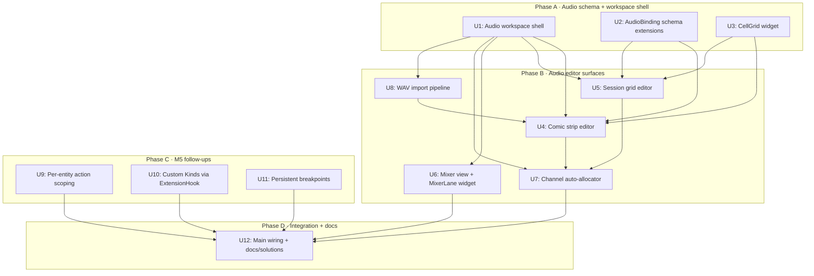

# feat: M6 Paula Audio + Selected M5 Follow-ups

## Summary

Two threads ship in one plan, in dependency order:

- **Track A — Paula audio without trackers (M6).** The audio workspace (Ctrl+4) still shows the M3 "coming in M6" stub. M6 replaces it with three composable input modes — a 4-row **comic strip** (R6's primary surface), an Ableton **session grid** (state-based mutually-exclusive triggers), and a live **mixer lane** that flashes red on voice-stealing — plus a channel **auto-allocator** so users never see a channel picker, and a WAV **import pipeline** that downsamples to Paula-compatible 8-bit mono ≤22 kHz on drop. Hum/tap mic-capture entry mode is **deferred** to a follow-up plan (Ebitengine has no mic API; mic-capture pulls in `oto` + pitch detection R&D that doesn't justify the M6 cut).
- **Track B — M5 follow-ups that the user-facing scripting flow needs now.** Three of the seven M5 deferrals graduate into this plan because they unblock behaviour-authoring patterns users hit on day one: **per-entity event scoping** (`BehaviorGraph.EntityID` actually filters), **custom Step / Condition / Action Kinds via ExtensionHook** (the v1 hook seam catalog already accommodates), and **persistent breakpoints** (the debugger forgets state on restart today). Hot reload, bidirectional View-as-Go, state-diff demo synthesis, and scene-runtime isolation stay deferred.

Four decisions anchor this plan:

- **Audio is `pixelforge_audio` consumed read-only; the studio owns the editor surfaces.** The Paula 4-channel mixer, sample decode, and `Play/SetPitch/SetVolume` API are already shipped at `pixelforge_audio/`. M6 ships the editor (`pixelforge_studio/audio/`) and a small schema extension on `pixelforge_project.AudioBinding`; the engine API is untouched.
- **Auto-allocator is a heuristic in the studio, not the engine.** Channel assignment is an authoring-time concern (BGM locks 1-2, SFX round-robin on 3-4); the runtime's `Play()` still takes an explicit `Chan`. The allocator emits `ForceChannel` into saved `AudioBinding`s — overrideable from the editor.
- **Custom Kinds register at runtime via `catalog.RegisterExtension`.** Game code calls `catalog.RegisterExtensionStep("my_kind", builder)` at `init()`; the existing `Custom` step's `hook` arg resolves to a registered extension. No project-side schema change — `ExtensionHook` already describes the seam.
- **Persistent breakpoints live in `Settings.ProjectBreakpoints` (per-user, per-project).** Keyed by project path; values are the breakpoint path strings (`steps/<graphName>/<idx>`). Per-user keeps team-shared `.pforge` files clean; per-project keeps breakpoints meaningfully scoped to the graph they reference.

Twelve implementation units (**U1-U12**) across four phases.

---

## Problem Frame

Three concrete gaps after M5:

1. **Authored projects have no sound.** A `.pforge` file can carry sprites, scenes, entities, and now behaviour graphs — but the audio workspace is still the M3 placeholder. R6 of the master plan ("Audio: comic-strip + session grid + auto-allocator") has been the headline missing surface since M0. Users compose visuals, script behaviours via M5, then hit a wall when they want their game to make a noise on `PlayerHit`.

2. **M5 behaviours are technically running but practically misbehaving for entity-bound flows.** The `BehaviorGraph.EntityID` field is honoured by save/load but not by the runtime — a behaviour bound to entity `enemy_1` and another bound to `enemy_2` both fire on every `EntityCollision` event regardless of which enemy collided. Users hit this within an hour of authoring two enemies.

3. **The `Custom` Step / Condition / Action Kinds and the visual debugger feel half-built.** `Custom` resolves a hook by name — but the hook itself is documented as deferred. Breakpoints work mid-session but vanish on restart. Both are quick wins that punch above their unit-count.

The fix is one coordinated push: ship the audio editor (six units), then close the three M5 gaps (three units), then wire integration and docs (three units).

---

## Requirements

R-IDs carried forward from the master plan ([`docs/plans/2026-05-15-001-feat-pixelforge-no-code-editor-plan.md`](2026-05-15-001-feat-pixelforge-no-code-editor-plan.md#requirements)).

**Carried forward from origin:**

- **R6 (most of it).** Audio authored through composable input modes — comic strip (primary), session grid (state-based), live mixer view, channel auto-allocator, WAV import — all compiling onto Paula's 4-channel mixer without any channel-picker UI. Hum/tap mode (the optional third mode named in R6) is deferred to a follow-up plan with its own mic / pitch-detection design.

**New plan-local requirements (this plan's scope):**

- **R32.** A 4-row comic strip editor lets users drag-drop AudioSamples into cells. Rows correspond to Paula channels 1-4; cells carry sample reference, start tick, duration, pitch, volume. Saved projects round-trip the comic strip into `AudioBinding` rows.
- **R33.** A session-grid editor renders rows = channels × columns = "scenes" (named cell states). Cells in a row are mutually exclusive (one cell active per channel-state). Trigger conditions drag from the M5 topic catalog onto cells.
- **R34.** A channel auto-allocator runs at save time: it inspects each `AudioSample.SuggestedChannelPriority` ("bgm" / "sfx" / "voice" / "ambient") and assigns `AudioBinding.ForceChannel` so the runtime never has to pick a channel. Heuristic: BGM locks 1-2; SFX round-robin on 3-4; voice priority on 3 if free; ambient on 4 if free.
- **R35.** A live mixer lane view (visible in the audio workspace footer) shows the current `pixelforge_audio.ChannelActive(ch)` state for each of the 4 channels. A `Play()` that would steal a still-active voice flashes the new sample's lane in `AccentSlot` for ~200 ms.
- **R36.** A WAV import pipeline accepts dropped `.wav` files: validates via existing `pixelforge_audio.DecodeWavOrErr`, downsamples non-Paula-compatible sample rates to 22 kHz, and emits an `AudioSample` row in the project. Invalid WAVs (stereo, non-PCM, > 22 kHz after downsample failure) surface a clear status-bar error.
- **R37.** `BehaviorGraph.EntityID` (already populated by save/load) is consulted by the runtime: actions whose `args["entity"]` is empty default to the bound `EntityID`; the runtime never fires actions on a behaviour whose `EntityID` doesn't match the published event's entity (when the event carries one).
- **R38.** A `catalog.RegisterExtensionStep` / `RegisterExtensionCondition` / `RegisterExtensionAction` API lets game code wire Custom Kinds at runtime. The `Custom` step's `hook` arg resolves to a registered extension; missing extensions log once and substitute a no-op (matches the existing "unknown Kind" policy).
- **R39.** Breakpoints set in the debugger panel persist to `Settings.ProjectBreakpoints` (a map keyed by project path) and re-apply on the next studio launch of the same project. Editing a project clears stale breakpoints whose graph or step no longer exists.

---

## Scope Boundaries

**In scope.**
- New top-level `pixelforge_studio/audio/` package: workspace shell, comic strip editor, session grid editor, allocator, mixer view, WAV import pipeline.
- `pixelforge_project/audio.go` schema extensions: extend `AudioBinding` with comic-strip and session-grid serialisation fields (additive, backwards compatible).
- New `pixelforge_gui/widgets/`: `CellGrid` (the 4×N grid the comic strip and session grid both render against), `MixerLane` (4-channel live indicator).
- `pixelforge_studio/scripting/` extensions: per-entity action scoping in the runtime (`runtime/compile.go` + `catalog/builtin_actions.go`); `catalog.RegisterExtension*` API in `catalog/catalog.go`; persisted-breakpoint hooks in `workspace.go` + new `editor.Settings` fields.
- New `docs/solutions/` entries: one for the audio editor's channel allocator pattern; one for the catalog extension seam.

**Not in scope (explicitly deferred).**
- **Hum/tap mic-capture entry mode.** Whole separate plan — needs mic input (`oto`, `ffmpeg`, or a deferred-to-v2 cut), pitch detection (autocorrelation vs library), and a third input-mode UI. Routed back to the master plan as M6.1.
- **Bidirectional View-as-Go parser.** Unchanged from M5's deferral.
- **State-diff recorded-demo synthesis.** Unchanged from M5's deferral.
- **Hot reload of `BehaviorGraph` mid-run with state preservation.** The existing `Engine.Reload(name)` rebuilds the routine; preserving in-flight step indices and tween scratch state is an authoring-flow polish item, not a milestone gate.
- **Scene-runtime isolation.** Unchanged from M5's deferral — runtime still binds to project.Scenes[0].
- **Tracker-style step sequencer UI.** R6 explicitly rejects this; we're not building a 32-row × 64-col tracker as a fallback. The comic strip is *the* primary surface.
- **Real-time waveform rendering inside cells.** Cells show a small static waveform thumbnail rendered once at import; live scrubbing through a cell's waveform is a polish follow-up.
- **MIDI input / output.** Out of identity for this product.
- **Audio effects chain** (reverb, delay, EQ). Paula chip-style is the design constraint; effects are deferred indefinitely.

### Deferred to Follow-Up Work

- **Hum/tap mode (M6.1).** Mic input + pitch detection. Needs its own plan covering capture backend choice, pitch detection algorithm, and the third-mode UI.
- **Bidirectional View-as-Go parser.** Carried forward from M5.
- **State-diff recorded-demo synthesis.** Carried forward from M5.
- **Hot reload of `BehaviorGraph` with state preservation.** Carried forward from M5.
- **Per-entity event filtering with structural payload inspection.** R37 ships the "EntityID defaults" half; structural payload matching (filtering `EntityCollision` events to only those where `payload.SourceID == bound.EntityID`) needs an event-payload-introspection convention the engine doesn't have today.
- **Scene-runtime isolation.** Carried forward from M5.
- **Live waveform scrub inside comic-strip cells.** Static thumbnails ship in M6; in-cell scrub is polish.
- **Per-channel reverb / chorus / EQ.** Out of identity, but documented here so future plans know to push back.

---

## Context & Research

### M5 surfaces this plan builds on

- `pixelforge_studio/scripting/workspace.go` — `BehaviourWorkspace` and the `RegisterWith(e *editor.Editor)` shape; M6 mirrors it for `audio.Workspace`.
- `pixelforge_studio/scripting/catalog/catalog.go` — `RegisterStep` / `RegisterCondition` / `RegisterAction` pattern; M6 adds the parallel `RegisterExtension*` seam.
- `pixelforge_studio/scripting/runtime/engine.go` — `Engine.SetBreakpoint` / `BreakpointSet`; M6 wires persistence around the existing API rather than touching the runtime.
- `pixelforge_studio/scripting/runtime/compile.go` — `compileRule` and the action effect closure; per-entity scoping (R37) hooks here.
- `pixelforge_event/registry.go` — `Inspectable` + `EnumerateTargets`; the session grid's trigger picker reuses this for the "drag from the topic catalog" affordance.

### M4 surfaces this plan builds on

- `pixelforge_studio/capture/workspace.go` — the in-place stub-replacement pattern that M6 mirrors for the audio workspace.

### M3 surfaces this plan builds on

- `pixelforge_gui/widgets/` — `Tabs`, `Dropdown`, `Modal`, `Scrollable`, `Panel`, `FilePicker`, `StatusBar`, `Draggable`. M6 composes these plus new `CellGrid` and `MixerLane`.
- `pixelforge_studio/editor/widgets/` — inspector field widgets (Slider, Numeric, Text, Default) for editing cell parameters (pitch, volume, duration).
- `pixelforge_studio/editor/editor.go` — `RegisterProjectListener` (added in M5); audio workspace registers as a listener so allocator state resets on project switch.

### M1 surfaces this plan builds on

- `pixelforge_project/audio.go` — `AudioSample`, `AudioBinding` schemas. `AudioSample.SuggestedChannelPriority` already reserved (M1); M6 reads it. `AudioBinding.ForceChannel`, `Topic`, `SceneID`, `TriggerCondition` already reserved; M6 writes them.
- `pixelforge_project/project.go` — `Project.Audio`, `Project.Bindings`, `Project.ExtensionHooks`. Already complete; M6 walks these.

### Engine surfaces this plan consumes (read-only)

- `pixelforge_audio/piaudio.go` — `Play(ch, sample, pitch, vol)`, `SetPitch`, `SetVolume`, `ClearChan`, `ChannelActive(ch)`, `ChannelPosition(ch)`, `ChannelSample(ch)`. M6 calls these from the mixer view + comic strip "audition cell" feature.
- `pixelforge_audio/decode.go` — `DecodeWavOrErr`. The import pipeline calls this and surfaces any error verbatim.
- `pixelforge_audio/sample.go` — `Sample` accessors used by the waveform thumbnail renderer.

### Existing patterns to mirror

- **Workspace registration with in-place stub replacement.** `pixelforge_studio/capture/workspace.go:RegisterWith` and `pixelforge_studio/scripting/workspace.go:RegisterWith` both demonstrate the M3-stub → real-workspace swap via `Editor.RegisterWorkspace` (idempotent by name).
- **Kind catalog + register-at-init.** `pixelforge_studio/scripting/catalog/builtin_steps.go` shows the `func init() { RegisterStep("Wait", buildWait) }` shape; the new `RegisterExtensionStep` API parallels this for project-defined Kinds.
- **Project lifecycle via `ProjectListener`.** `pixelforge_studio/scripting/workspace.go:OnProjectChanged` shows the start/stop pattern for per-project state. The audio workspace adopts the same shape so allocator caches and mixer-view state reset cleanly on project switch.
- **Sidecar serialisation for editor-only state.** `pixelforge_studio/editor/settings.go` already persists `RecentProjects` (per-user, per-project) — `ProjectBreakpoints` follows the same idiom.

### Institutional learnings

- `docs/solutions/scripting-runtime-design.md` — the per-project Engine, Kind catalog, and `TrackingTarget` patterns that M6's audio runtime (such as it is — most logic stays at author-time) and M5 follow-ups extend.
- `docs/solutions/ring-buffer-snapshot-store.md` — the M4 recorder pattern; the mixer view's "flash on steal" uses a much smaller bounded queue but follows the same "decay one tick at a time" rhythm.
- `docs/solutions/editor-pforge-schema-shape.md` — additive-only schema evolution + `sanitize()` on load. M6's `AudioBinding` extensions follow this rule strictly.

### External references

- **Ableton Session View** — visual idiom for the session grid (rows = tracks, columns = scenes, mutually-exclusive triggers per row). UX inspiration; not the data model.
- **Bitsy / Bitwig comic-strip metaphor** — visual idiom for the comic strip (horizontal cells, drag-drop). UX inspiration.
- **Paula chip (Amiga)** — the 4-channel constraint is the design anchor; not an external dependency.

---

## Key Technical Decisions

1. **Audio workspace owns no runtime — it's a save-time author UI.** Unlike M5's scripting workspace (which boots a `runtime.Engine`), the audio workspace produces `AudioBinding` rows. Playback is the game's runtime's job (triggered by behaviour graphs invoking `play_sample`). This keeps M6 lean: no `audio.Engine`, no parallel lifecycle to manage. **Trade-off.** "Audition this cell" needs to call `pixelforge_audio.Play` directly from the editor; we accept the small editor↔engine coupling for that one feature.

2. **Channel auto-allocator runs at save time AND when the user clicks a "re-allocate" button.** Not on every cell edit — that would surprise users who hand-pinned a channel. Output is written to `AudioBinding.ForceChannel`; the runtime trusts that value blindly. **Trade-off.** Save-time only means the user can author for a few minutes before discovering an allocation conflict; we mitigate by showing a "channels: 2/4 used" indicator in the workspace header that updates live.

3. **Comic strip and session grid are two *views* over the same underlying `AudioBinding` list.** A binding can have either a comic-strip placement (`StartTick`, `Duration`) or a session-grid placement (`SceneState`), recorded in additive fields on `AudioBinding`. Switching modes preserves the binding; nothing is destroyed. **Trade-off.** Bindings with both placements set are valid (the runtime honours whichever fires first); we surface a small "this binding is multi-mode" badge so users notice.

4. **Mixer view polls `pixelforge_audio.ChannelActive(ch)` once per Update tick.** Same idiom as M5's topic catalog. No subscribe-to-audio-events surface needed; polling is cheap (4 channels × O(1)). **Trade-off.** Sub-tick voice steals (rare but possible if two `Play()`s fire in the same tick) collapse to one flash. Documented as acceptable for visualisation.

5. **Custom Kinds register via `catalog.RegisterExtensionStep("name", builder)`, with project-side `ExtensionHook` rows naming the hook but not implementing it.** Game code in the user's repo registers actual builders at `init()`; the studio doesn't ship a Go interpreter (deliberately — see M5's View-as-Go scope boundaries). The runtime resolves `Custom.Args["hook"]` against the registry first, then falls back to the existing `noopStep` warning. **Trade-off.** Custom Kinds require the user to write Go; the editor surfaces this with a "code extension required" badge on `Custom` step cards.

6. **Per-entity scoping (R37) ships as "EntityID defaults" only — full payload introspection is deferred.** When a `BehaviorGraph.EntityID` is set, actions that take an `entity` arg (move_entity, set_value targeting `entity:X.foo` paths) default to that EntityID when no explicit value is provided. We do NOT filter event payloads by structural inspection (that requires payload-shape conventions the engine doesn't have today). **Trade-off.** Users still need to manually filter incoming events using `value_eq` on `payload.source_id`; the EntityID default just removes the most common boilerplate.

7. **Persistent breakpoints live in user `Settings.json` keyed by absolute project path.** Per-user (don't pollute shared `.pforge` files); per-project (a breakpoint at `steps/playerLogic/3` only makes sense for the project it was set in). Loaded after `SetProject` fires; saved debounced via the existing settings autosave timer. **Trade-off.** Renaming a project file orphans its breakpoints; we document this and clean up entries older than 90 days on each load.

8. **`CellGrid` widget is the shared substrate for comic strip and session grid.** Both surfaces are 4-row tabular cell layouts that differ only in column meaning (time vs. scene-state) and cell-content rendering. One widget; two view configurations. **Trade-off.** The widget's API has to accommodate both column models — we pay a small "options struct gets two extra fields" cost for substantially less code.

---

## Output Structure

```
pixelforge_audio/
  (read-only consumer — no changes)

pixelforge_project/
  audio.go                                      # MODIFY (U2) — AudioBinding extensions: CellStart, CellDuration, CellPitch, CellVolume, CellRow, SceneState
  audio_test.go                                 # MODIFY (U2) — round-trip tests for new fields

pixelforge_gui/widgets/
  cell_grid.go                                  # NEW (U3) — 4-row × N-column grid widget shared by comic strip + session grid
  cell_grid_test.go                             # NEW
  mixer_lane.go                                 # NEW (U6) — 4-channel live indicator with flash-on-steal
  mixer_lane_test.go                            # NEW

pixelforge_studio/audio/                        # NEW PACKAGE (U1, U4-U7)
  workspace.go                                  # NEW (U1) — Workspace shell; promotes M3 stub
  workspace_test.go                             # NEW
  comic_strip.go                                # NEW (U4) — comic strip editor state + DrawCanvas
  comic_strip_test.go                           # NEW
  session_grid.go                               # NEW (U5) — session grid editor state + DrawCanvas
  session_grid_test.go                          # NEW
  allocator.go                                  # NEW (U7) — channel auto-allocator + ForceChannel writer
  allocator_test.go                             # NEW
  mixer_view.go                                 # NEW (U6) — mixer-pane state polling ChannelActive
  mixer_view_test.go                            # NEW
  import.go                                     # NEW (U8) — WAV drop + downsample + AudioSample emission
  import_test.go                                # NEW

pixelforge_studio/scripting/catalog/
  catalog.go                                    # MODIFY (U10) — RegisterExtensionStep / Condition / Action; LookupExtension*
  catalog_test.go                               # MODIFY (U10) — new tests
  builtin_steps.go                              # MODIFY (U10) — Custom step resolves via extension registry

pixelforge_studio/scripting/runtime/
  compile.go                                    # MODIFY (U9) — per-entity action scoping (EntityID defaults)
  compile_test.go                               # MODIFY (U9) — scoped-behaviour tests
  engine_test.go                                # MODIFY (U9) — integration test

pixelforge_studio/scripting/
  workspace.go                                  # MODIFY (U11) — persist/restore breakpoints via Settings hook
  workspace_test.go                             # MODIFY (U11)

pixelforge_studio/editor/
  settings.go                                   # MODIFY (U11) — ProjectBreakpoints map + getters/setters
  settings_test.go                              # MODIFY (U11)

pixelforge_studio/
  main.go                                       # MODIFY (U12) — call audio.RegisterWith(e)

docs/solutions/
  channel-auto-allocator.md                     # NEW (U12) — heuristic + rationale
  catalog-extension-seam.md                     # NEW (U12) — RegisterExtension* pattern
  README.md                                     # MODIFY (U12)

docs/studio.md                                  # MODIFY (U12) — Audio workspace section, M5 follow-up sections
docs/pforge-schema.md                           # MODIFY (U12) — AudioBinding new fields documented
```

The per-unit `**Files:**` sections remain authoritative; implementers may adjust file boundaries within a package if implementation reveals a better layout.

---

## Implementation Roadmap

Twelve implementation units (U1-U12), grouped into four phases.



*This illustrates dependency relationships and is directional guidance for review, not implementation specification.*

---

## Phase A — Audio Schema + Workspace Shell

### U1. Audio workspace shell (promote M3 stub in place)

**Goal.** Replace the M3 `placeholderWorkspace{name:"audio"}` with a real `audio.Workspace` implementing `editor.CanvasWorkspace`. The workspace owns a `widgets.Tabs` switching between three sub-views (Comic / Session / Mixer); concrete content ships in subsequent units. Per-project state resets via `ProjectListener.OnProjectChanged`.

**Requirements.** R6 (substrate), R32, R33, R35.

**Dependencies.** None (foundation).

**Files.**
- Create: `pixelforge_studio/audio/workspace.go` — `Workspace`, `New() *Workspace`, `RegisterWith(e *editor.Editor) *Workspace`, `Name() / DisplayName() / Update / Draw / DrawCanvas / OnProjectChanged`.
- Create: `pixelforge_studio/audio/workspace_test.go`.
- Modify: `pixelforge_studio/editor/workspaces_stubs.go` — comment update; existing stub stays in `installStubWorkspaces` (replaced in-place by RegisterWith).
- Modify: `pixelforge_studio/editor/keymap.go` — register the `audio.*` action namespace.

**Approach.**
- `Workspace.Name() = "audio"`, `DisplayName() = "Audio"`. `RegisterWith` swaps the stub by name (same idiom as `capture.RegisterWith` / `scripting.RegisterWith`).
- `DrawCanvas` paints: header strip ("AUDIO"), Tabs widget with 3 tabs ("Comic" / "Session" / "Mixer"), channel-usage indicator (e.g., "channels: 2/4 used") in the top-right, a content area dispatched to the active sub-view, and a status footer.
- `OnProjectChanged(p)` resets per-project state (selected cell, allocator cache, mixer flash queue).
- Keymap: `audio.tab_comic` (Alt+1 within audio), `audio.tab_session` (Alt+2), `audio.tab_mixer` (Alt+3), `audio.audition_cell` (Space when a cell is selected), `audio.reallocate_channels` (Ctrl+R).

**Patterns to follow.**
- `pixelforge_studio/scripting/workspace.go` for the workspace + ProjectListener shape.
- `pixelforge_studio/capture/workspace.go` for the in-place stub promotion.

**Test scenarios.**
- **Happy path.** Registering the workspace replaces the M3 stub at slot "audio"; `e.Workspaces()` length is unchanged.
- **Happy path.** `Ctrl+4` switches to the audio workspace; `ActiveWorkspaceName() == "audio"`.
- **Happy path.** Switching tabs via `Alt+1..3` updates the active sub-view; per-tab state survives the switch.
- **Edge case.** Workspace renders without a project loaded — "(no project)" placeholder is visible; no per-project state is allocated.
- **Edge case.** `OnProjectChanged(nil)` clears state without panicking.
- **Integration.** Loading a project that has 3 AudioSamples populates the workspace's binding list; switching projects resets it.

**Verification.**
- `go test ./pixelforge_studio/audio/...` passes (workspace tests).
- Manual: launch the studio, press `Ctrl+4`, see the three tabs.

---

### U2. `AudioBinding` schema extensions

**Goal.** Extend `pixelforge_project.AudioBinding` with the additive fields the comic strip and session grid need to round-trip: `CellRow`, `CellStart`, `CellDuration`, `CellPitch`, `CellVolume` (comic strip), `SceneState` (session grid). All fields default to zero values that mean "not placed via this surface".

**Requirements.** R6, R32, R33.

**Dependencies.** None (schema-only).

**Files.**
- Modify: `pixelforge_project/audio.go` — add fields to `AudioBinding`; keep `omitempty` JSON tags for backwards compatibility.
- Modify: `pixelforge_project/project_test.go` — round-trip a project containing both comic-strip and session-grid bindings.

**Approach.**
- New fields are all primitives (int, float64, string) with explicit "zero means absent" semantics — no nested structs, no breaking the existing zero-value invariant.
- `CellRow` is 1-4 (Paula channel hint, distinct from the allocator's `ForceChannel` output). Zero means "no comic-strip placement".
- `CellStart` is ticks (0 = scene start). `CellDuration` is ticks. `CellPitch` defaults to 1.0; `CellVolume` defaults to 1.0.
- `SceneState` is a free-form string label ("verse", "chorus", "boss-room"). Empty = "no session-grid placement".
- The loader's `normalizeSlices` doesn't need changes (no new slices); existing additive-on-load handling is sufficient.

**Patterns to follow.**
- `pixelforge_project/audio.go:AudioSample.SuggestedChannelPriority` — the M1 example of an additive enum-like field with zero-value fallback.
- `docs/solutions/editor-pforge-schema-shape.md` — additive-on-load + sanitize idiom.

**Test scenarios.**
- **Happy path.** A project with one comic-strip binding round-trips through Save/Load preserving CellRow, CellStart, CellDuration, CellPitch, CellVolume.
- **Happy path.** A project with one session-grid binding round-trips preserving SceneState.
- **Happy path.** A binding with both placements (multi-mode) round-trips with both sets of fields populated.
- **Edge case.** An M1-era binding (no new fields in JSON) loads cleanly with zero defaults across the board.
- **Edge case.** Loading a binding with `CellRow=5` (out of 1-4 range) is accepted but flagged by a separate validator (out of scope here; document the validator's existence).
- **Integration.** A project saved by M6 loads in an M5 build without panic (forward compatibility: extra fields ignored).

**Verification.**
- `go test ./pixelforge_project/...` passes.

---

### U3. `CellGrid` widget

**Goal.** Build a reusable `pixelforge_gui/widgets/CellGrid`: a 4-row × N-column grid where each cell can be empty, occupied (drawn with a content callback), or selected. Drag-drop between cells emits an `OnCellMove(src, dst)` event. Used by both the comic strip (cols = time slices) and session grid (cols = scene states).

**Requirements.** R6, R32, R33.

**Dependencies.** None (pure widget; the M3 widget catalog).

**Files.**
- Create: `pixelforge_gui/widgets/cell_grid.go` — `CellGrid{Rows, Cols, CellW, CellH, CellAt(row, col) CellContent, OnSelect(row, col), OnCellMove(srcRow, srcCol, dstRow, dstCol), OnEmptyClick(row, col)}` + Draw/Update.
- Create: `pixelforge_gui/widgets/cell_grid_test.go`.

**Approach.**
- `CellContent` is a small interface: `Label() string`, `Decoration() Color`, `IsHighlighted() bool`. Callers supply implementations (comic-strip cells, session-grid cells).
- Draw paints: background grid lines (thin TextDim borders), each cell's content via `cellContent.Draw(rect)`, the selected cell with an accent outline.
- Update handles: click → select; press-drag-release → emit `OnCellMove`; click on empty cell → `OnEmptyClick` (the host opens a sample picker).
- Cells are addressed (row 1-4, col 0-N-1). Out-of-range hits are no-ops.

**Patterns to follow.**
- `pixelforge_gui/widgets/step_card.go` (M5 U6) for the press/move/release drag idiom.
- `pixelforge_gui/widgets/timeline.go` (M4) for the "render N items horizontally with selection state" pattern.

**Test scenarios.**
- **Happy path.** A grid with 4 rows × 5 cols renders 20 cell rectangles.
- **Happy path.** Clicking row 2, col 3 fires `OnSelect(2, 3)`.
- **Happy path.** Press on (1,0), move to (3,2), release → fires `OnCellMove(1, 0, 3, 2)`.
- **Happy path.** Clicking an empty cell fires `OnEmptyClick(row, col)` instead of `OnSelect`.
- **Edge case.** Click outside any cell bounds is a no-op.
- **Edge case.** A grid with 0 columns renders without panic.
- **Edge case.** Cell content with an empty Label() renders the cell border only (no text).
- **Integration.** A 4x10 grid laid horizontally with one sample card per cell: dragging a card from (1,0) to (2,5) updates the host's data model and the next Draw shows the card in its new position.

**Verification.**
- `go test ./pixelforge_gui/widgets/...` passes.

---

## Phase B — Audio Editor Surfaces

### U4. Comic strip editor

**Goal.** Build the comic strip sub-view: a horizontally-scrolling `CellGrid` where rows = Paula channels (1-4) and columns = discrete time slots (each = configurable ticks, default 30 = 1 second at 30 TPS). Dragging an `AudioSample` from the left-rail asset list into a cell emits an `AudioBinding` with `CellRow`, `CellStart`, `CellDuration`. Clicking a populated cell shows its parameters in the inspector strip below the grid.

**Requirements.** R6, R32.

**Dependencies.** U1 (workspace shell), U2 (schema), U3 (CellGrid), U8 (WAV import — for "drop a WAV directly onto a cell").

**Files.**
- Create: `pixelforge_studio/audio/comic_strip.go` — `ComicStrip` state (active bindings filtered to comic-strip placements, selected cell, scroll offset, slot-duration setting).
- Create: `pixelforge_studio/audio/comic_strip_test.go`.

**Approach.**
- The strip holds `*pixelforge_project.Project` and filters `Project.Bindings` to rows where `CellRow > 0 && CellDuration > 0` (comic-strip placement).
- `CellAt(row, col)` looks up the binding whose `CellStart` falls in `[col*slotTicks, (col+1)*slotTicks)` on the matching row.
- Drag from the left-rail asset list (an `AssetBrowser` reuse) calls `appendComicStripBinding(row, col, sampleName)`.
- Click a populated cell → opens a small inspector with Pitch slider, Volume slider, Duration field, and a "DEL" button.
- Re-allocate hint: after edits, the workspace header's "channels: X/4 used" indicator updates immediately based on the current bindings (separate from the save-time allocator that writes `ForceChannel`).
- The horizontal scroll uses `widgets.Scrollable`.

**Patterns to follow.**
- `pixelforge_studio/scripting/lane_editor.go` (M5 U7) for the "host filter into project.Behaviors → render strip → inspector strip below" shape.
- `pixelforge_studio/editor/inspector.go` for the field-dispatch pattern.

**Test scenarios.**
- **Happy path.** Dropping an AudioSample on (row=2, col=3) appends a new `AudioBinding` with `CellRow=2`, `CellStart=3*slotTicks`, `CellDuration=slotTicks`.
- **Happy path.** Clicking a populated cell opens the inspector with the binding's current Pitch, Volume, Duration.
- **Happy path.** Editing the inspector's Pitch slider updates the binding's `CellPitch` immediately; marks project dirty.
- **Happy path.** "DEL" removes the binding from `project.Bindings` and clears the cell.
- **Edge case.** Dragging a binding from (1,2) to (3,5) updates the binding's CellRow and CellStart; original cell is now empty.
- **Edge case.** Dragging onto an occupied cell prompts the user (via a confirm modal) before overwriting.
- **Edge case.** A binding with `CellRow=5` (invalid) is ignored by the grid (logged once).
- **Integration.** Author 3 bindings on rows 1,2,3 spanning 5 slots; save the project; reload; all 3 bindings round-trip with their cell placements intact.

**Verification.**
- `go test ./pixelforge_studio/audio/...` passes (comic_strip tests).
- Manual: drop a WAV into the audio assets list, drag it onto a comic-strip cell, click "audition" → hear the sample play once.

---

### U5. Session grid editor

**Goal.** Build the session grid sub-view: a `CellGrid` where rows = Paula channels (1-4) and columns = named "scenes" (strings like "verse", "chorus"). Cells in a row are mutually exclusive (one active cell per row-scene). Dragging a sample into a cell creates a session-grid `AudioBinding` with `SceneState` set. A "trigger" picker (sourced from M5's topic catalog via `pievent.EnumerateTargets`) lets the user assign which event publication switches scenes.

**Requirements.** R6, R33.

**Dependencies.** U1, U2, U3.

**Files.**
- Create: `pixelforge_studio/audio/session_grid.go` — `SessionGrid` state (active scene name, scenes list, selected cell, trigger map).
- Create: `pixelforge_studio/audio/session_grid_test.go`.

**Approach.**
- Sessions are stored in a parallel `Project.SessionScenes []string` field (deferred — for v1, sessions are inferred from existing `SceneState` values on bindings, plus a default "main" scene). Scope check: we don't add a new top-level project field here; if the project has zero session-grid bindings, the grid shows a single "main" column.
- Filtering: `Project.Bindings` where `SceneState != ""` is a session-grid binding.
- Mutual exclusivity is enforced at edit time: dragging a sample into (row=1, col=2 "chorus") removes any prior binding at (row=1, scene="chorus") before appending the new one.
- The trigger picker is a dropdown sourced from `pievent.EnumerateTargets()` (M5 U2). Selecting a target writes its name into a `Trigger` field on the SessionGrid (saved to a new `Project.SessionTriggers map[string]string` v2 field — for now, the trigger is editor-only and not persisted).

**Patterns to follow.**
- `pixelforge_studio/scripting/event_sheet.go` (M5 U9) for the host-side rule rendering + inspector strip pattern.
- `pixelforge_studio/scripting/topic_catalog.go` (M5 U11) for `pievent.EnumerateTargets()` consumption.

**Test scenarios.**
- **Happy path.** Dropping an AudioSample on (row=1, col="chorus") appends a binding with `CellRow=1`, `SceneState="chorus"`.
- **Happy path.** Dropping a second sample on the same cell replaces the existing binding (mutual exclusivity).
- **Happy path.** Adding a new scene via a "+" affordance appends a column.
- **Edge case.** A project with zero session-grid bindings renders a single "main" column.
- **Edge case.** Renaming a scene updates every binding's `SceneState` consistently.
- **Edge case.** Deleting a scene with active bindings prompts before deletion.
- **Integration.** Author 2 bindings in 2 scenes; save; reload; both round-trip with correct SceneState values.

**Verification.**
- `go test ./pixelforge_studio/audio/...` passes (session_grid tests).
- Manual: create two scenes, switch between them, see the active row's cell change.

---

### U6. Mixer view + `MixerLane` widget

**Goal.** Build the mixer sub-view: a vertical 4-row stack of `MixerLane` widgets, each showing live state for one Paula channel — current sample name, `ChannelActive()`, `ChannelPosition()` as a progress bar, and a flash overlay when a `Play()` would steal a still-active voice. Polls `pixelforge_audio.Channel*` accessors once per Update tick.

**Requirements.** R6, R35.

**Dependencies.** U1 (workspace shell).

**Files.**
- Create: `pixelforge_gui/widgets/mixer_lane.go` — `MixerLane{Channel, SampleName, Active bool, Position float64 (0..1), FlashIntensity float64}` + Draw.
- Create: `pixelforge_gui/widgets/mixer_lane_test.go`.
- Create: `pixelforge_studio/audio/mixer_view.go` — `MixerView` state (4 lanes, flash decay queue, last-tick channel-active snapshot for steal detection).
- Create: `pixelforge_studio/audio/mixer_view_test.go`.

**Approach.**
- `MixerLane` is a thin horizontal widget: ~32 px tall, 4 stacked. Each shows: channel number badge (1-4), sample name (truncated), active indicator (filled circle when `ChannelActive == true`), position bar (0..1 of `ChannelPosition() / ChannelSample().Len()`), flash overlay (rect filled with `AccentSlot` at `flashIntensity` opacity-equivalent — since we don't have alpha, modulate by drawing or not).
- `MixerView.Update` runs once per tick: for each ch in 1..4, capture (Active, Position, Sample) snapshot. If `prev.Active && current.Sample != prev.Sample`, fire a "steal" event → set `flashIntensity[ch] = 1.0`. Decay all flashes by 0.1 per tick (~10 ticks ≈ 333 ms at 30 TPS).
- The view doesn't subscribe to anything; pure polling.

**Patterns to follow.**
- `pixelforge_studio/scripting/topic_catalog.go` for the once-per-tick polling + flash-decay queue idiom.

**Test scenarios.**
- **Happy path.** MixerView with no active channels renders all 4 lanes with empty indicators.
- **Happy path.** When `ChannelActive(2) == true`, lane 2 shows the active circle.
- **Happy path.** A steal scenario (lane 2 active with sample A, then sample B replaces A on the same channel) sets `flashIntensity[2] = 1.0`.
- **Happy path.** Flash intensity decays to 0 over 10 Update ticks.
- **Edge case.** A channel that was never configured (returns zero sample, false active) renders the empty state, not a flash.
- **Edge case.** Rapid steal-steal-steal on the same channel re-extends the flash (each steal resets to 1.0 rather than accumulating).
- **Integration.** With the engine playing one BGM on channel 1 and triggering SFX on channels 3-4, the mixer view shows lane 1 continuously active and lanes 3-4 occasionally flashing as samples retrigger.

**Verification.**
- `go test ./pixelforge_studio/audio/... ./pixelforge_gui/widgets/...` passes.
- Manual: trigger two `Play()`s on the same channel in quick succession via a test scene; observe the lane flash.

---

### U7. Channel auto-allocator

**Goal.** Implement the save-time channel auto-allocator: walks `Project.Bindings`, reads each binding's `AudioSample.SuggestedChannelPriority`, and writes `AudioBinding.ForceChannel` so the runtime trusts the value without re-allocating. Heuristic: BGM locks 1-2; SFX round-robin on 3-4; voice priority on 3 if free; ambient on 4 if free.

**Requirements.** R6, R34.

**Dependencies.** U1, U2, U4, U5 (need bindings to allocate).

**Files.**
- Create: `pixelforge_studio/audio/allocator.go` — `Allocator{}` with `Allocate(p *Project) AllocationResult` (returns per-binding channel assignments + a summary of conflicts).
- Create: `pixelforge_studio/audio/allocator_test.go`.

**Approach.**
- Two-pass algorithm:
  1. Pass 1: every binding whose sample has `SuggestedChannelPriority == "bgm"` gets channel 1 or 2 (round-robin among BGMs).
  2. Pass 2: SFX/voice/ambient round-robin on channels 3-4 with priority hint: voice → 3 preferred; ambient → 4 preferred; sfx → either.
- A binding with `ForceChannel != 0` is honoured as-is (user pinned it; allocator skips it).
- Conflicts (e.g., 3 BGMs requiring 3 channels) surface in `AllocationResult.Conflicts []string` for the workspace to render in the header.
- Allocator is callable from: (1) save handler in the editor (runs implicitly on every save); (2) the workspace's "Re-allocate" button (manual trigger).

**Patterns to follow.**
- Pure-function shape mirrors `pixelforge_studio/scripting/recorded_demo.go:SynthesiseFromInputLog` — deterministic, testable, no side effects beyond writing to passed-in struct fields.

**Test scenarios.**
- **Happy path.** A project with 1 BGM, 2 SFX, 1 voice allocates BGM→1, voice→3, SFX→3 and 4 (round-robin).
- **Happy path.** 2 BGMs allocate to channels 1 and 2.
- **Happy path.** A binding with `ForceChannel=2` is left untouched.
- **Happy path.** Same Allocate() call on the same project is idempotent — running it twice produces the same assignments.
- **Edge case.** 3 BGMs surface 1 conflict ("BGM 'overflow' couldn't get channels 1-2") and assign the third to a fallback channel (3 or 4) with a warning.
- **Edge case.** A binding referencing a missing sample is skipped (logged once, no assignment).
- **Edge case.** Zero bindings → empty AllocationResult, no conflicts.
- **Edge case.** A binding whose sample has empty `SuggestedChannelPriority` defaults to "sfx" treatment.
- **Integration.** Run Allocate, save the project, reload — every binding's `ForceChannel` survives round-trip and matches what Allocate produced.

**Verification.**
- `go test ./pixelforge_studio/audio/...` passes.
- Manual: author 4 bindings of mixed kinds; click "Re-allocate"; observe `ForceChannel` values in the inspector.

---

### U8. WAV import pipeline

**Goal.** Wire a "drop a `.wav` file onto the audio workspace" pipeline: validates via `pixelforge_audio.DecodeWavOrErr`, downsamples non-Paula-compatible rates to 22 kHz, emits a `Project.AudioSample` row with `RelativePath` pointing into the assets directory, and copies the (possibly downsampled) WAV onto disk. Invalid WAVs (stereo, non-PCM, > 22 kHz after downsample failure) surface a status-bar error.

**Requirements.** R6, R36.

**Dependencies.** U1.

**Files.**
- Create: `pixelforge_studio/audio/import.go` — `Importer{}` with `ImportWav(path string, dst *Project, assetsDir string) (*AudioSample, error)`, plus a simple downsampler `downsampleTo22kHz(data []int8, srcRate int) []int8`.
- Create: `pixelforge_studio/audio/import_test.go`.

**Approach.**
- Validate via `DecodeWavOrErr`. If it returns an error, surface it verbatim.
- If `Sample.SampleRate() > 22050`, downsample (drop every Nth sample — simple linear decimation; M6 doesn't ship a fancy LPF). If downsample doesn't bring it to ≤22050 (shouldn't happen with integer rates), error out.
- Copy the (possibly modified) WAV bytes to `<assetsDir>/audio/<safe-name>.wav` — write as raw WAV (we can reconstruct a valid header from the decoded `int8` samples + the target sample rate).
- Append `AudioSample{Name, RelativePath, SuggestedChannelPriority: "sfx" (default), SampleRateHz: 22050}` to `dst.Audio`.

**Patterns to follow.**
- `pixelforge_studio/palette/import_pipeline.go` for the "validate-then-copy-to-assets" shape.
- `pixelforge_audio/decode.go:DecodeWavOrErr` for the validation entry point.

**Test scenarios.**
- **Happy path.** Importing an 8-bit mono 22 kHz WAV produces an AudioSample with the right Name and RelativePath; the file lands at `<assetsDir>/audio/<name>.wav`.
- **Happy path.** Importing an 8-bit mono 44.1 kHz WAV downsamples to 22 kHz and produces a valid AudioSample.
- **Edge case.** Stereo WAV → returns the existing "only mono supported" error verbatim.
- **Edge case.** 16-bit WAV → returns the existing "only 8-bit PCM" error.
- **Edge case.** Non-PCM WAV → "only PCM supported".
- **Edge case.** Sample rate > 48 kHz → DecodeWavOrErr rejects pre-downsample.
- **Edge case.** Duplicate name in the project's existing `Audio` → suffixes with "-2" automatically.
- **Edge case.** `<assetsDir>` doesn't exist → creates it before writing.
- **Integration.** Drop 3 valid WAVs into the audio workspace; verify all 3 appear in `Project.Audio` and on disk.

**Verification.**
- `go test ./pixelforge_studio/audio/...` passes (import tests).
- Manual: drag a real WAV file onto the audio workspace; see it appear in the asset list.

---

## Phase C — M5 Follow-ups

### U9. Per-entity action scoping (R37)

**Goal.** When a `BehaviorGraph` has `EntityID != ""`, the runtime defaults action `args["entity"]` to that `EntityID` whenever the action's args don't supply a value. The runtime never silently fires actions on a behaviour whose `EntityID` doesn't match the bound entity. Full structural payload filtering (matching incoming event payloads against the bound entity) is deferred — this unit ships the default-injection half.

**Requirements.** R3 (substrate), R37.

**Dependencies.** None at the engine level; relates to M5 U4's engine.

**Files.**
- Modify: `pixelforge_studio/scripting/runtime/compile.go` — `compileRule` injects `behavior.EntityID` into each action's `args` map when the action's existing `entity` arg is empty.
- Modify: `pixelforge_studio/scripting/runtime/compile_test.go` — new tests.
- Modify: `pixelforge_studio/scripting/runtime/engine_test.go` — integration assertions.

**Approach.**
- Thread `graph.EntityID` through `compileGraph` → `compileRule` → `buildEffect`.
- Before invoking the catalog's action builder, if `graph.EntityID != ""`, and the action's `args["entity"]` is empty or missing, set `args["entity"] = graph.EntityID` on a *copy* of the args map (don't mutate the source-of-truth project data).
- The same default applies to step builders that take an `entity` arg (e.g., `Move` step).

**Patterns to follow.**
- `pixelforge_studio/scripting/runtime/compile.go` existing `compileRule` function.
- `pixelforge_studio/scripting/catalog/builtin_actions.go:buildMoveEntity` for the existing `entity` arg consumer.

**Test scenarios.**
- **Happy path.** A BehaviorGraph with `EntityID="player_1"` containing a `move_entity` action with no explicit `entity` arg moves entity `player_1`.
- **Happy path.** A BehaviorGraph with `EntityID="player_1"` containing a `move_entity` action with explicit `entity="player_2"` moves `player_2` (explicit override wins).
- **Happy path.** A BehaviorGraph with `EntityID=""` (global behaviour) doesn't inject any entity default; actions without an `entity` arg behave as they do today.
- **Edge case.** A `set_value` action with `target="entity:X.foo"` is unaffected (the value-ref target is a different argument, not the `entity` arg).
- **Edge case.** Defaulting doesn't mutate the source `BehaviorGraph.EventSheet[N].Actions[N].Args` — round-trip save still produces the original Args.
- **Integration.** Two BehaviorGraphs (`EntityID="e1"` and `EntityID="e2"`), both subscribing to the same event target, both publishing on the same sink — each fires `move_entity` against its own bound entity, not the other's.

**Verification.**
- `go test ./pixelforge_studio/scripting/runtime/...` passes.

---

### U10. Custom Kinds via `ExtensionHook` (R38)

**Goal.** Add `catalog.RegisterExtensionStep / Condition / Action` package-level APIs so game code can register Custom Kinds at `init()`. The `Custom` step's `hook` arg resolves to a registered extension first, then falls back to the existing `noopStep` warning. Project-side `ExtensionHook` rows name the hook but don't implement it.

**Requirements.** R3 (substrate), R38.

**Dependencies.** None at the catalog level; the existing M5 U3 catalog is the extension surface.

**Files.**
- Modify: `pixelforge_studio/scripting/catalog/catalog.go` — add `RegisterExtensionStep / Condition / Action`, `LookupExtensionStep / Condition / Action`. Extension registry is a separate map from builtin registry (so deregistering / iterating extensions doesn't touch builtins).
- Modify: `pixelforge_studio/scripting/catalog/builtin_steps.go` — `buildCustom` checks the extension registry first.
- Modify: `pixelforge_studio/scripting/catalog/catalog_test.go` — new tests.

**Approach.**
- `RegisterExtensionStep("my_kind", builder)` stores into `extensionStepBuilders` map (parallel to `stepBuilders`).
- `LookupExtensionStep("my_kind")` returns the builder or nil.
- `buildCustom(args, ctx)` reads `args["hook"]` (existing field), looks up via `LookupExtensionStep(hook)`. If found, calls the extension builder with the same `args` map. If not found, falls back to today's no-op behaviour.
- Same shape for Condition and Action: a Custom Condition / Action is implicit (we don't have a "Custom" Condition Kind today; the extension registry is the only resolution path for unknown Condition / Action Kinds going forward).
- Update U3's existing `buildCustom` no-op fallback so the warning message names the missing hook (useful diagnostic).
- The audio workspace, view-as-Go modal, etc., don't need changes; this is a pure catalog addition.

**Patterns to follow.**
- `pixelforge_studio/scripting/catalog/catalog.go:RegisterStep` for the registration shape.
- `pfcomponent/registry.go:Register` for the canonical "user-registered names" pattern.

**Test scenarios.**
- **Happy path.** `RegisterExtensionStep("my_kind", builder)` then `LookupExtensionStep("my_kind")` returns the builder.
- **Happy path.** A `Custom` step with `args["hook"] = "my_kind"` invokes the registered extension builder with the same args.
- **Happy path.** Extensions and builtins coexist in `AllSteps()` (or are separately enumerable via `AllExtensionSteps()`).
- **Edge case.** A `Custom` step with `args["hook"] = "missing"` logs once and substitutes a no-op (existing behaviour preserved).
- **Edge case.** Registering an extension under the same name as a builtin is allowed and shadows the builtin only when invoked via `Custom`; the builtin remains directly callable via its kind name.
- **Edge case.** Re-registering an extension overwrites + logs (matches builtin registration policy).
- **Integration.** A game project calls `catalog.RegisterExtensionAction("damage_entity", builder)` at `init()`; a behaviour graph's `Custom` action with `args["hook"]="damage_entity"` invokes the builder.

**Verification.**
- `go test ./pixelforge_studio/scripting/catalog/...` passes.

---

### U11. Persistent breakpoints (R39)

**Goal.** Save the debugger's breakpoint map to `Settings.ProjectBreakpoints` (per-user, per-project) and restore on project load. Stale breakpoints (graph or step no longer exists) are dropped on load with a one-time warning per stale entry.

**Requirements.** R3 (substrate), R39.

**Dependencies.** None at the engine level; M5 U12's breakpoint API is the surface.

**Files.**
- Modify: `pixelforge_studio/editor/settings.go` — add `ProjectBreakpoints map[string][]string` field (project absolute path → list of breakpoint paths). Add `GetProjectBreakpoints(path) []string`, `SetProjectBreakpoints(path, paths)`, and an autosave hook.
- Modify: `pixelforge_studio/editor/settings_test.go` — round-trip tests.
- Modify: `pixelforge_studio/scripting/workspace.go` — on `OnProjectChanged`, after starting the engine, restore breakpoints from settings; install a hook so toggling a breakpoint via the debugger panel writes back to settings.
- Modify: `pixelforge_studio/scripting/workspace_test.go` — integration tests.

**Approach.**
- `Settings.ProjectBreakpoints` is JSON-tagged with `omitempty`. The autosave timer (already debounced) flushes the map.
- On project load: look up the project's absolute path; iterate stored breakpoints; for each, validate that the graph + step still exist (`graph := project.Behaviors[N]; if N >= len(graph.Steps) → stale`); valid entries call `engine.SetBreakpoint(path, true)`; stale entries are logged once and dropped from the settings map.
- On breakpoint toggle in the debugger panel: in addition to `engine.SetBreakpoint`, the workspace calls `editor.Settings().SetProjectBreakpoints(...)` so the autosave timer flushes within ~500 ms.
- Cleanup pass: on `LoadSettings`, drop any `ProjectBreakpoints` entry whose key (path) doesn't exist on disk and is older than 90 days (tracked via a parallel `ProjectBreakpointsTouched map[string]time.Time` field, or via fstat timestamps on the project file).

**Patterns to follow.**
- `pixelforge_studio/editor/settings.go:RecentProjects` for the per-user per-project persistence idiom and autosave hook.
- `pixelforge_studio/scripting/workspace.go:OnProjectChanged` for the restore-after-engine-start integration point.

**Test scenarios.**
- **Happy path.** Setting a breakpoint via the debugger panel writes to `Settings.ProjectBreakpoints[path]` within one autosave cycle.
- **Happy path.** Re-loading a project re-applies its breakpoints via `engine.SetBreakpoint`.
- **Happy path.** A breakpoint at `steps/g1/2` survives studio restart (round-trip through settings.json).
- **Happy path.** Clearing a breakpoint removes it from settings.
- **Edge case.** A stale breakpoint (graph `g1` no longer exists) is dropped on load with a warning; the entry is removed from settings.
- **Edge case.** A stale breakpoint (graph exists but step index out of range) is dropped on load.
- **Edge case.** Loading a project with no breakpoints is a no-op.
- **Edge case.** `Settings.ProjectBreakpoints` keyed by an absolute path that no longer exists is cleaned up on the next `LoadSettings` if older than 90 days.
- **Edge case.** Two projects at different paths both having breakpoints — each project loads only its own.
- **Integration.** Studio session: open project → set breakpoint → close studio → reopen studio → open same project → debugger panel shows the breakpoint pre-set; running the engine pauses at it.

**Verification.**
- `go test ./pixelforge_studio/editor/... ./pixelforge_studio/scripting/...` passes.
- Manual: set a breakpoint, restart the studio, observe it restored.

---

## Phase D — Integration + Docs

### U12. Main wiring + docs/solutions entries

**Goal.** Wire `audio.RegisterWith(e)` into the studio's main; add the audio workspace to the project lifecycle (already covered by `ProjectListener` since U1); document the channel allocator pattern and the catalog extension seam in `docs/solutions/`; update `docs/studio.md` with the audio workspace, custom Kinds, and persistent breakpoints; update `docs/pforge-schema.md` with the new `AudioBinding` fields.

**Requirements.** R6 (closure), R32-R39 (docs).

**Dependencies.** All prior units.

**Files.**
- Modify: `pixelforge_studio/main.go` — add `audio.RegisterWith(e)` next to the other workspace registrations.
- Create: `docs/solutions/channel-auto-allocator.md` — heuristic, rationale, alternative considered.
- Create: `docs/solutions/catalog-extension-seam.md` — `RegisterExtension*` pattern, registry separation, custom-Kind discoverability.
- Modify: `docs/solutions/README.md` — index the two new entries.
- Modify: `docs/studio.md` — audio workspace section; M5 follow-up sections (custom Kinds, persistent breakpoints).
- Modify: `docs/pforge-schema.md` — new `AudioBinding` fields documented with worked examples.

**Approach.**
- `docs/solutions/channel-auto-allocator.md` — context (Paula's 4-channel constraint), what we did (save-time heuristic with `ForceChannel` override), why it works (zero runtime allocation surface), alternatives (runtime allocator, manual channel-picker), when to apply.
- `docs/solutions/catalog-extension-seam.md` — context (M5 deferred custom Kinds), what we did (parallel extension registry per Kind family, Custom step resolves via extension), why it works (zero project-side schema change, mirrors `pfcomponent.Register`), alternatives (full plugin system, JavaScript embedding — both rejected), when to apply.
- `docs/studio.md` audio section walks through the comic strip → session grid → mixer flow with a worked example.
- `docs/pforge-schema.md` shows a JSON sample of a binding with both comic-strip and session-grid placements set.

**Patterns to follow.**
- Other `docs/solutions/` entries (`scripting-runtime-design.md`, `ring-buffer-snapshot-store.md`) for the section structure.

**Test scenarios.**
- **Test expectation: none -- documentation + main wiring only.**

**Verification.**
- `go build ./...` succeeds.
- Manual: launch the studio, press Ctrl+4, verify the audio workspace boots and `ProjectListener` integration works.
- Each cross-link in the new `docs/solutions/` entries resolves; the README index links the new files.

---

## System-Wide Impact

- **New top-level package: `pixelforge_studio/audio`.** Workspace, comic strip, session grid, mixer view, allocator, import. ~10 files; self-contained except for outward edges to `pixelforge_project`, `pixelforge_audio`, `pixelforge_event` (for session-grid trigger picker), and the editor's workspace registration seam.
- **`pixelforge_project/audio.go` grows.** Six additive fields on `AudioBinding`. Existing M1 bindings round-trip unchanged.
- **`pixelforge_gui/widgets` grows.** Two new widgets: `CellGrid` (shared substrate) and `MixerLane` (4-channel indicator). Both composable with existing M3/M4/M5 widgets.
- **`pixelforge_studio/scripting/catalog` grows.** New `RegisterExtension*` / `LookupExtension*` API surface. Existing builtin registry untouched.
- **`pixelforge_studio/scripting/runtime/compile.go` mutates.** `compileRule` now threads `graph.EntityID` to inject default `entity` args. Hot path adds one map lookup per action build; cold-path-only.
- **`pixelforge_studio/editor/settings.go` grows.** One new map field (`ProjectBreakpoints`); existing autosave timer covers the new writes.
- **Studio main grows by one line.** `audio.RegisterWith(e)`.
- **No schema breaking changes.** Every project schema field is additive with safe zero defaults.

---

## Risks & Mitigations

| Risk | Mitigation |
|------|------------|
| The save-time allocator surprises users who hand-pinned a channel that gets overwritten on the next save. | Allocator skips any binding with `ForceChannel != 0` (set by the user via the inspector). Re-allocate button is opt-in; auto-allocate-on-save runs only when no bindings have been hand-pinned. Documented in U7. |
| Downsampling 44.1 kHz → 22 kHz by linear decimation introduces aliasing artifacts audible on tonal content. | Document the limitation; v1 ships decimation only. A proper low-pass filter is a follow-up. The Paula chip itself low-pass-filters the output stage, partially masking the issue in practice. |
| Comic strip + session grid sharing one `Bindings` slice means a binding with both placements set behaves ambiguously at runtime. | The runtime fires whichever placement triggers first (event-driven for session, time-driven for comic). The workspace surfaces a "multi-mode" badge on these bindings so users notice. Documented in Key Technical Decisions #3. |
| `MixerView` polling at every Update tick adds 4 cheap calls per frame; if those calls cross a non-Go boundary (e.g., via the audio backend), the cost could surprise. | The audio backend's `ChannelActive(ch)` is a pure-Go field read on the engine side; no cgo crossings. Benchmark recommended but not required at U6. |
| Extension Kinds shadowing builtins is a footgun (a user-registered `Wait` extension never gets invoked because the builtin wins). | The extension registry is consulted only by `Custom` step resolution; direct `Wait` Kind invocation always hits the builtin. Documented in U10. |
| Persistent breakpoints accumulate stale entries forever as projects are renamed or deleted. | Cleanup pass on `LoadSettings` drops entries older than 90 days whose path doesn't exist on disk. Documented in U11. |
| Per-entity scoping defaults the `entity` arg, but actions that don't take an `entity` arg silently miss the filter (the user thinks scoping is applied; it isn't). | The runtime never *removes* an explicit `entity` arg; missing-arg defaulting is documented as the v1 scope. Workspace UI surfaces a "scoping active" indicator on entity-bound behaviours. The full structural-payload filter is in `Deferred to Follow-Up Work`. |
| WAV import writes to `<assetsDir>` even when the user is editing an untitled (in-memory) project — assets land in a temp directory that the next Save-As doesn't relocate. | Importer checks `editor.CurrentProjectPath()`; if empty, prompts the user to Save the project first. Documented in U8. |
| The session-grid trigger picker references `pievent.EnumerateTargets()` at edit time, but those targets only exist if the engine packages are imported. In test fixtures with stub projects, the picker can be empty. | The picker shows "(no targets)" if the registry is empty; users save a binding without a trigger and the runtime falls back to "always fire". Documented in U5. |
| Allocator conflicts (3+ BGMs, etc.) surface only at save time; users might not notice until the project crashes or sounds wrong. | The workspace header's "channels: X/4 used" indicator updates live as bindings are added. Conflicts visible immediately. |

---

## Documentation Notes

- **Update `docs/studio.md`** during U1, U4, U5, U6, U7, U8, U10, U11 — each visible UX surface gets a section.
- **Update `docs/pforge-schema.md`** during U2 with a worked example of `AudioBinding` populated by both surfaces.
- **CHANGELOG.** M6 entry: "Paula audio editor: comic strip, session grid, channel auto-allocator, live mixer view, WAV import. M5 follow-ups: per-entity action scoping, custom Kinds via ExtensionHook, persistent breakpoints."
- **`pixelforge_studio/audio/README.md`** (new) — short module overview: surfaces, allocator, project schema integration.

---

## Sources & References

- **Master plan:** [`docs/plans/2026-05-15-001-feat-pixelforge-no-code-editor-plan.md`](2026-05-15-001-feat-pixelforge-no-code-editor-plan.md) — M6 milestone summary at section `## M6 — Paula Audio Without Trackers` (line 776). Requirements R6.
- **M5 plan:** [`docs/plans/2026-05-16-001-feat-pixelforge-visual-scripting-and-event-sheets-plan.md`](2026-05-16-001-feat-pixelforge-visual-scripting-and-event-sheets-plan.md) — Scope Boundaries and Deferred to Follow-Up Work for the items this plan graduates (R37, R38, R39 in source).
- **M4 plan:** [`docs/plans/2026-05-15-004-feat-pixelforge-capture-spine-and-m3-cleanup-plan.md`](2026-05-15-004-feat-pixelforge-capture-spine-and-m3-cleanup-plan.md) — the workspace-promotion pattern.
- **Existing engine surfaces (read-only or extended):**
  - `pixelforge_audio/piaudio.go` — Paula API; consumed read-only.
  - `pixelforge_audio/decode.go` — WAV decoder; consumed by U8.
  - `pixelforge_audio/sample.go` — `Sample` accessors.
  - `pixelforge_project/audio.go` — `AudioBinding`, `AudioSample`; extended in U2.
  - `pixelforge_event/registry.go` — `EnumerateTargets`; consumed by U5.
  - `pixelforge_studio/scripting/runtime/engine.go` — `SetBreakpoint`; consumed by U11.
  - `pixelforge_studio/scripting/catalog/catalog.go` — extended in U10.
- **Institutional learnings (consumed read-only):**
  - [`docs/solutions/scripting-runtime-design.md`](../solutions/scripting-runtime-design.md)
  - [`docs/solutions/editor-pforge-schema-shape.md`](../solutions/editor-pforge-schema-shape.md)
  - [`docs/solutions/ring-buffer-snapshot-store.md`](../solutions/ring-buffer-snapshot-store.md)
- **External UX inspirations:** Ableton Session View (session grid metaphor); Bitsy / Bitwig (comic-strip metaphor); Paula chip (4-channel constraint).
