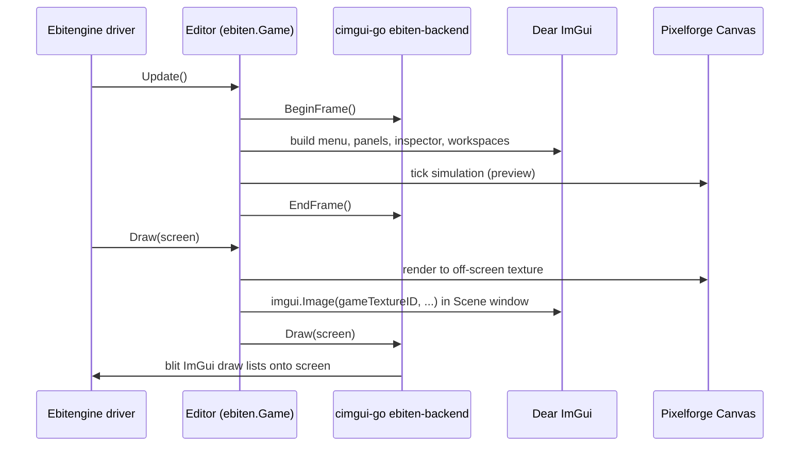

# refactor: Migrate Pixelforge Studio GUI to Dear ImGui (cimgui-go)

## Summary

Replace the home-grown `pixelforge_gui` widget chrome inside `pixelforge_studio/editor/` with Dear ImGui via the first-party `cimgui-go/backend/ebiten-backend`. Keep `pixelforge_gui` itself frozen and in-tree for engine-side consumers (`pixelforge_scope/`, `pixelforge_examples/gui/`). Reframe `editor.pforge` from "the editor's render tree" to "the editor's theme + dock layout fixture" — schema survives, renderer changes. Rebuild capture and scripting workspaces on ImGui in this migration so the studio never enters a mixed-rendering era. Game preview moves into a dockable ImGui image panel via `CreateTextureFromGame`, so the engine canvas lives *inside* the editor chrome rather than under it.

This refactor retires `docs/plans/2026-05-15-003` outright and renders the GUI-implementation portions of plans 001/002, 2026-05-16-001, and 2026-05-16-002 obsolete (their feature targets still apply, but on a new widget substrate).

---

## Problem Frame

The current studio is mid-rewrite (M0/M1 shipped, M2–M7 ahead) with **two parallel chrome paths inside `pixelforge_studio/editor/editor.go`**: a native ebitenutil-driven path (active) and a canvas-resident pgui-driven path (`canvasMenuBar`, `canvasStatusBar` — plumbed but inert because no `Workspace` currently implements `CanvasWorkspace`). The committed M3 plan grows `pixelforge_gui` into a full editor widget catalog to finish the canvas-resident migration; everything from M3 onward stacks on that growth.

The user reports the results are "visually bad" and asked whether a proper GUI builder could be lifted from Ebitengine. There isn't one — Ebitengine is a 2D game engine, not a tool framework. The realistic alternatives are:

1. Grow `pixelforge_gui` as the M3/003 plan committed (12+ weeks of widget work that competes with game-tool features).
2. Adopt a Go-native widget toolkit like `ebitenui` (drop-in but gives a workmanlike, not pro-grade, result).
3. Adopt **Dear ImGui via cimgui-go** — the toolkit every real game editor uses (Unreal/Unity/Godot tooling, RenderDoc, Tracy, ImHex). With cimgui-go's first-party Ebiten backend, integration is a few function calls per frame, not a backend port.

The user authorized heavy changes ("pixelforge itself might need heavy changes — don't shy away from them") and chose option 3.

**This is the cheapest moment in the project's lifetime to swap GUI libraries.** Every milestone that lands on pgui (M3 chrome growth, M5 visual scripting widgets, M6 audio widgets) makes the swap more expensive. M3 hasn't started; M5/M6 are planned but not built. Swapping now means deleting plumbed-but-unused infrastructure (`cart.go`, `cart_loader.go`, `chromeVisibility`, latent `canvasMenuBar`/`canvasStatusBar`) instead of deleting shipped features.

---

## Requirements

- **R1.** The studio editor renders all chrome (title bar, menu bar, status bar, panels, modals, asset browser, inspector) through Dear ImGui via `cimgui-go/backend/ebiten-backend`.
- **R2.** `pixelforge_gui` (the package) remains in the repo, unchanged in API, used by `pixelforge_scope/` and `pixelforge_examples/gui/`. Engine games (`snake/`, `pacman/`, `piano/`, `hello/`) are unaffected.
- **R3.** The Pixelforge engine itself (`pixelforge.go`, `surface.go`, `colortable.go`, `gameloop.go`, `pixelforge_audio/`, `pixelforge_event/`, etc.) has no new dependency on cimgui-go. Engine consumers can build games without the studio's dependency graph.
- **R4.** The reflection-driven inspector continues to consume `pfcomponent`'s `WidgetKind` metadata. Component authors who register types via `pf:"slider,0..100"` etc. continue to work without source changes.
- **R5.** The game preview is a dockable ImGui image panel that displays the running Pixelforge canvas. Input is routed to the engine only when the preview panel is focused; mouse and keyboard otherwise drive ImGui chrome.
- **R6.** Dockable panel layouts persist via ImGui's standard `imgui.ini` file in the user config dir. The user's preference for dock layout survives restarts.
- **R7.** The `editor.pforge` fixture continues to define the editor's theme (palette colors, font choice) and default dock layout. Loading a different `editor.pforge` produces a visually different editor without recompiling.
- **R8.** The Capture and Scripting workspaces (currently `pixelforge_studio/capture/workspace.go` and `pixelforge_studio/scripting/workspace.go`, both pgui-based) render through ImGui. The studio does not ship with a mixed-rendering era where some workspaces use pgui and others use ImGui.
- **R9.** The migration is verifiable on the user's machine (Parrot Linux / Debian 13, glibc 2.41). U1 produces a runnable smoke binary that proves cimgui-go's pre-compiled `.a` files link cleanly before any chrome replacement happens.
- **R10.** All implementation units land in a sequence where each unit is independently revertable. A reviewer can stop the migration after any unit and the editor remains in a coherent, runnable state.

---

## Scope Boundaries

### In scope

- `pixelforge_studio/editor/` (chrome, inspector, workspaces, cart, asset browser)
- `pixelforge_studio/capture/workspace.go`, `pixelforge_studio/capture/timeline.go` (rebuild on ImGui)
- `pixelforge_studio/scripting/workspace.go`, `pixelforge_studio/scripting/lane_editor.go` (rebuild on ImGui)
- `pixelforge_studio/main.go` (backend wiring)
- `go.mod`, `go.sum` (new cimgui-go dependency)
- Editor test suite (`pixelforge_studio/editor/*_test.go`, ~24 files)
- Documentation: `docs/studio.md`, plus the supersession markers on old plans

### Out of scope (not changing)

- Pixelforge engine packages (`pixelforge.go`, `surface.go`, `screen.go`, `colortable.go`, `palette.go`, `gameloop.go`, `position.go`, `area.go`, `sprite.go`, `shape.go`, etc.)
- All engine subsystems: `pixelforge_audio/`, `pixelforge_event/`, `pixelforge_routine/`, `pixelforge_metrics/`, `pixelforge_snap/`, `pixelforge_scope/`, `pixelforge_font/`, `pixelforge_cofont/`, `pixelforge_key/`, `pixelforge_mouse/`, `pixelforge_pad/`, `pixelforge_pool/`, `pixelforge_rand/`, `pixelforge_math/`, `pixelforge_loop/`, `pixelforge_stat/`, `pixelforge_test_helpers/`, `pixelforge_ebiten/`, `pixelforge_debug/`
- The `pixelforge_gui/` package itself (frozen API)
- The `pixelforge_project/` and `pfcomponent/` packages (schema and reflection registry unchanged)
- The `pixelforge_studio/codegen/`, `pixelforge_studio/palette/`, `pixelforge_studio/cmd/`, `pixelforge_studio/modulepath/` subpackages
- Game examples (`snake/`, `pacman/`, `piano/`, `hello/`, `pixelforge_examples/`)
- The `.pforge` file format (consumers only change; format unchanged)

### Deferred to Follow-Up Work

- ImGui multi-viewport (OS-level drag-out windows). Defaults to single-viewport in this migration; revisit once the docking layout is stable.
- ImNodes-based runtime visualization of `pixelforge_event` pub/sub and `pixelforge_routine` coroutine flow. Useful, but a debug-only feature, not chrome migration.
- ImPlot integration for `pixelforge_metrics` overlays. The current overlay works; the upgrade is a follow-up.
- ImGuiColorTextEdit as the `CodeBlock` widget replacement in scripting workspace. The current CodeBlock is read-only display; upgrading to a syntax-highlighted editable view is a follow-up under M5.
- A migration of `pixelforge_scope/internal/gui.go` and `pixelforge_examples/gui/main.go` to ImGui. They stay on pgui per R2.

### Outside this product's identity

- A Web/WebAssembly studio build. cimgui-go's pre-compiled `.a` files target native desktop only; WASM support would require a separate code path and is not a goal.
- A no-Cgo studio build. The migration explicitly accepts cgo as the cost of ImGui's behavior.
- Replacing Ebitengine. cimgui-go's `backend/ebiten-backend` co-exists with Ebitengine; it does not displace it.

---

## Context & Research

### Source documents

- **Origin (ideation):** `docs/ideation/2026-05-17-imgui-studio-migration-ideation.md` — survivors S1–S7, rejected strategies, and the migration sequence.
- **Existing planning (now superseded — see § Plan Supersession):** the M3 GUI growth plan and the M0/M1 master roadmap.

### Codebase state (verified May 2026)

- `pixelforge_studio/editor/editor.go` has two parallel chrome paths in `Editor` struct fields (`menuBar` native + `canvasMenuBar`/`canvasStatusBar` canvas). Only the native path drives frames.
- `pixelforge_studio/editor/cart.go` + `cart_loader.go` implement an `editorCart` with a 1280×800 Pixelforge `Canvas` and a `pgui.Element` tree. Gated on a `CanvasWorkspace` interface check; **no workspace currently implements it**, so the cart layer is plumbed but inert.
- `pixelforge_studio/editor/chrome.go` (~150 LOC) draws all native chrome via `ebitenutil.DebugPrintAt` + `vector.DrawFilledRect` from hardcoded rect arithmetic.
- `pixelforge_studio/editor/inspector.go` (~173 LOC) dispatches widgets via `pfcomponent.Get(comp.Type)`. Widget cache `map[inspectorKey]widgets.Widget` exists because pgui widgets are stateful.
- `pixelforge_studio/capture/workspace.go`, `pixelforge_studio/capture/timeline.go`, `pixelforge_studio/scripting/workspace.go`, `pixelforge_studio/scripting/lane_editor.go` all import `pixelforge_gui` for their workspace surfaces.
- `pixelforge_gui` external consumers: `pixelforge_examples/gui/main.go`, `pixelforge_scope/internal/internal.go`, `pixelforge_scope/internal/gui.go`. None of these are inside `pixelforge_studio/`.
- Editor tests: 24 `_test.go` files under `pixelforge_studio/editor/`. Many test pixel-level chrome rendering that won't translate to ImGui.

### cimgui-go local snapshot (at `/home/red/Desktop/render/cimgui-go-main/`)

- Wraps **Dear ImGui 1.92.8 WIP docking branch** — dockable panels native, no fork required.
- First-party Ebiten backend at `backend/ebiten-backend/` (package `ebitenbackend`). Supersedes the older `gabstv/ebiten-imgui`.
- Pre-compiled static libs in `lib/`: linux-x64, macos-arm64/x64, windows-x64. `go build` works without cmake.
- Reference integration: `examples/ebiten-game/main.go` (co-existence with `ebiten.Game`) and `examples/ebiten-game-in-texture/main.go` (engine canvas as ImGui texture via `CreateTextureFromGame`).
- Bonus bindings shipped (deferred to follow-up): ImNodes, ImGuizmo, ImPlot, ImGuiColorTextEdit, ImMarkdown.
- Local glibc check: 2.41 (Debian 13). Above the Ubuntu CI baseline cimgui-go is built against — pre-compiled libs should link. U1 verifies this.

### Integration pattern (from cimgui-go example)

The Ebiten backend integrates by adding three calls inside an existing `ebiten.Game`:

- `Editor.Update()` — call `backend.BeginFrame()`, build the ImGui frame, call `backend.EndFrame()`.
- `Editor.Draw(screen)` — after game draws, call `backend.Draw(screen)` to composite ImGui output.
- `Editor.Layout(w, h)` — call `backend.Layout(w, h)` so ImGui knows the screen size.

The backend is constructed once in `main.go` via `ebitenbackend.NewEbitenBackend()` + `backend.CreateBackend(...)`. This is *additive* — no replacement of the Ebitengine driver loop is required.

---

## Key Technical Decisions

1. **First-party `cimgui-go/backend/ebiten-backend`, not `gabstv/ebiten-imgui`.** Maintained alongside cimgui-go itself; integrates with current Dear ImGui via the same release cadence. The older third-party backend is superseded.

2. **Freeze `pixelforge_gui`, do not delete.** Engine-side consumers (`pixelforge_scope/`, `pixelforge_examples/gui/`) legitimately need an in-game UI library; ImGui is overkill (and a CGO dependency) for those use cases. Drawing the boundary at the `pixelforge_studio/` import surface keeps the engine cgo-free and preserves working demos.

3. **Migrate capture + scripting workspaces in this plan.** The alternative — leave them on pgui until M4/M5 do their feature work — creates a mixed-rendering era where some workspaces use ImGui (Scene, Palette, Asset) and others use pgui (Capture, Scripting). The blast-radius cost of fixing them now is lower than the ongoing cost of two rendering models.

4. **Single-viewport in v1, multi-viewport deferred.** ImGui's multi-viewport requires OS-window bridging. cimgui-go's ebiten-backend example uses a single window. Add a single dockspace inside the existing Ebitengine window; users can dock/undock panels within that window. Drag-out to separate OS windows can come later.

5. **`editor.pforge` becomes a theme + layout fixture, not a render tree.** The schema (palette references, font names, default workspace ordering) maps onto ImGui state: theme → `imgui.PushStyleColor`; font → `imgui.PushFont`; default workspace order → initial DockBuilder layout. The dogfooding story survives in altered form: "the editor still loads a `.pforge` file to know what it looks like."

6. **`imgui.ini` holds chrome geometry; `settings.go` holds project state.** ImGui automatically serializes window positions, sizes, dock state. Use the user-config-dir variant of `imgui.ini`. `settings.go` keeps owning `RecentProjects`, `Theme`, `WindowSize` (initial only — ImGui takes over once dock layout exists).

7. **Inspector widget cache disappears.** ImGui is immediate-mode — `imgui.SliderFloat("Speed", &speed, 0, 100)` reads and writes directly. The `map[inspectorKey]widgets.Widget` cache and the `Widget` interface go away. Inspector code drops from ~173 LOC + cache plumbing to a ~80-line switch on `pfcomponent.WidgetKind`.

8. **Engine canvas as `imgui.Image` via `CreateTextureFromGame`.** The Scene workspace's preview is an ImGui window containing a texture rendered from a Pixelforge `ebiten.Game`. Input routing uses `imgui.IsWindowFocused()` + `imgui.IsWindowHovered()` — feed game input only when the panel owns input.

9. **Test rewrite philosophy.** Tests that exercised pgui-tree assembly or pixel-level chrome rendering are deleted, not ported. Tests that exercised editor *behavior* (project load/save, inspector field changes flowing into `pfcomponent`, keymap dispatch, workspace state) are rewritten against the new code paths, asserting on observable state rather than ImGui pixel output. ImGui's `TestEngine` exists but is overkill for this migration; assert on the `Editor` model.

10. **Build verification gate at U1.** Before any chrome replacement, U1 imports cimgui-go, links the pre-compiled `.a`, opens a window, and renders a single ImGui demo button on the Parrot Linux machine. If the pre-compiled libs don't link against glibc 2.41 (unlikely but possible), U1's verification surfaces it immediately and the cimgui-go `make` rebuild becomes a one-time setup step before continuing.

---

## High-Level Technical Design

### Final integration shape

```
                  ┌────────────────────────────────────────────┐
                  │  Ebitengine Window (e.g. 1600×1000)        │
                  │                                            │
                  │  ┌──── ImGui DockSpace (full window) ────┐ │
                  │  │ ┌─Menu─┐ ┌──────────────────────────┐ │ │
                  │  │ │ File │ │ ImGui menu bar (top)     │ │ │
                  │  │ └──────┘ └──────────────────────────┘ │ │
                  │  │ ┌─Assets──┐ ┌─Scene──────┐ ┌─Inspect─┐│ │
                  │  │ │ sprite1 │ │            │ │ X: [42] ││ │
                  │  │ │ sprite2 │ │  ┌───────┐ │ │ Y: [17] ││ │
                  │  │ │ audio1  │ │  │ Game  │ │ │ HP:[100]││ │
                  │  │ │  ...    │ │  │ canvas│ │ │ ...     ││ │
                  │  │ │         │ │  │ (tex) │ │ │         ││ │
                  │  │ │         │ │  └───────┘ │ │         ││ │
                  │  │ └─────────┘ └────────────┘ └─────────┘│ │
                  │  │ ┌─Capture──────────┐ ┌─Scripting─────┐│ │
                  │  │ │ [timeline]       │ │ [step lanes]  ││ │
                  │  │ └──────────────────┘ └───────────────┘│ │
                  │  │ ┌─Status: 4 entities · saved · 60 FPS┐│ │
                  │  │ └────────────────────────────────────┘│ │
                  │  └────────────────────────────────────────┘ │
                  └────────────────────────────────────────────┘
```

*This illustrates the intended approach and is directional guidance for review, not implementation specification. The implementing agent should treat panel placement as defaults — users will rearrange via docking.*

### Per-frame flow



### Inspector dispatch (pseudo-code, directional)

```
for entity in project.SelectedEntities:
    for comp in entity.Components:
        meta = pfcomponent.Get(comp.Type)
        if imgui.CollapsingHeader(meta.DisplayName):
            for field in meta.Fields:
                switch field.WidgetKind:
                    case Slider:      imgui.SliderFloat(field.Label, ptr, min, max)
                    case Numeric:     imgui.InputInt(field.Label, ptr)
                    case Text:        imgui.InputText(field.Label, ptr, maxLen)
                    case Checkbox:    imgui.Checkbox(field.Label, ptr)
                    case ColorPicker: imgui.ColorEdit4(field.Label, ptr)
                    case Vector2:     imgui.InputFloat2(field.Label, ptr)
                    case Enum:        imgui.Combo(field.Label, ptr, enumValues)
                    case SpriteRef:   imgui.Combo(field.Label, ptr, project.SpriteNames)
                    case AudioRef:    imgui.Combo(field.Label, ptr, project.AudioNames)
                    case EventTopic:  imgui.Combo(field.Label, ptr, project.EventTopics)
```

*Directional only — exact ImGui call names map to cimgui-go's Go bindings (`imgui.SliderFloatV`, etc.).*

---

## Output Structure

This refactor mostly deletes files. Two new files added under `pixelforge_studio/editor/`:

```
pixelforge_studio/
├── editor/
│   ├── imgui_backend.go        (NEW) wires cimgui-go into Editor.Update/Draw/Layout
│   ├── imgui_theme.go          (NEW) maps editor.pforge palette + font to ImGui style
│   ├── editor.go               (MODIFIED) Editor struct slimmed, chrome paths removed
│   ├── inspector.go            (REWRITTEN) ~80-line switch on pfcomponent.WidgetKind
│   ├── workspaces.go           (MODIFIED) Workspace interface becomes "register ImGui windows"
│   ├── asset_browser.go        (REWRITTEN) ImGui list + drag-source for Place tool
│   ├── canvas.go               (REWRITTEN) Scene preview = imgui.Image(gameTextureID)
│   ├── settings.go             (TRIMMED) chrome geometry handed off to imgui.ini
│   ├── chrome.go               (DELETED)
│   ├── chrome_visibility.go    (DELETED)
│   ├── cart.go                 (DELETED)
│   ├── cart_loader.go          (DELETED)
│   ├── inspector_canvas.go     (DELETED)
│   ├── inspector_canvas_dropdowns.go (DELETED)
│   ├── workspaces_stubs.go     (DELETED — workspaces wired via Workspace registry)
│   └── widgets/                (DIRECTORY DELETED)
├── capture/
│   ├── workspace.go            (REWRITTEN on ImGui)
│   └── timeline.go             (REWRITTEN on ImGui)
├── scripting/
│   ├── workspace.go            (REWRITTEN on ImGui)
│   └── lane_editor.go          (REWRITTEN on ImGui)
└── main.go                     (MODIFIED) constructs cimgui-go backend before RunGame
```

This is a scope declaration. The implementer may merge or split files if implementation reveals a better layout — the per-unit `Files:` sections remain authoritative for what each unit produces.

---

## Implementation Units

### U1. Add cimgui-go dependency and wire ebiten-backend into Editor (build verification gate)

**Status: completed** — shipped 2026-05-17. See § Progress for the verification notes; per-unit closure does not change the plan's overall `status: active` (the frontmatter flips to `completed` only when U10 ships).

**Goal:** Prove the build works on the target machine and add the minimum integration to drive an ImGui frame per Editor tick. No chrome replacement yet — the editor still draws everything via the existing native path; ImGui contributes a single test window.

**Requirements:** R9, R3 (engine still buildable without studio).

**Dependencies:** none.

**Files:**
- `go.mod`, `go.sum` (add `github.com/AllenDang/cimgui-go` with local `replace` directive pointing to `/home/red/Desktop/render/cimgui-go-main`)
- `pixelforge_studio/main.go` (construct backend, hook lifecycle)
- `pixelforge_studio/editor/imgui_backend.go` (NEW — holds backend pointer, BeginFrame/EndFrame/Draw/Layout passthrough)
- `pixelforge_studio/editor/editor.go` (call into `imgui_backend` from `Update`/`Draw`/`Layout`)
- `pixelforge_studio/editor/imgui_backend_test.go` (NEW)

**Approach:**
- `main.go` constructs `ebitenbackend.NewEbitenBackend()` and calls `backend.CreateBackend(...)` before `ebiten.RunGame(e)`.
- New `editor.imguiBackend` struct holds the `*ebitenbackend.EbitenBackend`. `Editor` gets an `imgui *imguiBackend` field.
- `Editor.Update()` calls `e.imgui.BeginFrame()` at the top and `e.imgui.EndFrame()` at the bottom. As a smoke test, between them call `imgui.ShowDemoWindow(&showDemo)` gated behind a `--imgui-demo` flag.
- `Editor.Draw(screen)` renders everything it currently does, then calls `e.imgui.Draw(screen)` as the last step.
- `Editor.Layout(w, h)` forwards `(w, h)` to `e.imgui.Layout(w, h)` and returns its own logical scale.
- **Verify on Parrot Linux:** `go build ./pixelforge_studio && ./pixelforge_studio --imgui-demo` shows the ImGui demo window overlaid on the existing studio. If link fails (glibc 2.41 vs cimgui-go's CI baseline), run `make` in `cimgui-go-main/` to rebuild `.a` files locally and re-link.

**Execution note:** Land the build first, demo window second, test file third. The build is the gate — nothing else matters until `go build` succeeds.

**Patterns to follow:**
- `cimgui-go/examples/ebiten-game/main.go` — canonical integration pattern.
- The existing `editor.Editor` Update/Draw/Layout shape — extend, don't replace.

**Test scenarios:**
- `TestImguiBackendInitializes` — constructing `imguiBackend` does not panic and returns a non-nil backend pointer.
- `TestEditorUpdateInvokesBeginEndFrame` — `Editor.Update()` calls BeginFrame and EndFrame on a mock backend exactly once each.
- `TestEditorDrawInvokesBackendDraw` — `Editor.Draw(screen)` invokes the backend's `Draw(screen)` after the existing native chrome draw, not before.
- `TestEditorLayoutForwardsToBackend` — `Editor.Layout(1920, 1080)` calls `backend.Layout(1920, 1080)` before returning logical dimensions.

**Verification:** `go build ./pixelforge_studio` succeeds with no cgo errors. `./pixelforge_studio --imgui-demo` runs at ≥60 FPS with the ImGui demo window visible. All four tests pass. No existing editor tests fail.

---

### U2. Replace native chrome (title, menu, panels, status) with ImGui equivalents

**Status: completed** — shipped 2026-05-18. See § Progress for the verification notes.

**Goal:** Delete `chrome.go` and the native `MenuBar`/`StatusBar` paths. Build menu bar, status bar, left/right panel skeletons via `imgui.BeginMainMenuBar`, `imgui.BeginViewportSideBar`, and `imgui.Begin`/`End`. The asset browser, inspector, and canvas content remain in place as native widgets *inside* the ImGui panel rects for this unit; subsequent units port them.

**Requirements:** R1.

**Dependencies:** U1.

**Files:**
- `pixelforge_studio/editor/imgui_chrome.go` (NEW — menu bar, title, status bar, panel skeletons)
- `pixelforge_studio/editor/editor.go` (drop `menuBar`, `canvasMenuBar`, `canvasStatusBar`, `statusMessage` fields; call into `imgui_chrome` from Update)
- `pixelforge_studio/editor/file_menu.go` (rewrite menu actions to fire from ImGui `MenuItem` callbacks rather than the pgui MenuBar)
- `pixelforge_studio/editor/chrome.go` (DELETED)
- `pixelforge_studio/editor/chrome_visibility.go` (DELETED)
- `pixelforge_studio/editor/imgui_chrome_test.go` (NEW)
- `pixelforge_studio/editor/file_menu_test.go` (UPDATED)
- `pixelforge_studio/editor/chrome_visibility_test.go` (DELETED)

**Approach:**
- `imgui.BeginMainMenuBar()` + `imgui.BeginMenu("File")` / `imgui.MenuItem("Open", ...)` etc., wired to existing `FileMenu` actions (`New`, `Open`, `Save`, `Save As`, `Close`, `Export`, `Quit`).
- `imgui.BeginViewportSideBar("##StatusBar", viewport, ImGuiDir_Down, height, flags)` for the status bar.
- Panel skeletons via `imgui.Begin("Assets", ...)` / `imgui.Begin("Inspector", ...)` / `imgui.Begin("Scene", ...)`. Content rendering inside each `Begin`/`End` is still the existing native widget for this unit.
- Keymap dispatch (`pixelforge_studio/editor/keymap.go`) continues to drive shortcut actions; ImGui's `imgui.IsKeyChordPressed` is an option but the existing keymap covers it and stays as the source of truth.
- The Esc-to-hide-chrome behavior from `chrome_visibility.go` becomes "Esc focuses the Scene panel for fullscreen-like play" — a single boolean flag on Editor.

**Patterns to follow:**
- ImGui menu bar examples from `cimgui-go/examples/common/demoPanel.go`.
- Existing `FileMenu` action implementations.

**Test scenarios:**
- `TestMenuActionFiresOnMenuItemClick` — wiring `imgui.MenuItem("Open")` invokes `FileMenu.Open()` exactly once. Asserts on a recording `FileMenu` mock.
- `TestStatusBarRendersMessage` — setting `editor.SetStatus("saved")` causes the rendered status text to contain "saved" (assert on the editor model field, not pixels).
- `TestKeymapShortcutStillFiresWhenImGuiCapturesNothing` — Ctrl+S triggers Save when no ImGui widget owns text input focus.
- `TestKeymapShortcutSuppressedWhenTextInputFocused` — Ctrl+S does *not* trigger Save when an `imgui.InputText` widget owns focus (verify via `io.WantCaptureKeyboard`).
- `TestPanelSkeletonsAreRegistered` — after `Editor.Update()`, ImGui's window list contains "Assets", "Inspector", "Scene", "StatusBar".
- Covers AE1 if origin supplies an "open file via menu" acceptance example (currently none in ideation; AE link sparse-by-design).

**Verification:** `./pixelforge_studio` starts and shows an ImGui menu bar + status bar + three empty panels. File → Open works. Ctrl+S saves. No `chrome.go`/`chrome_visibility.go` symbols remain. `grep -r chrome\.go .` finds nothing.

---

### U3. ImGui DockSpace + Workspace registry

**Goal:** Replace the tab-strip workspace switcher with an ImGui DockSpace. Workspaces become "a set of registered ImGui windows" rather than "a panel that owns the canvas." Default dock layout placed on first run; subsequent runs restore from `imgui.ini`.

**Requirements:** R6, R7 (default layout from `editor.pforge`).

**Dependencies:** U2.

**Files:**
- `pixelforge_studio/editor/dockspace.go` (NEW — DockSpace setup, DockBuilder default layout)
- `pixelforge_studio/editor/workspaces.go` (REWRITTEN — `Workspace` interface becomes `Name() string`, `Render(e *Editor)`)
- `pixelforge_studio/editor/workspaces_stubs.go` (DELETED — workspaces register themselves)
- `pixelforge_studio/editor/dockspace_test.go` (NEW)
- `pixelforge_studio/editor/workspaces_test.go` (REWRITTEN)
- `pixelforge_studio/editor/workspaces_stubs_test.go` (DELETED)

**Approach:**
- A central dockspace covering the full viewport, set up once per frame: `imgui.DockSpaceOverViewport(viewport, ImGuiDockNodeFlags_PassthruCentralNode, nil)`.
- On first run (no `imgui.ini` present), call `imgui.DockBuilderAddNode`/`imgui.DockBuilderSplitNode` to build the default layout from `editor.pforge`'s `DefaultLayout` section (left/right panel widths, bottom-area presence, etc.).
- `Workspace` interface: `Name() string`, `DisplayName() string`, `Render(e *Editor)`. The `Render` method does its own `imgui.Begin(name) ... imgui.End()` and any content inside.
- The Scene workspace registers a "Scene" window; Capture registers "Capture" and "Timeline"; Scripting registers "Scripting" and "Step Lanes". Ctrl+1..6 hotkeys focus the corresponding window (`imgui.SetWindowFocus`).
- Drop the `activeWorkspace` and `tabStripHeight` state from Editor — replaced by dock focus.

**Patterns to follow:**
- ImGui DockSpace usage pattern from Dear ImGui docs (`imgui.DockSpaceOverViewport`).
- The existing `Workspace` interface — adapt, don't reinvent.

**Test scenarios:**
- `TestDockSpaceRegistersOnFirstFrame` — first call to `Editor.Update()` initializes a dockspace and lays out default windows from the loaded `editor.pforge`.
- `TestDefaultLayoutFromEditorPforge` — loading a fixture `.pforge` with `DefaultLayout.LeftPanelWidth: 300` produces a left dock node 300 px wide.
- `TestImguiIniRestoresPreviousLayout` — given a fixture `imgui.ini` placing the inspector on the bottom, on next start the inspector renders in the bottom dock node.
- `TestWorkspaceHotkeyFocusesWindow` — pressing Ctrl+2 focuses the "Palette" window per `keymap.go`'s default binding.
- `TestSceneWorkspaceRegistersWindow` — `SceneWorkspace.Render(e)` results in the ImGui window list containing "Scene".

**Verification:** Launch studio, drag the Inspector panel to a different dock position, quit, relaunch — the inspector is in the new position. Ctrl+2 focuses palette. Default layout matches `editor.pforge` on a fresh user config dir.

---

### U4. Port reflection inspector to pfcomponent → ImGui dispatch

**Goal:** Rewrite `inspector.go` to use ImGui immediate-mode calls per `pfcomponent.WidgetKind`. Delete the widget cache and per-widget `Render`/`OnEdit` interfaces.

**Requirements:** R4.

**Dependencies:** U2 (panel skeleton exists).

**Files:**
- `pixelforge_studio/editor/inspector.go` (REWRITTEN)
- `pixelforge_studio/editor/inspector_canvas.go` (DELETED)
- `pixelforge_studio/editor/inspector_canvas_dropdowns.go` (DELETED)
- `pixelforge_studio/editor/inspector_test.go` (REWRITTEN)
- `pixelforge_studio/editor/inspector_canvas_test.go` (DELETED)
- `pixelforge_studio/editor/inspector_canvas_dropdowns_test.go` (DELETED)

**Approach:**
- New `Inspector.Render(e *Editor)` opens an ImGui window "Inspector".
- For each selected entity, iterate `entity.Components`. For each, `imgui.CollapsingHeader(meta.DisplayName)` keyed by component type. Inside the header, iterate `meta.Fields` and dispatch on `field.WidgetKind` (see High-Level Technical Design pseudo-code).
- Edits flow directly into the component's reflected field via pointer (`unsafe.Pointer` + offset from `reflect.StructField.Offset`, or stay in `reflect.Value` and copy back per frame). Use whichever the existing `pfcomponent` registry supports natively.
- Track dirty state at the Editor level (`Editor.dirty = true`) when any inspector call returns true (`imgui.SliderFloat` returns `bool` when the value changed).
- ColorPicker uses `imgui.ColorEdit4`; SpriteRef/AudioRef/EventTopic use `imgui.Combo` populated from `project.Sprites`/`project.Audio`/`project.EventTopics`.

**Patterns to follow:**
- Existing `pfcomponent.Get(type)` and `WidgetKind` enum.
- ImGui immediate-mode widget call patterns from `cimgui-go/examples/common/demoPanel.go`.

**Test scenarios:**
- `TestInspectorRendersWidgetForEachField` — given a component with three `pf:"slider"` fields, the rendered ImGui call list contains three `SliderFloat` calls.
- `TestSliderEditMarksProjectDirty` — simulating a slider value change (returns `true`) sets `Editor.dirty = true`.
- `TestColorPickerEditFlowsIntoComponent` — setting a `ColorPicker` widget to a new RGBA mutates the underlying component field.
- `TestSpriteRefComboPopulatedFromProject` — `SpriteRef` widget's options match `project.SpriteNames`.
- `TestEnumWidgetUsesRegistryValues` — `Enum` widget pulls its options from `pfcomponent` metadata, not the project.
- `TestUnknownWidgetKindRendersFallback` — unrecognized `WidgetKind` renders as a read-only `Text` widget rather than crashing.
- `TestMultiEntitySelectionRendersIntersection` — when two entities are selected, only components present on both render (or render with a "(multiple values)" marker — pick whichever is simpler).

**Verification:** Load a `.pforge` with mixed component types, click an entity, edit a slider — value persists in `project.Save()`. All test scenarios pass.

---

### U5. Game preview as docked ImGui image panel via CreateTextureFromGame

**Goal:** The Scene workspace renders the running Pixelforge game canvas as an `imgui.Image` inside a docked window. Game input flows only when the panel is focused.

**Requirements:** R5.

**Dependencies:** U3 (DockSpace exists), U2 (Scene panel skeleton exists).

**Files:**
- `pixelforge_studio/editor/canvas.go` (REWRITTEN — becomes a thin host that creates the game texture and renders `imgui.Image`)
- `pixelforge_studio/editor/canvas_input.go` (NEW — routes input to the game texture when the panel is focused)
- `pixelforge_studio/editor/canvas_render_test.go` (REWRITTEN)
- `pixelforge_studio/editor/canvas_test.go` (REWRITTEN)
- `pixelforge_studio/editor/canvas_tool_test.go` (REWRITTEN)
- `pixelforge_studio/editor/canvas_text.go` (DELETED — text overlay is now ImGui text in an overlay window)

**Approach:**
- Construct game texture once via `backend.CreateTextureFromGame(previewGame, screenW, screenH)` after backend creation.
- Each frame: `imgui.Begin("Scene")`, `imgui.Image(gameTexID, contentRegionSize, ...)`, capture the resulting image rect for input mapping.
- Input routing: if `imgui.IsWindowFocused()` and `imgui.IsItemHovered()` for the image, compute local mouse coords inside the image rect, feed them to the existing tool dispatch (`Select`/`Place`/`Delete`/`Paint` via `tools.go`). Otherwise consume input as ImGui chrome.
- Tool palette (existing `tools.go` enum) renders as an ImGui toolbar inside the Scene window (`imgui.BeginGroup` of `imgui.SelectableV` icons or a `imgui.RadioButton` set).
- The "Scene canvas" concept (engine `Canvas` rendering selectable entities) survives unchanged — only its host changes from "the editor's panel rect" to "an ImGui Image rect."

**Patterns to follow:**
- `cimgui-go/examples/ebiten-game-in-texture/main.go` — `CreateTextureFromGame` + `imgui.ImageWithBgV` pattern.
- Existing `canvas.go` tool dispatch logic (`Select`/`Place`/`Delete`/`Paint`).

**Test scenarios:**
- `TestSceneTextureCreatedOnce` — game texture is created during editor construction and reused across frames (not recreated per frame).
- `TestToolDispatchWhenSceneFocused` — clicking inside the Scene panel with Place tool active places an entity at the correct project-space coords.
- `TestToolDispatchSuppressedWhenSceneNotFocused` — clicking at the same screen coords when another panel owns focus does not place an entity.
- `TestImageRectMapsToProjectCoords` — given a Scene panel sized 800×600 displaying a 320×180 project canvas, a click at panel-local (400, 300) maps to project-space (160, 90).
- `TestToolPaletteRendersFourTools` — Scene window includes a toolbar exposing `Select`, `Place`, `Delete`, `Paint`.
- `TestPlaceToolUsesAssetBrowserSelection` — Place tool consumes the asset browser's currently selected sprite (existing behavior, must survive).

**Verification:** Open a project, switch to Place, click in Scene — entity appears at click point. Click outside Scene (in Inspector) — nothing placed. Drag Scene panel to undock — game continues rendering inside the dragged panel.

---

### U6. ImGui theming from `editor.pforge` + `imgui.ini` persistence

**Goal:** Map `editor.pforge` palette references and font choice to ImGui style state. Hand off chrome geometry persistence from `settings.go` to ImGui's standard `imgui.ini`.

**Requirements:** R6, R7.

**Dependencies:** U3 (DockSpace exists, so default layout makes sense).

**Files:**
- `pixelforge_studio/editor/imgui_theme.go` (NEW)
- `pixelforge_studio/editor/cart_loader.go` (DELETED — its theme-loading concerns absorbed into `imgui_theme.go`; cart canvas itself goes in U9)
- `pixelforge_studio/editor/settings.go` (TRIMMED — `WindowWidth`/`WindowHeight` remain as initial window size hints only; chrome layout fields removed)
- `pixelforge_studio/editor/cart_assets/editor.pforge` (UPDATED schema — `DefaultLayout` section added; palette/font sections preserved)
- `pixelforge_studio/editor/imgui_theme_test.go` (NEW)
- `pixelforge_studio/editor/settings_test.go` (UPDATED)
- `pixelforge_studio/editor/cart_loader_test.go` (DELETED)

**Approach:**
- New `loadTheme(p *editor.pforge.Theme) ImGuiTheme`: reads palette indices for `BackgroundColor`, `TextColor`, `BorderColor`, `HighlightColor`, etc., from the loaded project's palette, converts to ImGui `Vec4` colors, applies via `imgui.PushStyleColor` calls on every frame's setup.
- Font handling: if `Theme.FontName == "cofont"`, register the cofont TTF as an `imgui.Font`. Otherwise load the named system TTF. Set as default font.
- `imgui.ini` location: user config dir + `pixelforge-studio/imgui.ini`. Set via `imgui.GetIO().SetIniFilename(...)` at startup.
- `settings.go` keeps `RecentProjects`, `Theme` (preferred theme name), and `WindowSize` (only used to size the OS window at startup). Drops `LeftPanelWidth`, `RightPanelWidth`, etc.

**Patterns to follow:**
- Existing `cart_loader.go` palette-index → color logic — copy into `imgui_theme.go`.
- ImGui style stack semantics from cimgui-go bindings.

**Test scenarios:**
- `TestThemeLoadsPaletteColors` — given a `.pforge` with palette index 5 as `BackgroundColor`, the resulting `ImGuiTheme.BgColor` matches palette slot 5.
- `TestThemeFallsBackOnMissingPalette` — a `.pforge` without a `Theme` section loads `DefaultEditorTheme()` colors.
- `TestImguiIniPathInUserConfigDir` — backend is configured with an ini path under the user config dir.
- `TestFontLoadedFromTheme` — `Theme.FontName: "cofont"` results in the cofont TTF being registered as an ImGui font.
- `TestUnknownFontFallsBackToImGuiDefault` — `Theme.FontName: "nonexistent"` does not panic; ImGui's bundled default font is used.

**Verification:** Edit `editor.pforge` to use a different palette → relaunch shows the new colors. Move panels around → quit → relaunch → panels stay where moved.

---

### U7. Rebuild capture workspace on ImGui

**Goal:** Replace `pixelforge_studio/capture/workspace.go` and `pixelforge_studio/capture/timeline.go` pgui implementations with ImGui equivalents. The capture *substrate* (recorder, ring buffer, event subscribe — built per the M4 capture plan) is untouched; only the workspace UI surface changes.

**Requirements:** R8.

**Dependencies:** U3 (Workspace registry exists).

**Files:**
- `pixelforge_studio/capture/workspace.go` (REWRITTEN)
- `pixelforge_studio/capture/timeline.go` (REWRITTEN)
- `pixelforge_studio/capture/workspace_test.go` (NEW)
- `pixelforge_studio/capture/timeline_test.go` (REWRITTEN)

**Approach:**
- `CaptureWorkspace.Render(e)` opens `imgui.Begin("Capture")` with a ring-buffer timeline scrubber (`imgui.SliderInt` over frame indices), Play/Pause/Step buttons (`imgui.Button`), and an export controls section (GIF / MP4 toggle).
- Timeline window opens `imgui.Begin("Timeline")` with horizontal frame thumbnails rendered via `imgui.Image` per snapshot.
- All pgui imports (`pixelforge_gui`) removed from `pixelforge_studio/capture/`.
- The Capture substrate API (`Recorder`, ring buffer accessor) stays unchanged — workspaces are pure consumers.

**Patterns to follow:**
- ImGui slider + button patterns from cimgui-go demos.
- The existing Capture substrate API surface.

**Test scenarios:**
- `TestCaptureWorkspaceRegistersWindows` — `CaptureWorkspace.Render(e)` registers "Capture" and "Timeline" ImGui windows.
- `TestTimelineSliderEmitsFrameIndex` — moving the timeline slider from frame 10 to frame 20 calls `Recorder.SeekTo(20)`.
- `TestExportButtonInvokesRecorderExport` — clicking the GIF export button invokes `Recorder.ExportGIF(path)`.
- `TestPlayPauseTogglesRecorderState` — clicking Play when paused invokes `Recorder.Play()`; clicking again invokes `Recorder.Pause()`.
- `TestNoPguiImportsRemain` — `grep -r "pixelforge_gui" pixelforge_studio/capture/` returns no matches (verify via `go list -deps` in the test).

**Verification:** `go vet ./pixelforge_studio/capture/...` is clean. Loading a project with captured frames shows the timeline with scrubable thumbnails inside the Capture panel.

---

### U8. Rebuild scripting workspace on ImGui

**Goal:** Replace `pixelforge_studio/scripting/workspace.go` and `pixelforge_studio/scripting/lane_editor.go` pgui implementations with ImGui equivalents. The visual-scripting *model* (steps, event sheets per the M5 plan) is untouched; only the editor surface changes.

**Requirements:** R8.

**Dependencies:** U3.

**Files:**
- `pixelforge_studio/scripting/workspace.go` (REWRITTEN)
- `pixelforge_studio/scripting/lane_editor.go` (REWRITTEN)
- `pixelforge_studio/scripting/workspace_test.go` (NEW)
- `pixelforge_studio/scripting/lane_editor_test.go` (NEW or REWRITTEN if exists)

**Approach:**
- `ScriptingWorkspace.Render(e)` opens `imgui.Begin("Scripting")` showing the behavior graph for the selected entity.
- `LaneEditor` opens `imgui.Begin("Step Lanes")` with a horizontal scrollable lane per behavior. Each lane uses `imgui.BeginChild("##lane-<id>", size)` with `imgui.Selectable`/`imgui.BeginDragDropSource`/`imgui.BeginDragDropTarget` for step cards.
- Step cards rendered as `imgui.Button` with custom backgrounds via `imgui.GetWindowDrawList().AddRectFilled(...)`.
- Event sheet (conditions/actions rows) rendered as a two-column `imgui.BeginTable("##rules", 2, ...)` with `imgui.TableSetupColumn("Conditions")` / `imgui.TableSetupColumn("Actions")`.
- All pgui imports (`pixelforge_gui`) removed from `pixelforge_studio/scripting/`.

**Patterns to follow:**
- ImGui drag-and-drop sample code from cimgui-go demos (`imgui.BeginDragDropSource` / `EndDragDropSource` / `BeginDragDropTarget`).
- The existing `Behavior`/`Step` model in `pixelforge_studio/scripting/` (unchanged).

**Test scenarios:**
- `TestScriptingWorkspaceRegistersWindow` — `Render(e)` registers "Scripting" window.
- `TestLaneEditorRendersLanePerBehavior` — given a behavior list of length 3, three child windows named `##lane-0`, `##lane-1`, `##lane-2` are rendered.
- `TestStepCardDragReordersBehavior` — simulating a drag from step index 1 to index 0 mutates the behavior's `Steps` slice in the project model.
- `TestEventSheetRendersConditionsActionsColumns` — event sheet table has exactly two columns labeled "Conditions" and "Actions".
- `TestNoPguiImportsRemain` — `grep -r "pixelforge_gui" pixelforge_studio/scripting/` returns no matches.

**Verification:** Open a project with behaviors, drag a step card between positions — order persists in `project.Save()`. No `pixelforge_gui` imports under `pixelforge_studio/scripting/`.

---

### U9. Delete dead studio code

**Goal:** Remove all studio code paths that no consumer references after U1–U8. This unit is intentionally last so previous units stay independently revertable.

**Requirements:** R1 (clean migration end-state), R10 (revertability up to this point).

**Dependencies:** U1–U8.

**Files (all DELETED):**
- `pixelforge_studio/editor/cart.go`
- `pixelforge_studio/editor/cart_test.go`
- `pixelforge_studio/editor/cart_assets/` (DIRECTORY — only if no `editor.pforge` survives there; U6 should keep `editor.pforge` if it stays in this dir, else move it to `pixelforge_studio/editor/fixtures/`)
- `pixelforge_studio/editor/widgets/` (DIRECTORY — the entire native widget bank)
- Any remaining files no consumer references after U8 (verified by `go vet` + `go build`)

**Files (MODIFIED to remove dead references):**
- `pixelforge_studio/editor/editor.go` — drop `cart`, `chromeVis`, `editorCart`-related fields, any remaining `pguiwidgets` imports
- `pixelforge_studio/editor/imgui_backend.go` — confirm no pgui references

**Approach:**
- Run `go build ./pixelforge_studio/...` and `go vet ./pixelforge_studio/...` after each deletion to confirm nothing referenced it.
- For any file flagged as "DELETED" in earlier units that wasn't actually deleted then (because removing it would have broken intermediate state), delete it now.
- Final sweep: `grep -rn "pixelforge_gui\|pguiwidgets" pixelforge_studio/` should match only legitimate references (there should be none — pgui is engine-side only after this unit).
- `grep -rn "editorCart\|cart_loader\|chromeVisibility\|canvasMenuBar\|canvasStatusBar" pixelforge_studio/` should match nothing.

**Patterns to follow:**
- No specific code patterns — this unit is mechanical cleanup. The discipline is the verification after each delete.

**Test scenarios:**
- `TestNoPguiInStudioEditor` — `go list -deps github.com/.../pixelforge_studio/editor` does not contain `pixelforge_gui`.
- `TestNoPguiInStudioCapture` — same for `pixelforge_studio/capture`.
- `TestNoPguiInStudioScripting` — same for `pixelforge_studio/scripting`.
- `TestEngineUnchanged` — `go build ./...` excluding `pixelforge_studio/` (i.e., engine + games + scope + examples) succeeds without cimgui-go in dependency tree (`go list -deps` confirms).

**Verification:** Repo-wide `grep` for deleted symbols returns nothing. Full test suite passes. `go list -deps github.com/.../pixelforge_studio/editor | grep cimgui-go` is non-empty (studio uses it); `go list -deps github.com/.../snake | grep cimgui-go` is empty (engine doesn't).

---

### U10. Update docs and mark superseded plans

**Goal:** Reflect the new reality in human-readable docs and add supersession markers to the planning archive so future readers know which plans are obsolete.

**Requirements:** none — documentation hygiene.

**Dependencies:** U9.

**Files (MODIFIED):**
- `docs/studio.md` — rewrite the "Where things stand" and "Running today" sections to describe the ImGui-based studio. Add a "Tech stack" section naming `cimgui-go` + Ebitengine.
- `docs/plans/2026-05-15-003-feat-pixelforge-editor-as-cart-and-gui-growth-plan.md` — frontmatter `status: superseded`, `superseded_by: docs/plans/2026-05-17-001-refactor-pixelforge-studio-imgui-migration-plan.md`. Add a top-of-document banner explaining the supersession.
- `docs/plans/2026-05-15-001-feat-pixelforge-no-code-editor-plan.md` — frontmatter `status: partially_superseded`. Banner: "M3 GUI-growth approach superseded. Milestone feature targets still authoritative."
- `docs/plans/2026-05-15-002-feat-pixelforge-editor-interactivity-and-palette-plan.md` — same treatment. Banner: "GUI implementation superseded; M1.5 / M2 feature targets still apply on ImGui substrate."
- `docs/plans/2026-05-16-001-feat-pixelforge-visual-scripting-and-event-sheets-plan.md` — same treatment. Banner: "Widget implementations superseded; UX patterns (event sheets, step lanes) still authoritative."
- `docs/plans/2026-05-16-002-feat-pixelforge-paula-audio-and-m5-followups-plan.md` — same treatment. Banner: "Widget implementations superseded; audio UX patterns still authoritative."

**Files (NOT changed):**
- `docs/plans/2026-05-14-001-feat-engine-internals-visualization-plan.md` — orthogonal (engine instrumentation overlays, not studio chrome). Untouched.
- `docs/plans/2026-05-15-004-feat-pixelforge-capture-spine-and-m3-cleanup-plan.md` — already `status: completed` in frontmatter. The shipped portions are historical; the U7 rewrite of capture workspace doesn't change the recorder substrate this plan delivered. No banner needed (closed plans aren't living documents).

**Approach:**
- Each banner is a 2–3 sentence callout right under the H1 title pointing to this plan.
- Frontmatter additions are non-destructive — preserve original keys.
- `docs/studio.md` rewrite emphasizes: ImGui-based chrome, dockable panels, engine canvas as a docked image panel, `imgui.ini` for layout persistence.

**Patterns to follow:**
- Standard supersession markers used in the repo's own plan format (if any prior examples exist, mirror them).

**Test scenarios (manual / lint, no Go tests):**
- All five superseded plan files start with the banner.
- All five contain the `status: superseded` or `status: partially_superseded` frontmatter key.
- `docs/studio.md` no longer references "M0/M1" as the current state — it describes the post-migration studio.

**Verification:** `grep -l "Superseded by" docs/plans/` lists the five expected files. `docs/studio.md` reads cleanly and matches the running binary's behavior.

---

## Progress

This section logs per-unit completion as the migration ships. Each entry names the U-ID, the date the work landed in-tree, the actual files touched, and the verification that gates the unit closed. The plan's frontmatter `status` stays `active` until U10 ships.

### U1 — Completed 2026-05-17

**What landed:**
- `third_party/cimgui-go/` — vendored cimgui-go snapshot (215 MB, examples/ + docs/ trimmed), with `replace github.com/AllenDang/cimgui-go => ./third_party/cimgui-go` in `go.mod`.
- `pixelforge_studio/editor/imgui_backend.go` — `imguiBackend` interface, `imguiHost` wrapper, `NewEbitenImguiBackend` constructor, `AttachImguiBackend` setter. `AttachImguiBackendStub` added in U2 to gate `imgui.*` C calls during unit tests.
- `pixelforge_studio/editor/imgui_backend_test.go` — four scenarios using a `recordingBackend` stub: `TestImguiBackendInitializes`, `TestEditorUpdateInvokesBeginEndFrame`, `TestEditorDrawInvokesBackendDraw`, `TestEditorLayoutForwardsToBackend`.
- `pixelforge_studio/editor/editor.go` — added `imgui *imguiHost` field; `BeginFrame` / `buildContent` / deferred `EndFrame` in `Update`; backend `Draw` last in `Draw`; backend `Layout` forwarding in `Layout`.
- `pixelforge_studio/main.go` — constructs the Ebiten backend before `RunGame`, parses `--imgui-demo`, attaches via `e.AttachImguiBackend(...)`.

**Verification:**
- `go build ./pixelforge_studio` succeeds — cimgui-go's pre-compiled `lib/linux/x64/cimgui.a` links cleanly against Parrot Linux glibc 2.41 (no local `make` rebuild needed).
- `go test ./...` passes across the repo (no regressions in engine, games, or studio packages).
- `./pf-studio --imgui-demo` runs ≥5 seconds without crashing; SIGTERM exits cleanly.
- Plan-level checks pass: engine packages still build without cimgui-go in their dep graph (R3 holds because the import lives only in `pixelforge_studio/editor/`).

### U2 — Completed 2026-05-18

**What landed:**
- `pixelforge_studio/editor/imgui_chrome.go` — new file owning the ImGui chrome surface: `buildMainMenuBar` iterating `buildMenuDefs()` and calling `imgui.MenuItemBoolV`; `buildStatusBar` via `imgui.InternalBeginViewportSideBar` with `DirDown`; `buildPanelSkeleton` for `Assets` / `Inspector` / `Scene` using `WindowFlagsNoBackground` so native widget content shows through; `panelRects` capture via `imgui.CursorScreenPos` + `imgui.ContentRegionAvail` so Editor.Draw can dispatch native widgets into ImGui-carved rects. Pure-function `shouldDispatchShortcuts` gate extracted for unit testing.
- `pixelforge_studio/editor/imgui_chrome_test.go` — five tests covering the plan's U2 scenarios: `TestMenuActionFiresOnMenuItemClick`, `TestStatusBarRendersMessage`, `TestKeymapShortcutStillFiresWhenImGuiCapturesNothing`, `TestKeymapShortcutSuppressedWhenTextInputFocused`, `TestPanelSkeletonsAreRegistered`, plus `TestPanelRectPopulatedAfterRectAssignment`. Scenarios that need a live ImGui IO are reframed to assert on the editor model state behind them; the visual contract is exercised by the U2 smoke run.
- `pixelforge_studio/editor/editor.go` — `Editor` struct slimmed: dropped `chrome *chromeLayout`, `menuBar`, `canvasMenuBar`, `canvasStatusBar`, `tabStripHeight`, `tabStripRegistered`, and the `chromeVis *chromeVisibility` object. Added `chromeHidden bool` (the simple Esc flag) and `panelRects map[string]widgets.Rect` (captured per frame from ImGui). `Update` now calls `buildChrome` between `beginFrame`/`endFrame`. `Draw` dispatches native asset browser / inspector / active workspace into the captured panel rects. `ResizeLeftPanel` / `ResizeRightPanel` / `ChromeCanvasRect`'s old chrome-layout source / `translateMenuDefs` / `CanvasMenuBar` / `CanvasStatusBar` accessors all removed. `pguiwidgets` import dropped from this file.
- `pixelforge_studio/editor/imgui_backend.go` — added `live bool` to `imguiHost`; `AttachImguiBackend` (production) sets it true via `newImguiHostWithLiveBackend`, `AttachImguiBackendStub` (tests) sets it false. `buildChrome` and `imguiCapturesKeyboard` skip the `imgui.*` C calls when `live` is false so unit tests don't segfault.
- `pixelforge_studio/editor/workspaces.go` — `SceneWorkspace.Update` now reads `e.PanelRect(PanelScene)` instead of the deleted `e.chrome.canvasRectWidgets()`. `drawTabStrip` + `handleTabStripClick` + `tabStripH` constant + `colTabStripBg` / `colTabStripActive` colors deleted (no native tab strip in U2). `image/color` import dropped.
- `pixelforge_studio/editor/inspector.go` — `debugLineHeight` constant and `strokeRectAt` helper migrated here from the deleted `chrome.go` so existing callers in `canvas.go` and `workspaces_stubs.go` keep their signatures.
- `pixelforge_studio/editor/chrome.go` — **DELETED** (459 LOC).
- `pixelforge_studio/editor/chrome_visibility.go` — **DELETED**.
- `pixelforge_studio/editor/chrome_visibility_test.go` — **DELETED**.
- `pixelforge_studio/editor/gutters_test.go` — **DELETED** (gutters no longer exist; ImGui dockspace will own panel resize in U3).
- `pixelforge_studio/editor/editor_test.go` — pruned to `TestEditor_NewAndLayoutPassThrough`; the chrome-layout tests (`TestChromeLayout_*`, `TestClampMax`, `chromeTopBandH`) removed along with their backing code.
- `pixelforge_studio/editor/workspaces_test.go` — `TestEditor_HandleTabStripClick` removed; `image/color` import dropped.

**Verification:**
- `go build ./...` succeeds across the whole repo.
- `go test ./...` is fully green (every package, including `pixelforge_studio/{editor, capture, scripting, palette, codegen, modulepath}` and `pixelforge_studio/editor/widgets`).
- `go vet ./pixelforge_studio/...` is clean.
- `./pf-studio` and `./pf-studio --imgui-demo` both run ≥5 seconds without crashing; SIGTERM exits cleanly.
- `chrome.go` no longer present in `pixelforge_studio/editor/` — the only remaining textual mentions are intentional historical references in comments, the predecessor plans, and `widgets/widgets.go`'s doc comment.
- Plan invariant R10 holds: U2 leaves the editor in a coherent runnable state. Menu actions still drive the existing FileMenu APIs (Open surfaces the file picker, Save persists, Quit terminates). Asset browser / inspector / canvas content still renders, now hosted inside ImGui panel rects.

**Deferred to subsequent units (kept in-tree but not used by the new chrome path):**
- `cart.go` / `cart_loader.go` / `cart_assets/` / `editor.pforge` — survive untouched; U6 (theming) and U9 (cleanup) own their final state.
- `settings.LeftPanelW` / `settings.RightPanelW` — fields preserved in `settings.go` for backwards compat; no longer read by the chrome path. U6 reconciles with `imgui.ini`.
- `installStubWorkspaces` / workspace stubs — still registered; U3 (DockSpace) replaces the activation surface, U7/U8 rebuild their content on ImGui.

---

## Plan Supersession

This refactor changes which planning documents are currently authoritative.

| Plan | Treatment | Reason |
|---|---|---|
| `2026-05-15-003-feat-pixelforge-editor-as-cart-and-gui-growth-plan.md` | **Fully superseded** | Its central thesis (`pixelforge_gui` grows into an editor widget catalog; the editor is a Pixelforge cart) is incompatible with this migration. ImGui replaces the widget catalog; the cart becomes a fixture. |
| `2026-05-15-001-feat-pixelforge-no-code-editor-plan.md` | **Partially superseded** | M0/M1 (schema, registry, native chrome shell) shipped — that history stands. M2+ feature *targets* (palette UI, asset import, audio, scripting, capture, procgen) still apply, but their implementations now land on ImGui rather than pgui. |
| `2026-05-15-002-feat-pixelforge-editor-interactivity-and-palette-plan.md` | **Partially superseded** | M1.5 file menu / asset browser / click-to-place and M2 palette grid feature targets still apply, but built on ImGui (`imgui.MenuItem`, `imgui.Begin` panels, `imgui.Image`-based swatches). The pgui widget contracts described here are obsolete. |
| `2026-05-16-001-feat-pixelforge-visual-scripting-and-event-sheets-plan.md` | **Partially superseded** | Visual scripting *UX* (horizontal step lanes, two-column event sheets, no node graphs) still authoritative. The specific widget implementations (`StepCard`, `RuleRow` as pgui widgets) are obsolete; U8 of this plan rebuilds them on ImGui primitives. |
| `2026-05-16-002-feat-pixelforge-paula-audio-and-m5-followups-plan.md` | **Partially superseded** | Audio *UX* (CellGrid for comic-strip patterns, MixerLane for 4-channel live indicator) still authoritative. Widget implementations rebuilt on ImGui (`imgui.BeginTable` for cell grid, `imgui.PlotLines` for VU meters). |
| `2026-05-15-004-feat-pixelforge-capture-spine-and-m3-cleanup-plan.md` | **No change** (marked `completed`) | Recorder substrate is engine-side and ships unchanged. The M3.1/M3.2 chrome migration work this plan completed is replaced by U2 of this plan, but the closed-plan history stands. |
| `2026-05-14-001-feat-engine-internals-visualization-plan.md` | **No change** | Engine instrumentation overlays — orthogonal to studio chrome. |

U10 applies the supersession markers in-tree.

---

## Risk Analysis & Mitigation

| Risk | Severity | Mitigation |
|---|---|---|
| cimgui-go pre-compiled `.a` files don't link against Parrot Linux glibc 2.41 | Low (CI baseline is older glibc) | U1 is explicitly the build gate. If it fails, `make` in `cimgui-go-main/` rebuilds locally — one-time setup cost, no plan changes needed. |
| Multi-viewport / undocked OS windows not supported by ebiten-backend | Medium | Explicitly out of scope for this migration (KTD #4). Single dockspace inside one window suffices for v1. |
| Inspector reflection edits don't flow through `imgui.SliderFloat`'s pointer correctly in cgo | Medium | U4's tests directly assert the reflection round-trip (TestColorPickerEditFlowsIntoComponent). If pointer-write breaks, fall back to `reflect.Value`-based per-frame copy-back (slower but correct). |
| Test rewrites lose meaningful coverage when pixel-level chrome tests are deleted | Medium | Keep all *behavioral* tests (project load/save, inspector edits flowing into `pfcomponent`, keymap dispatch, workspace state). Delete only pixel-rendering tests that don't translate to immediate-mode. Net coverage of editor behavior should improve, not regress. |
| User-visible regression in capture or scripting workspaces during rebuild (U7/U8) | Low (those workspaces are still M4/M5 stubs functionally) | U7/U8 rebuild the surface; the substrate is unchanged. Users get the same capabilities through different chrome. |
| `editor.pforge` dogfooding story dilution upsets stakeholders | Low | Reframe: the schema survives as theme + layout fixture. Banner in `docs/studio.md` explains the shift explicitly. |
| `pixelforge_gui` freeze leads to silent drift (engine consumers needing widget improvements get no updates) | Low | Two consumers only (`pixelforge_scope/`, `pixelforge_examples/gui/`); both are stable. If a real need surfaces, that work becomes a separate plan, not a blocker. |
| cimgui-go upstream changes its API in a breaking way | Low | Local snapshot is at `/home/red/Desktop/render/cimgui-go-main/`; pin via `replace` directive in `go.mod`. Upgrades become deliberate. |

---

## Verification Strategy

Per-unit verification lives in each U-section's `Verification:` field. Plan-level verification on completion:

1. **Build cleanliness.** `go build ./...` succeeds. `go vet ./...` is clean. `go test ./...` passes.
2. **Engine independence.** `go list -deps github.com/.../snake | grep cimgui-go` is empty. `go list -deps github.com/.../pixelforge_examples/gui | grep cimgui-go` is empty. Engine + games + examples build without cgo.
3. **Studio behavior parity.** Open a known `.pforge` fixture, perform: file open, sprite select, place entity, edit inspector field, save, reopen — value persists. All paths that worked in the pre-migration studio still work.
4. **Layout persistence.** Drag a panel → quit → reopen → panel position restored from `imgui.ini`.
5. **Theme parity.** Loading two different `editor.pforge` themes produces visibly different chrome colors / fonts.
6. **No pgui leakage in studio.** `grep -rn "pixelforge_gui\|pguiwidgets" pixelforge_studio/` returns nothing.
7. **Supersession applied.** All five named plans carry banners and `status: superseded` / `status: partially_superseded` frontmatter.

---

## Future Considerations

Items intentionally out of scope but worth surfacing once the migration lands:

- **Multi-viewport** — drag panels out to separate OS windows. Requires platform-bridging work in cimgui-go's ebiten-backend that doesn't exist today.
- **ImNodes** for live `pixelforge_event` pub/sub graph + `pixelforge_routine` coroutine flow visualization. Bonus that comes free with cimgui-go (no extra dependency).
- **ImPlot** integration into `pixelforge_metrics` overlay — turn the FPS/budget graph into a dockable, scrollable real-time plot window.
- **ImGuiColorTextEdit** for the scripting `CodeBlock` widget — gives syntax-highlighted, editable code panels (M5 plan's CodeBlock is read-only).
- **In-editor cimgui-go theme editor** — Dear ImGui ships a style editor. Expose it under a `View → Style Editor` menu item; theme tweaks save back to `editor.pforge`.
